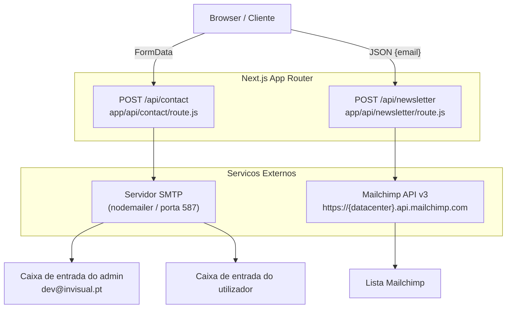
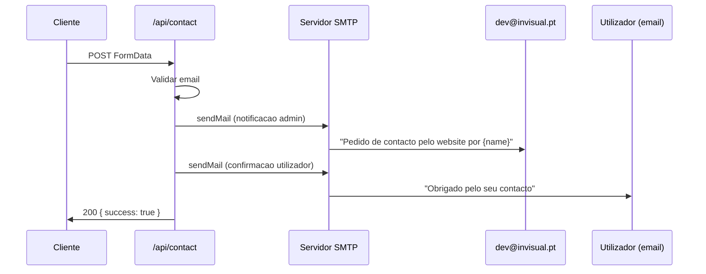
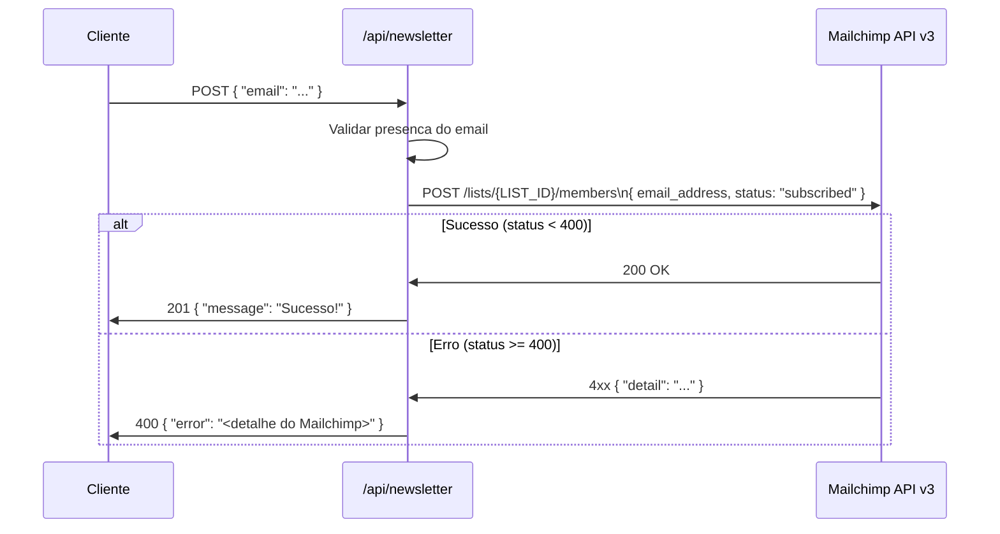

# Contact & Newsletter API

## Table of Contents
- [[Architecture/App Router Structure|Architecture Overview]]
- [[Frontend/Components Overview|Frontend Components]]

## Visao Geral

A aplicacao expoe dois endpoints de API Route do Next.js App Router para lidar com comunicacoes externas iniciadas pelo utilizador: o formulario de contacto e a subscricao da newsletter. Ambos os handlers residem sob o prefixo `/api/` e respondem exclusivamente ao metodo `POST`. Cada rota e implementada num ficheiro `route.js` dedicado, seguindo a convencao de sistema de ficheiros do App Router.



> **Sources:** `app/api/contact/route.js:L1-L68` · `app/api/newsletter/route.js:L1-L42`

---

## Endpoint de Contacto — `POST /api/contact`

### Leitura do Formulario

O handler le os dados atraves de `req.formData()`, o que significa que o cliente deve submeter o pedido com o `Content-Type: multipart/form-data` (ou `application/x-www-form-urlencoded`). Os seguintes campos sao extraidos, com uma string vazia como valor de fallback quando o campo esta ausente:

| Campo       | Obrigatorio | Descricao                        |
|-------------|-------------|----------------------------------|
| `name`      | Nao         | Primeiro nome do utilizador      |
| `surname`   | Nao         | Apelido do utilizador            |
| `email`     | **Sim**     | Endereco de email                |
| `tel`       | Nao         | Numero de telefone               |
| `interest`  | Nao         | Area de interesse selecionada    |
| `city`      | Nao         | Cidade do utilizador             |
| `message`   | Nao         | Corpo da mensagem                |

> **Sources:** `app/api/contact/route.js:L6-L13`

### Validacao

A unica validacao executada antes do envio de email e a verificacao do campo `email`: o valor nao pode ser vazio e deve conter o caracter `@`. Se a validacao falhar, o endpoint devolve imediatamente um `400 Bad Request` com o corpo `{ "error": "Email inválido" }`.

> **Sources:** `app/api/contact/route.js:L15-L17`

### Transporte SMTP

O transporte nodemailer e criado com as seguintes configuracoes fixas e de ambiente:

- **Host:** variavel de ambiente `SMTP_HOST`
- **Porta:** `587` (STARTTLS, nao SSL direto)
- **Secure:** `false` — a negociacao TLS e feita via STARTTLS na porta 587
- **Autenticacao:** credenciais `SMTP_USER` e `SMTP_PASS` injetadas via variaveis de ambiente

O transporte e instanciado em cada invocacao do handler, o que e estateless e adequado para um ambiente serverless.

> **Sources:** `app/api/contact/route.js:L19-L27`

### Fluxo de Envio de Email

O handler envia dois emails de forma sequencial (com `await`):



**Email para o administrador:**
- **De:** `"Website Ponto Urbano" <noreply@invisual.pt>`
- **Para:** `dev@invisual.pt` (destinatario fixo no codigo)
- **Reply-To:** endereco de email submetido pelo utilizador
- **Assunto:** `Pedido de contacto pelo website por {name}`
- **Corpo:** tabela HTML com todos os sete campos do formulario

**Email de confirmacao para o utilizador:**
- **De:** `"Ponto Urbano" <noreply@pontourbano.pt>`
- **Para:** email do utilizador
- **Assunto:** `Obrigado pelo seu contacto`
- **Corpo:** mensagem de agradecimento personalizada com o nome do utilizador

> **Sources:** `app/api/contact/route.js:L33-L61`

### Respostas

| Condicao                    | Status HTTP | Corpo                          |
|-----------------------------|-------------|-------------------------------|
| Sucesso                     | `200`       | `{ "success": true }`         |
| Email em falta ou invalido  | `400`       | `{ "error": "Email inválido" }` |
| Erro de envio SMTP          | `500`       | `{ "error": "Erro no envio" }` |

> **Sources:** `app/api/contact/route.js:L15-L17`, `app/api/contact/route.js:L63-L67`

---

## Endpoint de Newsletter — `POST /api/newsletter`

### Leitura do Pedido

Ao contrario do endpoint de contacto, este handler le o corpo como JSON com `request.json()`. O unico campo esperado e `email`. Se o campo estiver ausente, o handler devolve `400` com `{ "error": "Email é obrigatório" }` antes de qualquer chamada externa.

> **Sources:** `app/api/newsletter/route.js:L4-L8`

### Integracao com Mailchimp

O handler constroi dinamicamente o URL da API Mailchimp com base no datacenter extraido da propria chave de API:

```
DATACENTER = MAILCHIMP_API_KEY.split("-")[1]
URL = https://{DATACENTER}.api.mailchimp.com/3.0/lists/{LIST_ID}/members
```

As variaveis de ambiente necessarias sao:

| Variavel              | Descricao                                  |
|-----------------------|--------------------------------------------|
| `MAILCHIMP_API_KEY`   | Chave de API Mailchimp (ex: `xxx-us1`)     |
| `MAILCHIMP_LIST_ID`   | ID da lista/audiencia Mailchimp            |

O payload enviado para a API Mailchimp define o membro como `"subscribed"` imediatamente, sem dupla confirmacao (`double opt-in`):

```json
{
  "email_address": "<email do utilizador>",
  "status": "subscribed"
}
```

O cabecalho de autorizacao usa o formato `auth <API_KEY>` (nao `Bearer`, nao `Basic`), que e o esquema proprietario exigido pela API Mailchimp v3.

> **Sources:** `app/api/newsletter/route.js:L10-L29`

### Fluxo de Subscricao



### Tratamento de Erros da API Mailchimp

O handler verifica `response.status >= 400` para identificar erros devolvidos pela API Mailchimp, incluindo o caso em que o email ja se encontra inscrito. Nesse caso, o campo `detail` da resposta Mailchimp e propagado diretamente para o cliente, permitindo que o frontend apresente mensagens de erro contextuais (ex: "O utilizador ja esta inscrito").

> **Sources:** `app/api/newsletter/route.js:L32-L38`

### Respostas

| Condicao                        | Status HTTP | Corpo                            |
|---------------------------------|-------------|----------------------------------|
| Subscricao criada com sucesso   | `201`       | `{ "message": "Sucesso!" }`      |
| Email em falta no corpo         | `400`       | `{ "error": "Email é obrigatório" }` |
| Erro da API Mailchimp           | `400`       | `{ "error": "<detalhe Mailchimp>" }` |
| Erro de rede / excecao          | `500`       | `{ "error": "<mensagem de excecao>" }` |

> **Sources:** `app/api/newsletter/route.js:L6-L8`, `app/api/newsletter/route.js:L32-L41`

---

## Variaveis de Ambiente Necessarias

Ambos os endpoints dependem de variaveis de ambiente para funcionar. Nenhuma credencial esta embebida no codigo-fonte. As seguintes variaveis devem estar presentes no ficheiro `.env.local` (ou equivalente de producao):

| Variavel              | Utilizada em         | Descricao                              |
|-----------------------|----------------------|----------------------------------------|
| `SMTP_HOST`           | `/api/contact`       | Hostname do servidor SMTP              |
| `SMTP_USER`           | `/api/contact`       | Nome de utilizador SMTP                |
| `SMTP_PASS`           | `/api/contact`       | Password SMTP                          |
| `MAILCHIMP_API_KEY`   | `/api/newsletter`    | Chave de API Mailchimp com datacenter  |
| `MAILCHIMP_LIST_ID`   | `/api/newsletter`    | ID da audiencia/lista Mailchimp        |

> **Sources:** `app/api/contact/route.js:L20-L26` · `app/api/newsletter/route.js:L10-L11`

---

## Consideracoes de Seguranca e Limitacoes

- **Ausencia de autenticacao:** Ambos os endpoints sao publicos. Qualquer cliente pode invocar estes endpoints sem autenticacao, o que os torna suscetíveis a abusos (spam de formulario, abuso de subscricao). Recomenda-se a adicao de rate limiting ou um mecanismo CAPTCHA.
- **Injecao de HTML:** O endpoint de contacto interpola diretamente os valores dos campos do formulario num template HTML sem sanitizacao. Isto nao representa um risco XSS para os destinatarios de email que nao renderizem HTML arbitrario, mas e uma pratica que deve ser avaliada em funcao do cliente de email dos administradores.
- **Subscricao direta (`subscribed`):** O endpoint de newsletter inscreve o utilizador sem dupla confirmacao. Dependendo da jurisdicao (ex: RGPD), pode ser necessario mudar o `status` para `"pending"` para acionar um email de confirmacao do lado do Mailchimp.
- **Datacenter extraido da chave:** Se `MAILCHIMP_API_KEY` nao contiver um traco (ex: `xxxuserdatacenter`), a expressao `split("-")[1]` devolve `undefined`, causando um URL invalido. Deve-se validar o formato da chave no arranque da aplicacao.

> **Sources:** `app/api/contact/route.js:L39-L48` · `app/api/newsletter/route.js:L12-L13`

---

*[[index|← Back to Index]] · Generated by repowiki*
