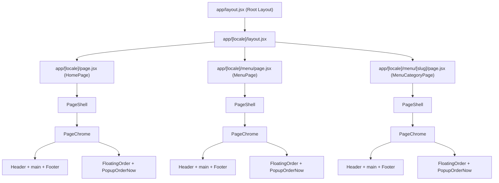
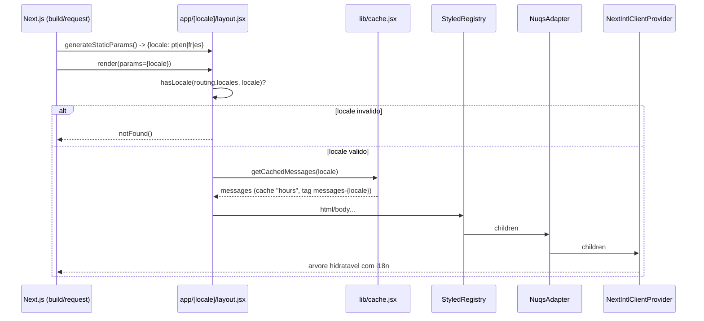

# App Router & Layout Composition

## Table of Contents
- [[Architecture/Rendering Strategy & Data Flow]]
- [[Architecture/Caching with 'use cache']]
- [[I18n/Locale Routing & Middleware]]
- [[Frontend/Component Domains Overview]]
- [[SEO/Metadata & JSON-LD Builders]]
- [[index]]

## Visão Geral

O site Pizzarte usa o App Router do Next.js 16 com dois layouts empilhados e uma cadeia de composição de componentes de cliente por baixo de cada página. O primeiro layout (`app/layout.jsx`) é o segmento raiz obrigatório pela convenção do App Router, mas é essencialmente um *passthrough*: não declara `<html>`/`<body>` e serve apenas para fixar `metadata.metadataBase`. O segundo layout (`app/[locale]/layout.jsx`) é onde o documento HTML real é construído — porque o atributo `lang` só pode ser conhecido depois de o segmento dinâmico `[locale]` ser resolvido, e porque só aí é que existem `params` para validar o idioma.

Por cima de cada página server-side (Home, Menu, categoria de Menu) existe uma cadeia fixa de componentes cliente — `PageShell` → `PageChrome` → `Header`/`<main>`/`Footer` — que substitui o padrão antigo do Gatsby de cada página montar `Header`+`Footer`+`Layout` à mão.

> **Sources:** `app/layout.jsx:L1-L7` · `app/[locale]/layout.jsx:L1-L83` · `components/layout/PageShell.jsx:L1-L21` · `components/layout/PageChrome.jsx:L1-L33`

## O Root Layout — `app/layout.jsx`

Este ficheiro tem sete linhas. Define `metadata.metadataBase` a partir de `process.env.NEXT_PUBLIC_SITE_URL`, com fallback para `https://example.pt`, e devolve `children` sem qualquer marcação adicional — não há `<html>` nem `<body>` neste nível. Isto é intencional: como o site tem quatro idiomas (`pt`, `en`, `fr`, `es`) e o atributo `lang` do documento tem de refletir o idioma da rota, o layout raiz deixa essa responsabilidade para o layout de locale, que é o primeiro ponto da árvore onde o parâmetro `locale` já está disponível.

> **Sources:** `app/layout.jsx:L1-L7`

## O Layout de Locale — `app/[locale]/layout.jsx`

É aqui que o documento HTML é efetivamente montado, uma vez por combinação de idioma. Vários mecanismos coexistem neste ficheiro:

**Geração estática dos locales.** `generateStaticParams()` devolve `routing.locales.map((locale) => ({ locale }))` — os quatro idiomas configurados em `i18n/routing.jsx`. O comentário no código é explícito: sem esta função, nenhuma rota desta árvore poderia ser pré-renderizada estaticamente (o site Gatsby original era 100% estático; o starter de partida do Next não tinha nenhum `generateStaticParams`).

**Validação do locale.** O parâmetro é lido com `const { locale } = await params;` e validado com `hasLocale(routing.locales, locale)`; se o valor não corresponder a nenhum dos quatro locales configurados, é chamado `notFound()` — é assim que um segmento de idioma inválido resulta num 404 em vez de cair silenciosamente noutra rota.

**Mensagens de i18n.** As mensagens são obtidas com `await getCachedMessages(locale)`, a função definida em `lib/cache.jsx` que usa a diretiva `"use cache"` do Next 16 (ver [[Architecture/Caching with 'use cache']] para o detalhe). Este é o único ponto, entre os ficheiros analisados nesta secção, onde a variante *cacheada* de carregamento de mensagens é usada — as páginas individuais (Home, Menu, categoria de Menu) chamam a variante não cacheada `getMessages()` diretamente.

**Documento e fontes.** O elemento `<html lang={locale}>` recebe as classes das três variáveis de fonte (`montserrat`, `britishRegular`, `chunkyRosie`, importadas de `app/fonts`).

**JSON-LD global.** Dentro de `<body>`, três tags `<script type="application/ld+json">` injetam os schemas `Organization`, `Restaurant` e `WebSite`, construídos por `buildOrganizationSchema`, `buildRestaurantSchema` e `buildWebSiteSchema` (importados de `lib/jsonld.js`). Por estarem no layout, estes três schemas aparecem em todas as rotas de qualquer locale.

**Analytics e consentimento.** Antes de qualquer script de terceiros correr, um `<Script strategy="beforeInteractive">` inline define o Google Consent Mode com `ad_storage` e `analytics_storage` a `'denied'` por omissão — o consentimento real só é concedido depois de o CookieYes atualizar o estado. Segue-se `<GoogleTagManager gtmId="GTM-5H4V228" />`, depois dois scripts `afterInteractive` que carregam e configuram o `gtag.js` para `G-EJNDSQMG4C`, e por fim o script do CookieYes. O comentário no código explica que este duplo sistema de analytics (GTM + gtag.js direto) replica deliberadamente o que existia no site Gatsby, para não perder histórico em nenhum dos dois dashboards.

**Providers de cliente.** `{children}` é envolvido por três providers aninhados, de fora para dentro: `StyledRegistry` → `NuqsAdapter` → `NextIntlClientProvider` (com `locale` e as `messages` obtidas acima).

> **Sources:** `app/[locale]/layout.jsx:L1-L83` · `lib/cache.jsx:L1-L9`

## Da Página ao PageShell e PageChrome

As três páginas analisadas nesta secção — `HomePage` (`app/[locale]/page.jsx`), `MenuPage` (`app/[locale]/menu/page.jsx`) e `MenuCategoryPage` (`app/[locale]/menu/[slug]/page.jsx`) — são todas Server Components assíncronos que seguem o mesmo padrão: destruturam `params`, chamam `setRequestLocale(locale)`, obtêm as suas próprias mensagens com `getMessages()`, e devolvem o conteúdo específico da página dentro de `<PageShell>`.

`PageShell` (`components/layout/PageShell.jsx`, `"use client"`) recebe `children`, `homeData`, e duas flags booleanas — `menuBg` e `hero` — que traduz em classes CSS (`menu-page`, `has-hero`) aplicadas ao `<main>`. Compõe `<Header data={homeData} />`, `<main>{children}</main>` e `<Footer data={homeData} />`, tudo dentro de `<PageChrome dataPopup={homeData?.popupOrderNow}>`. O comentário no ficheiro explica a motivação: no Gatsby, cada página repetia esta montagem manualmente; aqui fica centralizada num único wrapper, sem alterar quem decide os dados (isso continua a cargo do Server Component de cada página).

`PageChrome` (`components/layout/PageChrome.jsx`, `"use client"`) fornece um `PopupContext.Provider` com estado `isPopupOpen` e os handlers `handleOpenPopup`/`handleClosePopup`, permitindo que qualquer descendente (por exemplo o `Header`) abra o popup de encomenda sem *prop drilling*. Para além de `{children}`, renderiza sempre `<FloatingOrder />` e `<PopupOrderNow isOpen={isPopupOpen} onClose={...} data={dataPopup} />` como elementos persistentes, independentes da página ativa. O código documenta duas correções de comportamento face ao Gatsby original: um overlay de *loading* que atrasava a montagem de `<main>` em 4500ms (nada indexável no HTML inicial, LCP garantido ≥4,5s) foi eliminado — `{children}` está sempre montado desde o início; e um `window.scrollTo(0,0)` forçado no mount, que entrava em conflito com a restauração de scroll do browser ao navegar "para trás", foi removido.

> **Sources:** `components/layout/PageShell.jsx:L1-L21` · `components/layout/PageChrome.jsx:L1-L33` · `app/[locale]/page.jsx:L1-L36` · `app/[locale]/menu/page.jsx:L1-L30` · `app/[locale]/menu/[slug]/page.jsx:L72-L97`

## StyledRegistry — SSR de CSS-in-JS

`lib/StyledRegistry.jsx` resolve um problema específico do styled-components em conjunto com streaming SSR do App Router: sem um registo explícito, o CSS gerado por styled-components só existiria depois da hidratação no cliente, produzindo um *flash* de conteúdo sem estilo e conflitos de nomes de classe entre servidor e cliente.

O componente é `"use client"` e cria, com `useState(() => new ServerStyleSheet())`, uma única instância de `ServerStyleSheet` por *render*. Usa `useServerInsertedHTML` (API do Next.js para streaming SSR) para injetar o `<style>` coletado no `<head>` à medida que é produzido, chamando depois `sheet.instance.clearTag()` para limpar o buffer. No cliente (`typeof window !== "undefined"`), o componente passa a devolver `children` diretamente, sem o `StyleSheetManager`, porque nesse contexto já não há nada para coletar em SSR.

O próprio código deixa claro que este mecanismo é distinto da flag `compiler.styledComponents: true` em `next.config.js`: essa opção do compilador SWC só ativa a transformação equivalente ao `babel-plugin-styled-components` (nomes de classe determinísticos, `displayName`, etc.) em tempo de build; o streaming do CSS para o `<head>` do SSR depende deste registo em tempo de execução. `StyledRegistry` é o provider mais externo dentro de `app/[locale]/layout.jsx`, envolvendo `NuqsAdapter` e `NextIntlClientProvider`, precisamente porque precisa de envolver tudo o que possa gerar estilos.

> **Sources:** `lib/StyledRegistry.jsx:L1-L26` · `next.config.js:L27-L30`

## Ver também

Para entender como cada página decide o que renderizar em tempo de build (produto cartesiano de locales × categorias de menu) e como as mensagens fluem entre o layout cacheado e as páginas, ver [[Architecture/Rendering Strategy & Data Flow]]. Para o detalhe da diretiva `"use cache"` usada em `lib/cache.jsx`, ver [[Architecture/Caching with 'use cache']].

---
*[[index|← Back to Index]] · Generated by repowiki*
