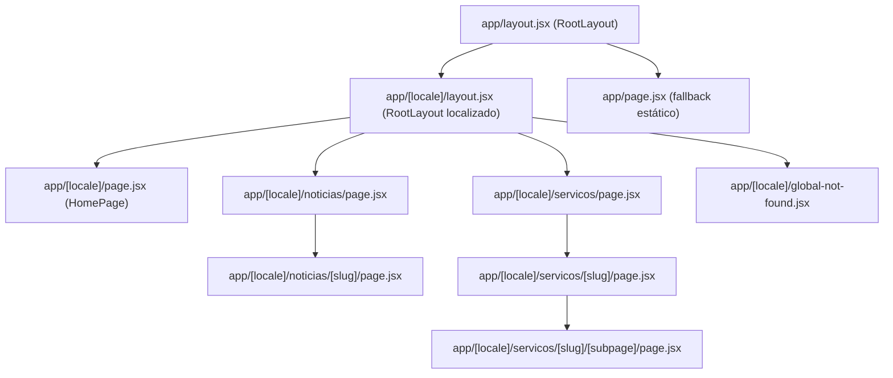
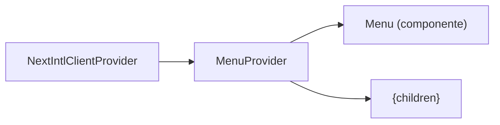

# Estrutura do App Router

## Tabela de Conteúdos
- [[Architecture/Data Flow & Routing]]
- [[index]]

## Visão Geral

Este projeto utiliza o **Next.js App Router** com suporte a internacionalização (i18n) gerido pela biblioteca `next-intl`. A árvore de páginas está organizada em torno de um segmento de rota dinâmico `[locale]`, o que permite que todas as páginas da aplicação sejam servidas num idioma específico sem duplicação de estrutura.

A hierarquia de layouts segue um padrão de dois níveis: um layout de raiz mínimo (`app/layout.jsx`) que simplesmente passa os filhos sem envolver qualquer HTML, e um layout de localidade (`app/[locale]/layout.jsx`) que é responsável por toda a estrutura real da página — incluindo os providers de contexto, internacionalização e o componente de menu global.

> **Fontes:** `app/layout.jsx:L1-L3` · `app/[locale]/layout.jsx:L1-L42` · `app/[locale]/page.jsx:L1-L42`

## Layout de Raiz (`app/layout.jsx`)

O layout de raiz tem uma responsabilidade deliberadamente mínima: retorna `children` diretamente, sem envolver qualquer elemento HTML. Isto é uma escolha intencional porque o elemento `<html>` e `<body>` são declarados pelo layout de localidade, que tem acesso ao `locale` correto para definir o atributo `lang`.

Este padrão evita a duplicação de elementos de documento raiz e garante que o atributo `lang` da tag `<html>` esteja sempre corretamente preenchido com o idioma da sessão do utilizador.

> **Fontes:** `app/layout.jsx:L1-L3`

## Layout de Localidade (`app/[locale]/layout.jsx`)

Este é o layout central da aplicação. É um componente assíncrono do servidor (`async function`) que recebe `children` e `params`. O parâmetro `params` é resolvido com `await` para extrair o `locale` — este padrão é específico do App Router do Next.js, onde os params são uma Promise.

### Validação de Localidade

Logo no início da função, o `locale` extraído é validado contra a lista de localidades suportadas usando `hasLocale` da `next-intl`, consultando o objeto `routing` importado de `i18n/routing`. Se o locale não for válido, a função chama `notFound()` do Next.js, o que resulta num erro 404.

### Carregamento de Mensagens e Menu

As mensagens de tradução são carregadas com `getMessages({ locale })` — uma função assíncrona do servidor da `next-intl`. O menu global é extraído diretamente do objeto de mensagens através do caminho `messages.global.global.menu`, o que significa que as traduções do menu estão aninhadas sob as chaves `global > global > menu` nos ficheiros de mensagens.

### Árvore de Providers

O corpo do layout envolve os filhos numa cadeia de providers:

1. `<html lang={locale}>` — define o idioma do documento HTML.
2. `<NextIntlClientProvider locale={locale} messages={messages}>` — fornece o contexto de internacionalização a todos os componentes cliente abaixo.
3. `<MenuProvider>` — fornece o estado do menu (provavelmente aberto/fechado) aos componentes que precisem.
4. `<Menu menu={menu} locale={locale} />` — o componente de navegação global, recebendo os dados do menu e o locale atual.
5. `{children}` — o conteúdo da página atual.

> **Fontes:** `app/[locale]/layout.jsx:L1-L42`

## Página Inicial (`app/[locale]/page.jsx`)

A `HomePage` é um componente do servidor que usa o padrão `use(params)` do React para aceder ao `locale` de forma síncrona dentro de um componente não-assíncrono. Chama `setRequestLocale(locale)` para configurar o locale para rendering no servidor.

A página faz duas operações principais:
- `useMessages()` — acede às mensagens de tradução já carregadas pelo layout pai.
- `getAllPosts(locale)` — carrega todos os artigos MDX filtrados pelo locale atual (embora o resultado `posts` não seja ainda utilizado no JSX visível).

A função `generateMetadata` é exportada separadamente para geração de metadados SEO dinâmicos, delegando para o utilitário `Seo` com o namespace `"home.homepage.seo"`.

O componente `MenuConfigClient` é renderizado no topo — este é um componente cliente responsável por configurar o estado do menu para esta página específica.

> **Fontes:** `app/[locale]/page.jsx:L1-L42`

## Página Fallback (`app/page.jsx`)

Existe uma página estática em `app/page.jsx` que serve como fallback quando o utilizador acede à raiz sem qualquer prefixo de locale. Esta página não usa `next-intl` nem qualquer lógica de localização — apresenta apenas links estáticos em inglês para `/sobre` e `/contact`. Na prática, o middleware de roteamento (definido em `proxy.ts`) interceta os pedidos antes de chegarem a esta página e redireciona o utilizador para a versão localizada correta.

> **Fontes:** `app/page.jsx:L1-L14`

## Configuração de Locales e Pathnames

A definição das localidades e dos caminhos localizados encontra-se em `i18n/routing.jsx`. O projeto suporta dois idiomas:

| Locale | Papel |
|--------|-------|
| `pt` | Locale padrão (`defaultLocale`) |
| `en` | Locale secundário |

A opção `localePrefix: "as-needed"` significa que o prefixo `/pt/` é omitido para o locale padrão — os utilizadores portugueses veem URLs sem prefixo de idioma (`/sobre-nos`), enquanto os utilizadores ingleses veem `/en/about`.

Os caminhos são mapeados por idioma:

| Rota interna | Caminho PT | Caminho EN |
|---|---|---|
| `/sobre-nos` | `/sobre-nos` | `/about` |
| `/noticias` | `/noticias` | `/news` |
| `/noticias/[slug]` | `/noticias/[slug]` | `/news/[slug]` |
| `/servicos` | `/servicos` | `/services` |
| `/servicos/[slug]` | `/servicos/[slug]` | `/services/[slug]` |
| `/servicos/[slug]/[subpage]` | `/servicos/[slug]/[subpage]` | `/services/[slug]/[subpage]` |
| `/politica-de-privacidade` | `/politica-de-privacidade` | `/privacy-policy` |

> **Fontes:** `i18n/routing.jsx:L1-L39`

---
*[[index|← Back to Index]] · Generated by repowiki*
