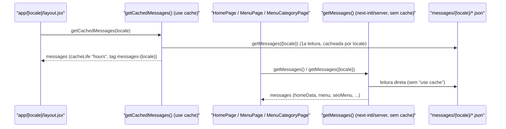

# Caching with 'use cache'

## Table of Contents
- [[Architecture/App Router & Layout Composition]]
- [[Architecture/Rendering Strategy & Data Flow]]
- [[I18n/Translated Nav Links & Menu Slugs]]
- [[Overview/Introduction & Tech Stack]]
- [[index]]

## Visão Geral

O Next.js 16 introduz o modelo de **Cache Components**, ativado neste projeto através de `cacheComponents: true` em `next.config.js`. Sob este modelo, nada é cacheado implicitamente — qualquer função ou componente que deva persistir o seu resultado entre pedidos tem de declarar explicitamente a diretiva `"use cache"`. No código-base analisado nesta secção existe exatamente **um** limite de cache explícito: `getCachedMessages`, em `lib/cache.jsx`, usado para carregar as mensagens de i18n consumidas pelo layout de locale.

```mermaid
flowchart LR
    subgraph "next.config.js"
        CC["cacheComponents: true"]
    end
    subgraph "lib/cache.jsx"
        UC["\"use cache\" getCachedMessages(locale)"]
        CL["cacheLife(\"hours\")"]
        CT["cacheTag(`messages-${locale}`)"]
        GM["getMessages({ locale })"]
        UC --> CL
        UC --> CT
        UC --> GM
    end
    CC -.habilita a diretiva.-> UC
    UC -->|"messages"| LL["app/[locale]/layout.jsx"]
    LL -->|"NextIntlClientProvider"| CLI["Componentes cliente"]
```

> **Sources:** `next.config.js:L22-L27` · `lib/cache.jsx:L1-L9`

## `cacheComponents` em `next.config.js`

A flag `cacheComponents: true` (linha 27) é o interruptor que torna a diretiva `"use cache"` significativa no resto do projeto — é o pré-requisito para o modelo de Cache Components do App Router. Sem esta flag ativa, a diretiva usada em `lib/cache.jsx` não teria o mesmo efeito.

No mesmo ficheiro de configuração coexistem outras definições relevantes para o comportamento geral de build/runtime, mas sem relação direta com `"use cache"`: `compiler.styledComponents: true` (transformação SWC do styled-components, distinta do registo de runtime `StyledRegistry` — ver [[Architecture/App Router & Layout Composition]]); configuração de `images` (`formats: ["image/avif", "image/webp"]`, `deviceSizes` recortados para `[640, 750, 828, 1080, 1200, 1920, 2560]`, `minimumCacheTTL: 2592000`); cabeçalhos de segurança (`headers()`); e os redireccionamentos de slugs legados de menu (`redirects()`, ver [[Architecture/Rendering Strategy & Data Flow]]).

> **Sources:** `next.config.js:L22-L49`

## `getCachedMessages` — o único limite de cache explícito

O ficheiro `lib/cache.jsx` define:

```js
export async function getCachedMessages(locale) {
  "use cache";
  cacheLife("hours");
  cacheTag(`messages-${locale}`);
  return getMessages({ locale });
}
```

Cada linha tem um papel específico no modelo de Cache Components:

- **`"use cache"`** — diretiva colocada no topo do corpo da função, marcando-a como uma unidade cacheável. O Next.js memoriza o valor devolvido, tendo os argumentos da função (aqui, `locale`) como parte da chave de cache.
- **`cacheLife("hours")`** — aplica o perfil de cache incorporado `"hours"`, indicando que o valor é válido por uma janela medida em horas antes de precisar de revalidação. Isto é coerente com a natureza dos dados subjacentes: as mensagens vêm de ficheiros JSON estáticos (`messages/{locale}/*.json`) que só mudam com um novo deploy, não a cada pedido.
- **`cacheTag(\`messages-${locale}\`)`** — associa uma tag distinta por locale (`messages-pt`, `messages-en`, `messages-fr`, `messages-es`). Isto é o que tornaria possível invalidar seletivamente o cache de um único idioma através de `revalidateTag`, sem afetar os restantes — não existe, nos ficheiros analisados, nenhuma chamada a `revalidateTag` para estas tags; a tag apenas disponibiliza esse caminho de invalidação para uso futuro.
- **`getMessages({ locale })`** — a chamada envolvida é o próprio carregador de mensagens do `next-intl/server`, o mesmo primitivo que as páginas chamam diretamente (sem cache) através de `getMessages()`.

> **Sources:** `lib/cache.jsx:L1-L9`

## Onde é consumido: `app/[locale]/layout.jsx`

O único consumidor de `getCachedMessages` nos ficheiros analisados é o layout de locale:

```js
const messages = await getCachedMessages(locale);
```

O resultado alimenta diretamente `<NextIntlClientProvider locale={locale} messages={messages}>`, que é o que expõe as strings traduzidas a todos os Componentes de Cliente descendentes através dos hooks de cliente do `next-intl`. Como este layout é partilhado por todas as páginas de um dado locale, cachear esta chamada significa que o pacote de mensagens desse locale é calculado uma vez (dentro da janela do perfil `"hours"`), em vez de ser recalculado a cada navegação entre páginas do mesmo idioma.

> **Sources:** `app/[locale]/layout.jsx:L39,L73-L79`

## Cache vs. leitura direta — duas vias de acesso às mesmas mensagens

Vale destacar uma nuance arquitetural: as páginas (`HomePage`, `MenuPage`, `MenuCategoryPage`) chamam `getMessages()` diretamente — sem passar pelo wrapper de `lib/cache.jsx` — para construir os seus próprios dados de renderização no servidor (`homeData`, o schema `Menu`, o schema `BreadcrumbList`, a procura da categoria por slug). Ou seja, o mesmo conteúdo de `messages/{locale}/*.json` é lido através de duas vias distintas dentro do mesmo pedido: a via cacheada, que só serve a fronteira de hidratação do `NextIntlClientProvider` no layout; e a via direta, usada por cada página Server Component para os seus próprios dados.



> **Sources:** `lib/cache.jsx:L1-L9` · `app/[locale]/page.jsx:L23-L24` · `app/[locale]/menu/page.jsx:L18-L19` · `app/[locale]/menu/[slug]/page.jsx:L38-L45`

## Boas práticas ao estender o cache

Ao adicionar novos limites de cache no mesmo espírito de `lib/cache.jsx`, o padrão observado é: declarar `"use cache"` no topo da função, escolher um perfil de `cacheLife` adequado à volatilidade real dos dados (aqui, `"hours"` porque o conteúdo só muda por deploy), e atribuir uma `cacheTag` que inclua qualquer parâmetro que deva segmentar a invalidação (aqui, o `locale`). É importante lembrar que `cacheComponents: true` em `next.config.js` é a condição que torna todo este mecanismo ativo — removê-la desativaria o comportamento de `"use cache"` em qualquer função do projeto.

---
*[[index|← Back to Index]] · Generated by repowiki*
