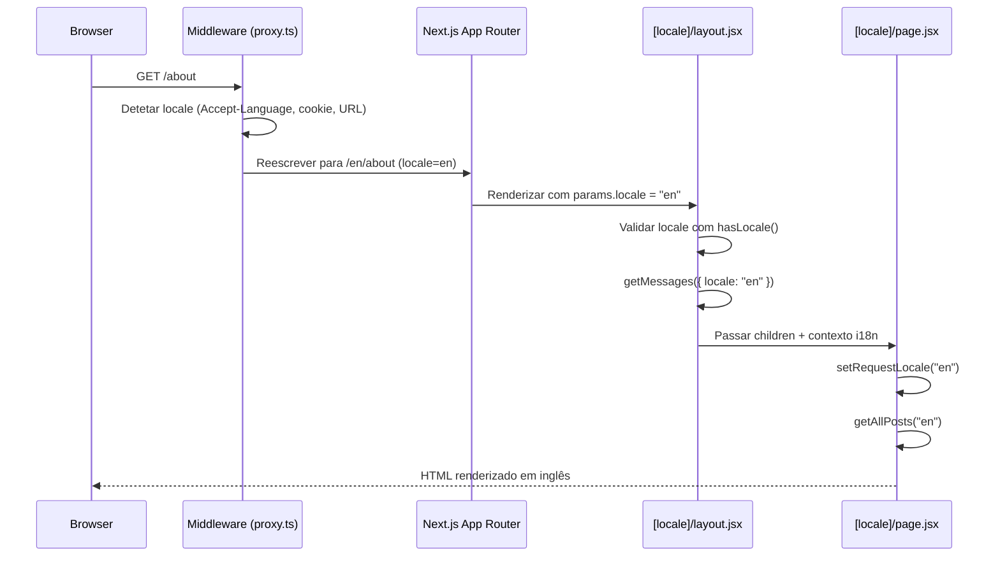
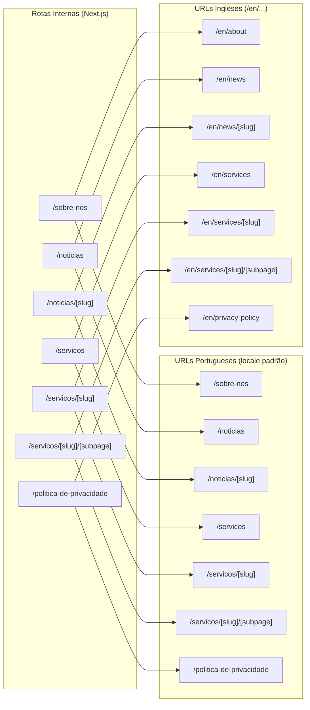
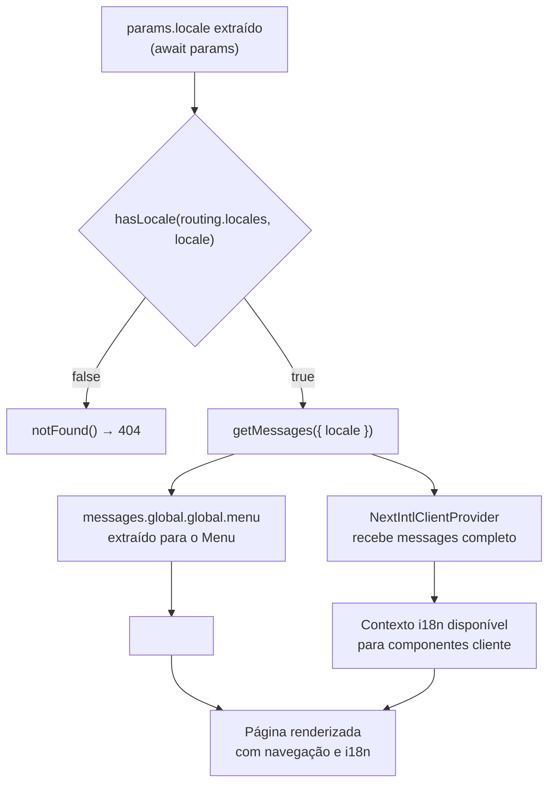
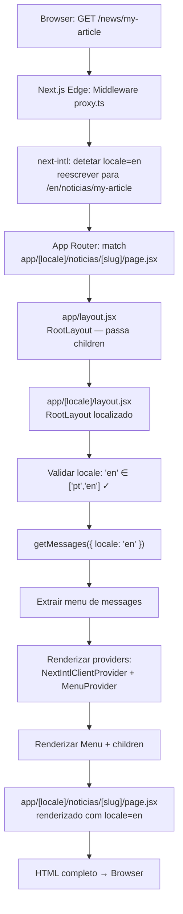

# Fluxo de Dados e Roteamento

## Tabela de Conteúdos
- [[Architecture/App Router Structure]]
- [[index]]

## Visão Geral

O roteamento neste projeto combina dois mecanismos complementares: o **middleware de Next.js** (definido em `proxy.ts`) que interceta todos os pedidos HTTP antes de chegarem a qualquer página, e a **configuração de routing do `next-intl`** (em `i18n/routing.jsx`) que determina quais locales são suportados, qual é o padrão, e como os caminhos são traduzidos por idioma.

O resultado é um sistema onde o utilizador pode aceder a `/about` (inglês) ou `/sobre-nos` (português) e o servidor resolve automaticamente o locale, carrega as mensagens corretas e renderiza o layout com o idioma adequado — tudo de forma transparente.

## Middleware: `proxy.ts`

O ficheiro `proxy.ts` define o middleware de Next.js exportando o resultado de `createMiddleware(routing)` da biblioteca `next-intl`. Este middleware é aplicado a todos os pedidos que correspondam ao padrão definido em `config.matcher`.

### Padrão de Correspondência (Matcher)

```
/((?!api|trpc|_next|_vercel|.*\\..*).*)
```

Este padrão exclui explicitamente:
- `/api/*` — rotas de API do Next.js
- `/trpc/*` — rotas tRPC (se aplicável)
- `/_next/*` — assets estáticos internos do Next.js
- `/_vercel/*` — infraestrutura da plataforma Vercel
- Qualquer caminho que contenha um ponto (`.`) — ficheiros estáticos como imagens, fontes e CSS

Todos os outros pedidos — ou seja, todas as páginas da aplicação — passam pelo middleware de internacionalização.

> **Fontes:** `proxy.ts:L1-L8`

### Responsabilidades do Middleware

O middleware criado por `createMiddleware(routing)` executa automaticamente as seguintes operações em cada pedido elegível:

1. **Deteção de locale** — analisa o URL, o cabeçalho `Accept-Language` e cookies para determinar o idioma preferido do utilizador.
2. **Redirecionamento** — se o URL não corresponder ao formato esperado para o locale detetado, o middleware emite um redirecionamento (por exemplo, `/about` → `/en/about` se o locale padrão não for inglês).
3. **Normalização do prefixo** — com `localePrefix: "as-needed"`, o prefixo do locale padrão (`pt`) é omitido, mantendo os URLs portugueses limpos.
4. **Injeção de cabeçalhos** — o locale resolvido é passado para o resto do pipeline de rendering via cabeçalhos internos do Next.js, tornando-o disponível em `params.locale` nas páginas.



> **Fontes:** `proxy.ts:L1-L8` · `i18n/routing.jsx:L1-L39` · `app/[locale]/layout.jsx:L10-L42`

## Configuração de Routing (`i18n/routing.jsx`)

A função `defineRouting` da `next-intl` recebe um objeto de configuração e retorna o objeto `routing` que é partilhado entre o middleware (`proxy.ts`) e o layout (`app/[locale]/layout.jsx`).

### Locales e Padrão

```
locales: ["pt", "en"]
defaultLocale: "pt"
```

O Português é o locale padrão. Com `localePrefix: "as-needed"`, isto significa que os URLs para visitantes portugueses nunca incluem `/pt/` — o prefixo só aparece para locales não-padrão (`/en/...`).

### Pathnames Localizados

Os pathnames definem o mapeamento entre a rota interna do Next.js e o caminho real do URL para cada locale. Esta é a funcionalidade central que permite ter `/noticias` em português e `/news` em inglês a apontar para o mesmo componente de página (`app/[locale]/noticias/page.jsx`).



> **Fontes:** `i18n/routing.jsx:L1-L39`

## Fluxo de Dados no Layout

Depois do middleware resolver e injetar o locale, o layout de localidade executa a sua própria sequência de operações para preparar o contexto da página:



### Partilha do Objeto `routing`

Um detalhe arquitetural importante é que o objeto `routing` exportado por `i18n/routing.jsx` é importado tanto pelo middleware (`proxy.ts`) como pelo layout (`app/[locale]/layout.jsx`). Isto garante que a validação do locale no servidor (`hasLocale(routing.locales, locale)`) usa exatamente a mesma lista de locales que o middleware usa para roteamento — há uma única fonte de verdade para a configuração de idiomas.

> **Fontes:** `proxy.ts:L2` · `app/[locale]/layout.jsx:L5,L13`

## Fluxo Completo: Browser ao HTML

O diagrama seguinte mostra o ciclo de vida completo de um pedido, desde o browser até à entrega do HTML renderizado:



> **Fontes:** `proxy.ts:L1-L8` · `app/[locale]/layout.jsx:L10-L42` · `i18n/routing.jsx:L1-L39`

---
*[[index|← Back to Index]] · Generated by repowiki*
