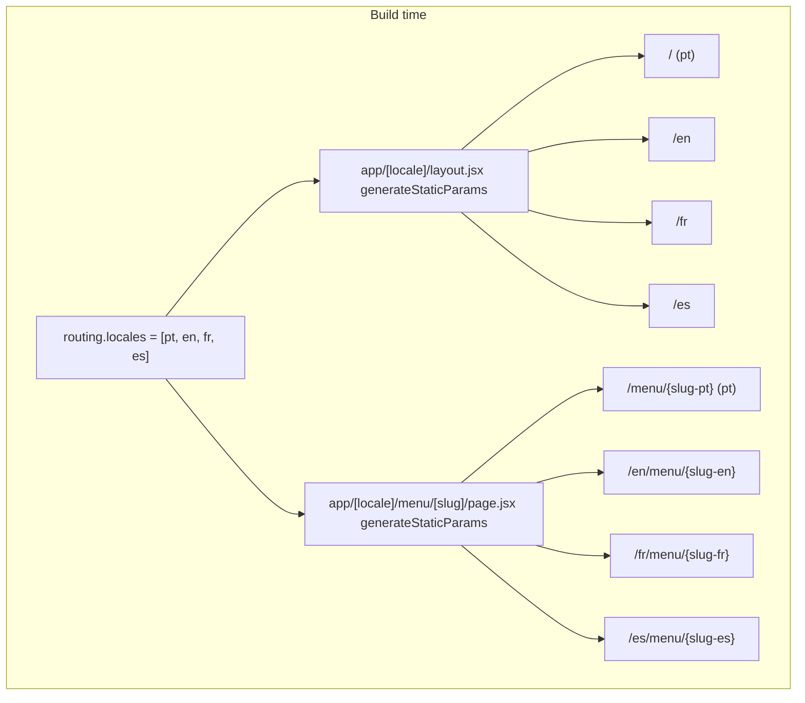
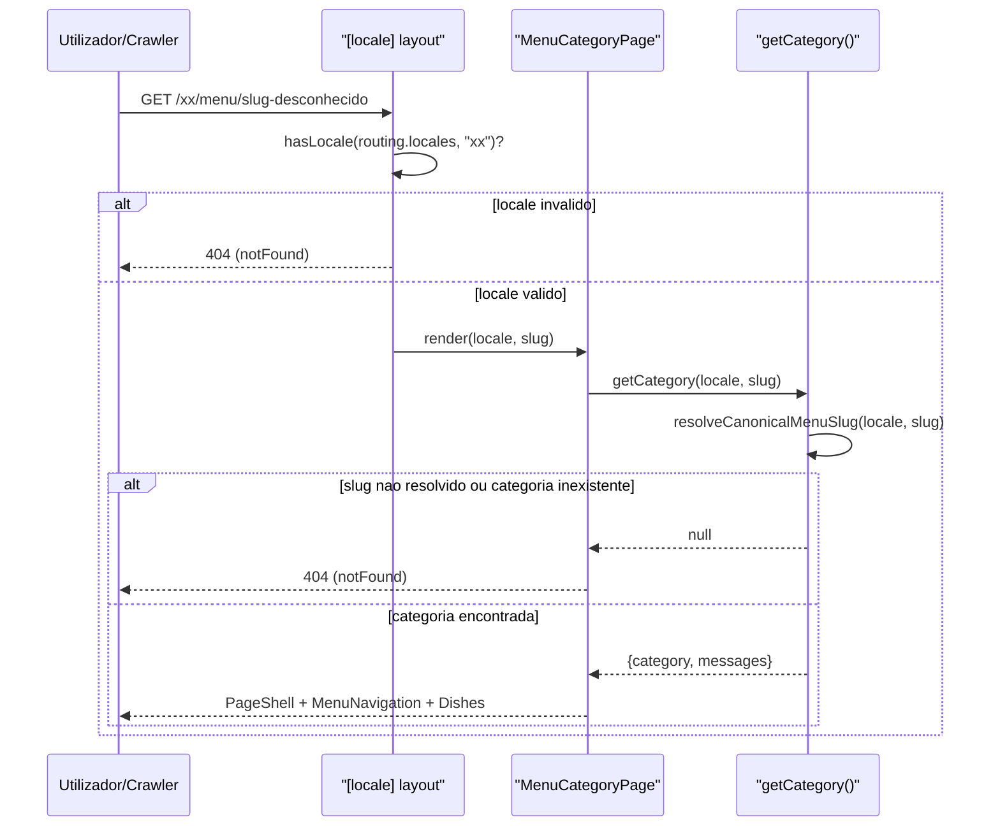

# Rendering Strategy & Data Flow

## Table of Contents
- [[Architecture/App Router & Layout Composition]]
- [[Architecture/Caching with 'use cache']]
- [[I18n/Locale Routing & Middleware]]
- [[SEO/Metadata & JSON-LD Builders]]
- [[SEO/Sitemap, Robots & llms.txt]]
- [[index]]

## Visão Geral

O Pizzarte pré-renderiza estaticamente todas as combinações de idioma e rota conhecidas em tempo de build, através de `generateStaticParams` em dois níveis da árvore de rotas: o layout de locale (`app/[locale]/layout.jsx`) enumera os quatro idiomas, e a página de categoria de menu (`app/[locale]/menu/[slug]/page.jsx`) enumera o produto cartesiano de idioma × slug de categoria traduzido. Isto substitui diretamente a geração de páginas que no site Gatsby original acontecia em `gatsby-node.js`.

## generateStaticParams: dos 4 locales à árvore completa

No layout de locale, `generateStaticParams()` devolve:

```js
routing.locales.map((locale) => ({ locale }))
```

ou seja, quatro entradas — `pt`, `en`, `fr`, `es` — que fixam o segmento `[locale]` para todas as rotas descendentes (`/`, `/menu`, `/menu/[slug]`, `/pizzarte`, `/galeria`, `/contactos`).

Na página de categoria de menu, `generateStaticParams()` faz um passo adicional:

```js
routing.locales.flatMap((locale) =>
  Object.values(MENU_CATEGORY_SLUGS[locale]).map((slug) => ({ locale, slug }))
)
```

Isto gera uma entrada por cada combinação de idioma e slug de categoria *já traduzido para esse idioma* — não o slug canónico único. O comentário no código assinala que isto corrige o "Bug #6" identificado durante a migração: o Gatsby publicava sempre `/{lang}/menu/{slugPT}`, reutilizando o slug em português para todos os idiomas, porque `gatsby-node.js` nunca traduzia o slug de categoria fora do PT. Agora, cada locale gera o seu próprio slug estático a partir de `MENU_CATEGORY_SLUGS`.

As páginas `HomePage` e `MenuPage` (índice de categorias) não precisam de `generateStaticParams` próprio — o único segmento dinâmico no seu caminho é `[locale]`, já resolvido pelo layout ancestral.



> **Sources:** `app/[locale]/layout.jsx:L25-L30` · `app/[locale]/menu/[slug]/page.jsx:L29-L36`

## setRequestLocale e a leitura de mensagens

Todas as três páginas seguem a mesma abertura: destruturam `params` (assíncrono, `await params`), e chamam de imediato `setRequestLocale(locale)` — a API do `next-intl/server` que fixa o locale do pedido para que utilitários como `getMessages()` ou `getTranslations()` resolvam deterministicamente durante a renderização estática, sem depender de cabeçalhos de pedido.

Depois de fixar o locale, cada página chama `getMessages()` (sem argumentos, ou com `{ locale }` explícito no caso da página de categoria) para obter o pacote de mensagens completo e indexar o *namespace* que precisa:

- `HomePage` lê `messages.home` e passa-o como `homeData` para `PageShell`, `HeroBanner`, `PizzaEffect`, `AboutIntro`, `FoodSlider`, `BarDrinks` e `Waiting`.
- `MenuPage` lê `messages.home` (para `PageShell`) e `messages.menu` (para `buildMenuSchema` e `MenuSection`).
- `MenuCategoryPage` usa uma função auxiliar `getCategory(locale, slug)` que resolve o slug canónico via `resolveCanonicalMenuSlug`, carrega `getMessages({ locale })`, e procura em `messages.menu.menus` a categoria cujo `slug` (sem a barra inicial) corresponda ao canónico.

Esta é uma via de acesso **diferente** da usada no layout: o layout chama `getCachedMessages(locale)` (`lib/cache.jsx`, com `"use cache"`) apenas para alimentar o `NextIntlClientProvider` do lado do cliente; cada página volta a ler as mensagens do disco via `getMessages()` sem passar por essa cache, para construir os seus próprios dados de renderização server-side (JSON-LD, `homeData`, listas de categorias). Ver [[Architecture/Caching with 'use cache']] para o detalhe deste limite de cache.

> **Sources:** `app/[locale]/page.jsx:L1-L36` · `app/[locale]/menu/page.jsx:L1-L30` · `app/[locale]/menu/[slug]/page.jsx:L38-L45` · `lib/cache.jsx:L1-L9`

## generateMetadata: SEO por página

Cada página exporta o seu próprio `generateMetadata`:

- `HomePage`: `Seo({ locale, namespace: "home.seo", pathname: "/" })`.
- `MenuPage`: lê `messages.pizzarte.seoMenu` e chama `SeoFromData({ locale, title, description, image, pathname: "/menu" })`.
- `MenuCategoryPage`: resolve a categoria com `getCategory()`; se não existir, devolve `{}`. Caso exista, constrói `alternatePaths` — um objeto com uma entrada por locale, traduzindo o slug canónico da categoria através de `MENU_CATEGORY_SLUGS[loc]` (com fallback para o próprio slug canónico se não houver tradução) e montando o prefixo de idioma (`""` para o locale por omissão, `/{loc}` para os outros). O título é montado manualmente como `` `${category.title} | ${SITE_TITLE_SUFFIX[locale]}` ``, com `SITE_TITLE_SUFFIX` a mapear cada locale para o nome de marca traduzido ("Restaurante Pizzarte", "Pizzarte Restaurant", "Restaurant Pizzarte", "Restaurante Pizzarte"). É passado `type: "article"` a `SeoFromData`.

O comentário no ficheiro explica por que o sufixo de marca é montado no código e não no JSON de mensagens: `category.title` é reutilizado como o *heading* visível da página (em `MenuNavigation` e `Dishes`), por isso não pode já incluir o sufixo.

> **Sources:** `app/[locale]/page.jsx:L11-L14` · `app/[locale]/menu/page.jsx:L7-L12` · `app/[locale]/menu/[slug]/page.jsx:L12-L20,L47-L70`

## notFound() e validação de rota

Duas camadas de `notFound()` protegem o funil de renderização:

1. No layout de locale, um `locale` fora de `routing.locales` dispara `notFound()` antes de qualquer outra lógica correr.
2. Na página de categoria de menu, se `getCategory(locale, slug)` devolver `null` — porque `resolveCanonicalMenuSlug` não reconheceu o slug, ou porque nenhuma categoria em `messages.menu.menus` corresponde ao slug canónico — a própria `MenuCategoryPage` chama `notFound()` antes de tentar renderizar.



> **Sources:** `app/[locale]/layout.jsx:L33-L37` · `app/[locale]/menu/[slug]/page.jsx:L38-L45,L72-L78`

## JSON-LD ao longo do funil de renderização

O JSON-LD injetado varia por nível da árvore:

| Nível | Schema | Fonte de dados |
|---|---|---|
| Layout de locale (todas as rotas) | `Organization`, `Restaurant`, `WebSite` | `lib/jsonld.js` (`buildOrganizationSchema`, `buildRestaurantSchema`, `buildWebSiteSchema`) |
| `MenuPage` | `Menu` | `buildMenuSchema(messages.menu.menus, locale)` |
| `MenuCategoryPage` | `BreadcrumbList` | `buildBreadcrumbSchema([...])`, com rótulos de `BREADCRUMB_LABELS[locale]` e URLs absolutos montados a partir de `NEXT_PUBLIC_SITE_URL` |

O comentário na página de menu descreve o schema `Menu` como "o maior ganho de GEO do projeto": torna toda a lista de pratos e preços legível por motores generativos, não apenas por motores de busca tradicionais.

> **Sources:** `app/[locale]/layout.jsx:L47-L49` · `app/[locale]/menu/page.jsx:L19-L26` · `app/[locale]/menu/[slug]/page.jsx:L81-L92`

## Redirecionamentos legados antes do funil de páginas

Antes de qualquer lógica das páginas correr, `next.config.js` define `redirects()` devolvendo `LEGACY_MENU_SLUG_REDIRECTS` (importado de `lib/legacyMenuRedirects.js`). O comentário explica o propósito: o Gatsby publicava slugs de categoria de menu em português sob os prefixos `/en`, `/fr`, `/es` (porque `gatsby-node.js` não traduzia o slug); esta configuração redireciona esses URLs legados para o slug correto de cada idioma, tal como agora definido em `messages/{locale}/menu.json`. Este redireccionamento acontece na camada de routing do Next.js, antes de `generateStaticParams`/`generateMetadata`/render de qualquer página serem alcançados.

> **Sources:** `next.config.js:L17-L21,L46-L48`

---
*[[index|← Back to Index]] · Generated by repowiki*
