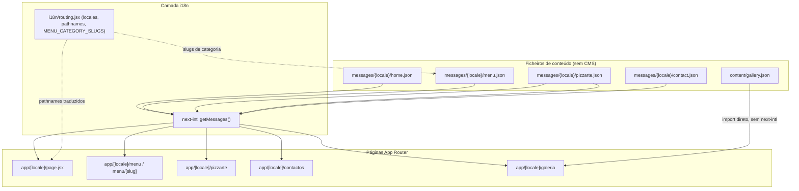
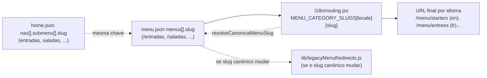
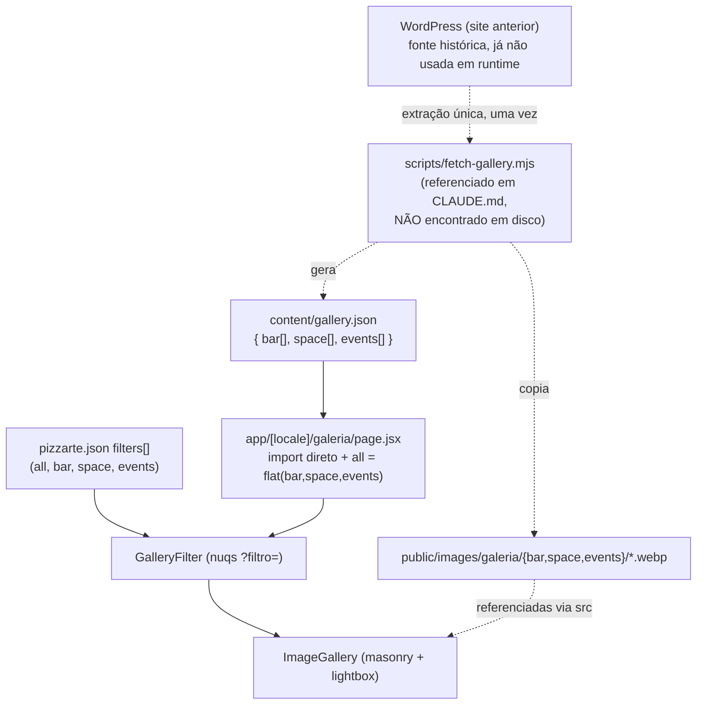

# Content Model (Messages & Gallery JSON)

## Table of Contents
- [[Content/Image Manifest & Media Handling]]
- [[I18n/Translated Nav Links & Menu Slugs]]
- [[I18n/Locale Routing & Middleware]]
- [[Architecture/App Router & Layout Composition]]
- [[SEO/Metadata & JSON-LD Builders]]
- [[index]]

## Visão Geral: um site sem CMS

O site da Pizzarte não tem sistema de gestão de conteúdo. Todo o texto visível — títulos, descrições SEO, itens de menu, preços, depoimentos, horários, textos de rodapé — vive em ficheiros JSON estáticos dentro de `messages/{locale}/`, um por idioma (`pt`, `en`, `fr`, `es`), lidos em build/request time através do `next-intl` (`getMessages()`). A galeria de fotos segue o mesmo princípio: é um ficheiro JSON estático (`content/gallery.json`) resultante de uma extração única do WordPress que alimentava o site anterior, sem qualquer chamada a uma API externa em runtime.

Este modelo tem uma consequência direta para quem edita conteúdo: não existe painel de administração, nem base de dados, nem endpoint de API para o conteúdo do site. Editar um preço, um texto ou uma legenda de imagem é editar o ficheiro JSON correspondente e fazer deploy.



> **Sources:** `messages/pt/home.json`, `messages/pt/menu.json`, `messages/pt/pizzarte.json`, `messages/pt/contact.json`, `content/gallery.json:L1-L60`, `i18n/routing.jsx:L1-L90`, `app/[locale]/galeria/page.jsx:L1-L37`

## Os quatro namespaces de `messages/`

Cada idioma tem quatro ficheiros JSON, cada um com um único namespace de topo que dá nome ao ficheiro: `home`, `menu`, `pizzarte`, `contact`. A leitura abaixo baseia-se na versão `pt` (idioma por defeito, sem prefixo de URL).

### `home.json`

Alimenta a homepage e é também a fonte dos dados de layout partilhados por outras páginas (header, footer, popup) via `PageShell`/`homeData`. Contém:

- `seo`: título, descrição, imagem e alt para metadata da homepage.
- `nav`: os itens de navegação principal (`pizzarte`, `o nosso menu`, `galeria`, `contactos`), incluindo o `submenu` do menu com título e `slug` de cada categoria (`entradas`, `saladas`, `massas`, `les-crepes-salees`, `les-crepes-wrap`, `pizzas`, `panne-di-pizza`, `sobremesas`, `bebidas`) — estes slugs são a chave canónica também usada em `menu.json` e em `i18n/routing.jsx`.
- `callButton` e `popupOrderNow`: texto e links do botão de encomenda (telefone, `shop.pizzarte.pt`) e do popup com botões de "LIGAR"/"SHOP ONLINE" e secção de apps (Google Play, App Store).
- `loader`: textos do ecrã de carregamento.
- `footer`: bloco `info` (informação ao consumidor com links para PDFs legais, endereço de Aveiro, horário de funcionamento), `livroReclamacoes`, `coFinanced` (aviso e PDF de cofinanciamento) e `social` (Facebook, Instagram, YouTube).
- `pizzaEffect`, `aboutIntro`, `foodSlider`, `waiting`, `drinks`: textos e imagens dos vários blocos de secção da homepage.
- `menu`: uma lista curta de pratos em destaque (imagem, descrição, `slug` da categoria a que pertencem) usada no slider de sugestões da homepage — não deve ser confundida com o menu completo em `menu.json`.

### `menu.json`

É o cardápio completo do restaurante, estruturado como um array `menus[]` em que cada entrada é uma categoria:

```
menu.menus[] = {
  slug, slugsubmenu?, title, description,
  image, imageSection,
  meals: [ { image, dishes: [ { name, ingredients?, price } ] } ]
}
```

As nove categorias presentes são `entradas`, `saladas`, `massas`, `les-crepes-salees`, `les-crepes-wrap`, `pizzas`, `panne-di-pizza`, `sobremesas` e `bebidas`. Cada categoria agrupa os seus pratos em um ou mais blocos `meals`, cada um com a sua própria imagem ilustrativa (`Menu/<categoria>/1.webp`, `2.webp`, ...) e uma lista de `dishes`. Cada prato tem sempre `name` e `price` (preço já formatado como string, ex.: `"€ 2,50"` ou com variantes `"PEQUENA € 8,00 | GRANDE - € 10,00"`); `ingredients` é opcional e nem todos os pratos o têm (por exemplo `sopa`, `azeitonas` e `queijo` não têm, mas `mista` ou `caprese` têm).

O `slug` de cada categoria (sem a barra inicial, ex. `entradas`) é a chave partilhada entre `home.json` (submenu de navegação), `menu.json` (esta lista) e `i18n/routing.jsx` (`MENU_CATEGORY_SLUGS`), que traduz esse slug canónico para o segmento de URL de cada idioma (ex.: `entradas` → `starters` em inglês, `entrees` em francês, mantendo-se igual em português e espanhol). A função `resolveCanonicalMenuSlug` faz o caminho inverso: dado o slug traduzido que chega no URL, devolve o slug canónico usado como chave em `menu.json`.



> **Sources:** `messages/pt/menu.json:L1-L711`, `messages/pt/home.json:L9-L64`, `i18n/routing.jsx:L1-L90`, `CLAUDE.md`

### `pizzarte.json`

Conteúdo da página institucional `/pizzarte` e metadados SEO partilhados com as páginas de menu e galeria:

- `seo`, `seoGallery`, `seoMenu`: três blocos de SEO distintos (título, descrição, imagem, alt) — um por página que não tem o seu próprio ficheiro de mensagens dedicado (galeria e menu reaproveitam SEO definido aqui).
- `info`: título, texto institucional sobre o restaurante e um array `feedback[]` com depoimentos (`quote`, `author`, `rating` numérico) usados como prova social na página.
- `ourSpace`: texto sobre o espaço físico (área, capacidade, eventos realizados) com botão/link para `/contactos`.
- `chessIntro`: texto sobre a tradição do tabuleiro de xadrez do restaurante (desde 1988).
- `filters`: os filtros da galeria de fotos — `all` ("Mostrar todas"), `bar` ("Bar"), `space` ("Espaço") e `events` ("Eventos"). Estes `slug` correspondem exatamente às chaves de topo em `content/gallery.json` (ver secção seguinte).

Nota de implementação: a página de galeria (`app/[locale]/galeria/page.jsx`) passa `messages.pizzarte.gallery` como prop `content` ao `GalleryFilter` para preencher o título da página, mas `pizzarte.json` não define atualmente uma chave `gallery` — apenas `seoGallery` (metadados) existe. O componente `Title` usado por `GalleryFilter` acede a `content?.title`/`content?.question` com optional chaining, por isso a página não rebenta; simplesmente não mostra título de secção acima dos filtros.

### `contact.json`

- `seo`: metadados da página de contactos.
- `contactInfo`: título, endereço, código postal, textos de botões (`phoneButton`, `adressButton`), telefone, nota de reserva (`reservationTitle`), telefone informativo, email e os respetivos links (`addressLink` para o Google Maps, `phoneLink` como `tel:`, `emailLink` como `mailto:`).
- `form`: um bloco completo de traduções para um formulário de reserva/contacto — placeholders de campos (`name`, `tel`, `people`, `email`, `message`), texto do botão de submissão e diálogos de sucesso/erro.

Este último bloco (`form`) é conteúdo morto: o componente `components/contact/ContactInfo.jsx` (confirmado por leitura direta do ficheiro) só consome `data.contactInfo` — nunca `data.form`. Isto está alinhado com a regra documentada em `CLAUDE.md`: o formulário de reservas/contacto foi removido intencionalmente na migração para Next.js porque não existia em produção no site Gatsby. As traduções de `form` permaneceram nos quatro ficheiros `contact.json` (pt/en/fr/es) mas não são lidas por nenhum componente atualmente montado nas rotas. Um desenvolvedor que queira reintroduzir o formulário já tem as strings traduzidas prontas; um desenvolvedor a fazer limpeza de conteúdo não usado deve saber que remover `form` de `contact.json` não deveria ter qualquer efeito visível.

> **Sources:** `messages/pt/pizzarte.json:L1-L77`, `messages/pt/contact.json:L1-L75`, `components/contact/ContactInfo.jsx:L25-L93`, `app/[locale]/galeria/page.jsx:L20-L37`, `CLAUDE.md`

## `content/gallery.json`: a galeria extraída do WordPress

`content/gallery.json` é um objeto JSON simples com três chaves de topo, cada uma um array de imagens:

```json
{
  "bar":    [ { "src": "galeria/bar/bar-01.webp",   "alt": "Bar da Pizzarte, foto 1" }, ... ],
  "space":  [ { "src": "galeria/space/space-01.webp", "alt": "Espaço do restaurante Pizzarte, foto 1" }, ... ],
  "events": [ ... ]
}
```

Cada entrada tem apenas `src` (caminho relativo a `public/images/`, sem a barra inicial) e `alt` (texto alternativo já traduzido/descritivo, gerado no momento da extração). Não há metadados de data, autor ou legenda longa — o modelo é deliberadamente mínimo.

O ficheiro tem 30 ocorrências de `"src"` no total, distribuídas pelas três categorias `bar`, `space` e `events`. Estas três chaves correspondem exatamente aos `slug` (`bar`, `space`, `events`) definidos em `pizzarte.json → filters`, mais o filtro sintético `all`, que **não existe como chave no JSON** — é construído em runtime pela página:

```js
// app/[locale]/galeria/page.jsx
const galleries = { ...galleryData, all: Object.values(galleryData).flat() };
```

Ou seja, `content/gallery.json` nunca precisa de manter uma lista "todas as fotos" sincronizada manualmente — a página de galeria monta-a a partir das outras três categorias sempre que é pedida.

Segundo o `CLAUDE.md`, este ficheiro (junto com as imagens em `public/images/galeria/`) resulta de uma extração única do WordPress do site anterior, feita por `scripts/fetch-gallery.mjs`. **Este script está referenciado em `CLAUDE.md` mas não foi encontrado em disco** no momento em que esta página foi gerada — a pasta `scripts/` não existe no repositório atual (verificado via pesquisa de ficheiros). Não é possível, portanto, documentar aqui o comportamento exato do script (paginação da API do WordPress, tratamento de erros, formato de saída intermédio, etc.) sem inventar conteúdo; o que se sabe com certeza, por estar gravado no código that consome o resultado, é a forma final do JSON acima. O ponto importante documentado no `CLAUDE.md` e confirmado pela ausência de qualquer chamada de rede em `app/[locale]/galeria/page.jsx` é que **já não há dependência de WordPress em runtime** — o ficheiro é importado como módulo JSON estático (`import galleryData from "../../../content/gallery.json"`).



> **Sources:** `content/gallery.json:L1-L60`, `app/[locale]/galeria/page.jsx:L1-L37`, `messages/pt/pizzarte.json:L59-L76`, `CLAUDE.md`

## Como o conteúdo chega ao ecrã

`next-intl` (`getMessages({ locale })` ou `getMessages()`) carrega o ficheiro JSON do idioma ativo e disponibiliza-o como objeto de mensagens às páginas e componentes de servidor. As páginas passam sub-objetos específicos (`messages.home`, `messages.pizzarte.seoGallery`, `messages.pizzarte.filters`, etc.) para os componentes de UI correspondentes como props — não há acesso implícito a "todas as mensagens" dentro de um componente de apresentação. Já `content/gallery.json` não passa pelo `next-intl` porque não é traduzido por idioma: é importado diretamente como módulo JSON no ficheiro de página, à semelhança de qualquer outro dado estático em JavaScript.

Esta separação — texto traduzido via `next-intl`/`messages/`, dados de galeria via import direto de `content/gallery.json` — é a distinção mais importante a reter sobre o modelo de conteúdo deste projeto: são dois mecanismos diferentes, escolhidos porque a galeria não tem, atualmente, versões diferentes por idioma (os `alt` de `gallery.json` estão apenas em português).

> **Sources:** `app/[locale]/galeria/page.jsx:L1-L37`, `messages/pt/home.json`, `messages/pt/pizzarte.json`, `CLAUDE.md`

---
*[[index|← Back to Index]] · Generated by repowiki*
