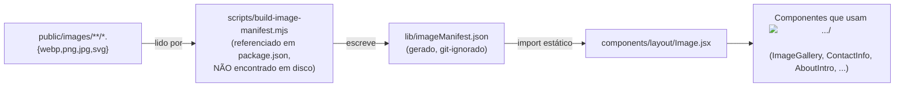
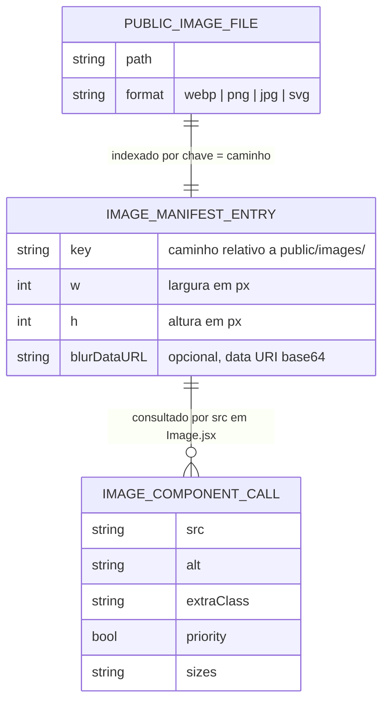
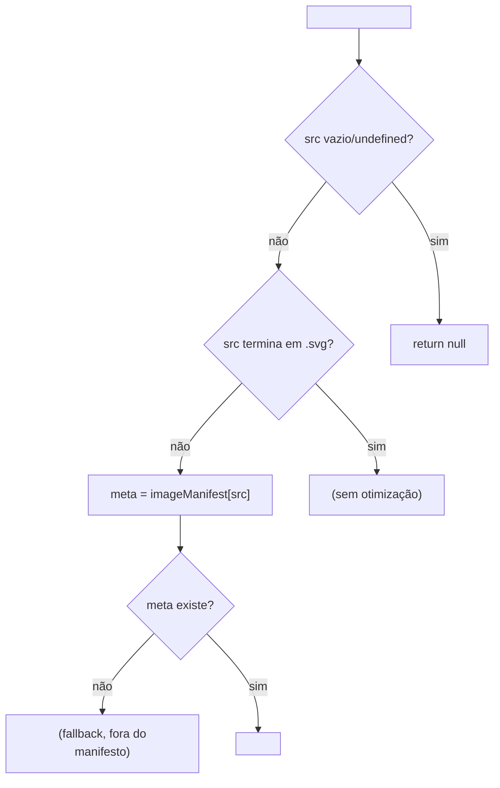
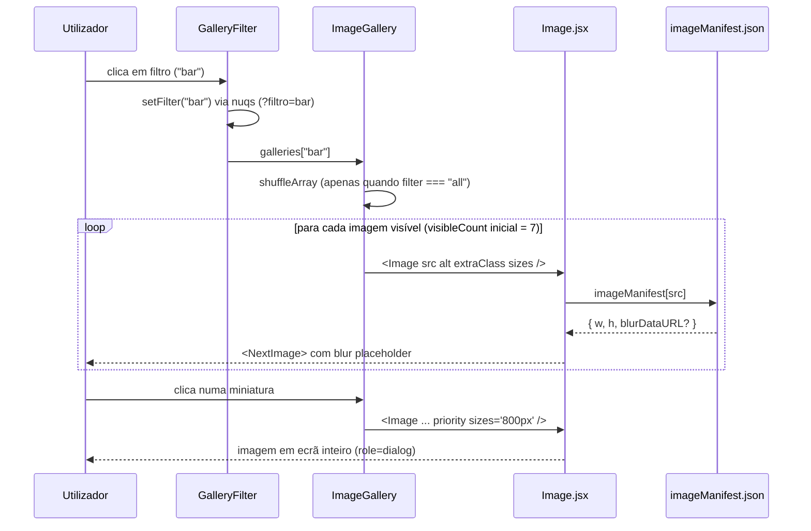

# Image Manifest & Media Handling

## Table of Contents
- [[Content/Content Model (Messages & Gallery JSON)]]
- [[Frontend/Component Domains Overview]]
- [[Architecture/App Router & Layout Composition]]
- [[SEO/Static Site Generation Strategy]]
- [[index]]

## O problema que o manifesto resolve

O componente `next/image` do Next.js precisa de conhecer a largura e a altura intrínsecas de cada imagem local para poder reservar espaço no layout sem "saltos" (cumulative layout shift) e para gerar automaticamente um `blurDataURL` de baixa resolução como placeholder enquanto a imagem real carrega. Como este projeto não tem CMS nem base de dados de media — as imagens são apenas ficheiros em `public/images/` — essa informação (`width`, `height`, `blurDataURL`) tem de ser calculada antecipadamente e disponibilizada de forma que qualquer componente possa consultá-la de forma síncrona, sem chamadas de rede nem processamento de imagem em runtime.

É esse o papel de `lib/imageManifest.json`: um índice gerado no momento do build (ou no arranque do `next dev`) que mapeia cada caminho de imagem relativo a `public/images/` para o seu tamanho e, quando aplicável, o seu placeholder em blur.



> **Sources:** `lib/imageManifest.json:L1-L60`, `components/layout/Image.jsx:L1-L71`, `package.json:L1-L35`, `CLAUDE.md`

## Quando e como o manifesto é gerado

O `package.json` deste projeto define dois scripts de ciclo de vida do npm que correm automaticamente antes de outras operações:

```json
"predev": "node scripts/build-image-manifest.mjs",
"prebuild": "node scripts/build-image-manifest.mjs"
```

Ou seja, tanto `npm run dev` como `npm run build` disparam primeiro `node scripts/build-image-manifest.mjs`, que (segundo a descrição em `CLAUDE.md`) percorre `public/images/` e escreve o resultado em `lib/imageManifest.json`. Este ficheiro está listado no `.gitignore` do projeto com o comentário `"# de public/images/ — não é fonte de verdade, não commitar"`, confirmando que é puramente derivado: pode ser apagado e reconstruído a qualquer momento a partir das imagens presentes em `public/images/`, sem perda de informação.

**Nota de verificação:** foi feita uma pesquisa por ficheiros na pasta `scripts/` deste repositório e **nenhum ficheiro foi encontrado** — nem `build-image-manifest.mjs` nem `fetch-gallery.mjs` existem em disco no momento em que esta página foi gerada, apesar de ambos serem referenciados em `package.json` (o primeiro, em `predev`/`prebuild`) e em `CLAUDE.md`. Isto significa que, no estado atual do checkout analisado, `npm run dev`/`npm run build` falhariam ao tentar executar `node scripts/build-image-manifest.mjs` (o Node não encontraria o ficheiro), a menos que o script exista noutro branch, tenha sido apagado recentemente, ou seja reposto antes da próxima instalação/build. Esta página documenta apenas o que é observável a partir do consumidor do manifesto (`lib/imageManifest.json` e `components/layout/Image.jsx`); não é feita nenhuma suposição sobre o algoritmo interno do script (por exemplo, se usa `sharp` — que está listado em `devDependencies` do `package.json` — para calcular dimensões e gerar o blur placeholder).

> **Sources:** `package.json:L1-L35`, `CLAUDE.md`, verificação direta de `scripts/` (glob sem resultados)

## Estrutura de `lib/imageManifest.json`

O manifesto é um único objeto JSON plano em que cada chave é o caminho da imagem relativo a `public/images/` (sem barra inicial) e o valor é um objeto com `w` (largura em píxeis), `h` (altura em píxeis) e, opcionalmente, `blurDataURL` (uma data URI WebP em base64, muito pequena, usada como placeholder de baixa resolução):

```json
{
  "404-error/1.webp": { "w": 336, "h": 339 },
  "404-error/4.webp": { "w": 646, "h": 364, "blurDataURL": "data:image/webp;base64,..." },
  "galeria/bar/bar-01.webp": { "w": 1280, "h": 1920, "blurDataURL": "data:image/webp;base64,..." }
}
```

O ficheiro contém pelo menos 129 entradas de imagem (contagem de chaves no formato `"caminho.ext":` nas primeiras linhas inspecionadas), cobrindo tanto imagens de UI (`404-error/`, `curtain.webp`, `Homepage/`, `Menu/`, `logos/`) como as 30 fotos da galeria em `galeria/bar/`, `galeria/space/` e `galeria/events/` listadas em `content/gallery.json`. Nem todas as entradas têm `blurDataURL` — imagens pequenas ou de UI simples (como `404-error/1.webp`, `404-error/2.webp`, `404-error/3.webp`) aparecem apenas com `w`/`h`, sem placeholder de blur.



> **Sources:** `lib/imageManifest.json:L1-L60`, `content/gallery.json:L1-L60`

## O componente `Image.jsx`: a única porta de entrada

`components/layout/Image.jsx` substitui o antigo `components/layout/image.js` do Gatsby (que usava `gatsby-plugin-image` com `GatsbyImage`/`useStaticQuery`). A API de superfície manteve-se deliberadamente parecida — `src` relativo a `public/images/`, `alt`, `extraClass`, resto das props passadas através — para que os componentes portados não precisassem de mudar a forma como chamam `<Image>`.

O componente exporta também `GetURL(src)`, um lookup puro (não é hook) que devolve `/images/${src}` — a diferença explícita face ao original é que `GetURL` deixou de ser um hook, porque no Gatsby o `useStaticQuery` condicional em `components/layout/seo.js` violava as Regras dos Hooks do React.

A lógica de `Image({ src, alt, extraClass, priority = false, sizes, ...rest })` segue três caminhos, por esta ordem:

1. **SVG:** se `src` terminar em `.svg` (case-insensitive), o componente devolve sempre um `` HTML simples com `src`, `alt` e `className={extraClass}` — SVGs não passam pelo manifesto nem por `next/image`.
2. **Sem entrada no manifesto:** se `src` não terminar em `.svg` mas também não existir uma chave correspondente em `imageManifest.json` (por exemplo, uma imagem adicionada depois do último `predev`/`prebuild`), o componente também recua para um `` simples — deliberadamente, para não rebentar a página por falta de `width`/`height`.
3. **Caso normal:** com uma entrada de manifesto encontrada (`meta = imageManifest[src]`), o componente renderiza `<NextImage>` (`next/image`) com `width={meta.w}`, `height={meta.h}`, `placeholder="blur"` e `blurDataURL={meta.blurDataURL}` quando existe, `priority` (para imagens LCP, sem `loading="lazy"` nesse caso), `sizes` passado pelo chamador, e `className={extraClass}`.



Um detalhe deliberado de correção face ao Gatsby original, documentado em comentário no próprio ficheiro: **`alt` é obrigatório**. O Gatsby original fixava `alt=''` no ramo SVG e nunca propagava o `alt` recebido para o `GatsbyImage`, deixando todas as imagens sem texto alternativo real. Em `Image.jsx`, `alt` está marcado como `PropTypes.string.isRequired` e é sempre usado nos três ramos de renderização.

Outra diferença intencional de estilo: não há nenhum estilo inline forçado de "preencher o contentor". O `GatsbyImage` antigo, com `layout FULL_WIDTH`, ocupava sempre 100% do contentor com altura automática; aqui, `width`/`height` do manifesto ficam como atributos HTML de tamanho intrínseco, e cada componente que precisa do comportamento "preenche o contentor" define isso no seu próprio CSS (`width:100%; height:auto`), evitando conflitos de especificidade entre uma classe global e o CSS local de ícones/logótipos de tamanho fixo.

> **Sources:** `components/layout/Image.jsx:L1-L71`

## Consumidores típicos: galeria como caso de estudo

O uso mais denso do manifesto no projeto é a galeria de fotos. `components/about/ImageGallery.jsx` recebe uma lista de imagens (`{ src, alt }`, vindas de `content/gallery.json` através de `GalleryFilter`) e renderiza cada uma com `<Image src={image.src} alt={image.alt} extraClass="gallery-thumb" sizes="(max-width: 700px) 50vw, 22vw" />` numa grelha masonry via CSS `columns` (4 colunas em desktop, 2 em mobile, breakpoint `l`). Ao clicar numa miniatura, a mesma imagem é re-renderizada em ecrã inteiro com `sizes="800px"` e `priority` (para carregar imediatamente, sem lazy loading, já que o utilizador pediu para a ver agora), dentro de um `<div role="dialog" aria-modal="true">` navegável por teclado (Escape para fechar, ArrowLeft/ArrowRight para navegar).

`components/about/GalleryFilter.jsx` não usa `<Image>` diretamente — o seu papel é gerir qual subconjunto de `galleries` (por categoria: `all`, `bar`, `space`, `events`) é passado a `ImageGallery`, com o filtro ativo guardado na URL via `nuqs` (`useQueryState("filtro", { defaultValue: "all" })`) em vez de estado local, tornando o filtro partilhável e indexável por motores de busca.



> **Sources:** `components/about/ImageGallery.jsx:L1-L213`, `components/about/GalleryFilter.jsx:L1-L111`, `lib/imageManifest.json:L1-L60`

## Comportamento de degradação e implicações para quem adiciona imagens

Porque `Image.jsx` recua silenciosamente para `` simples quando não encontra a chave no manifesto, adicionar uma imagem nova a `public/images/` e referenciá-la de imediato num componente **não é um erro fatal** — a imagem aparece, mas sem as otimizações do `next/image` (sem `width`/`height` explícitos calculados, sem placeholder blur, sem os benefícios de redimensionamento automático do Next). É exatamente por isso que a regra 3 do `CLAUDE.md` pede explicitamente para correr `node scripts/build-image-manifest.mjs` depois de adicionar imagens novas (ou simplesmente `npm run dev`/`npm run build`, que já disparam esse passo via `predev`/`prebuild`) — para que a imagem passe do caminho de fallback para o caminho otimizado do manifesto.

Isto também explica por que este ficheiro nunca deve ser commitado nem editado manualmente: é inteiramente reconstruído a partir do conteúdo de `public/images/` a cada `dev`/`build`, e qualquer edição manual seria descartada na próxima execução.

> **Sources:** `components/layout/Image.jsx:L40-L45`, `CLAUDE.md`, `.gitignore`

---
*[[index|← Back to Index]] · Generated by repowiki*
