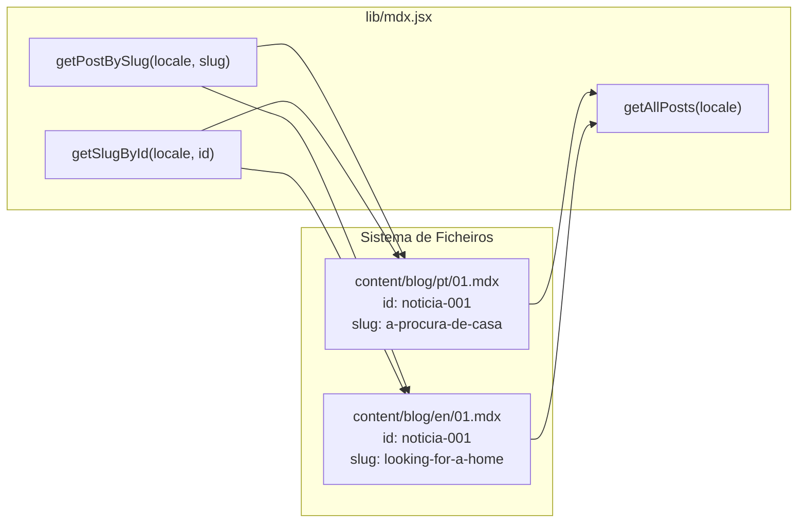
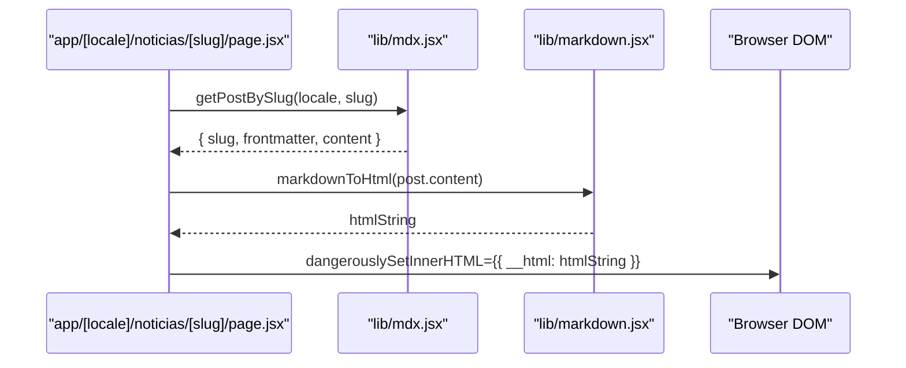
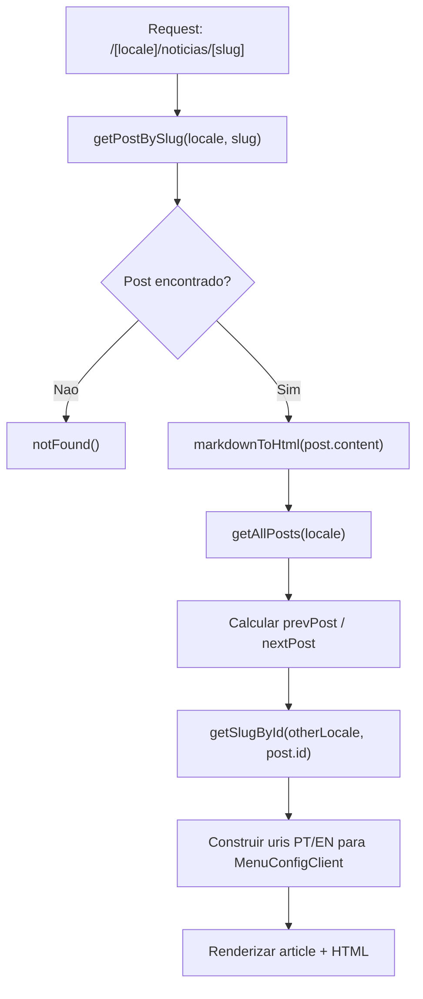

# MDX Blog Posts

## Table of Contents
- [[Content/Services & Dynamic Pages]]
- [[Architecture/App Router Structure|Architecture Overview]]
- [[index]]

## Visao Geral

O sistema de publicacao de noticias/blog assenta em ficheiros MDX armazenados no sistema de ficheiros, com separacao de conteudo por idioma. Nao ha base de dados envolvida: cada artigo e um ficheiro `.mdx` dentro de `content/blog/<locale>/`. As funcoes em `lib/mdx.jsx` leem esses ficheiros diretamente em tempo de construcao ou de pedido, extraindo frontmatter via `gray-matter` e devolvendo o corpo do artigo como string Markdown.

A renderizacao final do corpo do artigo e feita por `lib/markdown.jsx`, que converte Markdown para HTML usando a pipeline `remark` + `remark-html`, resultando numa string HTML segura para ser injetada com `dangerouslySetInnerHTML`.

> **Sources:** `lib/mdx.jsx:L1-L25` · `lib/markdown.jsx:L1-L7`

## Estrutura do Conteudo

Cada ficheiro MDX dentro de `content/blog/<locale>/` contem um bloco de frontmatter YAML seguido do corpo do artigo em Markdown puro. O frontmatter define os seguintes campos obrigatorios/opcionais:

| Campo     | Tipo   | Descricao                                              |
|-----------|--------|--------------------------------------------------------|
| `id`      | string | Identificador unico e estavel, partilhado entre locales (ex: `"noticia-001"`) |
| `title`   | string | Titulo legivel do artigo                               |
| `excerpt` | string | Resumo curto para listagens                            |
| `slug`    | string | URL-slug unico dentro do locale (ex: `"looking-for-a-home"`) |
| `date`    | string | Data de publicacao no formato `DD-MM-YYYY`             |
| `image`   | string | Caminho publico para a imagem de capa (ex: `/blog/01/01.webp`) |

O campo `id` e a chave que permite ligar artigos equivalentes em diferentes idiomas: `noticia-001` em `content/blog/pt/01.mdx` e `noticia-001` em `content/blog/en/01.mdx` referem-se ao mesmo artigo. O `slug` e diferente por locale (`"a-procura-de-casa"` em PT, `"looking-for-a-home"` em EN).

> **Sources:** `content/blog/en/01.mdx:L1-L8` · `content/blog/pt/01.mdx:L1-L8` · `lib/mdx.jsx:L5-L67`

## API de Leitura de Conteudo (lib/mdx.jsx)

O modulo `lib/mdx.jsx` exporta tres funcoes puras que operam sempre sobre o sistema de ficheiros local. Nao existe cache interno — cada chamada rele o disco.

### `getAllPosts(locale)`

Recebe um codigo de locale (`"pt"` ou `"en"`), abre o directorio `content/blog/<locale>/` e devolve um array de objectos `{ slug, frontmatter, content }` para todos os ficheiros encontrados. Se o directorio nao existir, devolve um array vazio sem lancar excepcao. O `slug` no objecto devolvido e retirado de `data.slug` (frontmatter), nao do nome do ficheiro.

### `getPostBySlug(locale, slug)`

Itera todos os ficheiros do directorio do locale e devolve o primeiro cujo frontmatter `slug` coincide com o argumento. Devolve `null` se nenhum ficheiro corresponder. Esta funcao e usada pela pagina de detalhe do artigo para carregar o conteudo apos a resolucao do slug a partir dos parametros de URL.

### `getSlugById(locale, id)`

Recebe o locale de destino e um `id` de artigo, e devolve o `slug` correspondente nesse locale. E a funcao critica para a troca de idioma na pagina de detalhe: dado o `id` do artigo actual (ex: `"noticia-001"`), obtem o slug equivalente no outro locale para construir o URI alternativo passado ao `MenuConfigClient`.

> **Sources:** `lib/mdx.jsx:L5-L67`

## Pipeline de Renderizacao Markdown

A funcao `markdownToHtml(markdown)` em `lib/markdown.jsx` e assincrona e converte uma string Markdown para HTML usando `remark` com o plugin `remark-html`. O resultado e uma string HTML serializada. Na pagina de detalhe, esta string e injectada directamente no DOM via `dangerouslySetInnerHTML={{ __html: htmlContent }}`.

Nao existe processamento de componentes MDX customizados neste pipeline — o conteudo dos ficheiros `.mdx` e tratado como Markdown puro, sem importacoes de componentes React.

> **Sources:** `lib/markdown.jsx:L1-L7` · `app/[locale]/noticias/[slug]/page.jsx:L54`

## Pagina de Listagem (noticias/page.jsx)

A pagina de listagem em `app/[locale]/noticias/page.jsx` e um Server Component que chama `getAllPosts(locale)` para obter todos os artigos do locale activo. Para cada artigo, renderiza um `<Link>` apontando para `/noticias/<slug>` com a imagem de capa e o titulo. O locale e extraido de `params.locale` e passado directamente a `getAllPosts`.

O componente `MenuConfigClient` e montado sem URIs especificos, o que indica que esta pagina nao tem alternativa de idioma dinamica configurada (ao contrario da pagina de detalhe).

> **Sources:** `app/[locale]/noticias/page.jsx:L21-L55`

## Pagina de Detalhe (noticias/[slug]/page.jsx)

A pagina de detalhe e mais complexa. Alem de carregar o artigo pelo slug, implementa:

1. **Navegacao previo/seguinte** — carrega todos os posts do locale com `getAllPosts(locale)`, determina o indice do artigo actual por `slug`, e expoe `prevPost` e `nextPost` (embora o JSX actual nao os renderize explicitamente, as variaveis estao calculadas).

2. **Troca de idioma** — usa o campo `id` do frontmatter do artigo actual para chamar `getSlugById(otherLocale, postId)`, obtendo o slug equivalente no outro locale. Este slug e passado ao `MenuConfigClient` via a prop `uris`, que contem os paths PT e EN correctos para o switcher de idioma no menu.

3. **Renderizacao** — converte o corpo Markdown para HTML com `markdownToHtml` e injeta-o num `<article>` que tambem exibe o titulo, a data e a imagem de capa.

> **Sources:** `app/[locale]/noticias/[slug]/page.jsx:L43-L109`

## Routing e Internacionalizacao

O routing baseia-se no segmento dinamico `[locale]` do App Router do Next.js. O locale activo e sempre extraido de `params.locale` e propagado manualmente para todas as funcoes de leitura de conteudo. Nao existe geracao estatica de rotas (`generateStaticParams`) nos ficheiros lidos — as paginas sao renderizadas em tempo de pedido.

Os paths de URL diferem por idioma para o blog:
- Portugues: `/pt/noticias/<slug-pt>`
- Ingles: `/en/news/<slug-en>` (o segmento `news` vs `noticias` e controlado pela configuracao de i18n, fora do escopo deste modulo)

> **Sources:** `app/[locale]/noticias/page.jsx:L21-L28` · `app/[locale]/noticias/[slug]/page.jsx:L43-L68`

---
*[[index|← Back to Index]] · Generated by repowiki*
