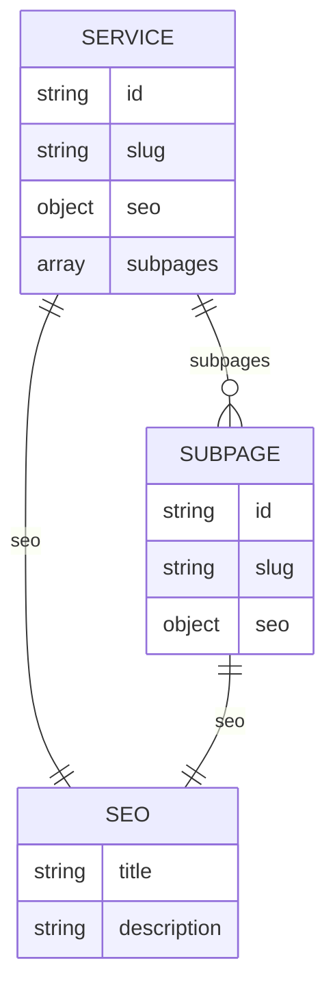
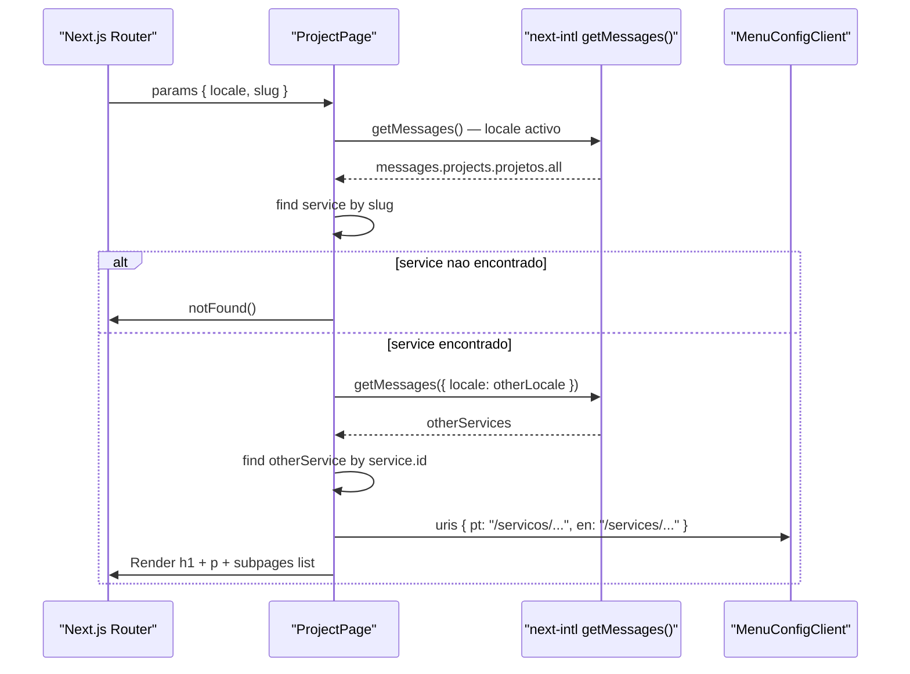
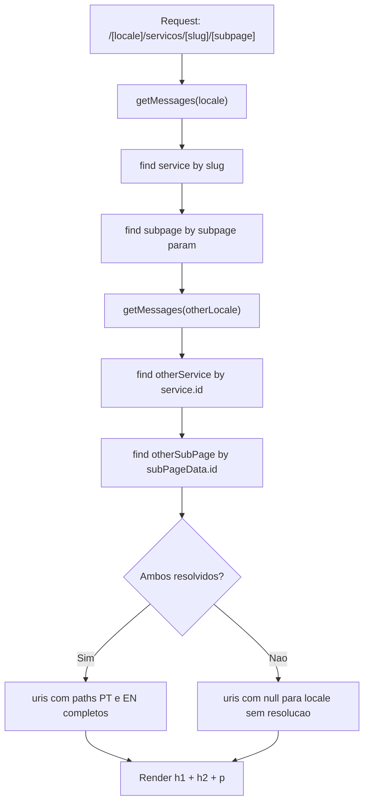
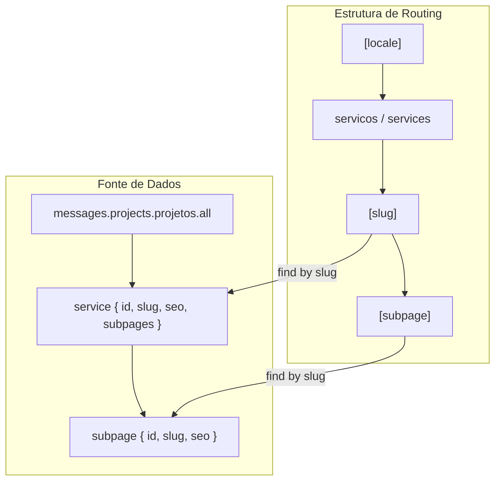

# Services & Dynamic Pages

## Table of Contents
- [[Content/MDX Blog Posts]]
- [[Architecture/App Router Structure|Architecture Overview]]
- [[index]]

## Visao Geral

As paginas de servicos diferem fundamentalmente do sistema de blog: em vez de ficheiros MDX no disco, o conteudo e carregado a partir das mensagens de i18n geridas pelo `next-intl`. Cada locale tem o seu proprio catalogo de mensagens, e os servicos (incluindo os seus slugs, titulos, descricoes e subpaginas) vivem dentro da chave `projects.projetos.all` desse catalogo.

Esta abordagem elimina a necessidade de ficheiros de conteudo separados para servicos — a traducao e o conteudo sao co-localizados nos ficheiros de mensagens. O routing e dinamico em dois niveis: `[slug]` para o servico pai e `[subpage]` para paginas filhas dentro de um servico.

> **Sources:** `app/[locale]/servicos/[slug]/page.jsx:L1-L57` · `app/[locale]/servicos/[slug]/[subpage]/page.jsx:L1-L52`

## Estrutura de Dados dos Servicos

Os servicos sao representados como objectos dentro do array `messages.projects.projetos.all`. Cada objecto de servico contem pelo menos os seguintes campos inferidos do codigo:

| Campo       | Tipo   | Descricao                                                      |
|-------------|--------|----------------------------------------------------------------|
| `id`        | string | Identificador estavel e partilhado entre locales (usado para cruzar idiomas) |
| `slug`      | string | Segmento URL unico dentro do locale                            |
| `seo.title` | string | Titulo do servico usado no `<h1>` e em metadados              |
| `seo.description` | string | Descricao usada no `
` de apresentacao                 |
| `subpages`  | array  | Lista opcional de subpaginas, cada uma com `id`, `slug` e `seo` |

As subpaginas seguem a mesma estrutura de `seo.title` e `seo.description`, alem de um campo `id` proprio que permite o cruzamento de idiomas ao nivel da subpagina.

> **Sources:** `app/[locale]/servicos/[slug]/page.jsx:L10-L13` · `app/[locale]/servicos/[slug]/[subpage]/page.jsx:L9-L25`

## Pagina de Servico (`[slug]/page.jsx`)

O Server Component `ProjectPage` recebe `locale` e `slug` de `params`. O fluxo de execucao e:

1. Carrega as mensagens do locale activo com `getMessages()`.
2. Extrai o array de servicos de `messages.projects.projetos.all`.
3. Encontra o servico cujo `slug` coincide com o parametro de URL; se nao existir, chama `notFound()`.
4. Carrega as mensagens do outro locale com `getMessages({ locale: otherLocale })` para resolver o slug equivalente, usando o campo `id` como chave de cruzamento.
5. Passa ao `MenuConfigClient` os paths PT e EN correctos para o switcher de idioma:
   - `/servicos/<slug>` para PT
   - `/services/<slug>` para EN (o prefixo de path e diferente por idioma)
6. Renderiza o titulo e descricao do servico, e lista as subpaginas como links `href=/servicos/<service.slug>/<sub.slug>`.

> **Sources:** `app/[locale]/servicos/[slug]/page.jsx:L6-L57`

## Pagina de Subservico (`[slug]/[subpage]/page.jsx`)

O Server Component `ServiceSubPage` adiciona um terceiro nivel ao routing dinamico, recebendo `locale`, `slug` e `subpage` de `params`. O cruzamento de idiomas opera a dois niveis independentes:

1. **Nivel do servico pai** — o `id` do servico e usado para encontrar o servico equivalente no outro locale e obter o seu `otherSlug`.
2. **Nivel da subpagina** — dentro do servico equivalente, o `id` da subpagina e usado para encontrar a subpagina correspondente e obter o seu `otherSubSlug`.

O `MenuConfigClient` so recebe URIs validos se ambos os niveis forem resolvidos com sucesso (`otherSlug && otherSubSlug`); caso contrario, o valor e `null`.

O conteudo renderizado e minimo: o slug do servico pai num `<h1>`, o titulo da subpagina num `<h2>`, e a descricao num `
`.

> **Sources:** `app/[locale]/servicos/[slug]/[subpage]/page.jsx:L5-L52`

## Diferenca entre Blog e Servicos

Embora ambos os sistemas sirvam conteudo dinamico com suporte a dois idiomas, diferem significativamente na fonte de dados e no mecanismo de cruzamento:

| Aspecto               | Blog (noticias)                        | Servicos                               |
|-----------------------|----------------------------------------|----------------------------------------|
| Fonte de dados        | Ficheiros MDX em `content/blog/<locale>/` | Mensagens i18n via `next-intl`        |
| Cruzamento de idioma  | `getSlugById(otherLocale, id)` em `lib/mdx.jsx` | `getMessages({ locale: otherLocale })` + `find by id` |
| Renderizacao do corpo | Markdown -> HTML via `remark`          | Campos estruturados (titulo, descricao) |
| Subpaginas            | Nao aplicavel                          | Array `subpages` com routing `[subpage]` |
| Profundidade de URL   | Dois niveis: `/noticias/[slug]`        | Tres niveis: `/servicos/[slug]/[subpage]` |

> **Sources:** `app/[locale]/servicos/[slug]/page.jsx:L1-L57` · `app/[locale]/noticias/[slug]/page.jsx:L1-L109`

## Routing e Convencoes de URL

Os paths de URL para servicos variam por locale a nivel do segmento pai:
- Portugues: `/pt/servicos/<slug-pt>` e `/pt/servicos/<slug-pt>/<subpage-pt>`
- Ingles: `/en/services/<slug-en>` e `/en/services/<slug-en>/<subpage-en>`

Esta diferenca (servicos vs services) e gerida pela configuracao de i18n do `next-intl`, nao pelos ficheiros de pagina. Os ficheiros de pagina apenas constroem os paths correctos por idioma ao preparar os `uris` para o `MenuConfigClient`.

> **Sources:** `app/[locale]/servicos/[slug]/page.jsx:L28-L42` · `app/[locale]/servicos/[slug]/[subpage]/page.jsx:L31-L46`

---
*[[index|← Back to Index]] · Generated by repowiki*
