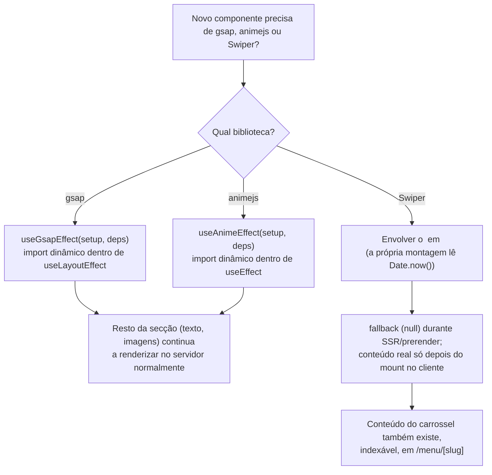
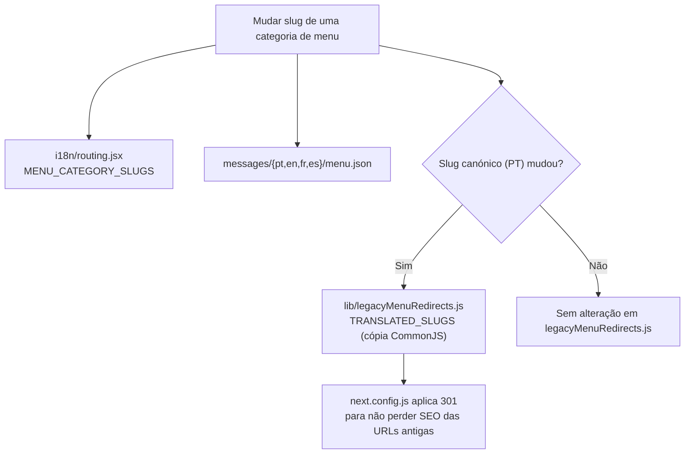

# Common Issues & Gotchas

## Table of Contents
- [[FAQ/Migration Notes (Gatsby to Next)]]
- [[I18n/Locale Routing & Middleware]]
- [[Frontend/Animation Hooks & Client-Only Boundaries]]
- [[Architecture/App Router & Layout Composition]]
- [[Overview/Introduction & Tech Stack]]

Este site é um caso incomum para o Next.js 16: usa `cacheComponents` (Partial Prerendering) para pré-renderizar estaticamente quase todas as páginas, mas depende de três bibliotecas de terceiros (`gsap`, `animejs`, `swiper`) que foram escritas para o browser e nunca pensaram em SSR. O atrito entre essas duas realidades é a causa de praticamente todas as armadilhas específicas deste codebase — e é o motivo de existirem `hooks/useGsapEffect.jsx`, `hooks/useAnimeEffect.jsx` e `components/layout/ClientOnly.jsx`. Esta página documenta essas armadilhas e mais algumas regras de projeto que, se ignoradas, produzem bugs silenciosos ou builds que falham sem explicação óbvia.

## O problema central: bibliotecas que leem `Date.now()` ao carregar

O Next.js 16, com PPR ativo (`cacheComponents` em `next.config.js`), tenta pré-renderizar estaticamente o máximo de HTML possível em build time. Para isso, exige que nada avaliado durante esse prerender dependa de valores que mudam a cada execução — relógio do sistema, `Math.random()`, etc. Se um módulo importado por um Client Component lê `Date.now()` só por ser importado (não numa função, mas no topo do módulo, durante a sua inicialização), o Next apanha esse valor "congelado" no HTML da build e rejeita-o com um erro do tipo *"unstable value Date.now() in a Client Component"*.

Três bibliotecas usadas neste projeto fazem exatamente isso:

- **gsap**: inicializa o seu ticker interno com `Date.now()` no próprio import.
- **animejs**: o mesmo motivo, ao carregar `animejs/lib/anime.es.js`.
- **Swiper**: pior ainda — lê `Date.now()` durante o *render inicial* do componente, não só ao importar o módulo. Isto significa que nem um import dinâmico dentro de um `useEffect` resolve — a biblioteca em si tem de nunca ser montada durante o prerender.

A solução adotada, e que deve ser seguida para qualquer novo uso destas bibliotecas, tem duas variantes:

1. **gsap e anime.js — import dinâmico dentro do efeito.** `useGsapEffect` e `useAnimeEffect` nunca importam `gsap`/`animejs` no topo do ficheiro. Em vez disso, o `import()` dinâmico acontece dentro de `useLayoutEffect`/`useEffect`, que só corre no browser depois do mount — nunca durante SSR ou prerender. `useGsapEffect` ainda regista o `cancelled` flag e reverte o `gsap.context()` na cleanup, para evitar leaks se o componente desmontar antes do import resolver.
2. **Swiper — `ClientOnly`.** Como a própria montagem do componente já é o problema, `components/layout/ClientOnly.jsx` usa o padrão `useState(false)` + `useEffect(() => setMounted(true), [])` para só renderizar `children` depois do primeiro efeito no cliente, devolvendo `fallback` (por omissão `null`) durante SSR/prerender. É usado exclusivamente à volta dos três carrosséis Swiper do site: `FoodSlider`, `BarDrinks` e `PizzarteInfo` (dentro de `components/about/`).

Um efeito colateral importante: o conteúdo dos três carrosséis Swiper não é a única fonte desses dados — o mesmo conteúdo existe também, de forma indexável por motores de busca, nas páginas `/menu/[slug]` correspondentes. Isto significa que, mesmo sendo `ClientOnly` (invisível ao prerender), o SEO desse conteúdo não depende só do carrossel.

**Se vires este erro numa build:** *"unstable value Date.now() in a Client Component"* — procura primeiro se alguém importou `gsap`, `gsap/ScrollTrigger`, `animejs` ou `swiper`/`swiper/react` no topo de um ficheiro em vez de dentro de um efeito, ou se um componente Swiper foi colocado fora de `ClientOnly`.

> **Sources:** `hooks/useGsapEffect.jsx:L1-L31` · `hooks/useAnimeEffect.jsx:L1-L22` · `components/layout/ClientOnly.jsx:L1-L17` · `CLAUDE.md:L19-L20`

## `.repowiki/` desatualizado — não confiar sem verificar a data

O diretório `.repowiki/` deste projeto foi originalmente gerado para o **cliente anterior do starter**, um site imobiliário com rotas `/noticias` e `/servicos` que já não existem no código. O `CLAUDE.md` sinaliza isto explicitamente como regra de desenvolvimento nº 1: não seguir o `.repowiki/` como fonte de verdade até ser regenerado. Esta própria página faz parte desse esforço de regeneração — mas o princípio geral fica: **para qualquer página desta wiki, confirmar sempre contra o código real (`CLAUDE.md` e os ficheiros fonte) antes de assumir que uma afirmação ainda é válida**, sobretudo se a data de geração no frontmatter for anterior à última alteração relevante do ficheiro em causa.

> **Sources:** `CLAUDE.md:L24`

## Links internos: nunca `next/link` com caminho fixo

O projeto tem 4 locales (`pt` sem prefixo por ser o default, `en`, `fr`, `es`), cada um com os seus próprios *pathnames* traduzidos (por exemplo, a categoria de menu "saladas" chama-se `salades` em francês e `ensaladas` em espanhol — ver `i18n/routing.jsx`, `MENU_CATEGORY_SLUGS`). Um `<Link href="/menu/saladas">` do `next/link` produziria sempre o slug em português, mesmo dentro de `/fr/...`, gerando um link morto ou, na melhor das hipóteses, um redirecionamento 301 desnecessário via `lib/legacyMenuRedirects.js`.

A regra do projeto (`CLAUDE.md`, regra nº 2) é usar sempre:

- `@/i18n/navigation` (`Link`, `useRouter`, `getPathname`) para navegação genérica com next-intl, ou
- `i18n/navLinks.js` (`translateNavLink`) para traduzir links canónicos guardados nas mensagens (`nav[].link`, `submenu[].slug` em `home.json`) para o locale atual.

Esta regra nasceu diretamente de um bug real herdado do Gatsby: o `gatsby-node.js` original gerava sempre `/{lang}/menu/{slugPT}`, nunca traduzindo o slug de categoria fora do português, mesmo quando o `url.json` já tinha a tradução certa disponível. `lib/legacyMenuRedirects.js` existe precisamente para fazer 301 dessas URLs antigas, já indexadas por motores de busca, para as URLs corretas e traduzidas.

> **Sources:** `CLAUDE.md:L13,L25` · `lib/legacyMenuRedirects.js:L1-L28`

## Mudar uma categoria de menu: três (ou quatro) ficheiros, não um

Os slugs de categoria de menu não vivem num único lugar. Segundo a regra nº 4 do `CLAUDE.md`, mudar uma categoria implica tocar em:

1. `i18n/routing.jsx` — `MENU_CATEGORY_SLUGS`, o mapa canónico de tradução por locale.
2. `messages/*/menu.json` (pt/en/fr/es) — o conteúdo da categoria em si.
3. `lib/legacyMenuRedirects.js` — **apenas se o slug canónico (PT) mudar**, para adicionar/ajustar o 301 que evita perda de SEO nas URLs antigas já indexadas.

O ponto mais fácil de esquecer é o terceiro: `lib/legacyMenuRedirects.js` é consumido por `next.config.js`, que corre em **CommonJS puro, sem transpilação**. Por isso, este ficheiro não pode fazer `import` do módulo ES `i18n/routing.jsx` — em vez disso, mantém a sua própria tabela `TRANSLATED_SLUGS`, uma cópia autónoma e deliberadamente parcial de `MENU_CATEGORY_SLUGS` (só os pares que **diferem** do slug em português é que aparecem lá; categorias como `pizzas` ou `panne-di-pizza`, iguais nos 4 idiomas, não precisam de entrada). Se `MENU_CATEGORY_SLUGS` mudar e `TRANSLATED_SLUGS` não for atualizado a par, os redirecionamentos 301 ficam desalinhados com o mapa de rotas real.

> **Sources:** `CLAUDE.md:L27` · `lib/legacyMenuRedirects.js:L1-L28`

## Imagens: gerar o manifesto antes de confiar no que vês

Todo o conteúdo visual novo vai para `public/images/`, referenciado via `components/layout/Image.jsx` com `src` relativo e `alt` obrigatório. Este componente depende de `lib/imageManifest.json`, que é **gerado, não commitado** — corre em `predev`/`prebuild` via `scripts/build-image-manifest.mjs`. Adicionar uma imagem nova e esquecer de correr `node scripts/build-image-manifest.mjs` (ou simplesmente `npm run dev`/`npm run build`, que já o disparam automaticamente) resulta em dimensões/blur placeholder desatualizados ou em falta para essa imagem.

> **Sources:** `CLAUDE.md:L15,L26`

## Sem formulário de reservas/contacto — não recriar sem pedido explícito

O site atual não tem formulário de reservas nem de contacto. Foi removido **intencionalmente** durante a migração porque não existia no site em produção antes da migração — não é uma funcionalidade em falta por engano. A regra nº 5 do `CLAUDE.md` é explícita: não recriar sem pedido explícito do cliente/stakeholder.

> **Sources:** `CLAUDE.md:L28`

## `global-not-found.jsx`: a localização importa mais do que parece

Existem dois ficheiros de 404 e não são intercambiáveis:

- `app/global-not-found.jsx` — vive na **raiz** de `app/`, sem `params`, e é o único que o Next.js 16 usa para qualquer URL que não corresponda a nenhuma rota. Por não receber `params.locale`, mostra sempre conteúdo em PT por omissão (é o único comportamento possível sem um locale resolvido).
- `app/[locale]/not-found.jsx` — trata os `notFound()` chamados explicitamente dentro de uma rota já resolvida (por exemplo `/en/menu/categoria-inexistente`). Este sabe o locale via `getLocale()`.

O `CLAUDE.md` avisa para ler o comentário no ficheiro antes de mexer em `app/global-not-found.jsx` — a razão histórica está documentada em [[FAQ/Migration Notes (Gatsby to Next)]]: o starter original tinha este ficheiro no sítio errado (dentro de `app/[locale]/`), onde nunca era efetivamente usado.

> **Sources:** `CLAUDE.md:L10-L11`

---
*[[index|← Back to Index]] · Generated by repowiki*
