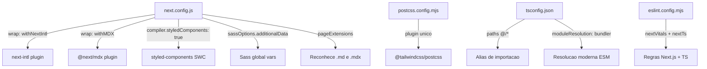
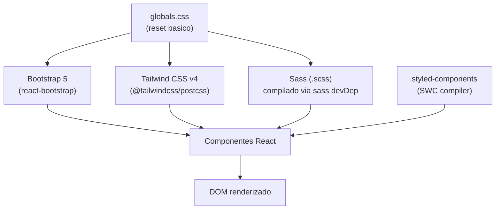
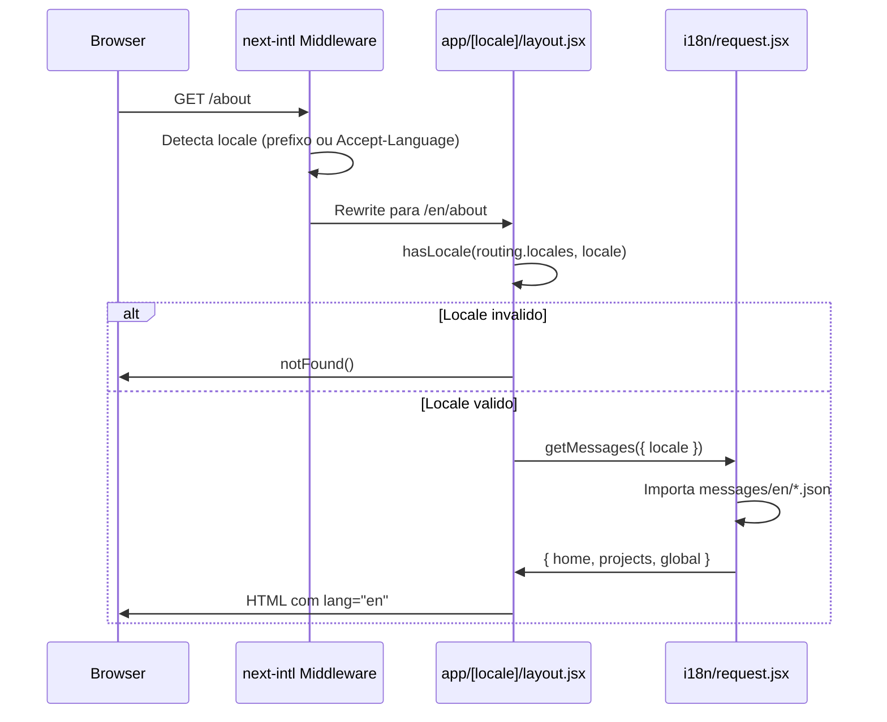
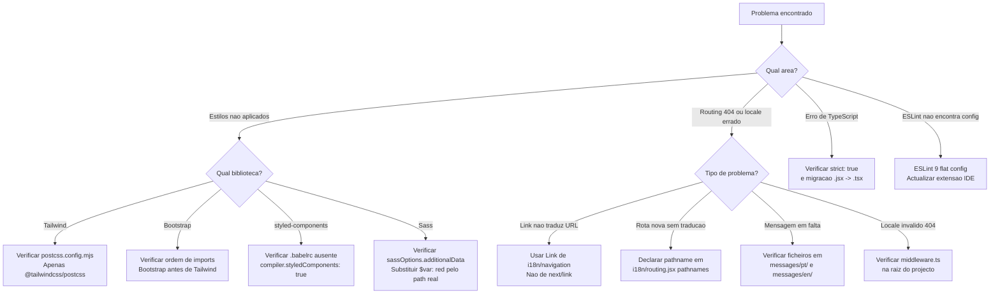

# Problemas Comuns e Solucoes

## Indice

- [[Architecture/App Router Structure|Architecture Overview]]
- [[I18n/Locale Routing|i18n & Routing]]

---

## Visao Geral da Stack de Configuracao

Este projeto combina varias bibliotecas e ferramentas que interagem entre si e que, quando mal configuradas, produzem erros silenciosos ou inesperados. Compreender como os ficheiros de configuracao raiz se encadeiam e a razao de cada escolha arquitetural e o primeiro passo para diagnosticar qualquer problema.



> **Sources:** `next.config.js:L1-L24` · `postcss.config.mjs:L1-L7` · `tsconfig.json:L1-L34` · `eslint.config.mjs:L1-L18`

---

## Problemas de Configuracao do next.config.js

### Ordem dos plugins importa

O `next.config.js` usa um padrao de composicao de funcoes: `withNextIntl(withMDX(nextConfig))`. Esta ordem nao e arbitraria. O `withNextIntl` deve envolver o resultado externo para que o middleware de routing de locale seja registado correctamente pelo Next.js antes que qualquer outra transformacao de modulos (como a do MDX) ocorra.

**Sintoma de erro:** Se a ordem for invertida para `withMDX(withNextIntl(nextConfig))`, o middleware `next-intl` pode nao ser aplicado a todas as rotas, resultando em redirects de locale que falham silenciosamente ou em paginas servidas sem locale no URL.

**Solucao:** Manter sempre a composicao na forma:

```
module.exports = withNextIntl(withMDX(nextConfig));
```

> **Sources:** `next.config.js:L21-L24`

---

### globalNotFound requer ficheiro no lugar certo

A opcao experimental `globalNotFound: true` esta activada. Esta flag instrui o Next.js a usar um ficheiro `global-not-found` para lidar com erros 404 a nivel global, em vez de depender apenas do `not-found.jsx` por segmento de rota.

**Onde deve estar o ficheiro:** O projeto ja tem `app/[locale]/global-not-found.jsx`. Se este ficheiro for removido ou renomeado, o Next.js pode lancar um aviso em build ou reverter para o comportamento padrao de 404 sem o contexto de locale.

> **Sources:** `next.config.js:L8-L10` · `app/[locale]/global-not-found.jsx`

---

### styledComponents no compiler

A flag `compiler.styledComponents: true` activa a transformacao SWC nativa para `styled-components`. Isto significa que o Babel nao e necessario para suporte a SSR de `styled-components` — o SWC trata disso.

**Problema comum:** Se adicionar um ficheiro `.babelrc` ou `babel.config.js` ao projecto, o Next.js desactiva o compilador SWC e passa a usar Babel. Nesse cenario, a flag `compiler.styledComponents` e ignorada e o SSR de `styled-components` pode quebrar (classes CSS inconsistentes entre servidor e cliente).

**Solucao:** Nunca adicionar configuracao Babel a este projecto a nao ser que seja estritamente necessario e se adicionar o plugin `babel-plugin-styled-components` manualmente.

> **Sources:** `next.config.js:L11-L13` · `package.json:L41` (styled-components ^6.3.12)

---

### sassOptions.additionalData com variavel de placeholder

O campo `sassOptions.additionalData` esta definido como `$var: red;`. Este e um valor de exemplo/placeholder que injeta a variavel Sass `$var` em todos os ficheiros `.scss` do projecto globalmente.

**Problema comum:** Qualquer ficheiro Sass que tente redefinir `$var` ira receber um conflito de declaracao. Se as variaveis globais de Sass do projecto nao forem colocadas aqui, nao estao disponiveis globalmente — precisam de ser importadas manualmente em cada ficheiro.

**Solucao recomendada:** Substituir o valor de placeholder pelo caminho real para o ficheiro de variaveis Sass do projecto, por exemplo: `@use 'styles/variables' as *;`.

> **Sources:** `next.config.js:L14-L16`

---

### pageExtensions e ficheiros MDX

O array `pageExtensions: ["js", "jsx", "ts", "tsx", "md", "mdx"]` indica ao Next.js que ficheiros `.md` e `.mdx` tambem podem ser paginas. Isto esta alinhado com a presenca do plugin `@next/mdx`.

**Problema comum:** Se criar um ficheiro `.md` numa pasta de rotas sem exportar um componente React como `default export`, o Next.js vai tentar renderiza-lo como pagina e falhar com um erro de modulo invalido.

**Solucao:** Ficheiros `.md` usados apenas como conteudo (nao como rotas) devem ficar fora da pasta `app/` — por exemplo, na pasta `content/` que ja existe no projecto.

> **Sources:** `next.config.js:L17` · directorio `content/` (presente na raiz)

---

## Problemas da Stack de Estilos (Tailwind + Sass + styled-components + Bootstrap)

Este projecto usa quatro sistemas de estilos em simultaneo: Tailwind CSS v4, Sass, `styled-components` e Bootstrap 5 com `react-bootstrap`. Esta combinacao e poderosa mas requer cuidado para evitar conflitos de especificidade e resets duplicados.



> **Sources:** `package.json:L19,L41,L44-L46` · `postcss.config.mjs:L1-L7` · `app/globals.css:L1-L25`

---

### Tailwind CSS v4: PostCSS como unico plugin

O `postcss.config.mjs` usa apenas `@tailwindcss/postcss` como plugin. Esta e a forma correcta para Tailwind v4 — ao contrario do v3, nao existe um `tailwindcss.config.js` separado nem o plugin `autoprefixer` precisa de ser declarado explicitamente (e incluido pelo proprio `@tailwindcss/postcss`).

**Problema comum:** Desenvolvedores familiarizados com Tailwind v3 que adicionam um `tailwind.config.js` classico ou tentam usar `@tailwindcss/vite` em vez de `@tailwindcss/postcss` vao obter erros de compilacao ou estilos que nao sao aplicados.

**Solucao:** Manter o `postcss.config.mjs` com apenas `@tailwindcss/postcss: {}` e nao criar `tailwind.config.js` a menos que seja necessario override de tema (o que no v4 e feito via CSS `@theme`).

> **Sources:** `postcss.config.mjs:L1-L7` · `package.json:L44` (@tailwindcss/postcss ^4) · `package.json:L52` (tailwindcss ^4)

---

### globals.css esta comentado no layout do locale

O import `import '../globals.css'` no ficheiro `app/[locale]/layout.jsx` esta comentado (`/* import '../globals.css' */`). Isto significa que o reset basico e as definicoes de `body` em `globals.css` nao estao activos por defeito nas rotas com locale.

**Sintoma:** A `background-color: #EBE9E3` e outros estilos globais definidos em `globals.css` nao serao aplicados, podendo resultar num fundo branco ou em estilos de `body` inesperados.

**Solucao:** Descomentar o import quando o projecto sair do estado de template e os estilos globais forem necessarios. Alternativamente, importar os estilos globais diretamente no `app/layout.jsx` raiz (actualmente apenas retorna `children`).

> **Sources:** `app/[locale]/layout.jsx:L1` · `app/globals.css:L1-L25` · `app/layout.jsx:L1-L3`

---

### Conflito de especificidade Bootstrap vs Tailwind

Bootstrap 5 inclui o seu proprio reset (`reboot.css`) que redefine margens, paddings e box-sizing. Tailwind v4 aplica o seu proprio preflight. Quando ambos estao activos, pode haver conflitos.

**Sintoma:** Elementos como `<button>`, `<input>` ou `<a>` podem ter estilos inesperados dependendo da ordem em que os CSS sao carregados.

**Solucao recomendada:** Importar Bootstrap antes de Tailwind para que as classes utilitarias do Tailwind possam sobrepor-se com maior especificidade. Usar o mecanismo `@layer` do Tailwind v4 para gerir a precedencia.

> **Sources:** `package.json:L19` (bootstrap ^5.3.8) · `package.json:L21` (react-bootstrap ^2.10.10) · `postcss.config.mjs:L1-L7`

---

## Problemas de Routing i18n (next-intl)



> **Sources:** `i18n/routing.jsx:L1-L38` · `i18n/request.jsx:L1-L19` · `app/[locale]/layout.jsx:L10-L41`

---

### localePrefix: "as-needed" e o locale padrao

A configuracao `localePrefix: "as-needed"` significa que o locale padrao (`pt`) nao aparece no URL. Ou seja, `https://exemplo.pt/` serve o locale portugues sem prefixo, enquanto `https://exemplo.pt/en/` serve o ingles.

**Problema comum:** Links criados com o `Link` nativo do Next.js (`next/link`) em vez do `Link` exportado de `i18n/navigation.jsx` nao respeitam o routing de locale. O link para `/sobre-nos` nao sera automaticamente traduzido para `/about` quando o locale for ingles.

**Solucao:** Sempre importar `Link`, `redirect`, `usePathname`, `useRouter`, e `getPathname` de `../../i18n/navigation` (ou do path equivalente) e nunca de `next/link` ou `next/navigation` diretamente.

**Exemplo do problema no ficheiro raiz:**

O ficheiro `app/page.jsx` usa `import Link from "next/link"` e referencia `/sobre` (que nao e uma rota valida definida em `routing.jsx`) — este ficheiro e um stub de demonstracao e nao deve ser usado em producao.

> **Sources:** `i18n/routing.jsx:L4-L6` · `i18n/navigation.jsx:L1-L5` · `app/page.jsx:L1-L2`

---

### Rotas localizadas: pathnames tem de ser declarados explicitamente

O objecto `pathnames` em `i18n/routing.jsx` define todos os pares de URLs por locale. Apenas as rotas aqui declaradas beneficiam de traducao automatica de pathname.

**Rotas configuradas actualmente:**

| Pathname interno | PT | EN |
|---|---|---|
| `/` | `/` | `/` |
| `/sobre-nos` | `/sobre-nos` | `/about` |
| `/noticias` | `/noticias` | `/news` |
| `/noticias/[slug]` | `/noticias/[slug]` | `/news/[slug]` |
| `/servicos` | `/servicos` | `/services` |
| `/servicos/[slug]` | `/servicos/[slug]` | `/services/[slug]` |
| `/servicos/[slug]/[subpage]` | `/servicos/[slug]/[subpage]` | `/services/[slug]/[subpage]` |
| `/politica-de-privacidade` | `/politica-de-privacidade` | `/privacy-policy` |

**Problema comum:** Se adicionar uma nova rota (`/contacto`) sem a declarar em `pathnames`, o `Link` de `i18n/navigation` vai usar o pathname interno directamente em ambos os locales, sem traducao. Nao e um erro de compilacao — falha silenciosamente.

**Solucao:** Sempre que adicionar uma nova pagina localizada, declarar o seu pathname para cada locale em `i18n/routing.jsx`.

> **Sources:** `i18n/routing.jsx:L7-L37`

---

### Mensagens em falta causam erro em runtime

O `i18n/request.jsx` importa dinamicamente tres namespaces de mensagens: `home`, `projects` (do ficheiro `projetos.json`) e `global`. Se um destes ficheiros JSON nao existir para um locale, o `import()` dinamico vai rejeitar a promise e a pagina vai lancar um erro 500.

**Ficheiros de mensagens esperados por locale:**

```
messages/
  pt/
    home.json
    projetos.json
    global.json
  en/
    home.json
    projetos.json
    global.json
```

**Problema de inconsistencia de nome:** O namespace e exposto como `projects` mas o ficheiro fonte chama-se `projetos.json`. Se o ficheiro for renomeado, o import em `i18n/request.jsx:L14` tem de ser actualizado em concordancia.

> **Sources:** `i18n/request.jsx:L13-L16`

---

### Locale invalido chama notFound() no layout

O layout em `app/[locale]/layout.jsx` verifica se o locale recebido nos `params` e valido usando `hasLocale(routing.locales, locale)`. Se o locale nao estiver na lista `["pt", "en"]`, chama `notFound()`, que com `globalNotFound: true` activo usa o ficheiro `app/[locale]/global-not-found.jsx`.

**Problema comum:** Em desenvolvimento, se o middleware `next-intl` nao estiver configurado (ficheiro `middleware.ts` ou `middleware.js` ausente da raiz do projecto), pedidos directos como `/fr/page` chegam ao layout com um locale invalido e retornam 404 em vez de ser redirecionados.

**Solucao:** Verificar se existe um ficheiro `middleware.ts` na raiz que exporte o middleware do `next-intl`. Este ficheiro nao esta visivel nos ficheiros listados e pode precisar de ser criado.

> **Sources:** `app/[locale]/layout.jsx:L12-L14` · `next.config.js:L21` (createNextIntlPlugin)

---

## Problemas de TypeScript e Aliases

### Alias @/* aponta para a raiz do projecto

O `tsconfig.json` define `"paths": { "@/*": ["./*"] }`, o que significa que `@/components/Menu` resolve para `./components/Menu` a partir da raiz do projecto.

**Problema comum:** Ao mover ficheiros entre pastas ou ao criar novos modulos, importacoes com `@/` podem funcionar em TypeScript (o IDE resolve correctamente) mas falhar em runtime se o `moduleResolution: "bundler"` do tsconfig nao for suportado pela versao do bundler em uso.

**Nota:** `moduleResolution: "bundler"` e o modo recomendado para projectos Next.js modernos com ESM. E compativel com o bundler interno do Next.js (Turbopack ou Webpack com config adequada).

> **Sources:** `tsconfig.json:L21-L23` · `tsconfig.json:L13`

---

### strict: true pode causar erros em ficheiros .jsx existentes

O compilador TypeScript esta configurado com `strict: true`, que activa um conjunto de verificacoes incluindo `strictNullChecks`, `noImplicitAny`, e `strictFunctionTypes`. Muitos ficheiros no projecto sao `.jsx` (nao `.tsx`), o que significa que o TypeScript os verifica com `allowJs: true` mas sem anotacoes de tipo explicitas.

**Problema comum:** Adicionar um novo ficheiro `.tsx` estritamente tipado que importa de um `.jsx` sem tipos pode gerar erros de `implicit any` ou de tipo incompativel.

**Solucao:** Migrar gradualmente ficheiros `.jsx` para `.tsx` adicionando tipos, ou usar `// @ts-expect-error` com justificacao quando a migracao nao for imediata.

> **Sources:** `tsconfig.json:L6` · `tsconfig.json:L7` (allowJs: true)

---

## Problemas de ESLint

### Uso de defineConfig e globalIgnores da nova API ESLint 9

O `eslint.config.mjs` usa a nova flat config API do ESLint 9 (`defineConfig`, `globalIgnores`). Esta API e incompativel com a configuracao classica baseada em `.eslintrc`.

**Problema comum:** Ferramentas ou plugins ESLint que esperam o formato `.eslintrc` (como algumas extensoes de IDE antigas) podem nao reconhecer `eslint.config.mjs` e reportar que "nao encontram configuracao".

**Solucao:** Actualizar a extensao ESLint do IDE para uma versao que suporte flat config, ou verificar a documentacao do plugin para confirmar compatibilidade com ESLint 9.

**Ignorados por defeito:** As pastas `.next/`, `out/`, `build/` e o ficheiro `next-env.d.ts` estao na lista de `globalIgnores`, o que e o comportamento correcto para nao analisar ficheiros gerados.

> **Sources:** `eslint.config.mjs:L1-L18`

---

## Arvore de Diagnostico Rapido



> **Sources:** todos os ficheiros listados em `sources`

---

*[[index|← Back to Index]] · Generated by repowiki*
