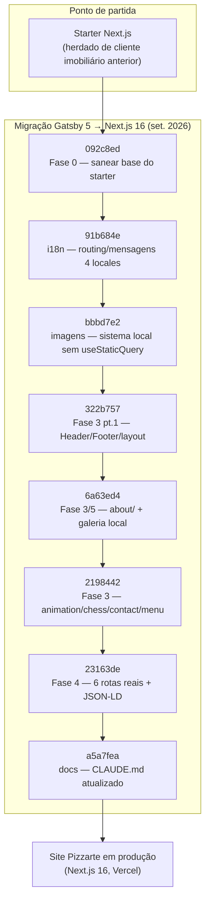
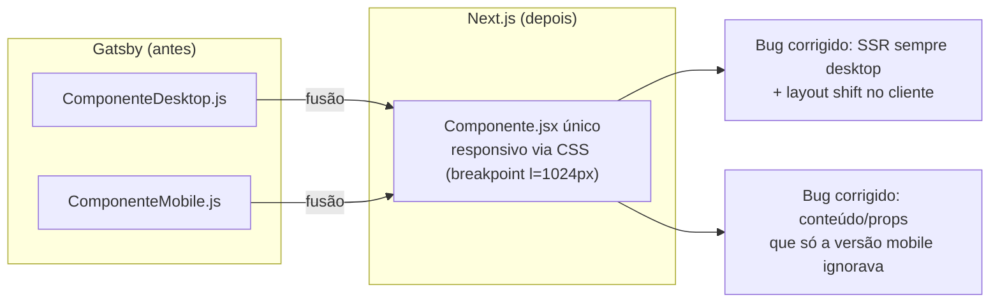

# Migration Notes (Gatsby to Next)

## Table of Contents
- [[FAQ/Common Issues & Gotchas]]
- [[Architecture/App Router & Layout Composition]]
- [[I18n/Locale Routing & Middleware]]
- [[Frontend/Component Domains Overview]]
- [[Overview/Introduction & Tech Stack]]

Em setembro de 2026, o site do Pizzarte foi migrado de **Gatsby 5** para **Next.js 16 (App Router)**. Não se tratava de um projeto novo: o código de partida era um *starter* que, por sua vez, tinha sido usado para um cliente anterior do setor imobiliário — daí restos de rotas como `/noticias` e `/servicos`, schemas JSON-LD de `LocalBusiness`/`RealEstateListing`, e um pipeline de blog em MDX, todos removidos durante a migração porque não pertenciam ao Pizzarte. Esta página resume as fases reais da migração, tal como registadas no histórico de commits do repositório, para que quem chegar depois entenda o "porquê" por trás de decisões que hoje parecem arbitrárias.

Autor dos commits de migração: Moisés Braz. Todos os commits de migração incluem `Co-Authored-By: Claude Sonnet 5`, indicando trabalho assistido por IA.

> **Sources:** `git log --oneline` (5a7b526..a5a7fea) · `CLAUDE.md:L3,L30-L32`

## Decisões-chave, fixadas desde o início

O `CLAUDE.md` resume as decisões arquiteturais tomadas durante a migração, todas confirmadas nos commits abaixo:

- **4 locales mantidos** — `pt` (default, sem prefixo de URL), `en`, `fr`, `es`.
- **styled-components mantido** como solução de CSS (não se migrou para Tailwind, CSS Modules, etc.).
- **Galeria movida do WordPress para local** — deixou de haver dependência de WordPress em runtime.
- **Vercel como alvo de deploy.**
- **Formulário de reservas/contacto não migrado** — porque não existia no site em produção antes da migração, não por omissão.

> **Sources:** `CLAUDE.md:L3,L28,L32`

## Fase 0 — Saneamento da base do starter (`092c8ed`)

*"chore: sanear base do starter (Fase 0 da migração Gatsby→Next)"*

Antes de portar qualquer conteúdo do Pizzarte, foi preciso limpar o starter herdado:

- Atualização para **React 19** e consolidação num único gestor de pacotes (ficou só `npm`; a atualização do `sharp` corrigiu uma CVE alta).
- Remoção de dependências mortas do starter que não tinham relação com o Pizzarte: `bootstrap`, `tailwind`, `emotion`, bibliotecas adjacentes a MUI (`lottie`, `countup`, multiselect, `lightgallery`, tooltip, `div-100vh`), todo o pipeline MDX/blog (`mdx`, `gray-matter`, `remark`), e `nodemailer`/`axios`.
- Adição das dependências que refletem a stack real do Pizzarte: `gsap`, `animejs`, `swiper`, `prop-types`.
- `next.config.js`: ativação de `cacheComponents` (liga o Partial Prerendering), portagem dos cabeçalhos de segurança do antigo `static/.htaccess`, hook de redirecionamentos legados, remoção de placeholders (`allowedDevOrigins`, `sassOptions`).
- `tsconfig.json` passou a incluir `.js`/`.jsx` — `allowJs` já estava a `true`, mas o `include` só apanhava `.ts`/`.tsx`, deixando toda a app sem verificação de tipos.
- Fontes: `Montserrat` via `next/font/google`; `BritishRegular` e `ChunkyRosieDemo` convertidas de `ttf`/`otf` para `woff2` (via `fonttools`) e servidas via `next/font/local`, substituindo o `<link>` bloqueante ao Google Fonts do Gatsby.
- `lib/StyledRegistry.jsx`: registry de SSR para styled-components, evitando um *flash of unstyled content* no primeiro paint.
- `lib/jsonld.js`: troca de schemas de imobiliário (`LocalBusiness`/`RealEstateListing`, herdados do cliente anterior) por `Restaurant`/`Menu`/`FAQPage`, alinhados com o negócio real do Pizzarte.
- GTM, `gtag` (GA4) e CookieYes movidos do `Helmet` do Gatsby para `next/script` e `@next/third-parties`, fora do caminho crítico de render, preservando o *Consent Mode* com "denied" por omissão.

> **Sources:** `git log 092c8ed` (stat + mensagem completa)

## i18n — Routing e mensagens dos 4 locales (`91b684e`)

*"feat(i18n): migrar routing/mensagens para os 4 locales do Pizzarte"*

- `i18n/routing.jsx`: locales `pt`/`en`/`fr`/`es`, pathnames traduzidos (`menu`, `pizzarte`, `galeria`, `contactos`) portados de `locales/{lang}/url.json` do Gatsby. `MENU_CATEGORY_SLUGS` documenta a tradução de cada categoria de menu — categorias como `les-crepes-salees`, `wrap` e `panne-di-pizza` ficam **iguais** nos 4 idiomas de propósito (são nomes usados como identidade de menu, confirmado no `menu.json` de cada idioma, não uma tradução esquecida).
- `i18n/request.jsx`: namespaces `home`/`menu`/`pizzarte`/`contact`.
- `messages/{pt,en,fr,es}/*.json` portados de `locales/` do Gatsby.
- `components/Seo.js` reescrito para iterar `routing.locales` via `getPathname()`; `alternates.languages` passa a incluir os 4 idiomas mais `x-default` (faltava antes).
- `components/LocaleSwitcher.jsx`: passou a suportar os 4 idiomas sem depender do antigo `MenuProvider`/`menuConfig`.
- **Removido** todo o conteúdo do cliente anterior (identificado no commit como "Ponto Urbano"): rotas `noticias`/`servicos`/`sobre-nos`/`contacto`, o pipeline MDX (`lib/mdx.jsx`, `lib/markdown.jsx`, `content/blog/`), `components/news/` (que já nem compilava — importava três módulos inexistentes), `utils/menuProvider.jsx`, `lib/MenuConfigClient.jsx`, `components/Menu.js`, e as rotas de API `app/api/{contact,newsletter}` (o formulário do Pizzarte não existe, não foi migrado).
- `app/robots.js`: removida a diretiva `disallow /api/`, já sem sentido depois de remover essas rotas.

> **Sources:** `git log 91b684e` (stat + mensagem completa)

## Imagens — sistema local sem `useStaticQuery` (`bbbd7e2`)

*"feat(images): sistema de imagens local, sem useStaticQuery"*

- `public/images/`: 121 imagens portadas de `src/images/` do Gatsby (das 129 originais, 8 ficaram de fora — leftovers do starter ou duplicados órfãos, como `example.png`, `gatsby-icon.png`, ou variantes com nome inconsistente como `pizza-top/bottom.webp` versus o `pizza_top/bottom.webp` com underscore realmente usado em `pizzaEffect.js`).
- `app/icon.png`: favicon real do Pizzarte, substituindo o placeholder do starter.
- `scripts/build-image-manifest.mjs` (usa `sharp`): gera `lib/imageManifest.json` com `width`/`height`/`blurDataURL` de cada imagem, uma vez por build/dev (`predev` + `prebuild`) — substitui o `useStaticQuery(allFile)` que o Gatsby corria a cada render de `<Image>`/`<GetURL>`.
- `components/layout/Image.jsx`: mantém a mesma API de superfície do Gatsby (`src` relativo, `alt`, `extraClass`), mas `GetURL()` deixou de ser um hook — no Gatsby era `useStaticQuery` chamado condicionalmente dentro de `seo.js`, o que violava as *Rules of Hooks*. `alt` passou a ser obrigatório (`PropTypes.isRequired`); o componente original do Gatsby fixava `alt=''` no ramo SVG e nunca propagava o `alt` recebido para o `GatsbyImage`.
- `lib/imageManifest.json` é gerado, não commitado (`.gitignore`).

> **Sources:** `git log bbbd7e2` (stat + mensagem completa)

## Componentes — fusão desktop+mobile (Fase 3, três commits)

A fase de componentes foi a maior em volume e em bugs reais corrigidos. O padrão em toda esta fase: cada componente do Gatsby original tinha uma versão desktop e uma versão mobile separadas; na migração, cada par foi fundido num único componente responsivo, usando CSS (`components/style/style.js`, breakpoint `l` = 1024px) em vez de duas árvores React.

### Header/Footer + primitivas de layout (`322b757`, "Fase 3, parte 1")

- `components/style/style.js` e `hooks/useBreakpoint.jsx` portados/realinhados.
- `utils/handlePhone.js` corrigiu um **bug real**: o `window.open()` da chamada telefónica estava dentro do `if` que verificava se o `gtag` já estava definido — em ligação lenta, antes do GTM carregar, clicar em "ligar" não fazia absolutamente nada (nem erro, nem chamada). Agora a chamada acontece sempre; só o tracking é condicional.
- `components/layout/Image.jsx`: removido o `style` inline `width:100%`/`height:auto` forçado em todas as imagens — entrava em empate de especificidade CSS com classes locais de ícones de tamanho fixo (ex.: `.icon{width:8px}` do footer).
- `components/layout/Reveal.jsx` substitui `react-reveal/Fade` (não mantido, incompatível com React 19) por `IntersectionObserver` + CSS, preservando a mesma API (`delay`).
- `components/layout/PageChrome.jsx` substitui o antigo `layout.js` e corrige dois bugs de arquitetura: o loader que substituía `<main>` durante 4500ms só na homepage (deixando o HTML sem conteúdo indexável e um LCP ≥ 4.5s); e um `scrollTo(0,0)` forçado que entrava em conflito com o scroll restoration nativo do browser. `<main>` fica sempre montado; o loader passa a overlay decorativo, uma vez por sessão.
- `components/header/Header.jsx` e `components/footer/Footer.jsx`: fusão desktop+mobile corrige outro bug de arquitetura — o SSR renderizava sempre a árvore desktop e o cliente trocava para mobile, causando *layout shift* e duplo *mount*. `SwipeableDrawer` (MUI) e `Div100vh` foram substituídos por um drawer próprio em styled-components e `100dvh` nativo. No footer, os ícones sociais no mobile ganharam `<a href>` — antes não tinham, e ficavam impossíveis de clicar.
- `i18n/navLinks.js` (novo): traduz os links canónicos guardados em `messages/*/home.json` para o locale atual — equivalente ao `translateUrl()` do `gatsby-plugin-translate-urls`.
- `i18n/request.jsx`: corrigida uma dupla imbricação — `home.json` tem uma chave de topo `"home"`, tal como `menu`/`pizzarte`/`contact` têm as suas — sem esta correção, `t("title")` teria de ser `t("home.title")` em todo o lado.

### `about/` + galeria local (`6a63ed4`, "Fase 3/5")

- Fusão desktop+mobile de `AboutIntro`, `BarDrinks`, `FoodSlider`, `OurSpace`, `PizzarteInfo`, `Stars`, `GalleryFilter`, `ImageGallery`.
- Bug corrigido: o `FoodSlider` ligava sempre a `/menu/{slug}` com o slug em português fixo, ignorando o locale — corrigido com `translateNavLink`.
- Bug corrigido no `GalleryFilter`: tinha um `LoaderPage` artificial de 3 segundos a cada troca de filtro, mais um `document.body.style.overflow='hidden'` sem *cleanup*. Passou a filtrar de imediato, sem bloquear o scroll da página.
- **Galeria movida do WordPress para local, por pedido explícito**: `scripts/fetch-gallery.mjs` corre uma vez, lê a GraphQL de `media.pizzarte.com` e grava 30 fotos (categorias bar/space/events) já redimensionadas e convertidas (webp, máx. 1600px, q75) em `public/images/galeria/`, mais `content/gallery.json` (com `src` e `alt` — o `altText` do WordPress vinha sempre vazio, foi substituído por texto descritivo por categoria).
- `ImageGallery.jsx`: `react-masonry-component` saiu (masonry via CSS columns nativo); o `` cru foi trocado por `<Image>` local com blur placeholder; a *lightbox* ganhou suporte de teclado (Escape/setas) e `role="dialog"`, que não existia antes.
- O filtro da galeria passou a estado de URL via `nuqs` (`?filtro=bar`).

### `animation/chess/contact/menu` + compressão de vídeo (`2198442`, "Fase 3")

- Fusão desktop+mobile de `PizzaEffect`, `Waiting`, `ChessIntro`, `ContactInfo`, `MenuSection`, `MenuNavigation`, `Dishes`.
- Bug real corrigido: a versão mobile do `PizzaEffect` pedia `"Homepage/pizza_top.png"`, um ficheiro que **nunca existiu** (só havia `.webp`) — a imagem partia silenciosamente em todos os telemóveis.
- Vídeo e poster da homepage comprimidos: `public/video/pizza-pizzarte.mp4` de 12,5MB para 7,1MB (H.264 720p, crf 26, faststart, áudio AAC mantido — o vídeo tem `controls`, não é só decorativo); poster de 8,1MB para 52KB.
- Bug corrigido no `ContactInfo`: a versão mobile tinha o subtítulo fixo `"AVEIRO"` (ignorava `data.contactInfo.title`) e o e-mail fora de `<a href={emailLink}>` (não clicável) — a versão desktop já fazia os dois corretamente; a versão mobile divergia sem razão aparente.
- Bug corrigido no `MenuNavigation`: a versão mobile tinha o título fixo `"o nosso menu"`, ignorando a prop `dataTitle`.
- `AniLink` (`gatsby-plugin-transition-link`) removido — navegação passou a ser normal, sem transições de página customizadas.
- Bug corrigido no `Header` (introduzido e apanhado na mesma sessão): a função `isActive()` prefixava o locale duas vezes por cima do que `getPathname` já devolve prefixado — o item de navegação ativo nunca ficava destacado em `en`/`fr`/`es`.

> **Sources:** `git log 322b757` · `git log 6a63ed4` · `git log 2198442` (stat + mensagens completas)

## Rotas — as 6 rotas reais do Pizzarte (`23163de`, "Fase 4")

*"feat(routes): construir as 6 rotas reais do Pizzarte (Fase 4)"*

Esta foi a fase que ligou tudo o que as fases anteriores tinham preparado a rotas reais do App Router:

- `app/[locale]/page.jsx` (homepage): `HeroBanner` (usa `<picture>` nativo para art-direction mobile/desktop sem duplo download, em vez de duas `<Image>` alternadas por CSS), `PizzaEffect`, `AboutIntro`, `FoodSlider`, `BarDrinks`, `Waiting`.
- `app/[locale]/menu/page.jsx` e `app/[locale]/menu/[slug]/page.jsx`: landing de menu e páginas de categoria, com `generateStaticParams` combinando locale × slug traduzido. Isto corrigiu o **Bug #6** identificado no plano informal de migração: o Gatsby nunca traduzia o slug de categoria fora do português. `lib/legacyMenuRedirects.js` faz o 301 das URLs antigas já indexadas (ver [[FAQ/Common Issues & Gotchas]]).
- `app/[locale]/pizzarte/page.jsx`: corrigiu um bug de SEO real — o Gatsby usava o SEO da homepage (`t("home").seo`) nesta página, ignorando o `pizzarte.json.seo` que já existia, duplicando título/descrição entre `/` e `/pizzarte`.
- `app/[locale]/contactos/page.jsx`, `app/[locale]/galeria/page.jsx`.
- Todas as páginas passaram a usar `generateStaticParams` — o maior défice do starter face ao Gatsby original (que era 100% estático). `components/layout/PageShell.jsx` (novo) reduz a repetição de `Header`+`Footer`+`PageChrome` que cada página do Gatsby replicava manualmente.
- **Correção arquitetural do 404**: o `global-not-found.jsx` herdado do starter vivia dentro de `app/[locale]/` e lia `params.locale` — mas o `global-not-found.js` do Next 16 ignora a app inteira (não recebe props, não passa pelo layout) e só é reconhecido na raiz de `app/`. Na prática, nunca era usado: qualquer URL não correspondida caía sempre no 404 genérico do Next. A correção moveu-o para `app/global-not-found.jsx` (raiz, sem `params`, PT por omissão) e criou `app/[locale]/not-found.jsx` para tratar `notFound()` chamado dentro de rotas já resolvidas (este sim sabe o locale via `getLocale()`). Ver detalhe em [[FAQ/Common Issues & Gotchas]].
- **JSON-LD finalmente ligado às páginas** (antes só existia nos builders de `lib/jsonld.js`, nunca era chamado nas rotas): `/menu` ganhou o schema completo `schema.org/Menu` (via `buildMenuSchema`) — descrito no commit como "o maior ganho de GEO do projeto"; `/menu/[slug]` ganhou `BreadcrumbList`; `/contactos` ganhou `FAQPage` com 3 perguntas reais (horário, reserva, morada) traduzidas nos 4 idiomas, com respostas construídas a partir de conteúdo já existente em `home.json`/`contact.json` — nada inventado.
- Correções de conteúdo em inglês, pré-existentes no Gatsby e portadas tal e qual até então: `footer.info[2].title` ("HORÁRIO" → "OPENING HOURS" — só o título da secção não tinha sido traduzido); `footer.coFinanced.title` ("COFINANCIADO POR:" → "CO-FINANCED BY:"); e `footer.coFinanced.link` sem barra inicial (`"pdf/..."` em vez de `"/pdf/..."`), que em produção fazia o link de cofinanciamento a partir de `/en` apontar para `/en/pdf/...` (404) — só a versão inglesa tinha este bug.
- Foi **nesta fase** que a incompatibilidade entre `gsap`/`animejs`/Swiper e o PPR do Next 16 foi descoberta e resolvida, dando origem a `hooks/useGsapEffect.jsx`, `hooks/useAnimeEffect.jsx` e `components/layout/ClientOnly.jsx` (ver [[FAQ/Common Issues & Gotchas]] para o detalhe técnico).
- `env-example` reescrito com dados reais do Pizzarte (telefone, morada, coordenadas confirmadas no OpenStreetMap).

O commit regista o resultado final da migração de rotas: `next build` passou a gerar **72 páginas estáticas** (4 locales × rotas), todas marcadas como ○ (estático) ou ◐ (PPR — estático com Swiper/filtro de galeria como *dynamic hole*), **nenhuma** totalmente dinâmica (ƒ).

> **Sources:** `git log 23163de` (stat + mensagem completa)

## Documentação — `CLAUDE.md` atualizado (`a5a7fea`)

*"docs: atualizar CLAUDE.md para refletir o projeto Pizzarte"*

Último commit da migração propriamente dita: o `CLAUDE.md` ainda descrevia o cliente anterior do starter (imobiliário, rotas `/noticias`/`/servicos`, blog MDX), completamente desalinhado do código já migrado. Foi reescrito para refletir o Pizzarte, e o `.repowiki/` foi sinalizado explicitamente como desatualizado — regenerá-lo ficou definido como trabalho à parte, fora do âmbito da migração (é o trabalho que esta própria wiki representa).

> **Sources:** `git log a5a7fea` (stat + mensagem completa)

## O que ficou intencionalmente de fora

Para evitar reintroduzir funcionalidade removida por decisão de produto (e não por limitação técnica), vale destacar o que **não** foi migrado:

- Formulário de reservas/contacto (`app/api/contact`, `app/api/newsletter`) — não existia em produção antes da migração.
- Dependência de WordPress em runtime — a galeria foi congelada uma vez em `content/gallery.json` + `public/images/galeria/`.
- Pipeline de blog em MDX (`lib/mdx.jsx`, `lib/markdown.jsx`, `content/blog/`).
- Rotas, conteúdo e schemas JSON-LD do cliente imobiliário anterior (`/noticias`, `/servicos`, `/sobre-nos`, `LocalBusiness`/`RealEstateListing`).

## Depois da migração

Os commits seguintes ao fim da migração (`938f74f` em diante — integração do Swiper no `FoodSlider`, ajustes de footer e hover, sufixos de SEO nos títulos de menu/galeria, otimização de imagens LCP/`srcset`) são evolução normal do produto já em Next.js, não fases da migração em si — mas continuam a respeitar as mesmas regras estabelecidas nela (i18n estrito, `ClientOnly`/hooks de import dinâmico para bibliotecas sensíveis a `Date.now()`, manifesto de imagens gerado).

---
*[[index|← Back to Index]] · Generated by repowiki*
