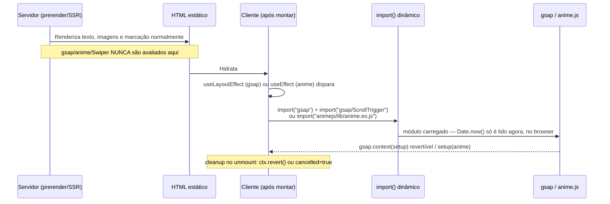
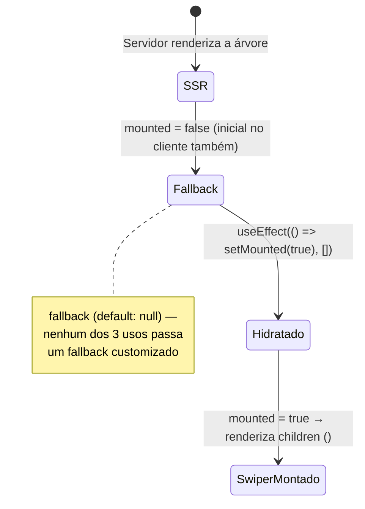

# Animation Hooks & Client-Only Boundaries

O Pizzarte usa três bibliotecas de animação/carrossel no cliente — **gsap** (com `ScrollTrigger`), **anime.js** e **Swiper** — mas nenhuma delas pode ser avaliada no servidor sob o Next.js 16 com PPR (Partial Prerendering). Esta página documenta o mecanismo comum que resolve esse conflito: dois hooks (`useGsapEffect`, `useAnimeEffect`) que atrasam o `import` da biblioteca para dentro de um efeito React, e um componente (`ClientOnly`) que atrasa o próprio *mount* para depois da hidratação, para o único caso em que atrasar o import não é suficiente.

## Table of Contents
- [[Frontend/Component Domains Overview]]
- [[Frontend/Styled-Components & Responsive System]]
- [[Architecture/App Router & Layout Composition]]
- [[Architecture/Caching with 'use cache']]

## O problema: bibliotecas que leem o relógio ao carregar

`gsap` inicializa o seu *ticker* interno lendo `Date.now()` no momento em que o módulo é importado — não numa função chamada mais tarde, mas como efeito colateral do próprio `import`. `anime.js` faz o mesmo. Se qualquer um destes módulos for avaliado durante o *prerender* estático do Next 16/PPR, o build falha com um erro de "unstable value `Date.now()` in a Client Component": o Next deteta que o HTML gerado em build "congelou" um valor que devia ser dinâmico.

O **Swiper** tem um problema ainda mais estrito: lê `Date.now()` **no próprio render inicial**, não só ao ser importado — pelo que atrasar o `import` para dentro de um `useEffect` (como se faz com gsap/anime) não chega; é preciso atrasar o *mount* do componente inteiro para depois da hidratação no cliente.



> **Sources:** `hooks/useGsapEffect.jsx:L1-L11`, `hooks/useAnimeEffect.jsx:L1-L7`, `components/layout/ClientOnly.jsx:L1-L12`, `CLAUDE.md`

## `useGsapEffect`: import dinâmico + `gsap.context`

```js
export function useGsapEffect(setup, deps = []) {
  useLayoutEffect(() => {
    let ctx;
    let cancelled = false;

    Promise.all([import("gsap"), import("gsap/ScrollTrigger")]).then(([gsapModule, stModule]) => {
      if (cancelled) return;
      const gsap = gsapModule.default;
      const ScrollTrigger = stModule.default;
      gsap.registerPlugin(ScrollTrigger);
      ctx = gsap.context(() => setup(gsap));
    });

    return () => {
      cancelled = true;
      ctx?.revert();
    };
  }, deps);
}
```

Pontos-chave:
- Corre dentro de **`useLayoutEffect`**, não `useEffect` — garante que a animação é registada antes do primeiro paint visível no cliente, evitando um "flash" do estado final antes do `gsap.set` inicial.
- Os dois módulos (`gsap` e `gsap/ScrollTrigger`) são importados em paralelo com `Promise.all`, e só depois `gsap.registerPlugin(ScrollTrigger)` é chamado — o plugin é registado uma vez por chamada do hook, não globalmente à importação do módulo.
- `setup(gsap)` — a função passada pelo componente — corre dentro de **`gsap.context(...)`**. Isto tem duas vantagens: os seletores CSS usados lá dentro (`gsap.utils.toArray(".woman")`, etc.) ficam automaticamente isolados ao contexto, e o `ctx.revert()` na limpeza desfaz *todos* os tweens/ScrollTriggers criados nesse `setup` de uma vez, sem o componente ter de guardar referências individuais.
- A flag `cancelled` protege contra a corrida em que o componente desmonta **antes** da promise dos imports resolver — nesse caso `ctx` nunca chega a existir, e o `if (cancelled) return` evita chamar `setup` sobre um componente já desmontado.

Consumidores lidos: `PizzarteInfo` (paralaxe de `.woman`/`.man` ao fazer scroll), `FoodSlider` (raio de borda que fecha ao scroll), `PizzaEffect` (pizza a abrir + texto a aparecer), `Waiting` (pizzas a saltar para os lados + vídeo).

> **Sources:** `hooks/useGsapEffect.jsx:L12-L31`, `components/about/PizzarteInfo.jsx:L22-L34`, `components/about/FoodSlider.jsx:L19-L33`, `components/animation/PizzaEffect.jsx:L18-L73`, `components/animation/Waiting.jsx:L13-L73`

## `useAnimeEffect`: mesma ideia, mais simples

```js
export function useAnimeEffect(setup, deps = []) {
  useEffect(() => {
    let cancelled = false;
    import("animejs/lib/anime.es.js").then((mod) => {
      if (cancelled) return;
      setup(mod.default);
    });
    return () => { cancelled = true; };
  }, deps);
}
```

Diferenças em relação a `useGsapEffect`: usa **`useEffect`** (não `useLayoutEffect` — as animações de anime.js aqui são decorativas, letra-a-letra, sem risco de "flash" visual crítico), importa um único módulo (`animejs/lib/anime.es.js`), e não tem equivalente a `gsap.context`/`revert()` — a limpeza é só a flag `cancelled`, porque o anime.js não oferece um mecanismo de contexto revertível. Isto significa que, ao contrário do gsap, uma animação de `anime.timeline({ loop: true })` iniciada por este hook **não é explicitamente destruída** no unmount — só deixa de ter efeito guardado se o componente ainda estiver montado quando a promise resolve.

Consumidores lidos: `BarDrinks` (texto "BAAAAAAAAAAAR" letra a letra, decorativo, `aria-hidden`) e `OurSpace` (texto "brutal" repetido, mesma técnica de `.replace(/\S/g, "<span class='letter'>$&</span>")`).

> **Sources:** `hooks/useAnimeEffect.jsx:L8-L22`, `components/about/BarDrinks.jsx:L38-L54`, `components/about/OurSpace.jsx:L30-L44`

## `prefersReducedMotion`: respeitado, mas não uniformemente

```js
export const prefersReducedMotion = () =>
  typeof window !== "undefined" &&
  window.matchMedia("(prefers-reduced-motion: reduce)").matches;
```

É uma função pura (não um hook), pensada para ser chamada **dentro** do `setup` passado a `useGsapEffect`/`useAnimeEffect` — o `typeof window !== "undefined"` garante que devolve `false` em qualquer avaliação no servidor, sem rebentar o SSR.

Nem todos os efeitos de animação a chamam da mesma forma:

- **`PizzaEffect`** é o mais cuidadoso: quando `prefersReducedMotion()` é verdadeiro, não se limita a saltar a animação — chama `gsap.set(...)` para colocar cada elemento diretamente no seu **estado final** (`translateX`, `translateY`, `opacity: 1`), garantindo que o conteúdo continua visível e completo mesmo sem movimento.
- **`PizzarteInfo`, `FoodSlider` e `Waiting`** fazem um `if (prefersReducedMotion()) return;` simples no início do `setup` — a animação nunca é registada, e os elementos ficam no estado inicial definido pelo CSS (que já é um estado visualmente coerente nestes casos, sem necessidade de um `gsap.set` explícito).
- **`BarDrinks`** também faz o `return` simples, dentro do seu `useAnimeEffect`.
- **`OurSpace`** é a excepção: o seu `useAnimeEffect` **não chama `prefersReducedMotion()`** — a animação letra-a-letra do texto "brutal" corre sempre, independentemente da preferência do sistema.

> **Sources:** `utils/prefersReducedMotion.js:L1-L4`, `components/animation/PizzaEffect.jsx:L47-L53`, `components/about/PizzarteInfo.jsx:L22-L24`, `components/about/FoodSlider.jsx:L20-L21`, `components/animation/Waiting.jsx:L14`, `components/about/BarDrinks.jsx:L39`, `components/about/OurSpace.jsx:L30-L44`

## `gsap.matchMedia`: breakpoints que se auto-revertem

`PizzaEffect` e `Waiting` vão um passo além do `window.matchMedia` simples usado noutros componentes (ver [[Frontend/Styled-Components & Responsive System]]): usam **`gsap.matchMedia()`**, registando os tweens dentro de `mm.add({ isMobile: "(max-width: 1024px)", isDesktop: "(min-width: 1024px)" }, (ctx) => { ... })`. A vantagem sobre um `window.matchMedia` lido uma única vez no mount é que o GSAP recalcula e **reverte automaticamente** os tweens do ramo anterior sempre que o ecrã atravessa o breakpoint em tempo real — por exemplo, ao rodar o telemóvel — sem que o componente precise de gerir isso manualmente. O comentário no código de `Waiting.jsx` nota ainda um bug já corrigido: como `mm.add` só corre o callback quando **pelo menos uma** condição do objeto é verdadeira, ter só `isMobile` definida (sem `isDesktop`) fazia o callback nunca disparar em desktop, matando a animação nesse breakpoint.

> **Sources:** `components/animation/PizzaEffect.jsx:L21-L31`, `components/animation/Waiting.jsx:L16-L27`

## `ClientOnly`: quando atrasar o import não basta

```jsx
export default function ClientOnly({ children, fallback = null }) {
  const [mounted, setMounted] = useState(false);
  useEffect(() => setMounted(true), []);
  return mounted ? children : fallback;
}
```

`ClientOnly` não atrasa um `import` — atrasa o **mount** dos `children` que lhe são passados, até ao primeiro efeito depois da hidratação (`mounted` começa `false`, muda para `true` só num `useEffect`, que nunca corre no servidor). É usado **exclusivamente em torno do `<Swiper>`**, nos três componentes que o usam: `FoodSlider`, `BarDrinks` e `PizzarteInfo` (nos seus dois carrosséis, desktop e mobile). O resto de cada secção — títulos, texto, imagens — continua a renderizar normalmente no servidor; só o carrossel em si fica ausente do HTML inicial e aparece após a hidratação.

Isto é uma troca deliberada, não um acidente: o conteúdo desses carrosséis específicos (testemunhos em `PizzarteInfo`, categorias em `FoodSlider`, bebidas em `BarDrinks`) também existe, indexável, nas páginas correspondentes (`/menu/[slug]`, etc.) — não é a única fonte desses dados no site, pelo que atrasar o seu mount no cliente não custa indexabilidade de conteúdo único.



> **Sources:** `components/layout/ClientOnly.jsx:L1-L17`, `components/about/PizzarteInfo.jsx:L65-L117`, `components/about/BarDrinks.jsx:L79-L101`, `components/about/FoodSlider.jsx:L1-L14`

## Resumo comparativo

| Mecanismo | Atrasa | Timing do efeito | Limpeza | Usado por |
|---|---|---|---|---|
| `useGsapEffect` | o `import("gsap")` + `import("gsap/ScrollTrigger")` | `useLayoutEffect` | `ctx.revert()` via `gsap.context` | `PizzarteInfo`, `FoodSlider`, `PizzaEffect`, `Waiting` |
| `useAnimeEffect` | o `import("animejs/...")` | `useEffect` | apenas flag `cancelled` (sem revert) | `BarDrinks`, `OurSpace` |
| `ClientOnly` | o **mount** do componente filho | `useEffect` (muda `mounted`) | React desmonta normalmente | `<Swiper>` em `FoodSlider`, `BarDrinks`, `PizzarteInfo` |
| `prefersReducedMotion()` | — (consultado dentro dos hooks acima) | síncrono, chamado no `setup` | n/a | Todos exceto `OurSpace` |

> **Sources:** ficheiros listados no frontmatter

---
*[[index|← Back to Index]] · Generated by repowiki*
