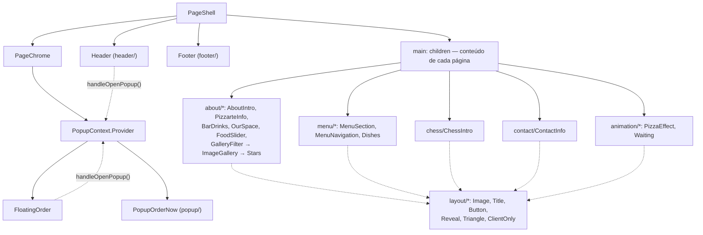

# Component Domains Overview

O diretório `components/` do Pizzarte está organizado por **domínio de conteúdo**, não por tipo técnico — a mesma estrutura de pastas (`about/`, `header/`, `footer/`, `menu/`, `chess/`, `contact/`, `animation/`, `popup/`, `layout/`) que existia no site Gatsby original. Essa escolha não é acidental: cada pasta é herdada 1:1 do site anterior, onde cada domínio tinha uma subpasta `desktop/` e uma `mobile/` com dois componentes quase idênticos. Na migração para Next.js 16, cada par foi **fundido num único componente responsivo**, guiado por `styled-components` e pelos breakpoints centralizados em `components/style/style.js` (ver [[Frontend/Styled-Components & Responsive System]]).

Ao todo existem 32 ficheiros `.jsx` em `components/`, mais dois ficheiros `.js` auxiliares (`components/Seo.js` e `components/style/style.js`) que não renderizam JSX — são construtores de dados (URLs canónicas/alternates para SEO, tokens de design).

## Table of Contents
- [[Frontend/Styled-Components & Responsive System]]
- [[Frontend/Animation Hooks & Client-Only Boundaries]]
- [[Architecture/App Router & Layout Composition]]
- [[I18n/Locale Routing & Middleware]]
- [[SEO/Metadata & JSON-LD Builders]]

## Domínios e os seus componentes

| Domínio | Ficheiros (`.jsx`) | Papel |
|---|---|---|
| `about/` (8) | `AboutIntro`, `PizzarteInfo`, `BarDrinks`, `OurSpace`, `FoodSlider`, `ImageGallery`, `GalleryFilter`, `Stars` | Secções institucionais da home e da página `/pizzarte`: apresentação do restaurante, bar de bebidas, "o nosso espaço", slider de comida, e a galeria de fotos (`/galeria`) com filtro por categoria. `Stars` é um sub-componente de rating usado dentro de `PizzarteInfo`. |
| `header/` (1) | `Header` | Cabeçalho fixo com navegação, submenu de categorias, drawer mobile e botão de encomenda. |
| `footer/` (1) | `Footer` | Rodapé com contactos, redes sociais, Livro de Reclamações, selo de cofinanciamento e copyright. |
| `menu/` (3) | `MenuSection`, `MenuNavigation`, `Dishes` | Fluxo do menu: `MenuSection` é a grelha de categorias em `/menu`, `MenuNavigation` é a navegação entre categorias reutilizada em cada página `/menu/[slug]`, `Dishes` renderiza a lista de pratos de uma categoria. |
| `chess/` (1) | `ChessIntro` | Secção de apresentação do "chess" (bloco temático da página `/pizzarte`), com texto e imagem cruzados por triângulos decorativos. |
| `contact/` (1) | `ContactInfo` | Bloco de informação de contacto da página `/contactos` (endereço, telefone, redes sociais). |
| `animation/` (2) | `PizzaEffect`, `Waiting` | Secções de animação pesada ligadas ao scroll (efeito de pizza a abrir, vídeo + pizzas a saltar) — o domínio mais dependente do GSAP. |
| `popup/` (1) | `PopupOrderNow` | Modal acessível "Encomenda já", acionado a partir do `Header` e do `FloatingOrder`. |
| `layout/` (13) | `PageShell`, `PageChrome`, `Image`, `Title`, `Button`, `Reveal`, `Triangle`, `ClientOnly`, `LoaderPage`, `MobileFilterDropdown`, `FloatingOrder`, `HeroBanner`, `NotFoundContent` | Camada transversal: primitivas visuais e estruturais partilhadas por todos os outros domínios (ver secção seguinte). |
| raiz de `components/` | `LocaleSwitcher.jsx`, `Seo.js` | `LocaleSwitcher` é o seletor de idioma (pt/en/fr/es); `Seo.js` não é um componente visual — constrói `canonical`/`alternates.languages` a partir de `i18n/routing.jsx`. |
| `style/` | `style.js` | Tokens de design partilhados (breakpoints, cores, helpers de media query) — ver [[Frontend/Styled-Components & Responsive System]]. |

> **Sources:** `components/style/style.js`, `components/header/Header.jsx`, `components/footer/Footer.jsx`, `components/menu/*.jsx`, `components/about/*.jsx`, `components/layout/*.jsx`, `components/popup/PopupOrderNow.jsx`, `components/chess/ChessIntro.jsx`, `components/contact/ContactInfo.jsx`, `components/animation/*.jsx`, `components/LocaleSwitcher.jsx`, `components/Seo.js`

## `layout/` como camada transversal

`layout/` é de longe a pasta com mais ficheiros (13) porque reúne tudo o que não pertence a um domínio de conteúdo específico:

- **Composição de página** — `PageShell.jsx` monta `Header` + `<main>` + `Footer` dentro de `PageChrome.jsx`, que por sua vez fornece o `PopupContext` (ver `utils/PopupContext.js`) e monta sempre `FloatingOrder` e `PopupOrderNow` por cima do conteúdo da página. Isto substitui o antigo `src/components/layout/layout.js` do Gatsby, que — segundo o comentário no código — só montava `<main>` 4500ms depois do load inicial (nada indexável no HTML inicial, LCP garantido ≥4,5s); no Next, `{children}` está sempre montado desde o primeiro render.
- **Primitivas visuais** — `Image.jsx` (wrapper sobre `next/image`, com fallback para `` em SVGs ou imagens fora do `imageManifest.json`), `Title.jsx` (título decorativo com heading semântico opcional, ver `question`/`level`), `Button.jsx`, `Reveal.jsx` (fade+slide-up ao entrar no viewport, substitui `react-reveal/Fade`), `Triangle.jsx` (forma decorativa rotativa), `HeroBanner.jsx` (elemento LCP da home, `<picture>` nativo com `getImageProps`).
- **Utilitários de interação** — `ClientOnly.jsx` e `MobileFilterDropdown.jsx` (dropdown de filtro para mobile, usado em `GalleryFilter` e `MenuNavigation`), `FloatingOrder.jsx` (botão fixo cuja opacidade acompanha a visibilidade do `<footer>` via `IntersectionObserver`).
- **Estados especiais** — `LoaderPage.jsx` (spinner de carregamento) e `NotFoundContent.jsx` (conteúdo do 404, partilhado entre `app/[locale]/not-found.jsx` e `app/global-not-found.jsx`).

> **Sources:** `components/layout/PageShell.jsx`, `components/layout/PageChrome.jsx`, `components/layout/FloatingOrder.jsx`, `components/popup/PopupOrderNow.jsx`, `utils/PopupContext.js`, `components/header/Header.jsx`

## O padrão de fusão desktop + mobile

Cada componente traz no topo do ficheiro um comentário a identificar de que par Gatsby (`.../desktop/x.js` + `.../mobile/xMobile.js`) foi fundido — é a assinatura mais consistente em todo o `components/`. A forma como cada fusão resolve as diferenças visuais varia por componente, e está detalhada em [[Frontend/Styled-Components & Responsive System]]: a maioria resolve tudo em CSS puro (`media.l` etc.), mas alguns (`PizzarteInfo`, `Waiting`) mantêm duas árvores de marcação distintas quando a diferença desktop/mobile não é só de estilo.

A fusão também serviu para corrigir bugs que existiam só numa das duas versões antigas — por exemplo:
- `Footer`: a versão mobile original não envolvia os ícones sociais em `<a href>`, ficavam por clicar; a versão fundida usa sempre `<a>`.
- `MenuNavigation`: a versão mobile ignorava a prop `dataTitle` e mostrava sempre "o nosso menu" fixo, nunca traduzido.
- `ContactInfo`: a versão mobile tinha o título fixo "AVEIRO" (ignorando `data.contactInfo.title`) e o e-mail fora de um `<a href>`, não clicável.
- `FloatingOrder`: no Gatsby estava, por engano, exportado como `FloatingIcons` (nome de um componente morto ao lado); foi renomeado para o que realmente é.

> **Sources:** `components/footer/Footer.jsx:L14-L22`, `components/menu/MenuNavigation.jsx:L11-L16`, `components/contact/ContactInfo.jsx:L13-L24`, `components/layout/FloatingOrder.jsx:L18-L22`

## Helpers não-visuais partilhados

Alguns ficheiros em `components/` não são componentes de UI, mas são consumidos por praticamente todos os domínios acima:

- **`components/style/style.js`** — tokens de design (breakpoints, cor de marca, helpers `media`/`hover`). Ver [[Frontend/Styled-Components & Responsive System]].
- **`components/Seo.js`** — não renderiza nada; constrói `canonical` + `alternates.languages` (+ `x-default`) para os 4 idiomas a partir de `i18n/routing.jsx`, usado pelas páginas para o `<head>`. Ver [[SEO/Metadata & JSON-LD Builders]].
- **`utils/PopupContext.js`** — contexto React (`PopupContext`/`usePopup`) que liga `Header`, `FloatingOrder` e `PopupOrderNow` sem prop-drilling.
- **`hooks/useGsapEffect.jsx`, `hooks/useAnimeEffect.jsx`, `components/layout/ClientOnly.jsx`, `utils/prefersReducedMotion.js`** — a infraestrutura de animação usada por `PizzarteInfo`, `BarDrinks`, `FoodSlider`, `OurSpace`, `PizzaEffect` e `Waiting`. Ver [[Frontend/Animation Hooks & Client-Only Boundaries]].

> **Sources:** `components/Seo.js:L1-L40`, `utils/PopupContext.js`, `components/style/style.js`

---
*[[index|← Back to Index]] · Generated by repowiki*
