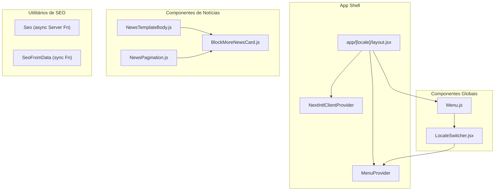
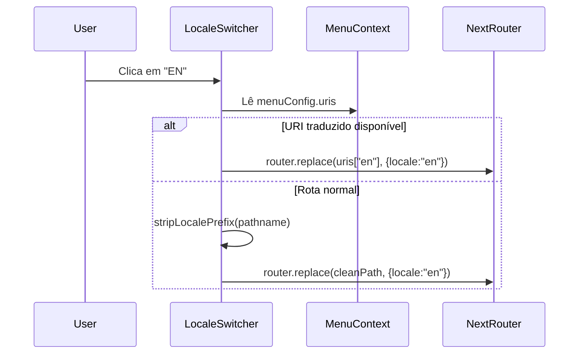
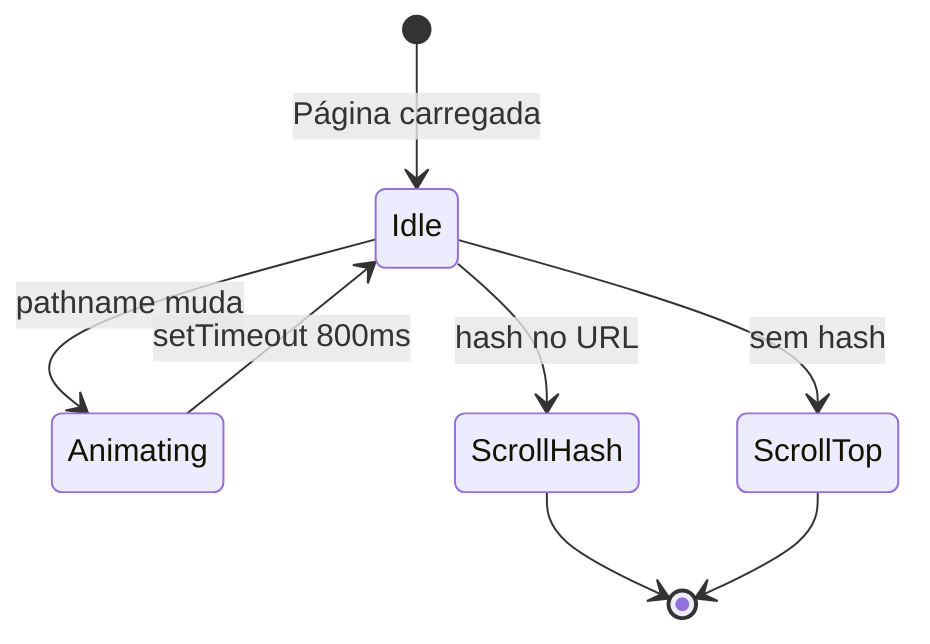
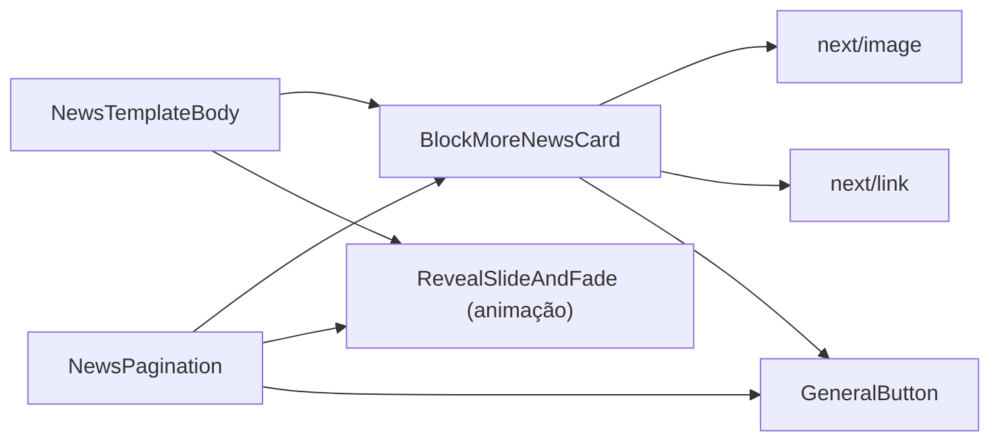
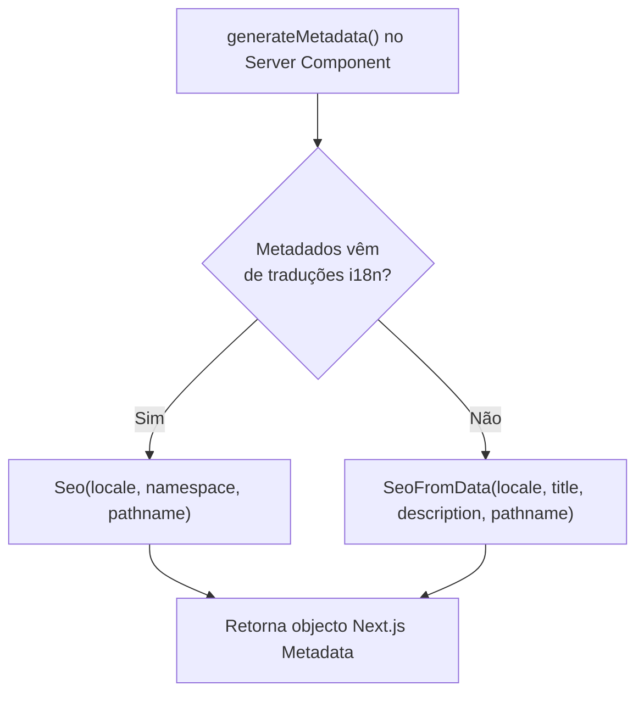

# Components Overview

## Table of Contents
- [[Frontend/Styling & Animation]]
- [[Architecture/App Router Structure|Architecture Overview]]

## Visão Geral da Biblioteca de Componentes

O projecto organiza os seus componentes React em duas camadas principais: componentes de estrutura global (menu, SEO, alternância de idioma) e componentes de domínio específico agrupados por funcionalidade, como a pasta `components/news/`. Todos os componentes seguem o modelo do Next.js App Router, sendo explicitamente marcados com `"use client"` quando precisam de interactividade no browser, ou deixados sem essa directiva quando funcionam como Server Components.

> **Sources:** `app/[locale]/layout.jsx:L1-L42` · `components/Menu.js:L1-L27`

---

## Menu e Localização

### Componente Menu

`Menu` (`components/Menu.js`) é um Client Component que recebe um objecto `menu` via props. Esse objecto tem uma propriedade `options` — um array de itens, cada um com os campos `link` e `text`. O componente itera sobre esses itens e renderiza cada um dentro de uma `
` com as classes `position-relative container-dot-text option-{index}`, usando o componente `Link` do Next.js para a navegação.

O `Menu` também incorpora o `LocaleSwitcher`, passando-lhe o `locale` actual obtido via `useLocale()` do `next-intl`. Os dados do menu são carregados no layout de servidor (`app/[locale]/layout.jsx`) a partir das mensagens i18n globais (`messages.global.global.menu`), garantindo que o menu nunca precisa de fazer chamadas de rede no cliente.

### LocaleSwitcher

`LocaleSwitcher` (`components/LocaleSwitcher.jsx`) gere a comutação entre os idiomas `pt` e `en`. A sua lógica de navegação distingue dois casos:

1. **Rotas com slugs traduzidos**: se `menuConfig.uris[nextLocale]` estiver definido (injectado via `MenuConfigClient`), o router navega directamente para o URI traduzido correspondente.
2. **Rotas normais**: a função `stripLocalePrefix` remove o prefixo `/pt` ou `/en` do pathname actual e o `router.replace` é chamado com o novo locale.

O botão da língua activa fica desactivado (`disabled={locale === lngOption.id}`) e recebe a classe CSS `selected`.

> **Sources:** `components/LocaleSwitcher.jsx:L1-L56` · `components/Menu.js:L1-L27`

---

## Gestão de Estado do Menu: MenuProvider e MenuConfigClient

### MenuProvider

`MenuProvider` (`utils/menuProvider.jsx`) é o contexto React que envolve toda a aplicação (declarado em `app/[locale]/layout.jsx`). Expõe dois valores via contexto:

- `menuConfig` — objecto de configuração com os campos:
  - `showLogoWhite` (boolean, default `false`)
  - `showLogoBlack` (boolean, default `true`)
  - `noFormOrCommercial` (boolean, default `false`)
  - `uris` (objecto de URIs traduzidos por locale, default `null`)
  - `loading` (boolean, default `false`)
- `setMenuConfig` — função de actualização do estado

Adicionalmente, `MenuProvider` rastreia o `pathname` com `usePathname()` e, sempre que este muda, activa uma animação de transição (`playAnimation`) durante um mínimo de 800 ms. Após esse tempo, faz scroll para o topo da página ou para o elemento de âncora definido no hash do URL.

O hook público `useMenuConfig()` encapsula o `useContext` e lança um erro explícito se for chamado fora de `MenuProvider`.

### MenuConfigClient

`MenuConfigClient` (`lib/MenuConfigClient.jsx`) é um componente-ponte que permite que Server Components injectem URIs traduzidos no contexto do menu. Recebe a prop `uris` (um mapa de locale para caminho) e, num `useEffect`, chama `setMenuConfig` para actualizar apenas o campo `uris`, preservando o resto do estado via spread (`...prev`). O componente não renderiza nada (`return null`), funcionando exclusivamente como canal de comunicação entre o servidor e o contexto cliente.

> **Sources:** `utils/menuProvider.jsx:L1-L62` · `lib/MenuConfigClient.jsx:L1-L17`

---

## Componentes de Notícias

### NewsTemplateBody

`NewsTemplateBody` (`components/news/NewsTemplateBody.js`) é o corpo de um artigo de notícia individual. Recebe as seguintes props:

| Prop | Tipo | Descrição |
|---|---|---|
| `contentHtml` | string | HTML gerado a partir de markdown/MDX |
| `data` | objecto | Textos i18n (share, more, etc.) |
| `slug` | string | Slug do post actual |
| `locale` | string | Locale activo ("pt", "en") |
| `prev` | objecto | Dados do post anterior |
| `next` | objecto | Dados do post seguinte |
| `mobile` | boolean | Indica se o ecrã é móvel |

A funcionalidade central é um `useMemo` que transforma o HTML recebido, injectando classes utilitárias Bootstrap e tipográficas personalizadas em todos os elementos de conteúdo (`<h1>`, `<h2>`, `<h3>`, `
`, `<ul>`, `<ol>`, `<li>`, `<blockquote>`, ``, `<iframe>`). Os iframes são envolvidos num `
` para suporte de vídeo responsivo.

O componente constrói o URL de partilha como `https://pontourbano.pt/${locale}/noticias/${slug}` e apresenta botões de partilha para Facebook, LinkedIn e WhatsApp. A navegação entre artigos é feita via `BlockMoreNewsCard`.

### BlockMoreNewsCard

`BlockMoreNewsCard` (`components/news/BlockMoreNewsCard.js`) renderiza um cartão de navegação para o post anterior ou seguinte. Espera que `data` tenha uma propriedade `frontmatter` com os campos `date` (formato `YYYY-MM-DD`), `slug`, `image` e `title`. O mês é exibido de forma localizada através da função utilitária `checkMonth`. O link de destino é construído conforme o locale: `/noticias/${slug}` para `pt` ou `/en/news/${slug}` para `en`.

### NewsPagination

`NewsPagination` (`components/news/NewsPagination.js`) implementa paginação progressiva ("load more"). Começa por exibir 5 artigos (estado `visibleCount`) e incrementa em 5 cada vez que o utilizador activa o botão "Ver Mais". A lista é invertida antes do slice para apresentar os artigos do mais recente para o mais antigo. O botão só é exibido enquanto `visibleCount < reversedNews.length`.

> **Sources:** `components/news/NewsTemplateBody.js:L1-L187` · `components/news/BlockMoreNewsCard.js:L1-L57` · `components/news/NewsPagination.js:L1-L101`

---

## Helpers de SEO

O ficheiro `components/Seo.js` exporta duas funções utilitárias destinadas a ser usadas em `generateMetadata` dos Server Components do App Router — não são componentes React, mas funções que retornam objectos de metadados compatíveis com a API do Next.js.

### Seo (async)

Importa dinamicamente `getTranslations` do `next-intl/server` e aceita `locale`, `namespace` e `pathname`. Usa as chaves `title` e `description` do namespace de tradução indicado. A URL canónica segue a convenção de que o locale `pt` é o predefinido e não gera prefixo de caminho; qualquer outro locale é prefixado com `/${locale}`. O `siteName` está fixado como `"Ponto Urbano"` e o `type` do Open Graph como `"website"`. O domínio base é lido de `process.env.NEXT_PUBLIC_SITE_URL`, com fallback para `"https://....pt"`.

### SeoFromData (sync)

Variante síncrona que recebe `title` e `description` directamente como props, sem aceder ao sistema de traduções. Útil para páginas cujos metadados provêm de dados dinâmicos (ex: artigos de blog com título vindo do frontmatter MDX). Segue exactamente a mesma lógica de construção de URL canónica e Open Graph.

> **Sources:** `components/Seo.js:L1-L59`

---

*[[index|← Back to Index]] · Generated by repowiki*
