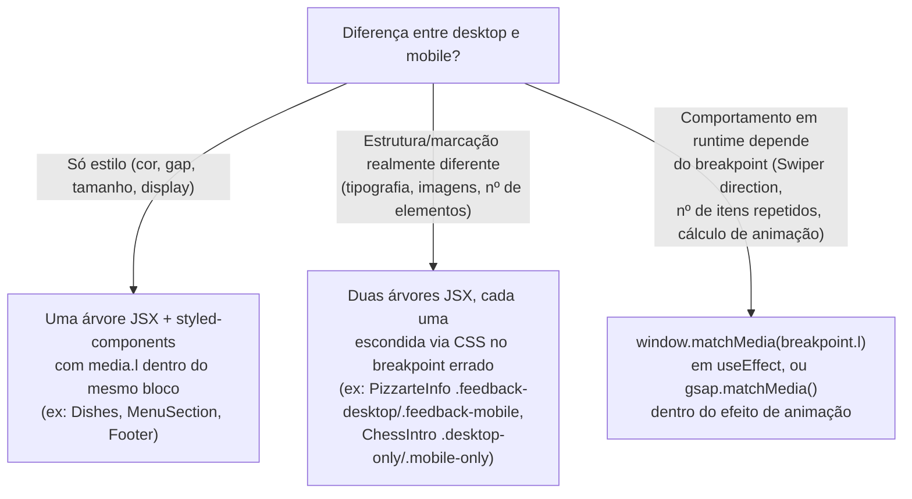

# Styled-Components & Responsive System

Todo o CSS do Pizzarte é CSS-in-JS via `styled-components`, e toda a responsividade parte de um único ficheiro de tokens: `components/style/style.js`. Esse ficheiro foi portado sem alterações do site Gatsby original (comentário explícito no código: "Design tokens portados de `src/components/style/style.js` (Gatsby), sem alterações") e é a base sobre a qual cada componente fundido (ver [[Frontend/Component Domains Overview]]) decide o que muda entre desktop e mobile.

## Table of Contents
- [[Frontend/Component Domains Overview]]
- [[Frontend/Animation Hooks & Client-Only Boundaries]]
- [[Architecture/App Router & Layout Composition]]

## Tokens de breakpoint

`components/style/style.js` exporta um objeto `breakpoint` com seis valores nomeados:

| Token | Valor |
|---|---|
| `xxxl` | `1921px` |
| `xxl` | `1560px` |
| `xl` | `1200px` |
| `l` | `1024px` |
| `m` | `700px` |
| `s` | `500px` |

`l` (1024px) é o limiar mais usado em todo o código — é o mesmo valor que o antigo hook `useBreakpoint().md` do Gatsby usava para decidir "isto é mobile?", e é reutilizado tanto em CSS (`media.l`) como em JavaScript (`window.matchMedia`, `gsap.matchMedia`), mantendo os dois mundos sincronizados no mesmo número.

O helper `media` embrulha cada breakpoint numa função que gera um bloco `@media` a partir de um template literal `css`:

```js
export const media = {
  xxxl: (...args) => css`@media screen and (min-width: ${breakpoint.xxxl}) { ${css(...args)} }`,
  xxl:  (...args) => css`@media screen and (max-width: ${breakpoint.xxl})  { ${css(...args)} }`,
  // xl, l, m, s seguem o mesmo padrão max-width
};
```

Um detalhe a não confundir: **`xxxl` é o único que usa `min-width`** (ecrãs muito grandes, ≥1921px — usado por exemplo no `.woman-footer` do `Footer` para reduzir a largura da imagem em ecrãs enormes); todos os outros (`xxl`, `xl`, `l`, `m`, `s`) usam `max-width`, no sentido "mobile/tablet para baixo". Isto permite aninhar breakpoints — é comum ver `media.l` a conter um `media.m` dentro, como em `BarDrinks` (`.background-red-bar`) ou `PizzarteInfo` (`.ImageContainer`), afinando ainda mais o layout em telas muito estreitas dentro do já-mobile.

`color.red` (`#FF0000`) é o único token de cor centralizado — a cor de marca do Pizzarte, usada em quase todos os componentes fundidos (fundo do drawer do `Header`, `Copyright` do `Footer`, textos do `Title`, etc.).

> **Sources:** `components/style/style.js:L1-L49`

## O helper `hover`: hover só onde há rato

```js
export const hover = (...args) => css`
  @media (hover: hover) and (pointer: fine) {
    ${css(...args)}
  }
`;
```

Em dispositivos touch não existe rato — um `:hover` normal em CSS fica "preso" depois de um toque (o primeiro tap ativa o estado hover e ele só desaparece ao tocar noutro sítio). O helper `hover` embrulha qualquer regra `&:hover` numa media query `(hover: hover) and (pointer: fine)`, garantindo que esses efeitos só disparam em ecrãs com um apontador de precisão real. É usado, por exemplo, no submenu do `Header` (`.nav-container:hover .submenu`), no botão de navegação do carrossel de testemunhos em `PizzarteInfo`, e no overlay de título em `MenuSection`.

> **Sources:** `components/style/style.js:L51-L57`, `components/header/Header.jsx:L247-L294`, `components/about/PizzarteInfo.jsx:L233-L239`, `components/menu/MenuSection.jsx:L59-L66`

## Padrão 1 — tudo resolvido em CSS (o caso comum)

Na maioria dos componentes fundidos, a diferença entre desktop e mobile é *só* de estilo: gaps, tamanhos de fonte, `flex-direction`, `display: none`. Nesses casos, o componente React é uma única árvore JSX, e um bloco `${media.l\`...\`}` dentro do `styled.div` correspondente troca as regras. `Dishes.jsx` é um exemplo direto: o `.dish-group`/`.dish-group-reverse` alterna `flex-direction: row`/`row-reverse` para `column` sob `media.l`, e o tamanho de fonte dos nomes de pratos usa unidades `vw` diferentes por breakpoint.

O caso mais deliberado deste padrão é o `Header`: no Gatsby original, o breakpoint desktop/mobile era decidido **em runtime** (o antigo `useBreakpoint().md`), e o servidor renderizava sempre a árvore desktop, trocando para mobile só depois de montar no cliente — isso causava *layout shift* e um duplo mount. Na versão fundida, **as duas árvores (`.logo-desktop`/`.logo-mobile`, `.nav-area`/`.hamburger`) existem sempre no HTML**; é só o CSS (`media.l`, o mesmo limiar de 1024px do antigo hook) que decide qual delas fica visível. Não há decisão de breakpoint em JavaScript no `Header` — o único estado React ali é `open` (drawer), `isSticky` (header colapsado ao scroll) e `menuItemsVisible` (atraso de 100ms para animar os itens do drawer).

> **Sources:** `components/header/Header.jsx:L14-L25`, `components/menu/Dishes.jsx:L66-L180`

## Padrão 2 — duas árvores de marcação distintas

Quando a diferença entre desktop e mobile não é só visual mas estrutural — tipografia diferente, imagens diferentes, disposição que não se resolve trocando `flex-direction` — o componente mantém **duas árvores JSX diferentes**, cada uma mostrada apenas no seu breakpoint via CSS (`display: none`).

`PizzarteInfo.jsx` é o exemplo mais explícito: o bloco de testemunhos ("feedback") tem tratamento visual genuinamente diferente por breakpoint no design original — imagem única `red-background` vs duas imagens/gradiente separados no mobile, tipografia `--font-british` vs `--font-chunky-rosie` — por isso o componente renderiza `.feedback.feedback-desktop` e `.feedback.feedback-mobile` como blocos JSX distintos (cada um com o seu próprio `<Swiper>`), e o CSS esconde um ou outro conforme `media.l`. O mesmo padrão aparece em `ChessIntro` (`.desktop-only`/`.mobile-only` nos triângulos decorativos, com larguras diferentes) e em `Waiting` (`NoAnimation` alterna entre `.waiting-first`/`.waiting-first1`, dois conjuntos de classes com animações diferentes).



> **Sources:** `components/about/PizzarteInfo.jsx:L61-L131`, `components/about/PizzarteInfo.jsx:L272-L385`, `components/animation/Waiting.jsx:L102-L120`

## Padrão 3 — quando CSS não basta: breakpoint também em JavaScript

Alguns componentes precisam de saber o breakpoint **em tempo de execução**, não só para estilo, porque uma biblioteca de terceiros não reage a CSS por si só, ou porque a própria lógica de render depende de um número que o CSS não pode calcular:

- **`BarDrinks.jsx`** — o carrossel de bebidas é vertical em desktop e horizontal em mobile (correção de UX: um Swiper vertical em mobile "roubava" o gesto de scroll da página). O Swiper **não troca de `direction` sozinho em runtime** — é preciso remontar o componente. `BarDrinks` lê `window.matchMedia(\`(max-width: ${breakpoint.l})\`)` num `useEffect`, guarda o resultado em `isMobile`, e passa esse valor como `key` do `<Swiper>` (`key={isMobile ? "h" : "v"}`), forçando o React a desmontar/remontar o carrossel sempre que o breakpoint muda.
- **`OurSpace.jsx`** — o número de vezes que o texto decorativo "brutal" se repete no fundo (`numHeadings`) depende da largura do ecrã: 4 em ≥1921px, 6 em ≤1024px, 5 no resto. Isto unificou duas lógicas de resize que no Gatsby original estavam desencontradas (desktop só reagia a ≥1921px, mobile só a ≤1024px). Como o número de nós DOM gerados varia, isto não é algo que `display:none` em CSS possa resolver — precisa de `window.innerWidth` lido num listener de `resize`.
- **`PizzaEffect.jsx` / `Waiting.jsx`** — usam `gsap.matchMedia()` (não `window.matchMedia` simples) dentro do efeito de animação, para que os tweens do GSAP se recalculem e revertam automaticamente sempre que o ecrã atravessa o breakpoint `l` em runtime (por exemplo, ao rodar o telemóvel) — ver [[Frontend/Animation Hooks & Client-Only Boundaries]] para o detalhe deste mecanismo.

Existe também um hook dedicado, **`hooks/useBreakpoint.jsx`** (`useBreakpoints()`), que expõe todos os breakpoints (`xxl`, `xl`, `l`, `m`, `s`) como booleanos reativos via `matchMedia` + `addEventListener("change", ...)`, realinhado com os mesmos tokens de `components/style/style.js` (o comentário no ficheiro nota que a versão anterior usava os breakpoints do Bootstrap, nunca realmente usados no projeto). Na prática, porém, nenhum componente lido nesta secção o importa — cada um resolve o seu próprio `matchMedia` inline conforme a necessidade específica (um único booleano `isMobile`, ou o `gsap.matchMedia`). `useBreakpoints()` fica disponível como utilitário genérico para uso futuro, mas hoje o padrão dominante no código é a leitura inline.

> **Sources:** `components/about/BarDrinks.jsx:L18-L36,L80-L89`, `components/about/OurSpace.jsx:L10-L28`, `components/animation/PizzaEffect.jsx:L26-L35`, `components/animation/Waiting.jsx:L19-L27`, `hooks/useBreakpoint.jsx:L1-L47`

---
*[[index|← Back to Index]] · Generated by repowiki*
