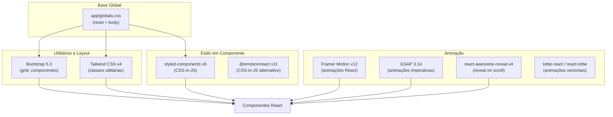
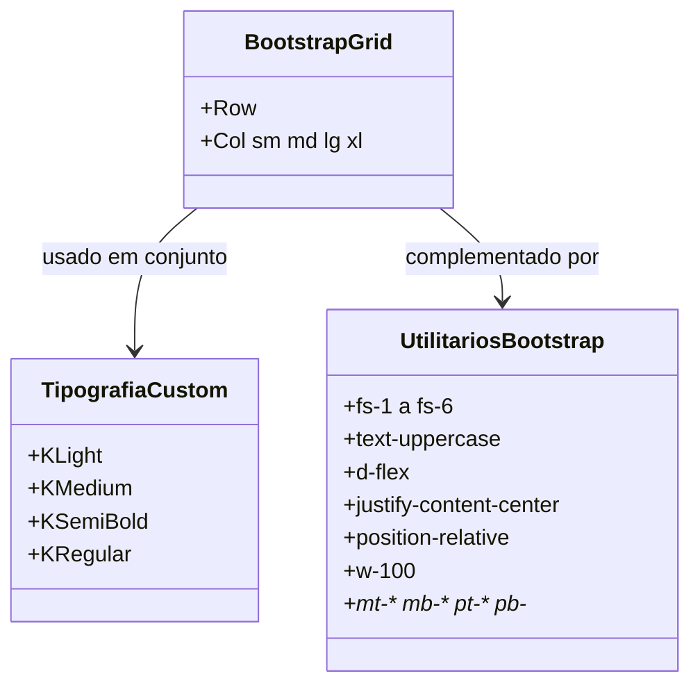
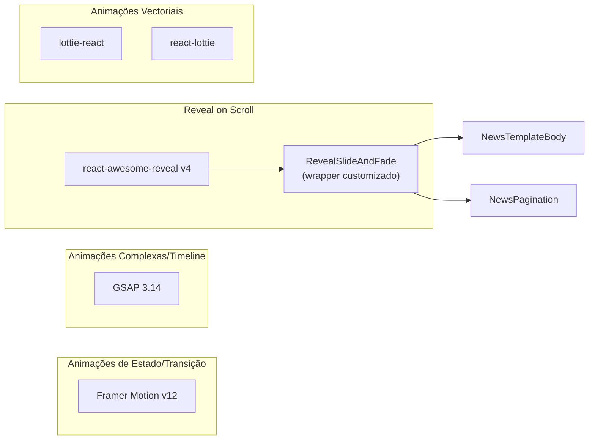
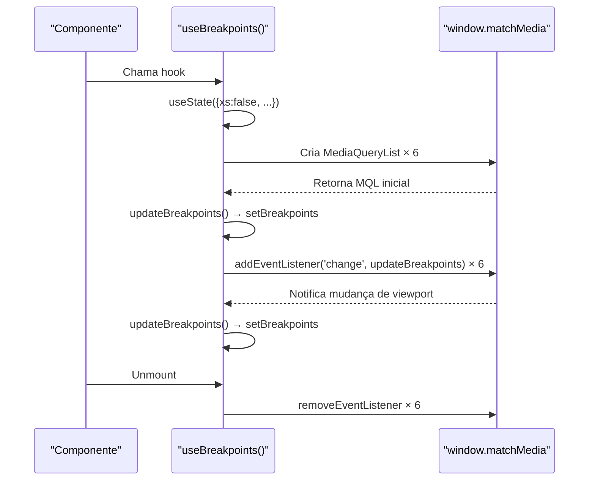

# Styling & Animation

## Table of Contents
- [[Frontend/Components Overview]]
- [[Architecture/App Router Structure|Architecture Overview]]

## Abordagem Multi-Biblioteca ao Estilo

O projecto adopta deliberadamente múltiplas bibliotecas de estilo em coexistência. Cada uma serve um propósito distinto e são usadas em camadas, evitando colisões. A ausência de uma única ferramenta de estilo dominante reflecte a natureza do template: acomodar diferentes casos de uso sem forçar uma única convenção.

> **Sources:** `package.json:L11-L54`

---

## Tailwind CSS

O Tailwind CSS v4 está configurado como devDependency, com o plugin de PostCSS (`@tailwindcss/postcss`) declarado separadamente. A versão 4 representa uma mudança de paradigma relativamente às versões anteriores — não usa um ficheiro `tailwind.config.js` clássico e integra-se directamente via PostCSS sem configuração manual de `content`.

Na base de código analisada, as classes Tailwind não são prevalentes nos componentes existentes; a maior parte do estilo visual recorre às classes Bootstrap. O Tailwind está disponível e pronto a ser usado, mas as classes utilitárias de Bootstrap dominam o markup dos componentes presentes.

> **Sources:** `package.json:L45-L46`

---

## Bootstrap

Bootstrap 5.3 é a biblioteca de layout principal. O sistema de grelha é usado extensivamente nos componentes de notícias, importando directamente os componentes React do pacote `react-bootstrap`.

### Padrões de Uso no Grid

Em `NewsTemplateBody`, o layout de coluna central é implementado com `Col sm="1" md="1" lg="1"` para margens e `Col sm="10" md="10" lg="10"` para o conteúdo. Em `BlockMoreNewsCard`, a imagem ocupa `Col sm="5" md="5" lg="5"` e a informação textual `Col sm="7" md="7" lg="7"`.

### Classes Tipográficas

O projecto define um sistema tipográfico personalizado que coexiste com Bootstrap. As classes `KLight`, `KMedium`, `KSemiBold` e `KRegular` são aplicadas consistentemente nos componentes, indicando uma família tipográfica customizada (provavelmente definida em CSS separado não incluído no template base). Os tamanhos de texto usam as classes `fs-*` do Bootstrap (`fs-1` a `fs-6`).

As classes de cor seguem uma convenção simples: `black` para texto principal e variações conforme o contexto.

> **Sources:** `components/news/NewsTemplateBody.js:L27-L64` · `components/news/BlockMoreNewsCard.js:L33-L54` · `components/news/NewsPagination.js:L28-L84`

---

## styled-components e @emotion/react

Ambas as bibliotecas CSS-in-JS estão declaradas como dependências de produção (`styled-components` v6 e `@emotion/react` v11). A sua presença no `package.json` indica que o template oferece suporte a qualquer uma delas como mecanismo de estilo baseado em componente, mas os ficheiros de código fonte analisados não contêm instâncias directas de `styled()` ou `css` prop do Emotion — estas bibliotecas estão disponíveis para uso nos componentes de produto concretos que se desenvolvam sobre este template.

> **Sources:** `package.json:L11-L12` · `package.json:L41`

---

## Animação: Framer Motion, GSAP e react-awesome-reveal

O projecto inclui três sistemas de animação complementares. Cada um é adequado a casos de uso distintos.

### Framer Motion

Framer Motion v12 é a biblioteca de animação React de alto nível. Permite declarar animações directamente no JSX através das props `animate`, `initial`, `exit` e variantes. É a escolha natural para animações de estado de componente, transições de layout e gestos.

### GSAP

GSAP 3.14 é uma biblioteca de animação imperativa, adequada para timelines complexas, animações scroll-driven e controlo preciso de múltiplos elementos em sequência. Ao contrário do Framer Motion, o GSAP opera directamente sobre o DOM, tornando-o ideal para animações que precisam de sincronização com lógica de negócio ou com eventos de scroll.

### react-awesome-reveal

`react-awesome-reveal` v4 é a biblioteca usada nos componentes de notícias para os efeitos de "reveal on scroll". O componente `RevealSlideAndFade` referenciado em `NewsTemplateBody` e `NewsPagination` é importado de `../RevealSlideAndFade`, sugerindo que é um wrapper customizado sobre esta biblioteca. Aceita as props `cascade` (anima filhos em sequência) e `damping` (controla o ritmo da cascata), além de `delay` nos usos directos em `NewsPagination`.

### Lottie

`lottie-react` e `react-lottie` estão ambos disponíveis para reprodução de animações vectoriais exportadas do Adobe After Effects em formato JSON.

> **Sources:** `package.json:L18` · `package.json:L20` · `package.json:L33` · `package.json:L27-L28` · `components/news/NewsTemplateBody.js:L75` · `components/news/NewsPagination.js:L31`

---

## CSS Global

O ficheiro `app/globals.css` estabelece uma base minimalista:

- Reset universal de `box-sizing`, `margin` e `padding` via `*`.
- Desactivação do ajuste automático de tamanho de texto em iOS (`-webkit-text-size-adjust: 100%`).
- Suavização de fontes com `-webkit-font-smoothing: antialiased` e `-moz-osx-font-smoothing: grayscale`.
- Cor de fundo do `body` definida como `#EBE9E3` — um bege quente que é a cor base de toda a aplicação.
- `overflow-y: scroll` no `html` para evitar saltos de layout causados pela barra de scrollbar.

Estes estilos são aplicados antes de qualquer biblioteca de terceiros, garantindo uma base consistente.

> **Sources:** `app/globals.css:L1-L24`

---

## Hook useBreakpoints: Responsividade Programática

O hook `useBreakpoints` (`hooks/useBreakpoint.jsx`) resolve um problema clássico nas aplicações React com SSR: o CSS responde ao viewport automaticamente, mas a lógica de JavaScript não tem acesso ao estado de breakpoint durante a hidratação.

O hook define seis pontos de quebra que espelham a convenção Bootstrap:

| Breakpoint | Media Query |
|---|---|
| `xs` | `(max-width: 576px)` |
| `sm` | `(min-width: 576px)` |
| `md` | `(min-width: 768px)` |
| `lg` | `(min-width: 1024px)` |
| `xl` | `(min-width: 1200px)` |
| `xxl` | `(min-width: 1400px)` |

Internamente, cria um `MediaQueryList` para cada entrada usando `window.matchMedia` dentro de um `useEffect`. Regista um único listener `updateBreakpoints` em todos os MQLs e remove-os no cleanup, evitando fugas de memória. O estado inicial é `false` para todos os breakpoints, actualizando-se na primeira execução do effect com o estado real do viewport.

O ficheiro é marcado com `'use client'`, sendo portanto exclusivo para componentes cliente. O resultado é um objecto `{ xs, sm, md, lg, xl, xxl }` com valores booleanos que reflectem o viewport actual em tempo real.

> **Sources:** `hooks/useBreakpoint.jsx:L1-L46`

---

## Dependências de UI Adicionais

Além das bibliotecas de estilo e animação principais, o `package.json` declara outras dependências relevantes para a experiência visual:

| Pacote | Versão | Finalidade |
|---|---|---|
| `swiper` | ^12.1.3 | Carrosséis e sliders |
| `lightgallery` | ^2.9.0 | Galerias de imagens com lightbox |
| `countup.js` | ^2.10.0 | Animação de contadores numéricos |
| `react-tooltip` | ^5.30.0 | Tooltips acessíveis |
| `react-div-100vh` | ^0.7.0 | Altura de viewport 100% corrigida para mobile |
| `multiselect-react-dropdown` | ^2.0.25 | Selects com multi-selecção |

> **Sources:** `package.json:L11-L43`

---

*[[index|← Back to Index]] · Generated by repowiki*
