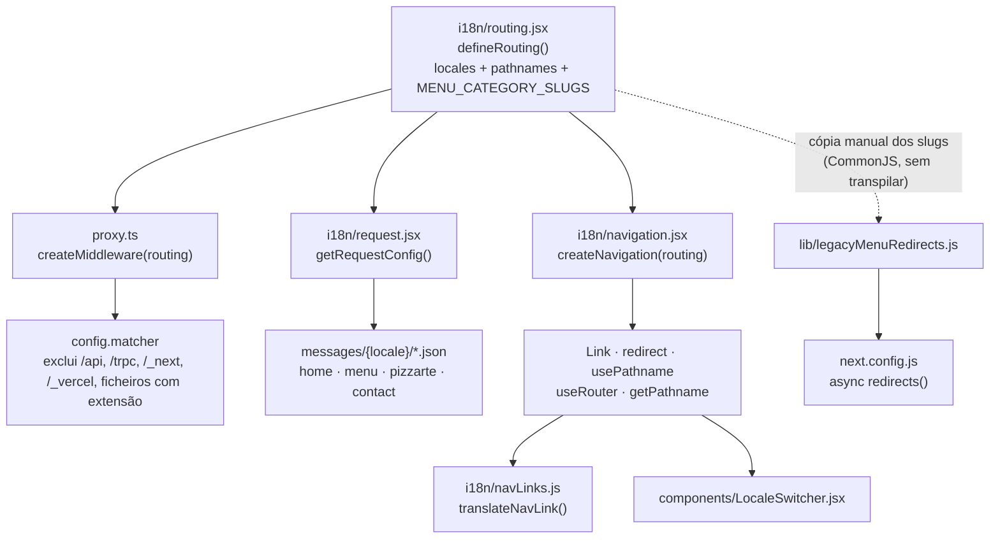
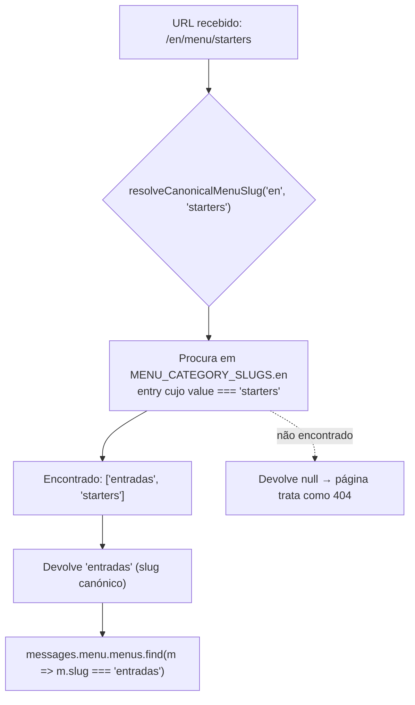
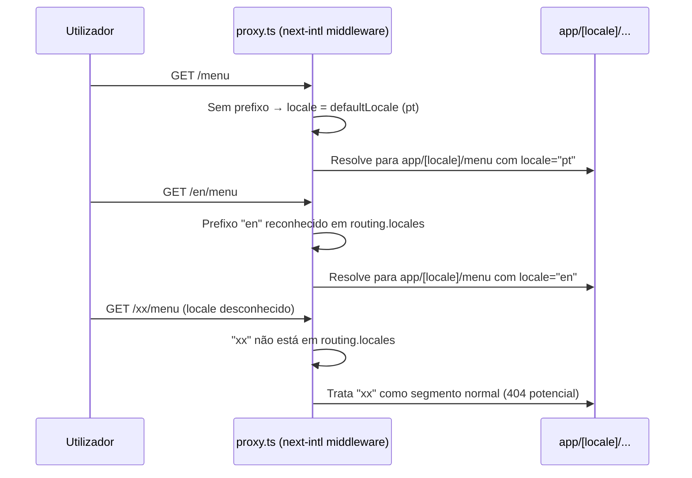
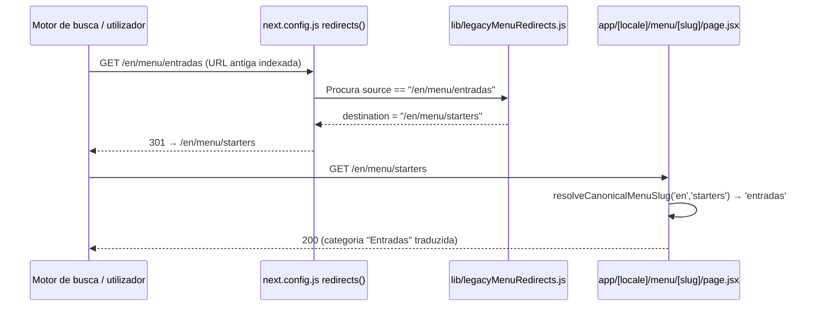

# Locale Routing & Middleware

## Table of Contents
- [[I18n/Translated Nav Links & Menu Slugs]]
- [[Architecture/App Router & Layout Composition]]
- [[SEO/Static Site Generation Strategy]]
- [[SEO/Sitemap, Robots & llms.txt]]
- [[index]]

## Visão Geral

O site do Pizzarte é servido em quatro idiomas — `pt` (idioma por omissão, sem prefixo no URL), `en`, `fr` e `es` — todos geridos pelo pacote `next-intl`. Ao contrário de um site bilingue simples, este projeto tem uma tabela de rotas onde cada segmento estático (`/galeria`, `/contactos`) pode ter um slug diferente por idioma, e uma tabela paralela e independente para os slugs de categoria de menu (`/menu/[slug]`), que são demasiado dinâmicos para o mecanismo de `pathnames` do next-intl resolver sozinho.

Toda a configuração de idiomas nasce num único ficheiro, `i18n/routing.jsx`, que é depois consumido por três consumidores distintos: o middleware (`proxy.ts`), o resolvedor de mensagens de tradução (`i18n/request.jsx`) e os wrappers de navegação client-side (`i18n/navigation.jsx`).



> **Sources:** `i18n/routing.jsx:1-30` · `proxy.ts:1-8` · `i18n/request.jsx:1-25` · `i18n/navigation.jsx:1-5`

## A Tabela de Rotas (`i18n/routing.jsx`)

O coração do sistema é a chamada a `defineRouting()` do `next-intl/routing`, exportada como `routing`:

- **`locales`**: `["pt", "en", "fr", "es"]`.
- **`defaultLocale`**: `"pt"`.
- **`localePrefix: "as-needed"`** — o locale por omissão (`pt`) nunca aparece no URL (`/menu`, não `/pt/menu`); os outros três aparecem sempre como prefixo (`/en/menu`, `/fr/galerie`, `/es/menu`).
- **`pathnames`**: um mapa de rota canónica → rota traduzida por locale. As rotas estáticas do site são apenas cinco:
  - `"/"` — igual em todos os idiomas.
  - `"/menu"` — igual em todos os idiomas.
  - `"/pizzarte"` — igual em todos os idiomas.
  - `"/galeria"` — traduzida: `pt: "/galeria"`, `en: "/gallery"`, `fr: "/galerie"`, `es: "/galeria"`.
  - `"/contactos"` — traduzida: `pt: "/contactos"`, `en: "/contacts"`, `fr: "/contact"`, `es: "/contacto"`.

Note-se que `es` reutiliza o slug `/galeria` do português (coincidência linguística, não um bug), enquanto `en` e `fr` têm slugs próprios.

O ficheiro documenta explicitamente, em comentário, uma decisão editorial importante: os slugs de categoria `les-crepes-salees`, `les-crepes-wrap`, `pizzas` e `panne-di-pizza` ficam **iguais nos 4 idiomas de propósito** — são nomes de categoria em francês/italiano usados como identidade de menu do restaurante, não uma tradução em falta. Isto foi confirmado a partir do conteúdo real de `messages/{en,fr,es}/menu.json`, onde esses termos aparecem como título visível sem tradução.

> **Sources:** `i18n/routing.jsx:1-30`

## Segmentos Dinâmicos de Menu: `MENU_CATEGORY_SLUGS`

As categorias de menu (`/menu/[slug]`) não podem viver dentro de `pathnames`, porque `pathnames` só traduz segmentos estáticos — um segmento dinâmico como `[slug]` não tem um valor fixo que o next-intl possa mapear sozinho. Por isso, `i18n/routing.jsx` exporta uma segunda estrutura, `MENU_CATEGORY_SLUGS`, um dicionário `{ locale: { slugCanonico: slugTraduzido } }` para as nove categorias do menu:

| Slug canónico (PT) | en | fr | es |
|---|---|---|---|
| `entradas` | `starters` | `entrees` | `entradas` |
| `saladas` | `salads` | `salades` | `ensaladas` |
| `massas` | `pasta` | `pate` | `pastas` |
| `les-crepes-salees` | `les-crepes-salees` | `les-crepes-salees` | `les-crepes-salees` |
| `les-crepes-wrap` | `les-crepes-wrap` | `les-crepes-wrap` | `les-crepes-wrap` |
| `pizzas` | `pizzas` | `pizzas` | `pizzas` |
| `panne-di-pizza` | `panne-di-pizza` | `panne-di-pizza` | `panne-di-pizza` |
| `sobremesas` | `desserts` | `desserts` | `postres` |
| `bebidas` | `drinks` | `boissons` | `bebidas` |

O slug canónico (chave PT) é também a chave usada em `messages/*/menu.json` para identificar cada categoria — ou seja, o slug canónico funciona como um ID interno estável, independente do idioma apresentado ao utilizador.

O sentido inverso — dado um slug traduzido que chega no URL (ex.: `starters`), descobrir o slug canónico (`entradas`) — é resolvido pela função `resolveCanonicalMenuSlug(locale, translatedSlug)`, também exportada de `i18n/routing.jsx`. Ela procura no dicionário do locale (ou, na ausência de um dicionário para esse locale, no dicionário `pt` como fallback) a entrada cujo valor traduzido corresponde ao slug recebido, e devolve a chave canónica correspondente ou `null` se não encontrar. É esta função que `app/[locale]/menu/[slug]/page.jsx` usa para transformar o slug do URL na chave que existe em `messages/*/menu.json`.



> **Sources:** `i18n/routing.jsx:32-89` · `app/[locale]/menu/[slug]/page.jsx:40-44,53-60`

## O Middleware (`proxy.ts`)

`proxy.ts` é o middleware do Next.js (a convenção de nome `proxy.ts` — em vez do tradicional `middleware.ts` — é a usada nesta versão do Next 16). O ficheiro é deliberadamente minúsculo: importa `createMiddleware` de `next-intl/middleware` e o objeto `routing` de `i18n/routing.jsx`, e exporta o resultado de `createMiddleware(routing)` como default. Toda a lógica de deteção de idioma, negociação por `Accept-Language`, cookies de preferência de idioma e reescrita/redireção de URL para aplicar `pathnames` é delegada inteiramente ao next-intl — não há lógica de idioma escrita à mão neste projeto.

A única configuração adicional é o `matcher`, exportado como `config.matcher`:

```
'/((?!api|trpc|_next|_vercel|.*\\..*).*)'
```

Esta regex exclui do middleware:
- `/api/*` e `/trpc/*` — rotas de API, que não têm conceito de idioma.
- `/_next/*` e `/_vercel/*` — internos do framework e da plataforma de deploy.
- Qualquer caminho que contenha um ponto (`.*\..*`) — ou seja, ficheiros estáticos com extensão (imagens, `robots.txt`, `sitemap.xml`, `favicon.ico`, etc.), que também não devem passar por resolução de idioma.



> **Sources:** `proxy.ts:1-8`

## Mensagens por Locale (`i18n/request.jsx`)

`i18n/request.jsx` fornece a configuração de request do next-intl via `getRequestConfig`. Recebe `requestLocale` (uma promise resolvida pelo middleware/roteador), valida-o com `hasLocale(routing.locales, requested)` e usa `routing.defaultLocale` (`pt`) como fallback caso o valor recebido não seja um dos quatro locales suportados.

Depois de resolver o `locale`, o ficheiro carrega dinamicamente quatro ficheiros de mensagens por idioma — `home.json`, `menu.json`, `pizzarte.json` e `contact.json` de `messages/{locale}/` — e, criticamente, desembrulha cada um pela sua chave de topo (`.default.home`, `.default.menu`, etc.) antes de os expor como namespaces (`home`, `menu`, `pizzarte`, `contact`). Isto existe porque cada JSON de mensagens tem sempre uma chave de topo com o próprio nome do ficheiro (herdado tal e qual da estrutura `locales/` do Gatsby original) — sem esse desembrulho manual, os namespaces ficariam com dupla imbricação (ex.: seria preciso chamar `t("home.seo.title")` em vez de `t("seo.title")`), reproduzindo um bug que já existia no starter original com `"global.global.menu"`.

> **Sources:** `i18n/request.jsx:1-25`

## Wrappers de Navegação (`i18n/navigation.jsx`)

`i18n/navigation.jsx` chama `createNavigation(routing)` do `next-intl/navigation` e reexporta os cinco helpers gerados: `Link`, `redirect`, `usePathname`, `useRouter` e `getPathname`. Estes são os únicos pontos de entrada aceites no projeto para navegação interna — a regra do repositório (ver `CLAUDE.md`) é usar sempre `@/i18n/navigation` (ou `i18n/navLinks.js`) em vez de `next/link` com um caminho fixo, precisamente porque um link fixo ignoraria a tradução de `pathnames` e o prefixo de locale.

- **`Link`** — substituto de `next/link` que resolve automaticamente o `href` traduzido para o locale ativo.
- **`getPathname({ href, locale })`** — função pura que devolve a string do caminho traduzido para um `href` canónico e um `locale` dados; é a base sobre a qual `translateNavLink` (ver [[I18n/Translated Nav Links & Menu Slugs]]) e `components/LocaleSwitcher.jsx` constroem os seus próprios links.
- **`useRouter`** — hook client-side com um `router.replace(pathname, { locale })` que troca de idioma mantendo o `pathname` interno (não traduzido) e delegando a tradução final ao next-intl.
- **`usePathname`** — devolve o pathname interno (canónico) da rota atual, já sem o prefixo de locale.
- **`redirect`** — variante de `redirect()` do Next.js consciente de locale, para redireções server-side dentro de Server Components/Actions.

> **Sources:** `i18n/navigation.jsx:1-5`

## Redirects de URLs Legadas do Gatsby (`lib/legacyMenuRedirects.js`)

O site anterior, gerado em Gatsby, tinha um bug de geração de URLs (documentado no ficheiro como "Bug #6 do plano de migração"): o `gatsby-node.js` original criava sempre as páginas de categoria de menu como `/{lang}/menu/{slugPT}` — ou seja, nunca traduzia o slug de categoria fora do português, mesmo quando o `url.json` desse idioma já continha a tradução correta. Essas URLs com slug português "vazado" para dentro de idiomas traduzidos ficaram indexadas em motores de busca, e simplesmente deixar de as servir causaria 404s e perda de SEO.

`lib/legacyMenuRedirects.js` resolve isto gerando uma lista de objetos de redirect 301 (`{ source, destination, permanent: true }`) para o `next.config.js`. Como o `next.config.js` corre em CommonJS puro sem transpilação, este ficheiro não pode importar `MENU_CATEGORY_SLUGS` de `i18n/routing.jsx` (um módulo ES) — em vez disso, mantém uma cópia local e independente, `TRANSLATED_SLUGS`, contendo **apenas os pares que diferem do slug português**:

```js
const TRANSLATED_SLUGS = {
  en: { entradas: "starters", saladas: "salads", massas: "pasta", sobremesas: "desserts", bebidas: "drinks" },
  fr: { entradas: "entrees", saladas: "salades", massas: "pate", bebidas: "boissons" },
  es: { saladas: "ensaladas", massas: "pastas", sobremesas: "postres" },
};
```

Note-se a assimetria intencional: `es.entradas` e `es.bebidas` não aparecem aqui (porque em espanhol esses slugs coincidem com o português, não há nada para redirecionar), e `fr.sobremesas` também não aparece na tabela de redirects — apenas os quatro slugs que realmente mudam de valor por idioma entram nesta tabela mais restrita, ao contrário da `MENU_CATEGORY_SLUGS` completa usada em runtime, que lista todas as nove categorias.

O ficheiro itera sobre `TRANSLATED_SLUGS` e produz um redirect por cada par `(locale, slugPT → slugTraduzido)`, com `source: /{locale}/menu/{slugPT}` e `destination: /{locale}/menu/{slugTraduzido}`. O array resultante é exportado via `module.exports` e consumido em `next.config.js`, cuja função `redirects()` assíncrona devolve diretamente `LEGACY_MENU_SLUG_REDIRECTS`.



> **Sources:** `lib/legacyMenuRedirects.js:1-27` · `next.config.js:20,46-48`

## Como as Peças se Encaixam

Resumindo o fluxo completo de uma navegação: o middleware (`proxy.ts`) intercepta o pedido e resolve o locale a partir do prefixo do URL (ou aplica o `defaultLocale` se não houver prefixo); o `i18n/request.jsx` carrega e desembrulha as mensagens desse locale para os Server Components; os componentes que precisam de gerar `href`s usam os wrappers de `i18n/navigation.jsx` (diretamente, ou indiretamente via `translateNavLink` e `LocaleSwitcher` — ver [[I18n/Translated Nav Links & Menu Slugs]]); e, para tráfego antigo que ainda aponta para URLs geradas pelo Gatsby, `lib/legacyMenuRedirects.js` garante um 301 permanente para o slug correto antes de o pedido chegar sequer ao App Router.

> **Sources:** `i18n/routing.jsx:1-89` · `proxy.ts:1-8` · `i18n/request.jsx:1-25` · `i18n/navigation.jsx:1-5` · `lib/legacyMenuRedirects.js:1-27`

---
*[[index|← Back to Index]] · Generated by repowiki*
