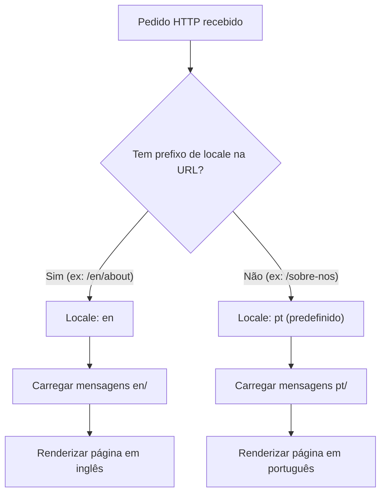
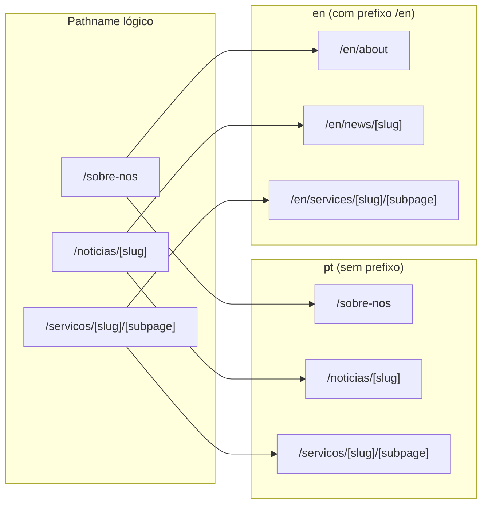
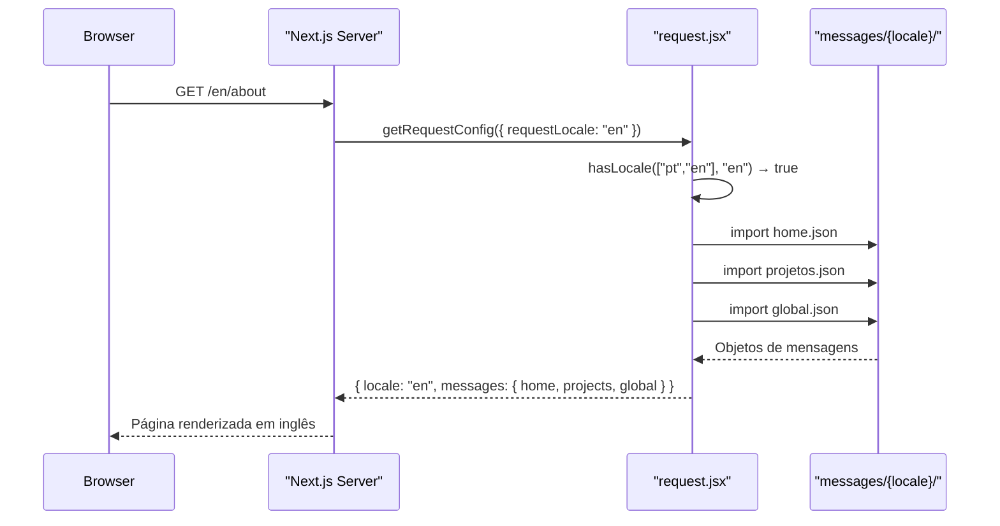
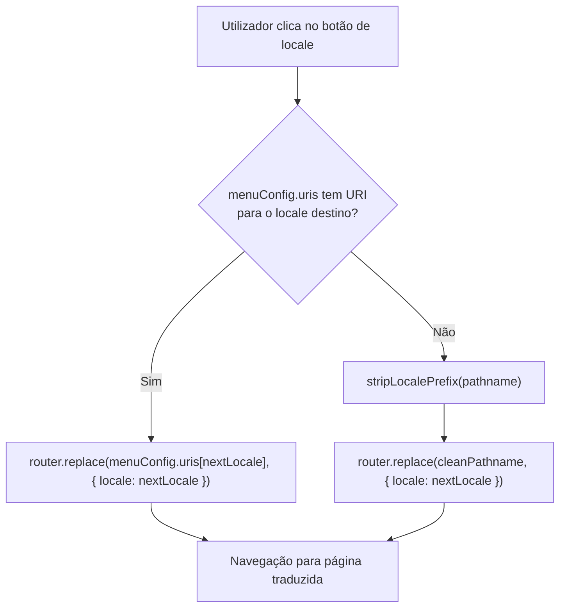

# Locale Routing

## Tabela de Conteúdos
- [[I18n/Translations & Messages]]
- [[Architecture/App Router Structure|Architecture Overview]]

## Visão Geral

O sistema de internacionalização deste projeto assenta na biblioteca **next-intl**, que se integra com o App Router do Next.js para gerir locales, prefixos de URL e pathnames traduzidos. A configuração está dividida em três ficheiros dentro da pasta `i18n/`: `routing.jsx`, `request.jsx` e `navigation.jsx`, cada um com uma responsabilidade distinta.

O projeto suporta dois locales: **Português (`pt`)** e **Inglês (`en`)**. O locale predefinido é `pt`, o que significa que os utilizadores portugueses não verão qualquer prefixo de locale na URL — essa é a consequência direta da estratégia `localePrefix: "as-needed"`.

> **Sources:** `i18n/routing.jsx:L3-L6` · `i18n/request.jsx:L5-L9`

## Configuração de Routing (`routing.jsx`)

O ficheiro `i18n/routing.jsx` exporta um objeto `routing` criado com `defineRouting` do `next-intl/routing`. Este objeto é a fonte de verdade central da configuração i18n — é importado tanto por `request.jsx` como por `navigation.jsx`, evitando qualquer duplicação de configuração.

As opções configuradas são:

| Opção | Valor | Efeito |
|---|---|---|
| `locales` | `["pt", "en"]` | Define os dois locales suportados |
| `defaultLocale` | `"pt"` | Português é o locale base |
| `localePrefix` | `"as-needed"` | O prefixo `/pt` é omitido nas URLs portuguesas; `/en` aparece apenas para inglês |
| `pathnames` | Objeto com rotas mapeadas | Permite que o mesmo pathname lógico tenha slugs diferentes por locale |

### Pathnames Traduzidos

O sistema suporta pathnames completamente diferentes por locale. Quando a aplicação usa um pathname lógico (ex: `/sobre-nos`), o next-intl sabe qual URL real usar para cada locale. A tabela seguinte mostra todos os mapeamentos definidos:

| Pathname lógico | URL em `pt` | URL em `en` |
|---|---|---|
| `/` | `/` | `/` |
| `/sobre-nos` | `/sobre-nos` | `/about` |
| `/noticias` | `/noticias` | `/news` |
| `/noticias/[slug]` | `/noticias/[slug]` | `/news/[slug]` |
| `/servicos` | `/servicos` | `/services` |
| `/servicos/[slug]` | `/servicos/[slug]` | `/services/[slug]` |
| `/servicos/[slug]/[subpage]` | `/servicos/[slug]/[subpage]` | `/services/[slug]/[subpage]` |
| `/politica-de-privacidade` | `/politica-de-privacidade` | `/privacy-policy` |

Repare que os segmentos dinâmicos `[slug]` e `[subpage]` mantêm o mesmo nome de parâmetro nos dois locales — apenas o segmento estático do pathname muda.

> **Sources:** `i18n/routing.jsx:L7-L38`

## Configuração de Request (`request.jsx`)

O ficheiro `i18n/request.jsx` é o ponto de entrada do next-intl no lado do servidor. Exporta a função de configuração obtida por `getRequestConfig`, que é invocada em cada pedido de servidor para determinar o locale ativo e carregar as mensagens correspondentes.

O processo de resolução do locale segue esta lógica:

1. Lê o locale solicitado a partir de `requestLocale` (derivado do URL ou do cookie de sessão).
2. Valida se esse locale existe na lista `routing.locales` usando `hasLocale`.
3. Se o locale solicitado não for válido (ex: URL manipulada), cai silenciosamente para `routing.defaultLocale` (`"pt"`).
4. Carrega dinamicamente os três namespaces de mensagens para o locale validado.

Os namespaces carregados dinamicamente são:

| Chave no contexto | Ficheiro carregado |
|---|---|
| `home` | `messages/{locale}/home.json` |
| `projects` | `messages/{locale}/projetos.json` |
| `global` | `messages/{locale}/global.json` |

Note que o ficheiro de projetos se chama `projetos.json` em ambos os locales, mas é exposto sob a chave `projects` no contexto de mensagens.

> **Sources:** `i18n/request.jsx:L1-L19`

## Utilitários de Navegação (`navigation.jsx`)

O ficheiro `i18n/navigation.jsx` é um módulo auxiliar muito simples: chama `createNavigation(routing)` e re-exporta todos os primitivos de navegação locale-aware que o next-intl fornece. Estes primitivos substituem os equivalentes nativos do Next.js, garantindo que todas as navegações respeitam o locale ativo e os pathnames traduzidos.

Os exportados são:

| Exportação | Descrição |
|---|---|
| `Link` | Componente `<a>` com suporte a locale e pathnames traduzidos |
| `redirect` | Função de redirect server-side com locale |
| `usePathname` | Hook que retorna o pathname sem o prefixo de locale |
| `useRouter` | Hook de router com métodos `push`/`replace` locale-aware |
| `getPathname` | Função utilitária para obter o pathname traduzido para um dado locale |

Todos os componentes e páginas do projeto devem importar estes utilitários a partir de `@/i18n/navigation` em vez dos módulos `next/navigation` nativos, para que a lógica de tradução de rotas seja sempre aplicada.

> **Sources:** `i18n/navigation.jsx:L1-L5`

## Componente LocaleSwitcher

O `LocaleSwitcher` é um componente de cliente (`"use client"`) que renderiza dois botões — `PT` e `EN` — e permite ao utilizador alternar entre os dois locales sem recarregar a página.

Recebe uma prop `locale` (o locale atualmente ativo) e usa dois hooks da camada de navegação i18n:
- `useRouter` de `@/i18n/navigation` para executar a navegação locale-aware.
- `usePathname` de `@/i18n/navigation` para conhecer o pathname atual sem prefixo.

### Lógica de Troca de Locale

O componente distingue dois cenários ao trocar de locale:

**Caso especial — slugs traduzidos com `menuConfig`:** Se o contexto `menuConfig` (proveniente de `useMenuConfig`) tiver URIs específicos para o locale de destino (`menuConfig.uris[nextLocale]`), o componente navega diretamente para essa URI. Isto é necessário quando a página atual tem um slug que varia por locale (ex: um post de notícias com slug diferente em `pt` e `en`).

**Caso normal — rotas automáticas do next-intl:** Caso não exista um URI personalizado em `menuConfig`, o componente remove o prefixo de locale do pathname atual com a função interna `stripLocalePrefix` e chama `router.replace(cleanPathname, { locale: nextLocale })`. O next-intl trata automaticamente da tradução do pathname para o novo locale.

O botão correspondente ao locale ativo fica desabilitado (`disabled={locale === lngOption.id}`) e recebe a classe CSS `selected`, fornecendo feedback visual ao utilizador.

> **Sources:** `components/LocaleSwitcher.jsx:L1-L55`

---
*[[index|← Back to Index]] · Generated by repowiki*
