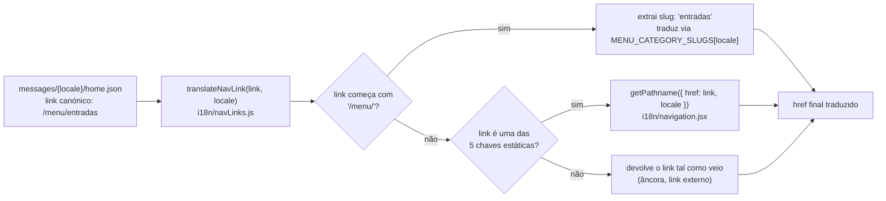
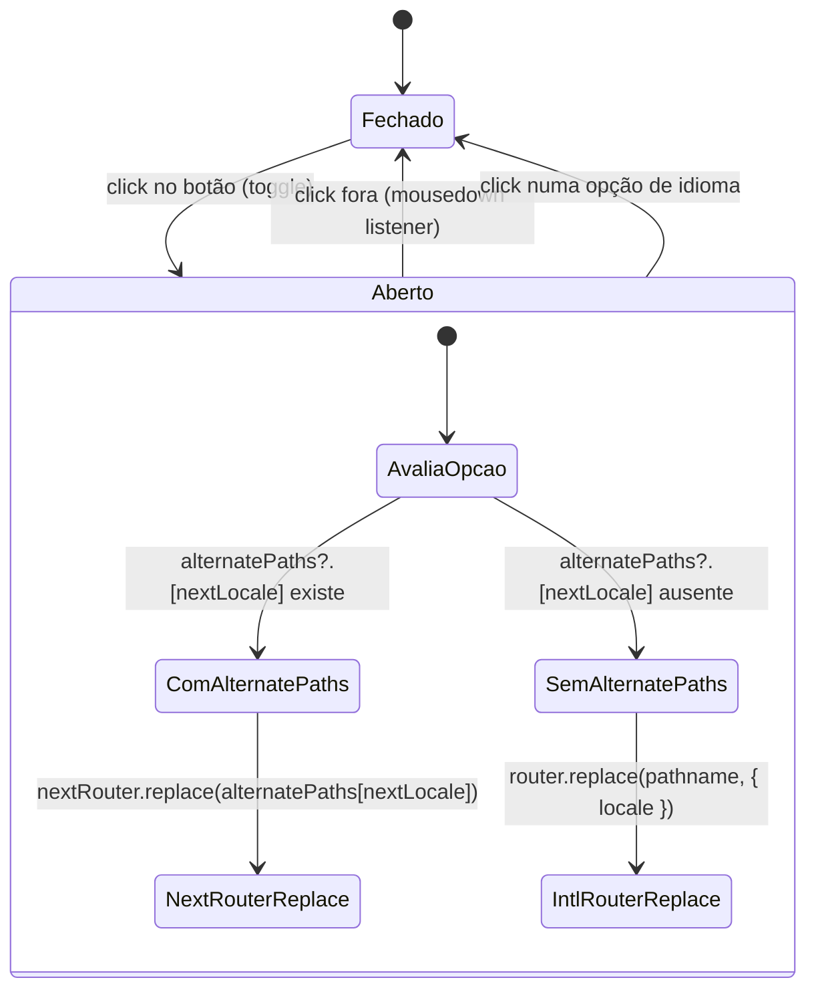

# Translated Nav Links & Menu Slugs

## Table of Contents
- [[I18n/Locale Routing & Middleware]]
- [[Frontend/Component Domains Overview]]
- [[Architecture/App Router & Layout Composition]]
- [[index]]

## Visão Geral

Enquanto [[I18n/Locale Routing & Middleware]] documenta a tabela de rotas em si, esta página cobre a camada seguinte: como os componentes de UI — sobretudo o cabeçalho de navegação e o seletor de idioma — transformam um link canónico armazenado nos ficheiros de mensagens (`messages/*/home.json`) num `href` real e traduzido para o idioma em que o utilizador está a navegar.

O padrão herdado do site Gatsby original é que `messages/{locale}/home.json` guarda **sempre** o link canónico, igual em todos os idiomas (`"/pizzarte"`, `"/menu"`, `"/galeria"`, `"/contactos"`, `"/menu/entradas"`), independentemente do idioma do próprio JSON. No Gatsby, era o `gatsby-plugin-translate-urls`, através da sua função `translateUrl()`, que resolvia o link final em runtime. Neste projeto Next.js, o equivalente direto e explícito é a função `translateNavLink`, exportada de `i18n/navLinks.js`.



> **Sources:** `i18n/navLinks.js:1-24` · `i18n/routing.jsx:32-89`

## `translateNavLink(link, locale)`

Esta função, usada pelo Header (menu principal e submenu de categorias), tem exatamente três ramos de decisão:

1. **Link de categoria de menu** (`link.startsWith("/menu/")`): extrai o slug canónico da parte final do caminho (ex.: `"entradas"` de `"/menu/entradas"`), obtém o segmento base `/menu` já traduzido para o locale através de `getPathname({ href: "/menu", locale })` (importado de `./navigation`), e traduz o slug em si consultando `MENU_CATEGORY_SLUGS[locale]?.[slug]` (importado de `./routing`) — com fallback para o próprio slug original se não houver tradução registada para aquele locale/slug. O resultado é a concatenação `${menuPath}/${translatedSlug}`.
2. **Chave estática registada em `pathnames`**: se o link for exatamente uma de `["/", "/menu", "/pizzarte", "/galeria", "/contactos"]`, a tradução é delegada inteiramente a `getPathname({ href: link, locale })`, que consulta a tabela `pathnames` de `i18n/routing.jsx`.
3. **Qualquer outro link** (âncora dentro da página, URL externo, ou qualquer valor não reconhecido): devolvido tal como veio, sem qualquer transformação.

Esta arquitetura de dois níveis existe porque as rotas estáticas (`pathnames` em `i18n/routing.jsx`) e as rotas dinâmicas de categoria (`MENU_CATEGORY_SLUGS`) são resolvidas por mecanismos diferentes — o next-intl só sabe traduzir os segmentos estáticos que lhe são declarados; o segmento `[slug]` dinâmico de `/menu/[slug]` precisa da tradução manual feita aqui.

```mermaid
sequenceDiagram
    participant Header as Header (nav principal)
    participant TNL as translateNavLink()
    participant GP as getPathname()
    participant Routing as MENU_CATEGORY_SLUGS

    Header->>TNL: translateNavLink("/menu/bebidas", "fr")
    TNL->>TNL: link.startsWith("/menu/") → true
    TNL->>GP: getPathname({ href: "/menu", locale: "fr" })
    GP-->>TNL: "/fr/menu"
    TNL->>Routing: MENU_CATEGORY_SLUGS.fr["bebidas"]
    Routing-->>TNL: "boissons"
    TNL-->>Header: "/fr/menu/boissons"

    Header->>TNL: translateNavLink("/contactos", "en")
    TNL->>TNL: não começa com "/menu/"; está na lista de chaves estáticas
    TNL->>GP: getPathname({ href: "/contactos", locale: "en" })
    GP-->>TNL: "/en/contacts"
    TNL-->>Header: "/en/contacts"
```

> **Sources:** `i18n/navLinks.js:1-24`

## Tabela de Categorias: `MENU_CATEGORY_SLUGS`

A estrutura consultada pelo ramo 1 de `translateNavLink` é `MENU_CATEGORY_SLUGS`, definida em `i18n/routing.jsx` como um dicionário de dois níveis, `{ locale: { slugCanonico: slugTraduzido } }`, cobrindo as nove categorias de menu do restaurante: `entradas`, `saladas`, `massas`, `les-crepes-salees`, `les-crepes-wrap`, `pizzas`, `panne-di-pizza`, `sobremesas` e `bebidas`.

Quatro dessas categorias — `les-crepes-salees`, `les-crepes-wrap`, `pizzas` e `panne-di-pizza` — mantêm o mesmo valor em todos os quatro idiomas por decisão editorial: são nomes de categoria em francês/italiano que funcionam como identidade de menu do restaurante, e o próprio conteúdo de `messages/{en,fr,es}/menu.json` já os usa como título visível sem os traduzir. As restantes cinco categorias têm slug próprio por idioma (ver a tabela completa em [[I18n/Locale Routing & Middleware]]).

Esta mesma estrutura serve dois papéis distintos no sistema:
- **Geração de links** (esta página): `translateNavLink` e `LocaleSwitcher` consultam-na para construir `href`s traduzidos a partir do slug canónico.
- **Resolução de rotas** (ver [[I18n/Locale Routing & Middleware]]): a função `resolveCanonicalMenuSlug(locale, translatedSlug)`, também exportada de `i18n/routing.jsx`, faz o percurso inverso — dado o slug traduzido que chega no URL, encontra o slug canónico usado como chave em `messages/*/menu.json`.

> **Sources:** `i18n/routing.jsx:32-89`

## `components/LocaleSwitcher.jsx`

O seletor de idioma no cabeçalho do site é um componente cliente (`"use client"`) portado de `src/components/layout/languageSelector.js` do Gatsby, com uma mudança de interação: em vez de abrir/fechar em hover/focus, abre e fecha ao clicar no próprio botão (o mesmo padrão usado por `components/layout/MobileFilterDropdown.jsx`), e fecha automaticamente ao clicar fora do dropdown — implementado com um `useEffect` que regista um listener `mousedown` no `document` enquanto o dropdown está `open`, e limpa o listener na desmontagem/fecho.

O componente recebe duas props: `locale` (o idioma atual) e `alternatePaths` (opcional). Internamente usa quatro hooks/funções importados de `@/i18n/navigation`: `usePathname`, `useRouter`, `getPathname`, e ainda o `routing` de `@/i18n/routing` para iterar sobre `routing.locales` ao renderizar as quatro opções do dropdown.

### Construção do `href` (`hrefFor`)

Para cada idioma alternativo, o link real do `<a href>` (para ser rastreável por motores de busca e permitir abrir em novo separador com o botão do meio do rato, exatamente como no comportamento original do Gatsby) é calculado por `hrefFor(nextLocale)`:

- Se existir `alternatePaths?.[nextLocale]`, usa esse valor diretamente.
- Caso contrário, usa `getPathname({ href: pathname, locale: nextLocale })`, deixando o next-intl traduzir o `pathname` atual (interno, não traduzido, obtido via `usePathname()`) para o novo idioma.

### Navegação client-side (`goTo`)

Ao clicar numa opção, `goTo(e, nextLocale)` previne a navegação nativa do `<a>`, fecha o dropdown, e só age se `nextLocale !== locale`:

- Se existir `alternatePaths?.[nextLocale]`, usa o router **nativo** do Next.js (`useNextRouter` de `next/navigation`, importado com o alias `useNextRouter`) chamando `nextRouter.replace(alternatePaths[nextLocale])`.
- Caso contrário, usa o router do next-intl (`useRouter` de `@/i18n/navigation`) chamando `router.replace(pathname, { locale: nextLocale })`.

Esta distinção existe por um motivo preciso, documentado em comentário no próprio ficheiro: quando `alternatePaths` já vem com o locale e o slug traduzido **totalmente resolvidos** (o caso das páginas de categoria de menu, `/menu/[slug]`, onde `app/[locale]/menu/[slug]/page.jsx` calcula os quatro caminhos alternativos usando `MENU_CATEGORY_SLUGS` e já inclui o prefixo de locale), navegar outra vez através do router do next-intl duplicaria o prefixo (ex.: `/en/en/menu`). Por isso, nesse caso, usa-se o router "cru" do Next.js. Para as rotas estáticas cobertas pela configuração `pathnames`, passa-se o `pathname` interno (sem tradução) e deixa-se o próprio next-intl aplicar a tradução correta.



> **Sources:** `components/LocaleSwitcher.jsx:1-91`

## Relação com Componentes de SEO

O mesmo padrão de `alternatePaths` (um mapa `{ locale: caminhoCompleto }`) que o `LocaleSwitcher` aceita como prop opcional é também o formato usado pelo componente `Seo`/`SeoFromData` para construir as tags `hreflang`/canonical de páginas de categoria — ambos são alimentados pelo mesmo cálculo feito em `app/[locale]/menu/[slug]/page.jsx`, que combina `routing.locales` com `MENU_CATEGORY_SLUGS[loc]` para produzir, por categoria, um caminho completo por idioma (incluindo o prefixo `/${loc}` quando o idioma não é o `defaultLocale`). Isto garante que o link que o utilizador vê no seletor de idioma e a tag de SEO que os motores de busca leem apontam sempre para o mesmo destino.

> **Sources:** `components/LocaleSwitcher.jsx:18-20,42-46` · `i18n/routing.jsx:32-89`

---
*[[index|← Back to Index]] · Generated by repowiki*
