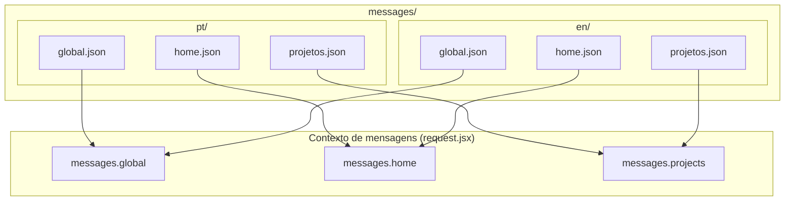
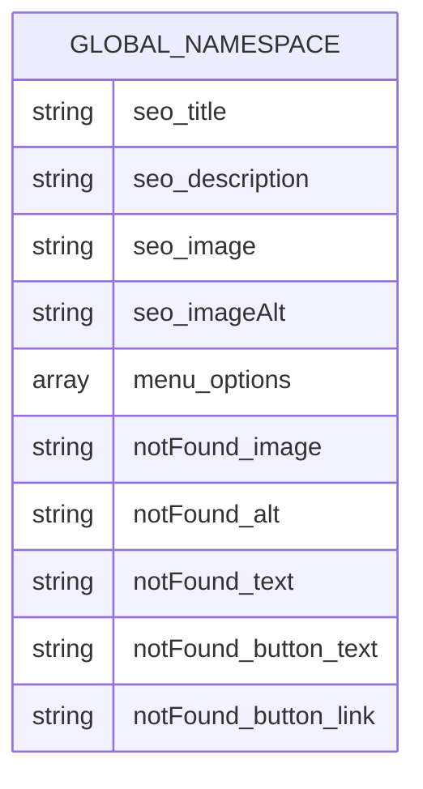
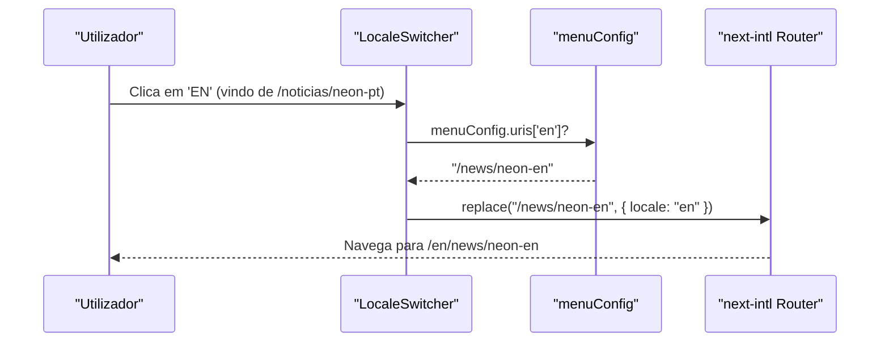

# Translations & Messages

## Tabela de Conteúdos
- [[I18n/Locale Routing]]
- [[Architecture/App Router Structure|Architecture Overview]]

## Visão Geral

As traduções do projeto estão organizadas em ficheiros JSON separados por locale e por namespace. A estrutura de diretórios segue o padrão `messages/{locale}/{namespace}.json`, onde cada ficheiro JSON corresponde a uma área funcional da aplicação. Esta separação por namespace evita carregar todo o conteúdo traduzido de uma vez — em `request.jsx`, cada namespace é importado dinamicamente apenas quando necessário.

Os dois locales suportados são `pt` (Português, predefinido) e `en` (Inglês). Para cada locale existem três ficheiros de mensagens:



> **Sources:** `i18n/request.jsx:L12-L17`

## Namespace `global`

O namespace `global` contém conteúdo transversal à aplicação inteira: metadados SEO globais, opções de menu de navegação e a mensagem da página 404.

### Estrutura de Chaves

```
global
├── seo
│   ├── title
│   ├── description
│   ├── image
│   └── imageAlt
├── menu
│   └── options[]
│       ├── text
│       └── link
└── notFound
    ├── image
    ├── alt
    ├── text
    └── button
        ├── text
        └── link
```

### Diferenças entre Locales

Os links dentro de `menu.options` e `notFound.button` diferem entre locales, reflectindo os pathnames traduzidos definidos em `routing.jsx`. Por exemplo, a opção de serviços aponta para `/servicos` em português e `/services` em inglês. O mesmo padrão aplica-se ao texto visível — "Notícias" em português torna-se "News" em inglês, e "Ver projetos" torna-se "View projects".

Os títulos e descrições SEO também são completamente independentes por locale, permitindo textos optimizados para cada mercado linguístico.



> **Sources:** `messages/pt/global.json:L1-L36` · `messages/en/global.json:L1-L35`

## Namespace `home`

O namespace `home` agrega todo o conteúdo da página inicial. É o namespace mais extenso, contendo dados de SEO específicos da homepage, configuração de vídeo de introdução, conteúdo da secção "sobre", uma lista de destaques de projetos e configuração da secção de notícias.

### Estrutura de Chaves

```
homepage
├── seo
│   ├── title
│   ├── description
│   ├── image
│   └── imageAlt
├── top
│   ├── video
│   ├── videoMobile
│   ├── title
│   ├── pt2020
│   └── pt2020Alt
├── about
│   ├── title
│   ├── subtitle
│   └── button
│       ├── text
│       └── link
├── highlights[]
│   ├── src
│   ├── alt
│   ├── logo
│   ├── logoAlt
│   ├── location
│   └── button
│       ├── text
│       ├── link
│       └── external (opcional)
└── news
    ├── title
    ├── subtitle
    ├── path
    └── button
        └── text
```

### Destaques de Projetos

A secção `highlights` é um array de objetos, cada um representando um projeto em destaque na página inicial. São definidos cinco destaques, todos partilhando as mesmas imagens e localizações entre os dois locales — apenas os textos dos botões diferem (ex: "Ver Projeto" vs "View project"). Um dos destaques (`destaque_5`) tem o campo `external: true` no seu botão, indicando que o link aponta para um domínio externo (`https://ethula.pontourbano.pt`).

### Secção de Notícias

O campo `news.path` difere entre locales: é `"noticias"` em português e `"news"` em inglês. Este valor é presumivelmente usado para construir links para a listagem de notícias com o pathname correcto para cada locale.

> **Sources:** `messages/pt/home.json:L1-L91` · `messages/en/home.json:L1-L91`

## Namespace `projects` (ficheiro `projetos.json`)

O namespace de projetos armazena os dados de cada projecto imobiliário, incluindo slugs e metadados SEO. Apesar de o ficheiro se chamar `projetos.json` em ambos os locales, é exposto sob a chave `projects` no contexto de mensagens (ver `request.jsx`).

Cada projecto tem um `id` numérico, um `slug` único por locale, metadados SEO (título, descrição, imagem e alt de imagem), e um array `subpages` com a mesma estrutura recursiva para subpáginas.

### Diferença de Slugs por Locale

Os slugs dos projectos variam entre locales, o que é o aspecto mais crítico deste namespace. O mesmo projecto tem `slug: "neon-pt"` em português e `slug: "neon-en"` em inglês. Esta diferença de slug é precisamente a razão pela qual o `LocaleSwitcher` verifica `menuConfig.uris` antes de fazer a navegação — sem isso, um `router.replace` simples navegaria para um slug inexistente no locale de destino.



> **Sources:** `messages/pt/projetos.json:L1-L28` · `messages/en/projetos.json:L1-L28` · `components/LocaleSwitcher.jsx:L26-L29`

## Como Adicionar um Novo Locale

Para adicionar um terceiro locale ao projecto, seria necessário:

1. Adicionar o código de locale ao array `locales` em `i18n/routing.jsx`.
2. Criar um novo directório `messages/{novoLocale}/` com os três ficheiros `global.json`, `home.json` e `projetos.json`.
3. Adicionar traduções de pathname ao objecto `pathnames` em `routing.jsx` para o novo locale.
4. Adicionar o novo locale à lista `languages` em `components/LocaleSwitcher.jsx`.

## Como Adicionar um Novo Namespace de Mensagens

Para criar um novo namespace (ex: `footer`):

1. Criar `messages/pt/footer.json` e `messages/en/footer.json` com a estrutura de chaves desejada.
2. Adicionar o import dinâmico ao return de `i18n/request.jsx`:
   ```js
   footer: (await import(`../messages/${locale}/footer.json`)).default,
   ```
3. O namespace `footer` ficará disponível em todos os componentes de servidor via `useTranslations('footer')` ou `getTranslations('footer')`.

> **Sources:** `i18n/request.jsx:L11-L18`

---
*[[index|← Back to Index]] · Generated by repowiki*
