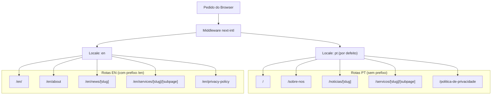
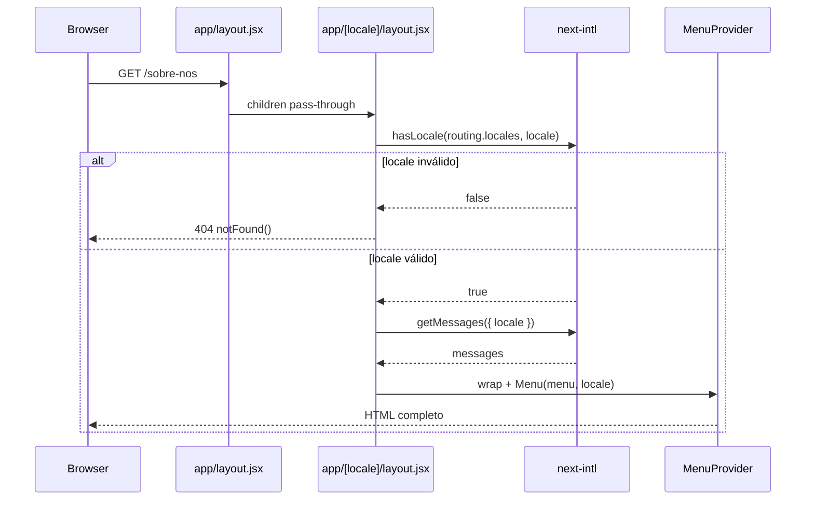

# Introdução e Propósito

## Tabela de Conteúdos
- [[Overview/Tech Stack & Quick Start]]
- [[I18n/Locale Routing|I18n]]
- [[Architecture/App Router Structure|Architecture Overview]]
- [[Content/MDX Blog Posts|Content]]

## O Que é Este Projeto

O projecto chama-se internamente **belone** (conforme declarado no campo `name` do `package.json`) e é um template de arranque para sites de marketing e conteúdo construído sobre **Next.js 16**. Foi inicializado com `create-next-app` e serve como base reutilizável para projectos de web com necessidades de internacionalização, conteúdo em MDX e animações ricas.

A intenção central do template é oferecer, desde o primeiro momento, uma estrutura production-ready com rotas localizadas, suporte a conteúdo escrito em Markdown/MDX, integração com serviços de terceiros (analytics, e-mail) e uma paleta de componentes de UI prontos a usar — evitando que cada novo projecto parta do zero.

> **Sources:** `package.json:L2` · `README.md:L1`

## Arquitectura de Rotas Multilingue

A característica mais distinta deste template é o seu sistema de rotas bilingue. Usando `next-intl`, o projecto suporta os idiomas **Português (pt)** e **Inglês (en)**, com Português como locale por defeito. A estratégia de prefixo de locale é `as-needed`: os URLs em Português não carregam o prefixo `/pt/`, enquanto os URLs em Inglês usam o prefixo `/en/`.

As rotas de conteúdo são mapeadas com nomes diferentes por idioma, tornando os URLs naturais em cada língua:

| Rota interna | URL em Português | URL em Inglês |
|---|---|---|
| `/` | `/` | `/en/` |
| `/sobre-nos` | `/sobre-nos` | `/en/about` |
| `/noticias` | `/noticias` | `/en/news` |
| `/noticias/[slug]` | `/noticias/[slug]` | `/en/news/[slug]` |
| `/servicos` | `/servicos` | `/en/services` |
| `/servicos/[slug]` | `/servicos/[slug]` | `/en/services/[slug]` |
| `/servicos/[slug]/[subpage]` | `/servicos/[slug]/[subpage]` | `/en/services/[slug]/[subpage]` |
| `/politica-de-privacidade` | `/politica-de-privacidade` | `/en/privacy-policy` |

> **Sources:** `i18n/routing.jsx:L1-L38`

## Layout em Duas Camadas

O template utiliza uma hierarquia de dois layouts do App Router do Next.js:

1. **`app/layout.jsx` (raiz)** — Um layout minimalista que simplesmente devolve `children`. Serve como ponto de entrada obrigatório do App Router sem adicionar qualquer elemento HTML, delegando tudo ao layout de locale.

2. **`app/[locale]/layout.jsx` (por locale)** — Este é o layout funcional. Valida o locale recebido na URL contra a lista de locales suportados; se o locale for inválido, invoca `notFound()`. Em caso de sucesso, carrega as mensagens de tradução via `getMessages({ locale })`, envolve a árvore com `NextIntlClientProvider` e com `MenuProvider`, e renderiza o componente `Menu` passando-lhe as entradas de menu vindas das mensagens de tradução (`messages.global.global.menu`).

O bloco comentado no layout de locale revela que estão preparados ganchos para **Google Tag Manager** (`@next/third-parties`) e **Google Analytics**, bastando descomentar e fornecer os IDs correspondentes.

> **Sources:** `app/layout.jsx:L1-L3` · `app/[locale]/layout.jsx:L1-L41`

## Domínios de Conteúdo

As páginas previstas no sistema de rotas revelam os três domínios de conteúdo principais do template:

- **Notícias / News** — listagem e detalhe por slug, ideal para artigos de blog ou press releases.
- **Serviços / Services** — listagem, detalhe por slug e sub-páginas por slug + subpage, adequado para catálogos de serviços com hierarquia.
- **Páginas estáticas** — Início, Sobre Nós/About, Política de Privacidade/Privacy Policy.

Estes domínios são servidos através de ficheiros MDX ou dados carregados a partir de mensagens de tradução, integrando conteúdo editorial e lógica de rota num único pipeline.

> **Sources:** `i18n/routing.jsx:L7-L37`

---
*[[index|← Back to Index]] · Generated by repowiki*
