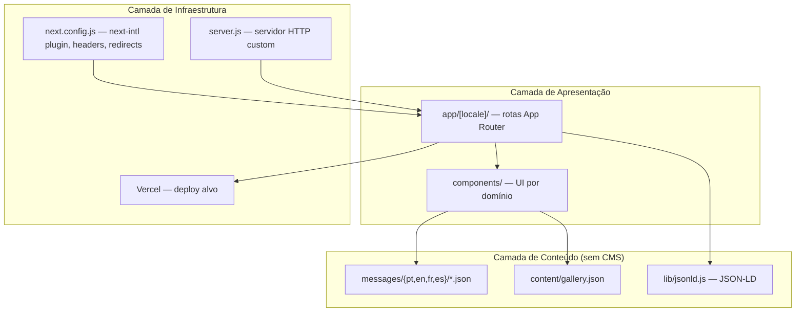
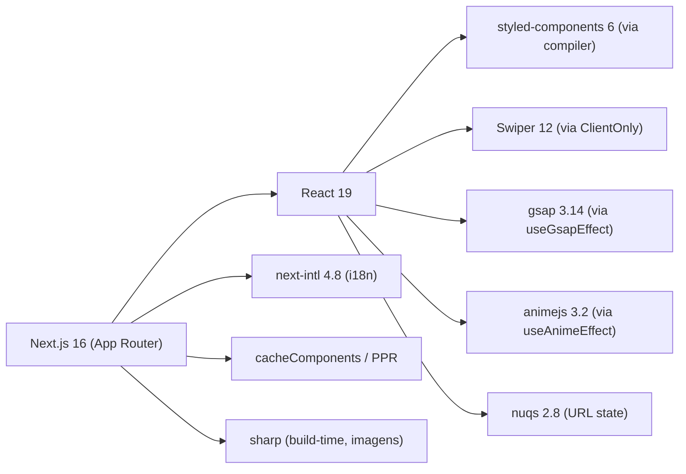
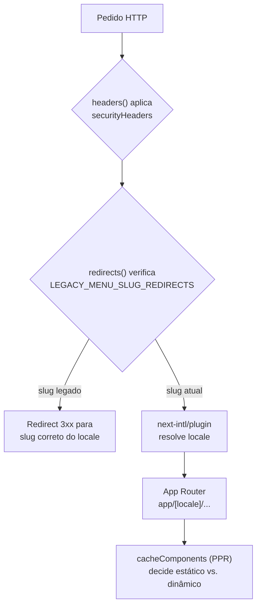

# Introdução & Stack Tecnológico

## Table of Contents
- [[Overview/Quick Start & Project Layout]]
- [[Architecture/App Router & Layout Composition]]
- [[I18n/Locale Routing & Middleware]]
- [[Frontend/Component Domains Overview]]
- [[Architecture/Caching with 'use cache']]
- SEO, GEO & AIO (ver secção SEO)

## O que é o Pizzarte

Pizzarte é o site institucional do restaurante Pizzarte, em Aveiro, Portugal, em atividade desde 1989. O `package.json` identifica o projeto pelo nome `pizzarte` (versão `1.0.0`, pacote privado) — não existe nenhum codinome interno distinto do nome real do restaurante.

O site é um projeto de marketing/apresentação: menu do restaurante, informação sobre o espaço ("Pizzarte"), galeria de fotos e contactos. Não existe backend próprio nem CMS — todo o conteúdo textual vive em ficheiros JSON de tradução (`messages/{pt,en,fr,es}/*.json`), e a galeria de imagens foi extraída uma única vez de um WordPress legado para ficheiros estáticos locais, pelo que **não há qualquer dependência de WordPress em runtime**. Também não existe formulário de reservas ou de contacto — foi removido intencionalmente durante a migração porque não existia em produção antes disso, e não deve ser recriado sem pedido explícito.

O site serve 4 idiomas: português (`pt`, o locale por defeito, sem prefixo no URL), inglês (`en`), francês (`fr`) e espanhol (`es`).

> **Sources:** `package.json:L1-L4` · `CLAUDE.md:L3,L5,L14,L17` · `CLAUDE.md:L28-L32`

## Origem: migração de Gatsby 5 para Next.js 16

O site foi migrado de Gatsby 5 para o Next.js 16 App Router em setembro de 2026. O `CLAUDE.md` documenta que o histórico completo da migração, fase a fase (7 fases no total: saneamento da base, i18n, imagens, componentes, rotas, entre outras), está preservado no `git log` a partir do commit `chore: sanear base do starter`.

As decisões-chave tomadas durante essa migração foram:

- Mantidos os 4 locales que já existiam em Gatsby.
- Mantido `styled-components` como solução de estilos (em vez de migrar para outra abordagem de CSS).
- A galeria de fotos, que em Gatsby dependia de um WordPress remoto, passou a ser servida a partir de ficheiros locais (`content/gallery.json` + `public/images/galeria/`).
- Vercel foi definido como a plataforma de deploy alvo.
- O formulário de reservas/contacto **não** foi migrado, porque já não existia em produção antes da migração.
- Cada componente antigo de Gatsby que tinha versões separadas para desktop e mobile foi fundido num único componente responsivo, controlado via CSS (breakpoint `l` = 1024px, definido em `components/style/style.js`).

Um detalhe relevante para quem vier a tocar no código: os hooks `hooks/useGsapEffect.jsx` e `hooks/useAnimeEffect.jsx` importam as bibliotecas `gsap`/`animejs` **dentro do efeito**, nunca no import de topo do módulo — porque essas bibliotecas leem `Date.now()` ao serem carregadas, o que quebra o prerender estático do Next 16/PPR se o módulo for avaliado no servidor. O mesmo problema aplica-se ao `Swiper`, que lê `Date.now()` no próprio render (não só em efeitos); por isso `components/layout/ClientOnly.jsx` existe especificamente para envolver instâncias de `<Swiper>` (usadas em `BarDrinks`, `FoodSlider`, `PizzarteInfo`).

> **Sources:** `CLAUDE.md:L3,L19-L20,L30-L32`

## Stack tecnológico

O `package.json` fixa as seguintes dependências de produção:

| Pacote | Versão | Papel |
|---|---|---|
| `next` | `^16.2.3` | Framework — App Router, PPR/`cacheComponents`, imagens, headers/redirects |
| `react` / `react-dom` | `^19.2.0` | Camada de UI |
| `next-intl` | `^4.8.3` | Internacionalização (routing, mensagens, navegação com locale) |
| `styled-components` | `^6.3.12` | Estilos (com o compilador do Next ativado — `compiler.styledComponents`) |
| `@next/third-parties` | `^16.2.3` | Integração de scripts de terceiros (ex.: Google Tag Manager) |
| `swiper` | `^12.1.3` | Carrosséis/sliders (envolvidos em `ClientOnly`) |
| `gsap` | `^3.14.2` | Animações (via `useGsapEffect`) |
| `animejs` | `^3.2.2` | Animações (via `useAnimeEffect`) |
| `nuqs` | `^2.8.9` | Estado sincronizado com a URL (query string) |
| `prop-types` | `^15.8.1` | Validação de props em componentes JS |

E como dependências de desenvolvimento: `typescript` `^5` e os tipos `@types/node`, `@types/react`, `@types/react-dom` (o projeto usa TypeScript apenas para tipos/DX, os ficheiros de componentes são `.jsx`), `eslint` `^9` com `eslint-config-next` `16.2.1`, e `sharp` `^0.35.4` (processamento de imagens, usado pelo pipeline de otimização/manifesto de imagens).

> **Sources:** `package.json:L13-L34`

## Configuração do Next.js: `next.config.js`

O `next.config.js` é o ponto onde várias decisões de arquitetura ficam explícitas:

- **`next-intl/plugin`**: o `next.config.js` envolve toda a configuração com `createNextIntlPlugin()` (`withNextIntl(nextConfig)`), o que liga o roteamento i18n ao App Router.
- **`experimental.globalNotFound: true`**: ativa o suporte a um `app/global-not-found.jsx` para 404s fora de qualquer locale resolvido (ver [[Overview/Quick Start & Project Layout]]).
- **`cacheComponents: true`**: ativa o modelo de cache/PPR do Next 16 (`use cache`), relevante para todos os componentes que dependem de dados estáticos vs. dinâmicos — ver [[Architecture/Caching with 'use cache']].
- **`compiler.styledComponents: true`**: ativa a transformação em build-time do `styled-components` pelo compilador do Next (melhora SSR/hidratação e nomes de classe).
- **`images`**: define os formatos gerados (`avif`, `webp`), os `deviceSizes` (`[640, 750, 828, 1080, 1200, 1920, 2560]` — o comentário no código explica que os defaults `2048`/`3840` foram cortados porque o maior breakpoint real do site é ~2560px, evitando transformações de imagem desnecessárias) e um `minimumCacheTTL` de `2592000` segundos (30 dias).
- **`allowedDevOrigins`**: inclui `192.168.2.29`, permitindo acesso ao servidor de dev a partir desse IP na rede local.
- **`headers()`**: aplica um conjunto de `securityHeaders` a todas as rotas (`/:path*`) — `Strict-Transport-Security`, `X-Frame-Options: DENY`, `X-Content-Type-Options: nosniff`, `Referrer-Policy: strict-origin-when-cross-origin`, `Permissions-Policy` (bloqueia geolocalização, câmara e microfone) e uma `Content-Security-Policy-Report-Only` que permite scripts/estilos apenas de `'self'`, Google Tag Manager e CookieYes, fontes do Google Fonts, e conexões para Google Analytics/Tag Manager/CookieYes.
- **`redirects()`**: devolve `LEGACY_MENU_SLUG_REDIRECTS`, importado de `lib/legacyMenuRedirects.js`. Este mapa existe porque o Gatsby antigo publicava slugs de categoria de menu em português também sob os prefixos EN/FR/ES (o `gatsby-node.js` original não traduzia o slug); o redirect corrige isso, apontando para o slug correto de cada idioma definido em `messages/{locale}/menu.json`.

> **Sources:** `next.config.js:L1-L53`

## `server.js`: servidor HTTP customizado

O repositório inclui um `server.js` que cria um servidor HTTP Node.js manual em vez de depender apenas do `next start` embutido: usa `http.createServer`, invoca `next({ dev })` (onde `dev` é `process.env.NODE_ENV !== "production"`) e delega cada pedido ao `handle` do Next via `app.getRequestHandler()`, fazendo o parsing do URL com o módulo `url` do Node. O servidor escuta na porta definida por `process.env.PORT`, com fallback para `3001` (note-se que isto é diferente da porta padrão `3000` usada pelo `next dev`/`next start`).

Este ficheiro é relevante para quem for configurar o deploy fora do fluxo padrão do Vercel (por exemplo, um ambiente Node tradicional), já que oferece um ponto de entrada alternativo a `npm start`.

> **Sources:** `server.js:L1-L19`

## Variáveis de ambiente (`env-example`)

O `env-example` documenta as variáveis públicas (`NEXT_PUBLIC_*`) usadas para gerar metadados e dados estruturados do site, organizadas em quatro grupos:

- **Core (obrigatório antes de build de produção)**: `NEXT_PUBLIC_SITE_URL` (URL base sem barra final, usada em canonical, OG tags, sitemap e JSON-LD) e `NEXT_PUBLIC_SITE_NAME` (usado em títulos de página, OG tags e nos schemas `Organization`/`Restaurant`).
- **Contacto**: `NEXT_PUBLIC_PHONE`, `NEXT_PUBLIC_EMAIL`, `NEXT_PUBLIC_ADDRESS`, `NEXT_PUBLIC_CITY`, `NEXT_PUBLIC_POSTAL_CODE` — cada uma é opcional; o schema JSON-LD omite o campo correspondente se a variável estiver vazia.
- **Geo**: `NEXT_PUBLIC_GEO_LAT` e `NEXT_PUBLIC_GEO_LNG`, usadas no `GeoCoordinates` do schema `Restaurant` (o comentário no ficheiro indica que foram confirmadas no OpenStreetMap, num nó "Pizzarte" já mapeado).
- **Redes sociais**: `NEXT_PUBLIC_SOCIAL_INSTAGRAM` e `NEXT_PUBLIC_SOCIAL_FACEBOOK`, alimentando o array `sameAs` do schema `Organization` — apenas os perfis preenchidos são incluídos.

Estas variáveis alimentam diretamente os builders definidos em `lib/jsonld.js` (Restaurant, Menu, Organization, WebSite, BreadcrumbList, FAQPage), pelo que qualquer alteração de dados de contacto ou redes sociais do restaurante deve começar por atualizar o `.env` local (a partir deste exemplo), não o código.

> **Sources:** `env-example:L1-L24` · `CLAUDE.md:L18`

## Diretivas para agentes de IA (`AGENTS.md`)

O `AGENTS.md` avisa explicitamente que a versão do Next.js usada neste projeto tem alterações que quebram compatibilidade com o conhecimento de treino de modelos de IA — recomenda ler a documentação em `node_modules/next/dist/docs/` antes de escrever código e respeitar avisos de depreciação. Também define convenções de processo: cada diretório de rota dinâmica (`[slug]`, `[subpage]`) deveria ter um ficheiro `claude.md` a listar implementações e componentes usados; e pede que as novas APIs de cache (`use cache`) e PPR do Next.js 16 sejam seguidas "conforme documentado na wiki".

**Nota importante de precedência**: o `AGENTS.md` refere a wiki (`.repowiki/**`) como fonte de arquitetura obrigatória, mas o `CLAUDE.md` do projeto — mais recente — esclarece que a wiki anterior estava desatualizada (gerada para um cliente diferente, do setor imobiliário, com rotas `/noticias` e `/servicos` que já não existem neste site) e não deve ser seguida como fonte de verdade até ser regenerada. Esta própria página faz parte dessa regeneração; até à conclusão total do processo, o código real e o `CLAUDE.md` do projeto têm precedência sobre qualquer conteúdo desta wiki que ainda não tenha sido revalidado.

> **Sources:** `AGENTS.md:L1-L17` · `CLAUDE.md:L24`

---
*[[index|← Back to Index]] · Generated by repowiki*
