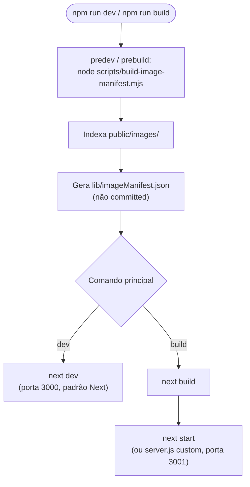
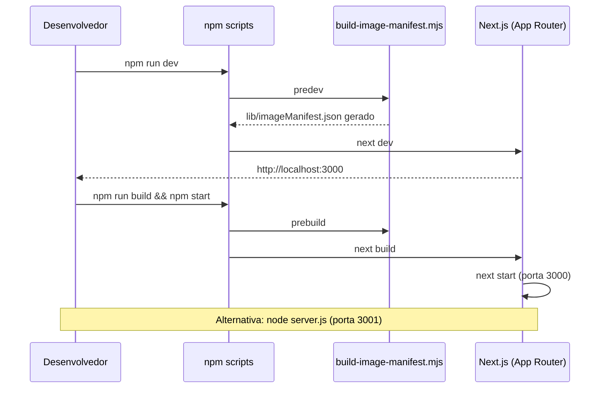
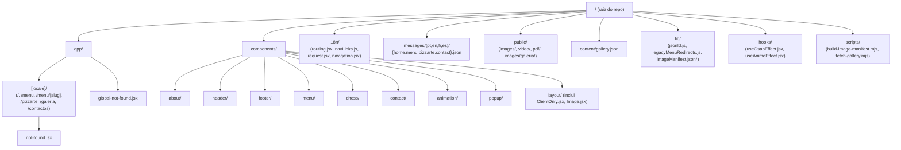
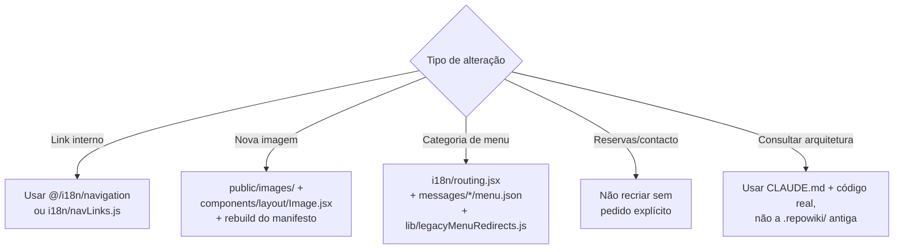

# Quick Start & Estrutura do Projeto

## Table of Contents
- [[Overview/Introduction & Tech Stack]]
- [[Architecture/App Router & Layout Composition]]
- [[I18n/Locale Routing & Middleware]]
- [[Frontend/Component Domains Overview]]
- Content/MDX Blog Posts (removido na migração — sem página correspondente)
- [[SEO/Sitemap, Robots & llms.txt]]

## Scripts disponíveis

O `package.json` define os seguintes scripts npm:

| Script | Comando | Quando corre |
|---|---|---|
| `predev` | `node scripts/build-image-manifest.mjs` | Automaticamente antes de `npm run dev` |
| `dev` | `next dev` | Arranque do servidor de desenvolvimento |
| `prebuild` | `node scripts/build-image-manifest.mjs` | Automaticamente antes de `npm run build` |
| `build` | `next build` | Build de produção |
| `start` | `next start` | Servir o build de produção (Next.js embutido) |
| `lint` | `eslint` | Linting do código |

Os hooks `predev`/`prebuild` do npm garantem que `scripts/build-image-manifest.mjs` corre sempre antes de `dev` ou `build`, gerando `lib/imageManifest.json` a partir do conteúdo de `public/images/` — este ficheiro é **gerado, não committed**, pelo que nunca deve ser editado manualmente nem assumido como presente num checkout limpo antes do primeiro `npm run dev`/`build`.

> **Sources:** `package.json:L5-L12` · `CLAUDE.md:L15`

## Arrancar o projeto localmente

O `README.md` deste repositório é o texto genérico gerado pelo `create-next-app`, ainda não personalizado para o Pizzarte — recomenda `npm run dev` (ou `yarn`/`pnpm`/`bun dev`) e abrir `http://localhost:3000`. Isto está correto para o fluxo padrão do Next.js, mas dois pontos específicos deste projeto merecem atenção:

1. **Variáveis de ambiente**: antes de um build de produção, é preciso copiar `env-example` para `.env` (ou `.env.local`) e preencher pelo menos os valores "Core" (`NEXT_PUBLIC_SITE_URL`, `NEXT_PUBLIC_SITE_NAME`) — o próprio ficheiro de exemplo assinala isto como obrigatório. Os grupos de Contacto, Geo e Redes Sociais são opcionais e alimentam os schemas JSON-LD gerados em `lib/jsonld.js`.
2. **Servidor alternativo**: existe um `server.js` com um servidor HTTP Node customizado, que escuta na porta `3001` por defeito (`process.env.PORT` com fallback `3001`), diferente da porta `3000` do `next dev`/`next start` padrão. Este ficheiro não está ligado a nenhum script do `package.json` — para o usar, corre-se diretamente com `node server.js` depois de um `next build`.

> **Sources:** `README.md:L1-L37` · `package.json:L5-L12` · `server.js:L1-L19` · `env-example:L1-L24`

## Estrutura de diretórios

De acordo com o `CLAUDE.md` do projeto (fonte de verdade atual, em vez da wiki anterior desatualizada), a estrutura principal é:

- **`app/[locale]/`** — rotas do App Router: `/`, `/menu`, `/menu/[slug]`, `/pizzarte`, `/galeria`, `/contactos`.
- **`app/global-not-found.jsx`** — 404 para URLs que não correspondem a nenhuma rota, na raiz de `app/`, sem locale (o próprio ficheiro tem um comentário a explicar o motivo, a ler antes de qualquer alteração). Este comportamento é ativado por `experimental.globalNotFound: true` em `next.config.js`.
- **`app/[locale]/not-found.jsx`** — 404 para chamadas a `notFound()` dentro de uma rota já resolvida (portanto já sabe o locale ativo).
- **`components/`** — organizados por domínio herdado do Gatsby original: `about/`, `header/`, `footer/`, `menu/`, `chess/`, `contact/`, `animation/`, `popup/`, `layout/`. Cada componente fundiu as antigas versões desktop e mobile separadas num único componente responsivo, controlado via CSS (`components/style/style.js`, breakpoint `l` = 1024px).
- **`i18n/`** — `routing.jsx` (locales, pathnames, `MENU_CATEGORY_SLUGS`), `navLinks.js` (`translateNavLink`, traduz links canónicos), `request.jsx` e `navigation.jsx`.
- **`messages/{pt,en,fr,es}/{home,menu,pizzarte,contact}.json`** — todo o conteúdo textual do site; não existe CMS.
- **`public/images/`** — imagens locais, indexadas por `scripts/build-image-manifest.mjs` em `lib/imageManifest.json` (gerado, não committed).
- **`public/video/`, `public/pdf/`** — vídeo/poster da homepage e documentos legais.
- **`content/gallery.json` + `public/images/galeria/`** — fotos da galeria, extraídas uma única vez do WordPress via `scripts/fetch-gallery.mjs`; sem dependência de WordPress em runtime.
- **`lib/jsonld.js`** — builders de JSON-LD: `Restaurant`, `Menu`, `Organization`, `WebSite`, `BreadcrumbList`, `FAQPage`.
- **`hooks/useGsapEffect.jsx`, `hooks/useAnimeEffect.jsx`** — importam `gsap`/`animejs` dentro do efeito, nunca no import de topo, para não quebrar o prerender estático do Next 16/PPR.
- **`components/layout/ClientOnly.jsx`** — usado apenas em torno de `<Swiper>` (em `BarDrinks`, `FoodSlider`, `PizzarteInfo`), pelo mesmo motivo de leitura de `Date.now()` no render.

> **Sources:** `CLAUDE.md:L9-L20`

## Regras de desenvolvimento a respeitar

O `CLAUDE.md` estabelece cinco regras que qualquer alteração ao código deve respeitar:

1. **`.repowiki/` desatualizada** — foi gerada para um cliente anterior do setor imobiliário (com rotas `/noticias` e `/servicos` que não existem neste site). Não deve ser seguida como fonte de verdade até ser regenerada; usar o `CLAUDE.md` e o código real como referência.
2. **i18n estrito** — qualquer link interno deve usar `@/i18n/navigation` (`Link`, `useRouter`, `getPathname`) ou `i18n/navLinks.js` (`translateNavLink`); nunca `next/link` com um caminho fixo.
3. **Imagens** — todo o conteúdo visual novo vai para `public/images/`, referenciado via `components/layout/Image.jsx` (`src` relativo, `alt` obrigatório). É preciso correr `node scripts/build-image-manifest.mjs` depois de adicionar imagens (ou simplesmente `npm run dev`/`npm run build`, que já o fazem via `predev`/`prebuild`).
4. **Categorias de menu** — os slugs traduzidos vivem em `i18n/routing.jsx` (`MENU_CATEGORY_SLUGS`); mudar uma categoria implica atualizar esse ficheiro, `messages/*/menu.json` e, se o slug canónico mudar, também `lib/legacyMenuRedirects.js` (o mapa de redirects consumido em `next.config.js`).
5. **Sem formulário de reservas/contacto** — foi removido intencionalmente na migração porque não existia em produção; não deve ser recriado sem pedido explícito.

> **Sources:** `CLAUDE.md:L22-L28`

## Notas para agentes de IA (`AGENTS.md`)

Ao trabalhar neste repositório com um agente de IA, o `AGENTS.md` pede que se leia a documentação em `node_modules/next/dist/docs/` antes de escrever código, porque esta versão do Next.js tem alterações que quebram compatibilidade com o conhecimento de treino de modelos de IA. Também define uma convenção de documentação por rota: cada diretório de rota dinâmica (`[slug]`, `[subpage]`) deve ter (ou ganhar) um `claude.md` próprio, listando as implementações realizadas e os componentes utilizados nessa rota. Por fim, pede respeito rigoroso pelas novas APIs de cache do Next 16 (`use cache`) e PPR, e pela separação de mensagens por namespace do `next-intl`.

Como referido em [[Overview/Introduction & Tech Stack]], a indicação do `AGENTS.md` para seguir a wiki como fonte de arquitetura deve ser lida em conjunto com o aviso do `CLAUDE.md` de que a wiki anterior estava desatualizada — o código real e o `CLAUDE.md` prevalecem enquanto a regeneração da wiki (da qual esta própria página faz parte) não estiver completa.

> **Sources:** `AGENTS.md:L1-L17`

---
*[[index|← Back to Index]] · Generated by repowiki*
