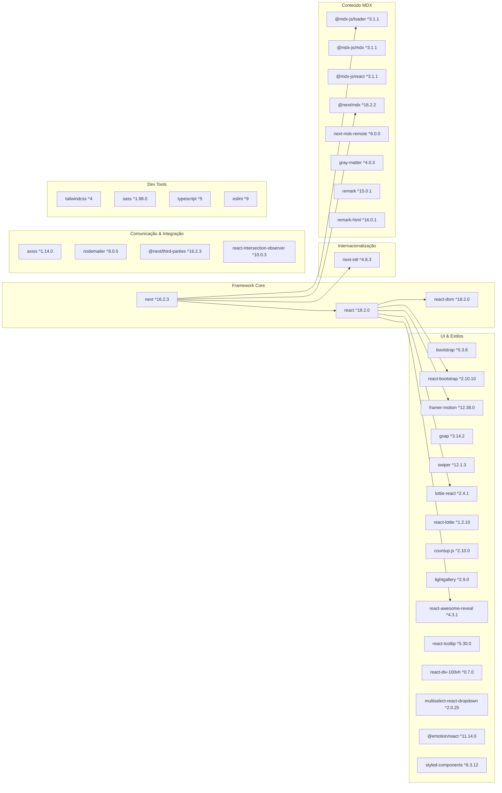
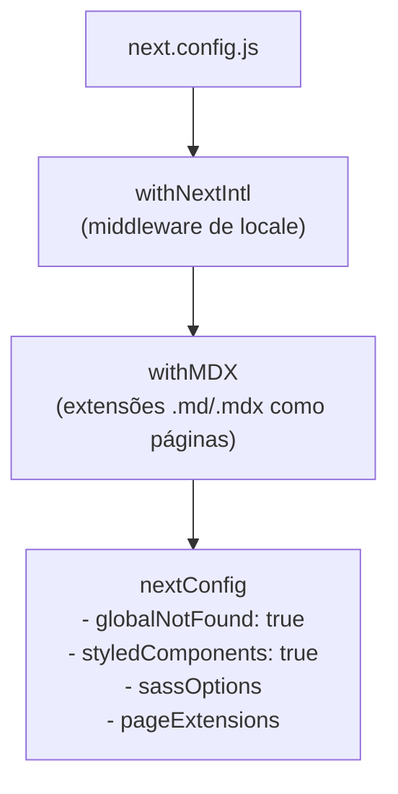

# Tech Stack & Quick Start

## Tabela de Conteúdos
- [[Overview/Introduction & Purpose]]
- [[I18n/Locale Routing|I18n]]
- [[Content/MDX Blog Posts|Content]]
- [[Architecture/App Router Structure|Architecture Overview]]

## Visão Geral das Dependências

O template assenta num conjunto deliberado de pacotes, agrupados por responsabilidade. A versão do projecto é **0.1.0** e o nome interno é **belone**.



> **Sources:** `package.json:L11-L53`

## Dependências em Detalhe

### Framework e Renderização

O projecto usa **Next.js 16** com **React 18**. A versão 16 do Next.js introduz alterações de API relativamente à série 14/15 — o ficheiro `AGENTS.md` do projecto avisa explicitamente que se trata de uma versão com breaking changes e instrui a consultar a documentação interna antes de escrever qualquer código.

### Internacionalização

**next-intl 4.8.3** é a dependência central para i18n. Fornece:
- `NextIntlClientProvider` — contexto de traduções para componentes cliente.
- `hasLocale` — validação de locale no layout de servidor.
- `getMessages` — carregamento de mensagens no servidor.
- `defineRouting` — definição de locales, locale por defeito e mapeamento de pathnames.

O plugin `createNextIntlPlugin` é aplicado em `next.config.js` para integrar o middleware automático de detecção de locale.

> **Sources:** `package.json:L28` · `next.config.js:L2` · `app/[locale]/layout.jsx:L4-L6`

### Conteúdo MDX

O sistema de conteúdo é composto por quatro pacotes complementares:

| Pacote | Função |
|---|---|
| `@next/mdx` | Plugin Next.js que regista `.md` e `.mdx` como extensões de página |
| `@mdx-js/loader` / `@mdx-js/mdx` / `@mdx-js/react` | Compilação e renderização de MDX |
| `next-mdx-remote` | Carregamento de MDX a partir de fontes externas (ficheiros, CMS) |
| `gray-matter` | Parsing de frontmatter YAML nos ficheiros Markdown |
| `remark` / `remark-html` | Pipeline de transformação Markdown → HTML |

A configuração em `next.config.js` estende as extensões de página com `["js", "jsx", "ts", "tsx", "md", "mdx"]`, o que significa que qualquer ficheiro `.mdx` colocado dentro de `app/` é tratado como uma rota do App Router.

> **Sources:** `package.json:L13-L16,L29,L40-L41` · `next.config.js:L3-L5,L17`

### UI, Animações e Componentes

O template é generoso em bibliotecas de UI, reflectindo o seu propósito de marketing com conteúdo visual rico:

- **Bootstrap 5 + react-bootstrap** — Sistema de grid e componentes clássicos.
- **Framer Motion 12** + **GSAP 3** — Animações de scroll e transições de página. GSAP é uma das bibliotecas de animação mais performativas disponíveis.
- **Swiper 12** — Carrosséis e sliders touch-friendly.
- **Lottie** (via `lottie-react` e `react-lottie`) — Reprodução de animações vectoriais exportadas do Adobe After Effects.
- **countup.js** — Animação de números (contadores de estatísticas).
- **lightgallery** — Galeria de imagens com lightbox.
- **react-awesome-reveal** — Animações de entrada baseadas no Intersection Observer.
- **react-intersection-observer** — Hook para detectar visibilidade de elementos.
- **react-tooltip** — Tooltips acessíveis.
- **react-div-100vh** — Solução para a altura variável do viewport em mobile browsers.
- **multiselect-react-dropdown** — Campo de selecção múltipla para formulários.

> **Sources:** `package.json:L18-L42`

### Estilos

O projecto suporta simultaneamente três abordagens de estilos:

1. **Tailwind CSS 4** (via `@tailwindcss/postcss`) — Utility-first CSS.
2. **Sass** (`sass ^1.98.0`) — Pré-processador SCSS com suporte a variáveis globais configuradas em `next.config.js` (`sassOptions.additionalData`).
3. **styled-components 6** + **@emotion/react** — CSS-in-JS com Server Components habilitado via `compiler.styledComponents: true` em `next.config.js`.

Esta coexistência indica que o template foi desenhado para ser flexível: cada projecto derivado pode adoptar a abordagem de estilos que preferir.

> **Sources:** `package.json:L45-L46,L41` · `next.config.js:L11-L15`

### Comunicação

- **axios** — Cliente HTTP para chamadas a APIs externas.
- **nodemailer** — Envio de e-mail a partir de Server Actions ou rotas de API (ex: formulários de contacto).
- **@next/third-parties** — Integração optimizada com Google Tag Manager e Google Analytics (já referenciado, mas comentado, no layout de locale).

> **Sources:** `package.json:L17,L31,L18` · `app/[locale]/layout.jsx:L26-L27`

## Configuração do Next.js



O `next.config.js` aplica os plugins em cadeia: `withNextIntl(withMDX(nextConfig))`. As opções relevantes são:

- **`experimental.globalNotFound: true`** — Activa um handler global de 404 que cobre também rotas que não correspondem a nenhum locale.
- **`compiler.styledComponents: true`** — Habilita o compilador SWC para styled-components, garantindo SSR correcta e class names determinísticos.
- **`sassOptions.additionalData`** — Injeta variáveis SCSS globais em todos os ficheiros `.scss` automaticamente.
- **`pageExtensions`** — Lista branca de extensões reconhecidas como páginas: `js`, `jsx`, `ts`, `tsx`, `md`, `mdx`.

> **Sources:** `next.config.js:L1-L24`

## Servidor Customizado

Para além do servidor de desenvolvimento padrão do Next.js (iniciado com `next dev`), o projecto inclui um `server.js` que implementa um **servidor HTTP customizado** usando o módulo `http` nativo do Node.js.

O servidor lê a porta a partir de `process.env.PORT`, com fallback para `3000`. Determina o modo desenvolvimento/produção via `process.env.NODE_ENV !== "production"`. Após `app.prepare()`, cria um servidor HTTP que delega todos os pedidos ao handler padrão do Next.js (`app.getRequestHandler()`), analisando o URL com `url.parse`.

Este padrão é útil quando se precisa de interceptar pedidos antes do Next.js os tratar, por exemplo para adicionar WebSockets, lógica de proxy customizado, ou integração com outros frameworks Node.

> **Sources:** `server.js:L1-L18`

## Quick Start

Para executar o projecto localmente:

```bash
# Instalar dependências
npm install

# Servidor de desenvolvimento (next dev)
npm run dev

# Servidor customizado (server.js)
node server.js

# Build de produção
npm run build

# Iniciar em produção
npm run start

# Lint
npm run lint
```

O servidor ficará disponível em `http://localhost:3000` (ou na porta definida em `PORT`).

> **Sources:** `package.json:L5-L9` · `server.js:L5-L16`

---
*[[index|← Back to Index]] · Generated by repowiki*
