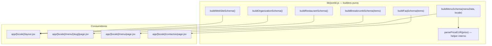
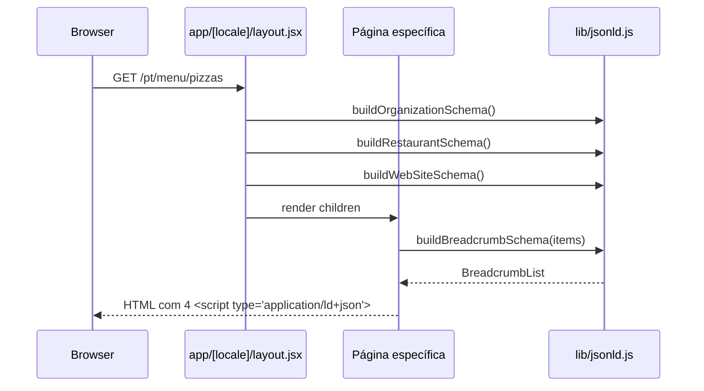
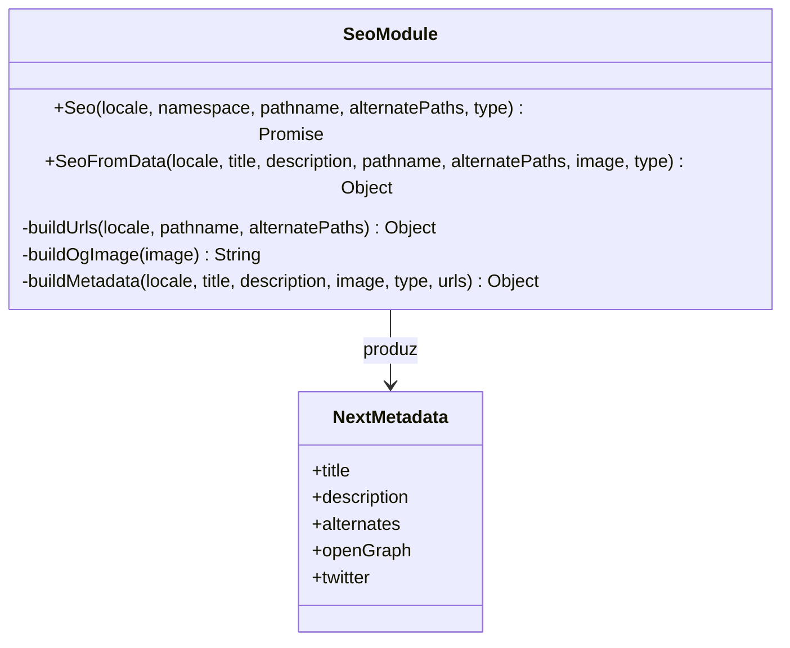

# Metadata & JSON-LD Builders

O site Pizzarte separa a produção de metadados em duas camadas puras e reutilizáveis: `lib/jsonld.js` (dados estruturados schema.org, para motores de pesquisa e motores generativos — a parte "GEO" do trabalho) e `components/Seo.js` (metadata do Next.js — `<title>`, `<meta description>`, canonical, hreflang, Open Graph e Twitter Card). Nenhuma página do site constrói estes objetos à mão: todas importam destes dois módulos, o que garante que `BASE_URL` e `SITE_NAME` nunca ficam duplicados ou desincronizados entre rotas.

## Table of Contents
- [[SEO/Sitemap, Robots & llms.txt]]
- [[SEO/Static Site Generation Strategy]]
- [[I18n/Locale Routing & Middleware]]
- [[Architecture/App Router & Layout Composition]]
- [[index]]

## Os builders de JSON-LD (`lib/jsonld.js`)

O ficheiro `lib/jsonld.js` exporta seis funções puras e sem efeitos secundários. Cada uma devolve um objeto JavaScript simples, pronto a ser serializado com `JSON.stringify` dentro de um `<script type="application/ld+json">`. Todas partilham as mesmas constantes de topo:

```js
const BASE_URL = process.env.NEXT_PUBLIC_SITE_URL || "https://example.pt";
const SITE_NAME = process.env.NEXT_PUBLIC_SITE_NAME || "Site";
```

Um comentário no topo do ficheiro é explícito quanto à intenção arquitetural: "nunca duplicar BASE_URL/SITE_NAME nas páginas, só usar os builders daqui".

### `buildRestaurantSchema()`

Substituiu um antigo `buildLocalBusinessSchema` herdado do template imobiliário que deu origem a este projeto. Como a Pizzarte é um restaurante, o tipo correto e mais específico é `schema.org/Restaurant` — não `RealEstateListing` nem `LocalBusiness` genérico. O objeto inclui `name`, `url`, `image` (fixo em `${BASE_URL}/images/seo/pizzarte.png`), `servesCuisine: ["Italian", "Pizza"]`, `priceRange: "€€"` e, condicionalmente (só se a variável de ambiente existir), `telephone`, `email`, um bloco `address` (`PostalAddress` com `addressCountry: "PT"`), um bloco `geo` (`GeoCoordinates`), `hasMenu` (apontando para `${BASE_URL}/menu`), `acceptsReservations: "True"` e `sameAs` com os links de Instagram/Facebook. Todos os campos opcionais usam spread condicional (`...(condição && { campo })`), pelo que o schema nunca inclui chaves vazias ou `null` quando a env var correspondente não está definida.

### `buildOrganizationSchema()`

Gera um `schema.org/Organization` com `name`, `url`, `logo` (`${BASE_URL}/images/logos/logo.svg`), um `contactPoint` opcional (`ContactType: "customer service"`, `availableLanguage` fixo nos quatro idiomas do site) e o mesmo `sameAs` de redes sociais.

### `buildWebSiteSchema()`

O mais simples dos builders: apenas `name` e `url`, tipo `WebSite`.

### `buildBreadcrumbSchema(items)`

Recebe um array `[{ name, item }]` e devolve um `BreadcrumbList` com `itemListElement` numerado (`position` começa em 1). É a única função de breadcrumb do projeto e é usada nas páginas de categoria de menu.

### `buildMenuSchema(menuData, locale)`

O builder com maior peso estratégico do projeto — o comentário no código chama-lhe explicitamente "o maior ganho de GEO do projeto: torna a ementa inteira legível por motores generativos (ChatGPT, Perplexity, Gemini)". Recebe o array de categorias tal como vem de `messages/{lang}/menu.json` (`menu.menus`, cada categoria com `{ title, meals: [{ dishes: [{ name, ingredients?, price }] }] }`) e produz um `schema.org/Menu` completo: uma `MenuSection` por categoria, cada uma com `hasMenuItem` — um `MenuItem` por prato, incluindo `description` (a partir de `ingredients`, se existir) e um bloco `offers` (`Offer`, `priceCurrency: "EUR"`) sempre que o preço for interpretável.

A conversão de preço é feita por uma função interna não exportada, `parsePriceEUR(price)`, que normaliza strings como `"€ 2,50"` para o formato decimal `"2.50"` (troca `.` por nada e `,` por `.`, depois usa `parseFloat` e `toFixed(2)`). Se a string não corresponder ao padrão esperado, devolve `null` — e nesse caso o `MenuItem` correspondente simplesmente não tem `offers`, em vez de propagar um preço inválido.

### `buildFaqSchema(items)`

Recebe `[{ question, answer }]` e devolve um `FAQPage` com `mainEntity` — um array de `Question`, cada uma com `acceptedAnswer` do tipo `Answer`. É consumido pela página de contactos.



> **Sources:** `lib/jsonld.js:L1-L157`

## Onde os schemas são injetados no HTML

O `Organization`, `Restaurant` e `WebSite` são globais: são emitidos uma única vez em `app/[locale]/layout.jsx`, diretamente no `<body>`, através de três `<script type="application/ld+json">` com `dangerouslySetInnerHTML`. Como o layout envolve todas as rotas de `[locale]`, estes três schemas aparecem em **todas as páginas do site**, nos quatro idiomas.

Os restantes schemas são específicos de página:

- `buildBreadcrumbSchema` — usado em `app/[locale]/menu/[slug]/page.jsx`, construindo a trilha Início → Menu → Categoria com URLs absolutos (`BASE_URL` + prefixo de locale + caminho traduzido).
- `buildMenuSchema` — usado em `app/[locale]/menu/page.jsx`, recebendo `messages.menu.menus` diretamente das traduções e o `locale` corrente.
- `buildFaqSchema` — usado em `app/[locale]/contactos/page.jsx`, com perguntas fixas por idioma (`FAQ_QUESTIONS`) cujas respostas vêm sempre de dados reais já existentes (`messages/*/home.json` para horário, `messages/*/contact.json` para morada/reserva) — nunca inventadas.



> **Sources:** `app/[locale]/layout.jsx:L46-L49`, `app/[locale]/menu/[slug]/page.jsx:L84-L92`, `app/[locale]/menu/page.jsx:L19-L26`, `app/[locale]/contactos/page.jsx:L35-L43`

## `components/Seo.js` — metadata do Next.js (`<title>`, canonical, hreflang, OG, Twitter)

Enquanto `lib/jsonld.js` trata de dados estruturados, `components/Seo.js` trata da metadata "clássica" consumida pelo `generateMetadata` de cada rota. O ficheiro tem quatro funções internas mais duas exportadas.

### `buildUrls({ locale, pathname, alternatePaths })`

Constrói o conjunto de URLs por idioma. Para rotas estáticas registadas em `i18n/routing.jsx` (`/`, `/menu`, `/pizzarte`, `/galeria`, `/contactos`), resolve cada URL com `getPathname({ href: pathname, locale })`. Para rotas dinâmicas cujo slug traduzido depende dos dados (`/menu/[slug]`), a chamada passa `alternatePaths` — um objeto já pré-calculado `{ pt: "/menu/entradas", en: "/menu/starters", ... }` — porque o mapa `pathnames` do next-intl não cobre segmentos dinâmicos data-driven. O locale por defeito (`pt`) nunca leva prefixo (`${BASE_URL}${path}`); os outros três levam (`${BASE_URL}/${loc}${path}`). O resultado inclui `canonical` (a URL do locale atual) e `xDefault` (a URL do locale por defeito, para a tag `x-default` do hreflang).

### `buildOgImage(image)`

Normaliza o caminho de imagem que vem de `messages/*.json` (herdado da estrutura antiga `src/images/` do Gatsby, agora servida em `/images/`). Se `image` já for uma URL absoluta (`http...`), devolve-a tal como está; caso contrário, prefixa com `${BASE_URL}/images/`. Devolve `null` se não houver imagem.

### `buildMetadata({ locale, title, description, image, type, urls })`

O construtor final do objeto de metadata do Next.js. Produz:
- `title`, `description` diretamente.
- `alternates.canonical` e `alternates.languages` (um mapa `{ pt, en, fr, es, "x-default" }`), separando `canonical`/`xDefault` do resto de `urls` por destructuring.
- `openGraph`: `title`, `description`, `url` (o canonical), `siteName`, `locale` traduzido via o mapa `OG_LOCALE` (`{ pt: "pt_PT", en: "en_US", fr: "fr_FR", es: "es_ES" }`), `type`, e `images` (array com `width: 1200`, `height: 630`, `alt: title`) só se houver `ogImage`.
- `twitter`: `card: "summary_large_image"`, `title`, `description`, e `images` só se houver `ogImage`.

### `Seo({ locale, namespace, pathname, alternatePaths, type = "website" })`

Função assíncrona exportada, pensada para páginas cujo título/descrição vive numa chave de tradução fixa em `messages/{locale}/*.json` (convenção: `namespace.title`, `namespace.description`, `namespace.image` opcional). Importa `getTranslations` de `next-intl/server` dinamicamente, resolve as strings, tenta ler `t("image")` dentro de um `try/catch` silencioso (se a chave não existir, `image` fica `null` sem rebentar a página) e delega em `buildMetadata`.

### `SeoFromData({ locale, title, description, pathname, alternatePaths, image = null, type = "website" })`

Variante síncrona para quando o título/descrição já foi resolvido em runtime (por exemplo, uma categoria de menu escolhida dinamicamente, cujo título não é uma chave de tradução fixa). Não faz lookup de traduções — recebe os valores já prontos e delega também em `buildMetadata`.



> **Sources:** `components/Seo.js:L1-L99`

## Quem chama `Seo` vs. `SeoFromData`

Existe uma distinção deliberada entre as duas funções, visível em todas as páginas de `app/[locale]/`:

| Página | Função usada | Fonte do título/descrição |
|---|---|---|
| `/` (`app/[locale]/page.jsx`) | `Seo({ namespace: "home.seo", pathname: "/" })` | chave de tradução fixa |
| `/contactos` (`app/[locale]/contactos/page.jsx`) | `Seo({ namespace: "contact.seo", pathname: "/contactos" })` | chave de tradução fixa |
| `/menu` (`app/[locale]/menu/page.jsx`) | `SeoFromData({ title: seo.title, ... })`, lendo `messages.pizzarte.seoMenu` | dados já resolvidos em runtime |
| `/pizzarte` (`app/[locale]/pizzarte/page.jsx`) | `SeoFromData(...)`, lendo `messages.pizzarte.seo` | dados já resolvidos em runtime |
| `/galeria` (`app/[locale]/galeria/page.jsx`) | `SeoFromData(...)`, lendo `messages.pizzarte.seoGallery` | dados já resolvidos em runtime |
| `/menu/[slug]` (`app/[locale]/menu/[slug]/page.jsx`) | `SeoFromData({ title: `${category.title} | ${SITE_TITLE_SUFFIX[locale]}`, alternatePaths, type: "article" })` | categoria resolvida em runtime + sufixo de marca |

Um comentário em `app/[locale]/pizzarte/page.jsx` documenta um bug corrigido durante a migração: o Gatsby original usava o SEO da homepage (`t("home").seo`) também na página `/pizzarte`, fazendo com que `/` e `/pizzarte` tivessem título e descrição duplicados. A versão Next.js lê corretamente `messages.pizzarte.seo`.

Na página de categoria de menu, o `alternatePaths` é construído manualmente dentro de `generateMetadata`, percorrendo `routing.locales` e traduzindo o slug canónico através de `MENU_CATEGORY_SLUGS[loc]` — o mesmo mapa usado pelo sitemap (ver [[SEO/Sitemap, Robots & llms.txt]]).

> **Sources:** `app/[locale]/page.jsx:L11-L14`, `app/[locale]/contactos/page.jsx:L8-L11`, `app/[locale]/menu/page.jsx:L7-L12`, `app/[locale]/pizzarte/page.jsx:L9-L17`, `app/[locale]/galeria/page.jsx:L8-L13`, `app/[locale]/menu/[slug]/page.jsx:L47-L70`

---
*[[index|← Back to Index]] · Generated by repowiki*
