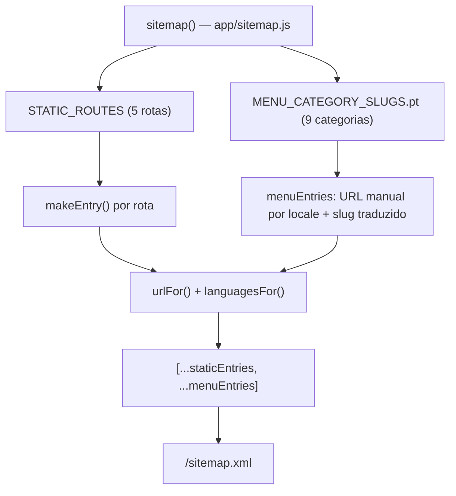
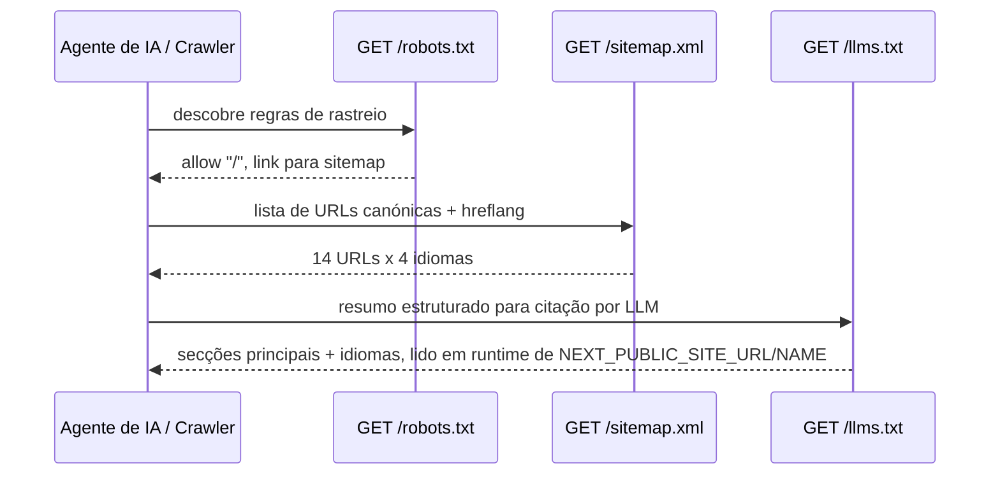

# Sitemap, Robots & llms.txt

O Pizzarte expõe três ficheiros de descoberta na raiz do site — `sitemap.xml`, `robots.txt` e `llms.txt` — cada um gerado dinamicamente por um route handler do App Router (`app/sitemap.js`, `app/robots.js`, `app/llms.txt/route.js`) em vez de servido como ficheiro estático. Isto significa que os três leem sempre `NEXT_PUBLIC_SITE_URL`/`NEXT_PUBLIC_SITE_NAME` em runtime, nunca ficando desatualizados em relação ao domínio real de deploy.

## Table of Contents
- [[SEO/Metadata & JSON-LD Builders]]
- [[SEO/Static Site Generation Strategy]]
- [[I18n/Locale Routing & Middleware]]
- [[index]]

## `app/sitemap.js` — o sitemap XML

Usa a convenção nativa do Next.js (`export default function sitemap()`), que o framework serve automaticamente em `/sitemap.xml`. A implementação combina rotas estáticas com rotas de categoria de menu geradas a partir de `i18n/routing.jsx`.

### Rotas estáticas

Um array `STATIC_ROUTES` define as cinco páginas fixas do site, cada uma com a sua prioridade e frequência de alteração:

| `pathname` | `priority` | `changeFrequency` |
|---|---|---|
| `/` | 1.0 | monthly |
| `/menu` | 0.8 | monthly |
| `/pizzarte` | 0.7 | yearly |
| `/galeria` | 0.6 | monthly |
| `/contactos` | 0.6 | yearly |

Cada entrada é construída por `makeEntry(pathnameKey, { priority, changeFrequency })`, que por sua vez chama dois helpers:
- `urlFor(pathnameKey, locale)` — resolve a URL absoluta de uma rota para um locale, usando `getPathname({ href: pathnameKey, locale })` de `i18n/navigation`, prefixado com `BASE_URL`.
- `languagesFor(pathnameKey)` — devolve um mapa `{ pt: url, en: url, fr: url, es: url }`, usado no campo `alternates.languages` de cada entrada do sitemap (o equivalente, dentro do sitemap, ao hreflang das páginas).

A `url` principal de cada entrada usa sempre `routing.defaultLocale` (ou seja, a versão `pt` sem prefixo), com `lastModified: new Date()` calculado no momento da geração do sitemap.

### Rotas de categoria de menu

Como o segmento `/menu/[slug]` é dinâmico e o slug varia por idioma (ver `MENU_CATEGORY_SLUGS` em `i18n/routing.jsx`), estas entradas não usam o mapa `pathnames` do next-intl — são construídas manualmente. `canonicalSlugs` é a lista de chaves canónicas (`Object.keys(MENU_CATEGORY_SLUGS.pt)`, ex: `entradas`, `saladas`, `massas`, `pizzas`, `bebidas`, etc.). Para cada slug canónico, o código percorre os quatro locales, resolve o slug traduzido correspondente e monta a URL manualmente com o prefixo de locale correto (`""` para `pt`, `/en`, `/fr`, `/es` para os restantes). Cada categoria entra no sitemap com `priority: 0.7` e `changeFrequency: "monthly"`.

O sitemap final é a concatenação `[...staticEntries, ...menuEntries]` — 5 páginas estáticas + 9 categorias de menu = 14 URLs canónicas (cada uma com as suas 4 variantes de idioma em `alternates.languages`).

> **Sources:** `app/sitemap.js:L1-L58`, `i18n/routing.jsx:L32-L80`

## `app/robots.js` — robots.txt

É a implementação mais simples dos três ficheiros: uma única regra `{ userAgent: "*", allow: "/" }` — o site permite indexação total, sem exclusões — mais os campos `sitemap` (apontando para `${BASE_URL}/sitemap.xml`) e `host` (o próprio `BASE_URL`). Tal como o sitemap, usa a convenção nativa do App Router (`export default function robots()`), servida automaticamente em `/robots.txt`.

> **Sources:** `app/robots.js:L1-L14`

## `app/llms.txt/route.js` — o ficheiro AIO (llmstxt.org)

Este é o único dos três que não usa a convenção de metadata do Next.js — é um route handler explícito (`export function GET()`) em `app/llms.txt/route.js`, que devolve texto simples (`Content-Type: text/plain; charset=utf-8`) através de `NextResponse`. O formato segue a convenção [llmstxt.org](https://llmstxt.org): um resumo em Markdown pensado para ser lido por agentes de IA/LLMs ao decidirem como citar o site — a peça central da estratégia de **AIO** (otimização on-page para IA) e **GEO** (visibilidade em respostas geradas por IA) do projeto.

Um comentário no código explica por que este ficheiro precisou de se tornar dinâmico: a versão estática original em `public/llms.txt`, herdada do starter, apontava para o nome de outro projeto ("Ponto Urbano") e para o domínio placeholder `example.pt` — porque um ficheiro estático nunca pode ler `NEXT_PUBLIC_SITE_URL` em runtime. Ao mover o ficheiro para um route handler, o conteúdo passa a refletir sempre o domínio e nome reais configurados via variáveis de ambiente.

O corpo do documento inclui:
- Um título (`# ${SITE_NAME}`) e uma linha de resumo em blockquote descrevendo a Pizzarte como "Restaurante de pizza e cozinha italiana em Aveiro, Portugal, desde 1989. Bar, esplanada e espaço para eventos."
- Um parágrafo de contexto adicional (capacidade para 200 pessoas, uso do espaço para eventos como torneios de xadrez, concertos e teatro).
- Uma secção `## Main sections` com links absolutos e descrição curta para Homepage, Menu, A Pizzarte, Galeria e Contactos.
- Uma secção `## Languages`, listando as quatro variantes de idioma com os respetivos prefixos de URL (`/`, `/en/`, `/fr/`, `/es/`).
- Uma secção `## Optional` apontando para o `/sitemap.xml`.

> **Sources:** `app/llms.txt/route.js:L1-L37`

## Relação entre os três ficheiros

Os três ficheiros formam a camada de "descoberta" do site: `robots.txt` diz a crawlers tradicionais o que podem indexar e onde está o sitemap; `sitemap.xml` enumera exaustivamente todas as combinações de rota × idioma (incluindo as 9 categorias de menu, cujos slugs traduzidos não aparecem em nenhum outro ficheiro de configuração de rotas); `llms.txt` resume o mesmo conteúdo em prosa legível por um agente de IA, sem depender de rastreio de HTML. Todos os três partilham a mesma fonte de verdade de idiomas e rotas — `i18n/routing.jsx` — evitando que uma categoria de menu nova fique presente no sitemap mas ausente do `llms.txt`, ou vice-versa (ver também [[SEO/Metadata & JSON-LD Builders]] para o schema.org/Menu que espelha a mesma estrutura de categorias).

> **Sources:** `app/sitemap.js:L1-L58`, `app/robots.js:L1-L14`, `app/llms.txt/route.js:L1-L37`, `i18n/routing.jsx:L1-L89`

---
*[[index|← Back to Index]] · Generated by repowiki*
