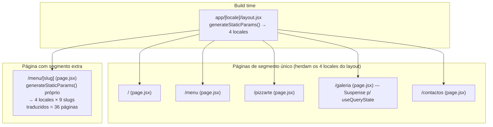
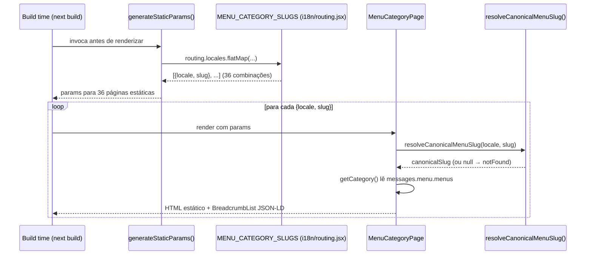

# Static Site Generation Strategy

O site Pizzarte foi migrado de Gatsby 5 (100% estático, com geração de páginas em `gatsby-node.js`) para o App Router do Next.js 16. Para manter o mesmo perfil de performance e SEO — todas as páginas pré-renderizadas em build, sem espera por dados em runtime — o projeto reconstrói esse comportamento com `generateStaticParams`, combinado com `setRequestLocale` do next-intl e caching explícito das traduções.

## Table of Contents
- [[SEO/Metadata & JSON-LD Builders]]
- [[SEO/Sitemap, Robots & llms.txt]]
- [[I18n/Locale Routing & Middleware]]
- [[Architecture/App Router & Layout Composition]]
- [[Architecture/Caching with 'use cache']]
- [[index]]

## O segmento `[locale]` — a base de tudo

Toda a árvore de rotas do site vive sob `app/[locale]/`. Sem `generateStaticParams` neste nível, nenhuma rota da árvore poderia ser pré-renderizada estaticamente — um comentário no código é explícito: "o Gatsby original era 100% estático; o starter não tinha `generateStaticParams` nenhum". `app/[locale]/layout.jsx` resolve isto com a implementação mais simples possível:

```js
export function generateStaticParams() {
  return routing.locales.map((locale) => ({ locale }));
}
```

Isto enumera os quatro locales definidos em `i18n/routing.jsx` (`pt`, `en`, `fr`, `es`, com `pt` como `defaultLocale` e `localePrefix: "as-needed"` — ou seja, `pt` nunca leva prefixo de URL, os outros três levam `/en`, `/fr`, `/es`). Dentro do layout, se o locale recebido não constar de `routing.locales`, `hasLocale` falha e a rota chama `notFound()`.

O layout também carrega as mensagens de tradução via `getCachedMessages(locale)` (de `lib/cache.jsx`), que usa a diretiva `"use cache"` do Next.js com `cacheLife("hours")` e `cacheTag(`messages-${locale}`)` — as traduções de cada locale ficam em cache por várias horas e podem ser invalidadas seletivamente por tag. Este é o único ponto do projeto onde o carregamento de mensagens passa por uma cache explícita; as páginas individuais (`/`, `/menu`, `/pizzarte`, etc.) chamam `getMessages()` diretamente do next-intl, sem essa camada.

> **Sources:** `app/[locale]/layout.jsx:L25-L39`, `i18n/routing.jsx:L9-L30`, `lib/cache.jsx:L1-L9`

## Páginas com um único segmento dinâmico (`[locale]`)

As cinco páginas estáticas do site — `/`, `/menu`, `/pizzarte`, `/galeria`, `/contactos` — **não** definem o seu próprio `generateStaticParams`. Isto é suficiente porque o único segmento dinâmico no seu caminho é `[locale]`, já enumerado pelo layout pai. O Next.js propaga os parâmetros estáticos do layout para as páginas filhas que partilham o mesmo segmento, gerando as quatro variantes de idioma de cada uma destas páginas em build.

Todas seguem o mesmo padrão em `generateMetadata`: recebem `{ locale }` de `await params`, e devolvem metadata via `Seo(...)` ou `SeoFromData(...)` (ver [[SEO/Metadata & JSON-LD Builders]]). No corpo da página, todas chamam `setRequestLocale(locale)` antes de qualquer `getMessages()` — a API do next-intl que permite ao React Server Components saber, em tempo de build/render estático, qual o locale ativo, o que é necessário para que `generateStaticParams` produza de facto HTML estático por locale em vez de cair em renderização dinâmica.

Um caso especial é `app/[locale]/galeria/page.jsx`: o filtro de galeria usa `useQueryState` (nuqs), que lê `useSearchParams()`. Para que a página continue elegível para pré-renderização estática sob o modelo PPR (Partial Prerendering) do Next 16, o componente `GalleryFilter` é envolvido em `<Suspense fallback={null}>` — sem isso, a leitura de search params forçaria toda a página a renderização dinâmica.



> **Sources:** `app/[locale]/page.jsx:L11-L14`, `app/[locale]/menu/page.jsx:L7-L12`, `app/[locale]/pizzarte/page.jsx:L12-L17`, `app/[locale]/galeria/page.jsx:L8-L13,L30-L34`, `app/[locale]/contactos/page.jsx:L8-L11`

## `/menu/[slug]` — o produto cartesiano locale × slug traduzido

Esta é a única rota do site com um segundo segmento dinâmico, e por isso a única página (além do layout) que define o seu próprio `generateStaticParams`:

```js
export function generateStaticParams() {
  return routing.locales.flatMap((locale) =>
    Object.values(MENU_CATEGORY_SLUGS[locale]).map((slug) => ({ locale, slug }))
  );
}
```

Um comentário no código situa isto historicamente: esta função "substitui a geração de páginas de `gatsby-node.js`" e corrige, de passagem, o que é identificado como "Bug #6 do plano de migração" — o Gatsby original gerava sempre `/{lang}/menu/{slugPT}`, ou seja, nunca traduzia o slug de categoria fora de português. Na versão Next.js, cada locale gera o seu próprio slug traduzido a partir de `MENU_CATEGORY_SLUGS` (definido em `i18n/routing.jsx`): por exemplo, a categoria canónica `entradas` gera o slug `entradas` em `pt`/`es`, mas `starters` em `en`. Como `MENU_CATEGORY_SLUGS` tem 9 categorias canónicas por locale (`entradas`, `saladas`, `massas`, `les-crepes-salees`, `les-crepes-wrap`, `pizzas`, `panne-di-pizza`, `sobremesas`, `bebidas`), o resultado é **4 × 9 = 36 páginas estáticas** só para categorias de menu.

Em runtime (ou melhor, em build, durante a geração estática de cada uma destas 36 páginas), a função `getCategory(locale, slug)` resolve o slug recebido de volta ao slug canónico através de `resolveCanonicalMenuSlug(locale, slug)` — a função inversa de `MENU_CATEGORY_SLUGS`, definida também em `i18n/routing.jsx`, que percorre as entradas do dicionário do locale à procura do valor que corresponde ao slug traduzido. Se não encontrar correspondência, `getCategory` devolve `null` e a página chama `notFound()`.

`generateMetadata` desta página reconstrói manualmente o `alternatePaths` (um objeto `{ pt: caminho, en: caminho, ... }`) para todos os quatro locales, de modo a que o `SeoFromData` consiga montar as tags `hreflang`/`alternates.languages` corretas mesmo sem uma entrada no mapa `pathnames` do next-intl (que não cobre segmentos dinâmicos data-driven). É o mesmo padrão de slug traduzido usado por `app/sitemap.js` (ver [[SEO/Sitemap, Robots & llms.txt]]).



> **Sources:** `app/[locale]/menu/[slug]/page.jsx:L1-L97`, `i18n/routing.jsx:L32-L89`

## Por que isto importa para SEO/GEO

A pré-renderização estática de todas as combinações locale × página × categoria significa que **nenhum crawler ou agente de IA precisa de executar JavaScript ou esperar por uma resposta de API** para ver o conteúdo completo de qualquer página do site — incluindo o schema.org/Menu completo (ver [[SEO/Metadata & JSON-LD Builders]]) e os breadcrumbs. Isto alinha-se diretamente com os princípios documentados na base de conhecimento de SEO/GEO/AIO da agência (`docs/00 - Home.md`): a era atual de pesquisa (2023-2026, "Era da IA Generativa") depende de conteúdo que motores generativos como ChatGPT, Gemini e Perplexity conseguem indexar e citar sem fricção técnica — e HTML estático, servido integralmente no primeiro request, é a forma mais fiável de garantir isso.

> **Sources:** `docs/00 - Home.md:L105-L129`, `app/[locale]/layout.jsx:L25-L30`, `app/[locale]/menu/[slug]/page.jsx:L29-L36`

---
*[[index|← Back to Index]] · Generated by repowiki*
