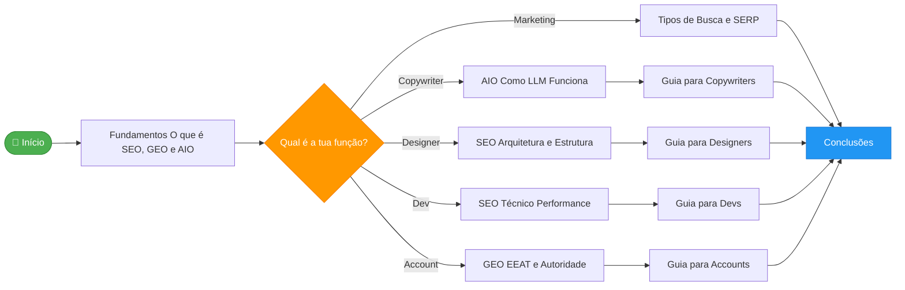
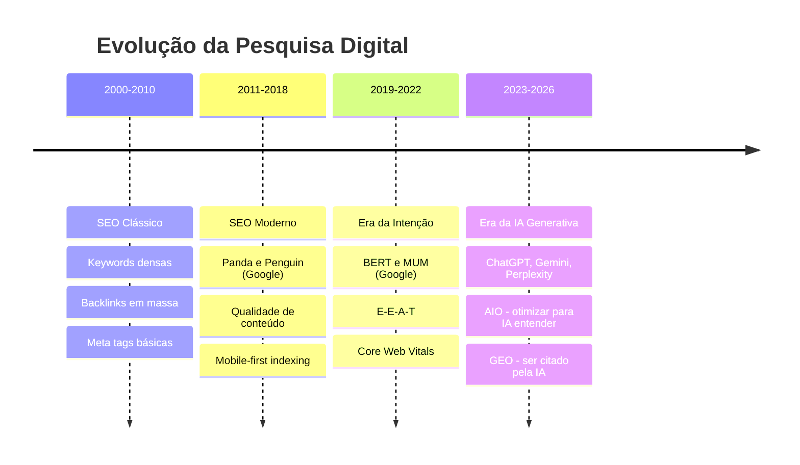

# SEO · GEO · AIO — Base de Conhecimento da Agência

> **Objetivo:** Nivelar toda a equipa — marketing, copywriters, designers, accounts e devs — com os melhores métodos atuais de SEO, GEO e AIO para websites de alta performance.

---

## O que vais encontrar aqui

Esta wiki cobre os três pilares da visibilidade digital moderna:

| Pilar | O que otimiza | Para quem |
|-------|--------------|-----------|
| **SEO** | Motores de pesquisa tradicionais (Google, Bing) | Toda a equipa |
| **AIO** | Compreensão do conteúdo por IA on-page | Copywriters, Devs |
| **GEO** | Citações e referências em respostas de IA | Toda a equipa |

---

## Mapa de Navegação

```
📚 Base de Conhecimento
│
├── 🟡 01 - Fundamentos
│   ├── O que é SEO, GEO e AIO
│   ├── Diferenças entre SEO, AIO e GEO
│   └── Evolução da Pesquisa Digital
│
├── 🔵 02 - SEO
│   ├── SEO - Overview
│   ├── SEO Técnico
│   ├── Rastreamento (Crawling)
│   ├── Indexação
│   ├── Arquitetura e Estrutura da Página
│   ├── Performance Técnica
│   ├── Conteúdo e Taxonomia
│   └── Robots e Sitemap
│
├── 🟣 03 - AIO
│   ├── Como uma LLM Funciona
│   ├── Processo de Ranking das IA
│   └── Otimização On-Page para IA
│
├── 🟢 04 - GEO
│   ├── GEO - Overview
│   ├── Off-page e Backlinks
│   ├── 3 Pilares Fundamentais do GEO
│   ├── EEAT e Autoridade
│   └── Como Medir o GEO
│
├── 🟠 05 - Dados Estruturados
│   ├── Dados Estruturados - Overview
│   └── Schema Markup - Tipos e Implementação
│
├── ⚪ 06 - Tipos de Busca
│   ├── Tipos de Busca e SERP
│   └── Intenção de Busca
│
├── 👥 07 - Guias por Função
│   ├── Guia para Copywriters
│   ├── Guia para Designers
│   ├── Guia para Devs
│   └── Guia para Accounts
│
└── ✅ 08 - Conclusões
    └── Conclusões e Síntese Final
```

---

## Fluxo de Leitura Recomendado



---

## Visão Geral Rápida

### O que mudou no mundo da pesquisa



---

## Conceitos-Chave

> [!tip] **Regra de Ouro**
> O conteúdo deve responder perguntas reais, de forma clara, estruturada e confiável — tanto para humanos como para máquinas.

> [!info] **Para a equipa toda lembrar**
> A IA não "lê" da mesma forma que o Google. A IA procura **entidades**, **autoridade semântica** e **contexto consistente**. Não basta rankear — é preciso ser **citado**.

---

## Links Rápidos por Função

| Função         | Ficheiros Prioritários                                                                                                                                                                                                        |
| -------------- | ----------------------------------------------------------------------------------------------------------------------------------------------------------------------------------------------------------------------------- |
| **Copywriter** | [[01 - Fundamentos/O que é SEO, GEO e AIO\|Fundamentos]] → [[03 - AIO/Como uma LLM Funciona\|Como LLM Funciona]] → [[07 - Guias por Função/Guia para Copywriters\|Guia Copywriter]]                                           |
| **Designer**   | [[01 - Fundamentos/O que é SEO, GEO e AIO\|Fundamentos]] → [[02 - SEO/Arquitetura e Estrutura da Página\|Arquitetura]] → [[07 - Guias por Função/Guia para Designers\|Guia Designer]]                                         |
| **Dev**        | [[02 - SEO/SEO Técnico\|SEO Técnico]] → [[02 - SEO/Performance Técnica\|Performance]] → [[05 - Dados Estruturados/Schema Markup - Tipos e Implementação\|Schema Markup]] → [[07 - Guias por Função/Guia para Devs\|Guia Dev]] |
| **Account**    | [[04 - GEO/EEAT e Autoridade\|EEAT]] → [[04 - GEO/Como Medir o GEO\|Métricas GEO]] → [[07 - Guias por Função/Guia para Accounts\|Guia Account]]                                                                               |
| **Marketing**  | [[06 - Tipos de Busca/Tipos de Busca e SERP\|Tipos de Busca]] → [[04 - GEO/GEO - Overview\|GEO Overview]] → [[08 - Conclusões/Conclusões e Síntese Final\|Conclusões]]                                                        |
