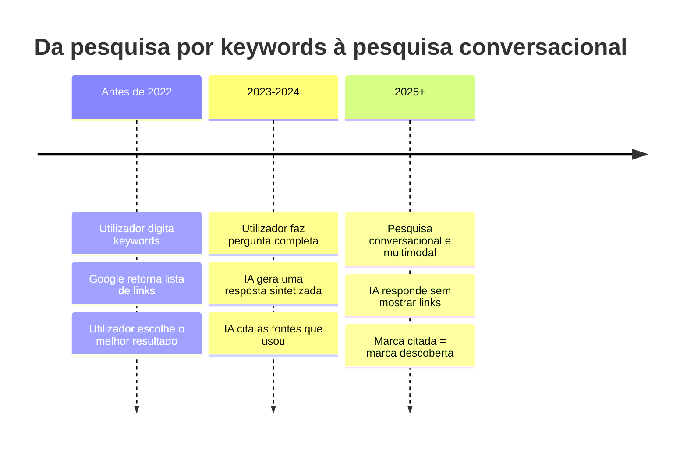
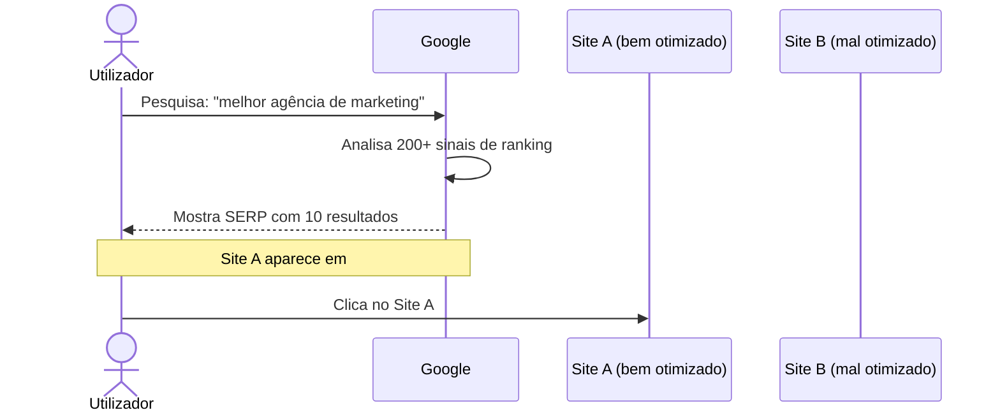
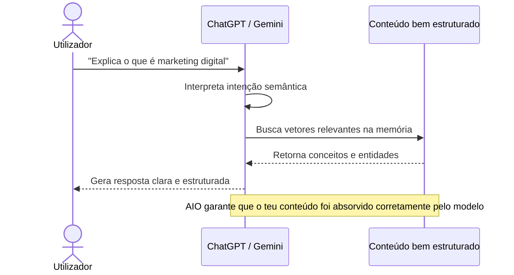
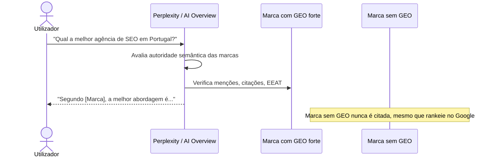
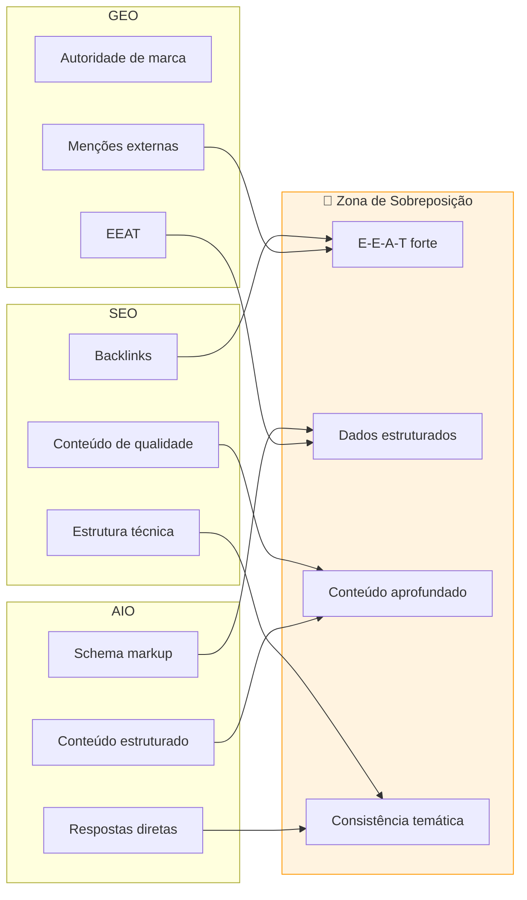
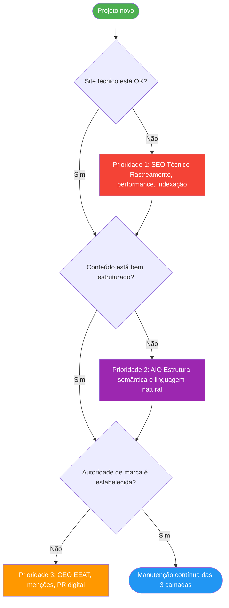

# Diferenças entre SEO, AIO e GEO

> [!abstract] **Resumo**
> Não são concorrentes — são camadas complementares. Um site bem otimizado precisa das três, aplicadas em conjunto.

---

## A Mudança de Paradigma

---

## Diferença Central

### SEO — Otimizar para motores de pesquisa tradicionais

### AIO — Otimizar para a IA compreender o conteúdo

### GEO — Otimizar para ser citado pela IA

---

## Tabela Comparativa Completa

| Dimensão | SEO | AIO | GEO |
|----------|-----|-----|-----|
| **Objetivo** | Aparecer em rankings | Ser compreendido pela IA | Ser citado pela IA |
| **Motor alvo** | Google, Bing | GPT, Gemini, Claude | Perplexity, AI Overview, ChatGPT |
| **Tipo de resultado** | Posição na SERP | Featured snippet / zero position | Menção na resposta gerada |
| **Principal foco** | Técnico + keywords | Semântico + estrutura | Autoridade + reputação |
| **On-page ou Off-page** | Ambos | On-page | Principalmente Off-page |
| **Métricas** | CTR, posição, impressões | Snippet coverage, zero-click | Citation share, mention share |
| **Velocidade de impacto** | 3-6 meses | 1-3 meses | 6-12 meses |
| **Papel do backlink** | Muito importante | Menos relevante | Menção contextual > link puro |
| **Responsável principal** | Dev + Copywriter | Copywriter | Account + Marketing |

---

## Onde se Sobrepõem

---

## Analogia Prática

> [!example] **Imagina um restaurante:**
>
> - **SEO** = Estar bem posicionado no Google Maps quando alguém pesquisa "restaurante italiano Lisboa"
> - **AIO** = A descrição do restaurante é tão clara e bem estruturada que o ChatGPT entende exatamente o que ofereces, cuisine, preços e ambiente
> - **GEO** = Quando alguém pergunta ao ChatGPT "Onde jantar bem em Lisboa?", o teu restaurante é **citado** como recomendação

---

## Qual aplicar primeiro?

---

## Checklist de Diagnóstico Rápido

### SEO está OK?
- [ ] Google Search Console sem erros críticos
- [ ] Páginas indexadas (não bloqueadas por robots.txt)
- [ ] Core Web Vitals a verde
- [ ] Site Mobile-first
- [ ] URLs limpas e hierárquicas

### AIO está OK?
- [ ] Conteúdo responde perguntas reais (Quem? O quê? Como? Porquê?)
- [ ] H2 e H3 como perguntas diretas
- [ ] Schema markup implementado
- [ ] Linguagem natural e conversacional
- [ ] Primeira frase de cada secção responde diretamente

### GEO está OK?
- [ ] Página "sobre nós" robusta com entidade clara
- [ ] Menções em sites externos relevantes
- [ ] Citações em artigos do setor
- [ ] Perfil Google My Business atualizado
- [ ] Presença em diretórios de nicho

---

## Ver também

- [[O que é SEO, GEO e AIO]] — definições e conceitos base
- [[Evolução da Pesquisa Digital]] — contexto histórico
- [[../04 - GEO/EEAT e Autoridade|EEAT e Autoridade]] — aprofundamento
- [[../06 - Tipos de Busca/Tipos de Busca e SERP|Tipos de Busca e SERP]] — onde cada um aparece
