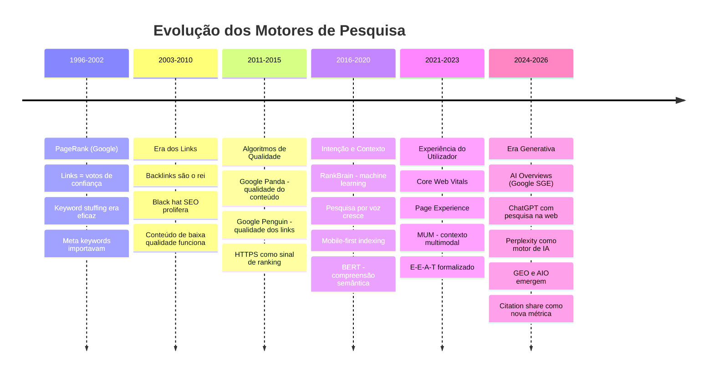
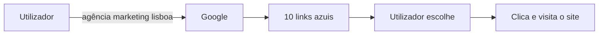
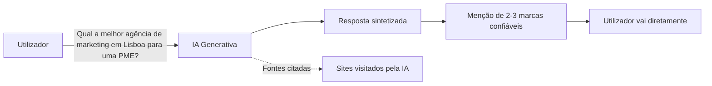
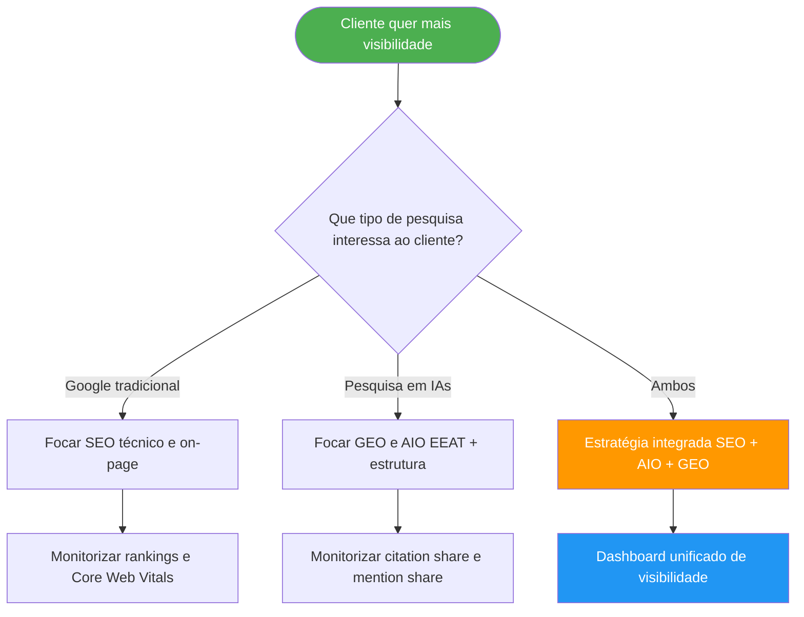

# Evolução da Pesquisa Digital

> [!abstract] **Porquê isto importa**
> Compreender como chegámos aqui ajuda a perceber porque é que as táticas de SEO de 2015 já não bastam — e porque o GEO e AIO são urgentes agora.

---

## A Linha do Tempo



---

## Mudanças Estruturais no Comportamento de Pesquisa

### Antes (SEO clássico)



### Agora (Era da IA)



> [!warning] **O risco do zero-click**
> Em 2024, mais de 65% das pesquisas no Google terminam sem um clique. A IA retorna a resposta diretamente. Se não fores citado, **não existes para esse utilizador**.

---

## Os Grandes Marcos do Google

| Atualização | Ano | Impacto |
|-------------|-----|---------|
| **Panda** | 2011 | Penalizou conteúdo de baixa qualidade e thin content |
| **Penguin** | 2012 | Penalizou link building artificial e spam de links |
| **Hummingbird** | 2013 | Foco na intenção da pesquisa, não apenas keywords |
| **Mobilegeddon** | 2015 | Sites mobile-friendly recebem boost |
| **RankBrain** | 2015 | Primeiro uso de machine learning para ranking |
| **BERT** | 2019 | Compreensão contextual e semântica do conteúdo |
| **Core Web Vitals** | 2021 | Performance UX como sinal de ranking oficial |
| **MUM** | 2021 | Compreensão multimodal (texto + imagem + vídeo) |
| **Helpful Content** | 2022 | Conteúdo feito para humanos, não para algoritmos |
| **AI Overviews** | 2024 | Google passa a gerar respostas com IA antes dos links |

---

## A Nova Concorrência

### Antes: Concorrência na SERP

```
Posição 1: Empresa A ← meta: chegar aqui
Posição 2: Empresa B
Posição 3: Empresa C
...
Posição 10: Empresa J
```

### Agora: Concorrência na Citação

```
AI Overview (Google): "Segundo [Empresa A] e [Empresa C]..."
    → Empresa B rankeia #2 mas nunca é citada → invisível

ChatGPT resposta: "[Empresa A] é conhecida por..."
    → Empresa A tem GEO forte → existe na IA
```

> [!info] **Tipos de concorrentes agora**
> - **Concorrentes de negócios** — Empresas que vendem o mesmo produto/serviço
> - **Concorrentes de keyword** — Sites que dominam a SERP (ex: Wikipedia, Quora)
> - **Concorrentes de autoridade** — Sites que a IA usa como fontes confiáveis

---

## O que isto significa para a agência



---

## Ver também

- [[O que é SEO, GEO e AIO]] — definições práticas
- [[Diferenças entre SEO, AIO e GEO]] — como se complementam
- [[../04 - GEO/EEAT e Autoridade|EEAT e Autoridade]] — o framework de confiança do Google/IA
