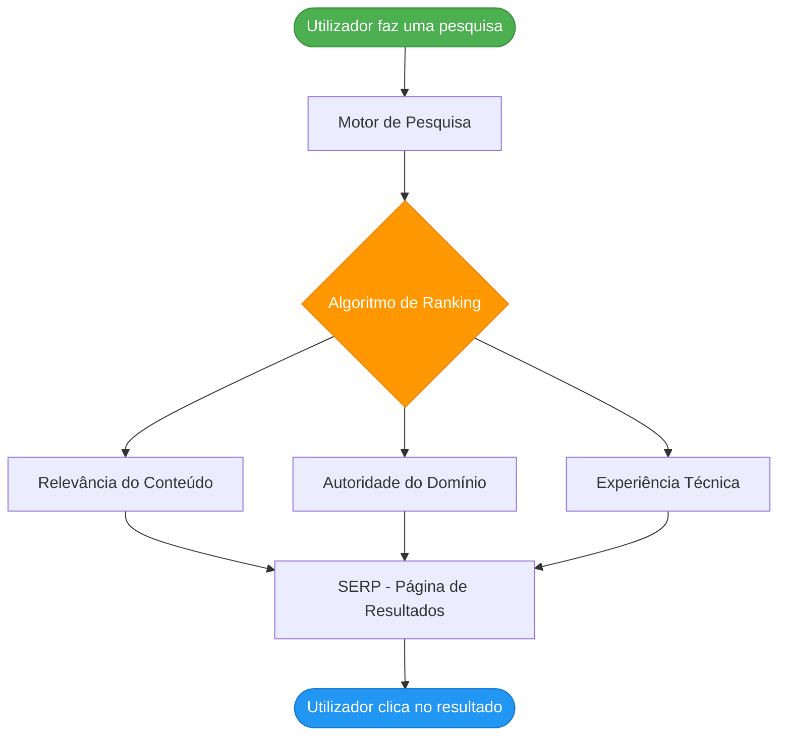
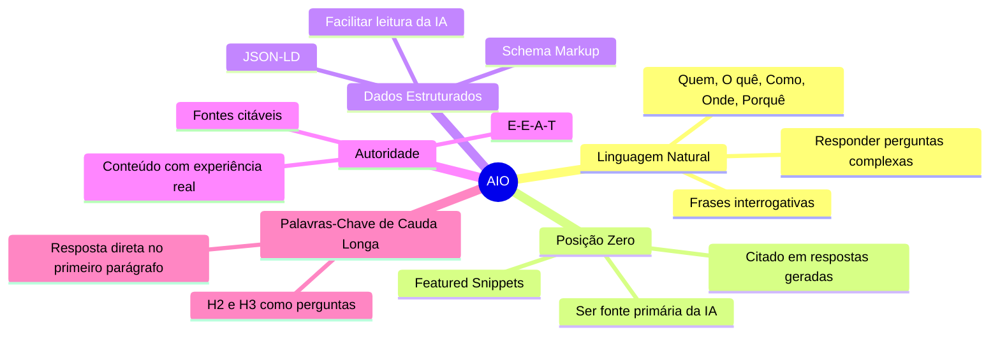
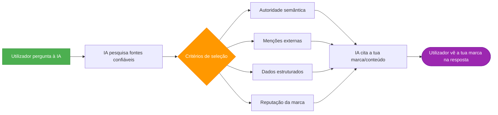
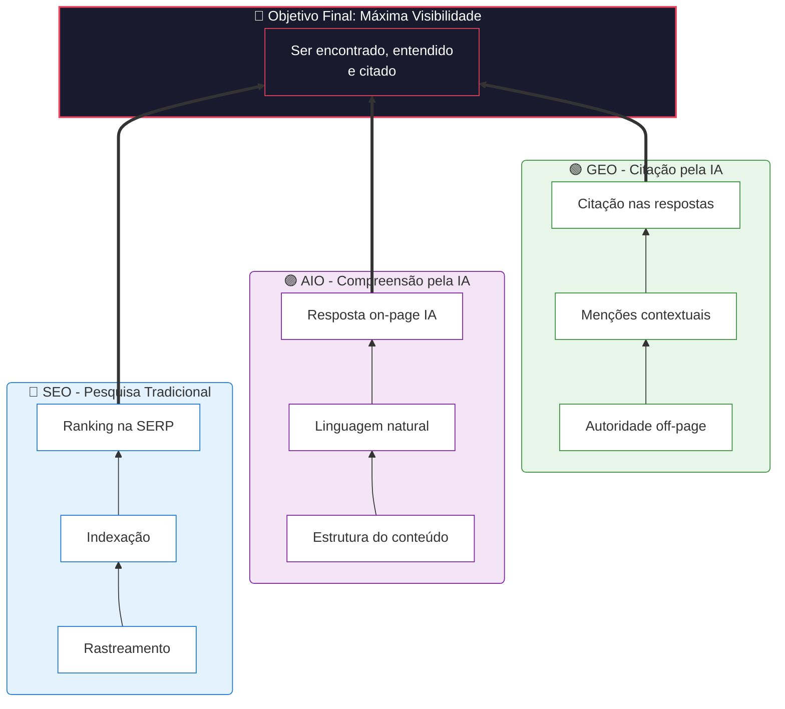

# O que é SEO, GEO e AIO

> [!abstract] **Em resumo**
> SEO, GEO e AIO são as três camadas da visibilidade digital moderna. Cada uma serve um tipo diferente de motor de descoberta — e hoje, precisas das três.

---

## SEO — Search Engine Optimization

**Definição:** Conjunto de técnicas para otimizar um site e o seu conteúdo de forma a aparecer nos primeiros resultados dos motores de pesquisa tradicionais (Google, Bing, etc.).

### Como funciona

### Os 3 Pilares do SEO

| Pilar | O que cobre | Responsável |
|-------|-------------|-------------|
| **SEO Técnico** | Rastreamento, indexação, performance, mobile | Dev |
| **SEO On-Page** | Conteúdo, palavras-chave, estrutura de H1-H6, meta tags | Copywriter + Dev |
| **SEO Off-Page** | Backlinks, menções, autoridade de domínio | Account + Marketing |

---

## AIO — AI (Content) Optimization

**Definição:** Técnicas para estruturar o conteúdo de forma a que modelos de linguagem (LLMs) como ChatGPT, Gemini e Claude o compreendam, processem e utilizem melhor nas suas respostas.

> [!info] **AIO ≠ SEO**
> O SEO otimiza para algoritmos de ranking. O AIO otimiza para **compreensão semântica** por parte de um modelo de linguagem.

### O que o AIO aborda

---

## GEO — Generative Engine Optimization

**Definição:** Evolução do SEO focada em garantir que uma marca, produto ou conteúdo seja **citado e recomendado** nas respostas geradas por IAs como ChatGPT, Perplexity, Google AI Overview, Gemini, etc.

> [!warning] **A grande mudança**
> No SEO clássico, o objetivo é **rankear**. No GEO, o objetivo é **ser citado**. A IA não mostra uma lista de links — ela sintetiza uma resposta e escolhe as suas fontes.

### Como o GEO funciona

### Os 3 Pilares do GEO

| Pilar | Descrição | Como aplicar |
|-------|-----------|--------------|
| **Presença** | Aparições externas e menções | PR digital, diretórios, entrevistas |
| **Profundidade** | Dados, evidências e estudos originais | Conteúdo baseado em dados reais |
| **Posicionamento** | Clareza da especialidade da marca | Página "sobre nós" robusta, bio do fundador |

---

## Visão Unificada: SEO + AIO + GEO

---

## Comparação Rápida

| Dimensão | SEO | AIO | GEO |
|----------|-----|-----|-----|
| **Foco** | Rankings no Google | Compreensão pela IA | Citações em respostas IA |
| **Motor alvo** | Google, Bing, Yahoo | ChatGPT, Gemini, Claude | Perplexity, ChatGPT, AI Overview |
| **Tipo de resultado** | Lista de links | Featured snippets, resposta on-page | Menção direta na resposta |
| **Métrica principal** | Posição no ranking | CTR no snippet zero | Citation Share / Mention Share |
| **Tipo de conteúdo** | Keywords + relevância | Perguntas + respostas claras | Autoridade + dados originais |
| **Off-page** | Backlinks quantitativos | Menos relevante | Menções semânticas contextuais |

---

## Próximos Passos

- [[Diferenças entre SEO, AIO e GEO]] — análise detalhada das diferenças
- [[../02 - SEO/SEO - Overview|SEO - Overview]] — como o SEO funciona em profundidade
- [[../03 - AIO/Como uma LLM Funciona|Como uma LLM Funciona]] — o mecanismo por trás do AIO
- [[../04 - GEO/GEO - Overview|GEO - Overview]] — como o GEO funciona na prática
