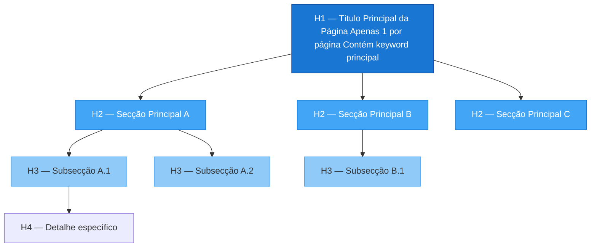
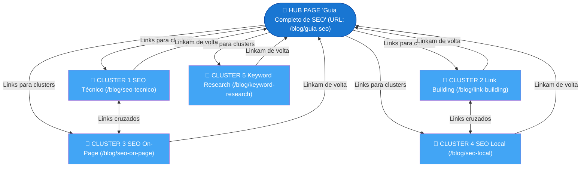
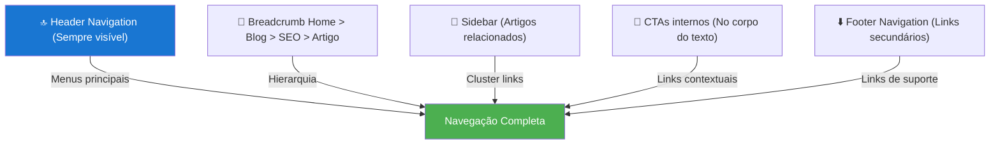

# Arquitetura e Estrutura da Página

> [!abstract] **Princípio base**
> Quanto mais curta e clara for a URL, e mais lógica for a hierarquia de navegação, melhor para o crawler, para a IA e para o utilizador.

---

## Estrutura de URLs

### Anatomia de uma URL ideal

```
https://www.agencia.pt/blog/seo/seo-tecnico-guia-completo
         ──────────────  ─────  ─────────────────────────
         Domínio         Pasta  Slug descritivo
```

### Comparação URL boa vs má

| URL Má | URL Boa | Porquê |
|--------|---------|--------|
| `agencia.pt/p?id=123` | `agencia.pt/servicos/seo` | Legível e descritiva |
| `agencia.pt/categoria/subcategoria/sub-subcategoria/artigo` | `agencia.pt/blog/seo-tecnico` | Arquitetura rasa |
| `agencia.pt/Artigo_SEO_2024_v2_FINAL` | `agencia.pt/blog/guia-seo` | Sem versões ou datas |
| `agencia.pt/blog/o-que-e-o-seo-e-como-funciona-em-2025` | `agencia.pt/blog/o-que-e-seo` | Slug conciso |
| `agencia.pt/blog/SEO-Marketing` | `agencia.pt/blog/seo-marketing` | Sempre minúsculas |

### Regras para URLs

- [ ] **Minúsculas** — sem letras maiúsculas
- [ ] **Hífens** como separadores (não underscores `_`)
- [ ] **Sem parâmetros** nas páginas principais (`?utm_source=...` não indexar)
- [ ] **Máximo 3-4 níveis de profundidade**
- [ ] **Palavras-chave** no slug
- [ ] **Sem datas** para conteúdo evergreen
- [ ] **Sem stopwords** desnecessárias (`de`, `e`, `o`, `a`)

---

## Hierarquia de Headings (H1–H6)



### Regras de Headings para SEO + AIO

| Heading | Uso | Regra |
|---------|-----|-------|
| **H1** | Título principal da página | 1 por página, keyword principal |
| **H2** | Secções principais | 3-6 por página, keywords secundárias |
| **H3** | Subsecções, ideal como **perguntas** | Excelente para AIO e PAA |
| **H4-H6** | Detalhes muito específicos | Usar com moderação |

> [!tip] **H2/H3 como perguntas = AIO + PAA**
> Usar H3 como perguntas (ex: "Como otimizar para SEO técnico?") ajuda o Google a usar a resposta no bloco **People Also Ask** e a IA a extrair a resposta diretamente.

### Exemplo de estrutura de artigo ideal

```markdown
# O que é SEO Técnico e Como Implementar (H1)

## O que é SEO Técnico? (H2 — define o tema)
Parágrafo de resposta direta...

## Como funciona o rastreamento? (H2 — pergunta)
Explicação...

### Quais são os erros mais comuns no rastreamento? (H3 — sub-pergunta)
Lista de erros...

## Como melhorar a performance do site? (H2 — pergunta)
Explicação...

### O que são Core Web Vitals? (H3 — sub-pergunta)
Explicação detalhada...
```

---

## Modelo Hub-Cluster em Detalhe



### Benefícios do modelo Hub-Cluster

| Benefício | Explicação |
|-----------|-----------|
| **Autoridade temática** | O Google reconhece o site como especialista no tema |
| **Distribuição de PageRank** | Links internos distribuem autoridade entre páginas |
| **Rastreamento eficiente** | Caminhos claros para o Googlebot |
| **AIO-friendly** | A IA entende o grafo de conhecimento do site |
| **UX melhorada** | Utilizadores encontram conteúdo relacionado facilmente |

---

## Navegação Clara

### Estrutura de navegação ideal



### Prioridades de navegação mobile

> [!important] **O Google avalia o mobile primeiro**
> A navegação no mobile deve ser:
> - Menu hamburger funcional e acessível
> - Links com mínimo 48px de área de toque
> - Sem elementos que bloqueiem o conteúdo (popups agressivos)
> - Scroll suave, sem jank visual

---

## Checklist Arquitetura e Estrutura

### URLs
- [ ] URLs em minúsculas com hífens
- [ ] Máximo 3-4 níveis de profundidade
- [ ] Slug descritivo com keyword
- [ ] Sem parâmetros nas páginas principais

### Headings
- [ ] Apenas 1 H1 por página
- [ ] H2 para secções principais
- [ ] H3 como perguntas (AIO-friendly)
- [ ] Não saltar níveis (H1 → H3 sem H2)

### Links Internos
- [ ] Hub pages linkam para clusters
- [ ] Clusters linkam de volta para o hub
- [ ] Texto âncora descritivo (não "clica aqui")
- [ ] Páginas orfãs eliminadas

### Navegação
- [ ] Menu principal claro e hierárquico
- [ ] Breadcrumbs em subcategorias e artigos
- [ ] Footer com links para páginas importantes
- [ ] Todas as páginas a máximo 3 cliques da homepage

---

## Ver também

- [[SEO Técnico]] — rastreamento e indexação
- [[Performance Técnica]] — velocidade e Core Web Vitals
- [[Robots e Sitemap]] — controlar o rastreamento
- [[../05 - Dados Estruturados/Dados Estruturados - Overview|Dados Estruturados]] — schema markup para breadcrumbs
