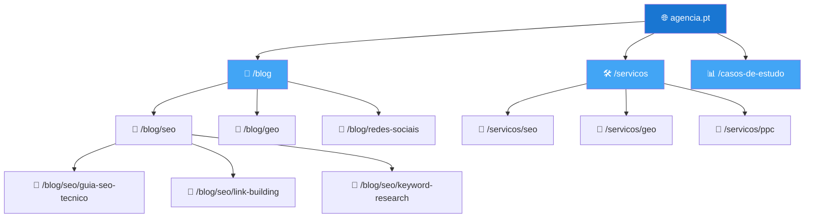
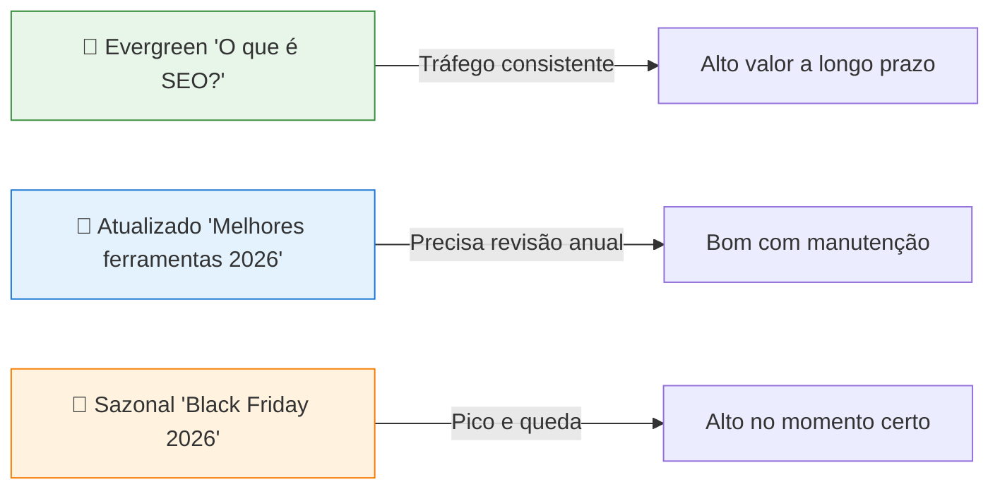
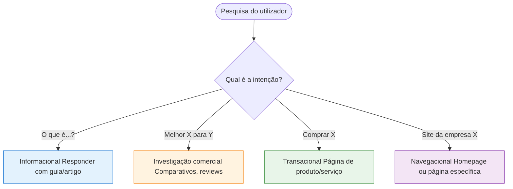
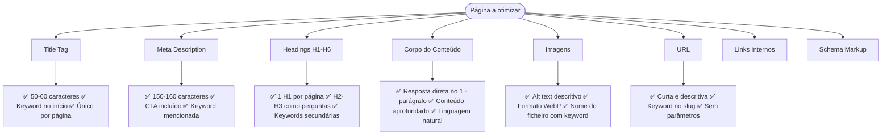

# Conteúdo e Taxonomia

> [!abstract] **Princípio fundamental**
> Conteúdo de qualidade para SEO é aquele que satisfaz a **intenção de pesquisa** do utilizador, responde completamente à sua questão e é estruturado de forma que tanto humanos como máquinas o compreendam facilmente.

---

## Taxonomia de Conteúdo

A taxonomia define **como o conteúdo é organizado** em categorias, subcategorias, tags e relações entre páginas.

### Estrutura Hierárquica



### Por que a taxonomia importa

| Benefício | Impacto em SEO | Impacto em AIO/GEO |
|-----------|---------------|-------------------|
| Organização clara | Caminhos óbvios para o crawler | IA entende o grafo de conhecimento do site |
| URLs lógicas | Keyword no URL = sinal de relevância | Entidade bem definida por pasta/categoria |
| Breadcrumbs | Rich result no SERP | Contexto hierárquico para a IA |
| Links internos | Distribui PageRank | Fortifica autoridade temática |
| Conteúdo agrupado | Autoridade de tema | Especialização semântica reconhecida |

---

## Tipos de Conteúdo

### 1. Conteúdo Evergreen

> Conteúdo que **não expira** — não depende da data e continua relevante ao longo do tempo.



**Exemplos de evergreen:**
- "O que é [conceito]?"
- "Como fazer [tarefa]?"
- "Guia completo de [tema]"
- "Diferença entre X e Y"

**Exemplos não-evergreen:**
- "Melhores ferramentas de 2024"
- "Novidades Google de julho"
- "Promoção de verão"

### 2. Mix de Conteúdo Recomendado

| Tipo | % do plano de conteúdo | Objetivo |
|------|----------------------|----------|
| **Evergreen** | 60-70% | Tráfego orgânico a longo prazo |
| **Atualizado periodicamente** | 20-30% | Manter freshness e relevância |
| **Sazonal** | 10% | Capitalizar picos de procura |

---

## Pesquisa de Palavras-Chave

### Tipos de Keywords

| Tipo | Exemplo | Volume | Concorrência | Conversão |
|------|---------|--------|-------------|-----------|
| **Head (cauda curta)** | "SEO" | Muito alto | Muito alta | Baixa |
| **Meio** | "SEO para empresas" | Médio | Média | Média |
| **Cauda longa** | "como melhorar SEO site pequena empresa" | Baixo | Baixa | Alta |
| **Conversacional/IA** | "Qual a melhor agência SEO para PMEs em Portugal?" | Crescente | Baixa | Alta |

> [!tip] **Em 2026, priorizar cauda longa e conversacional**
> Com a ascensão das IAs, as pesquisas conversacionais cresceram exponencialmente. Conteúdo que responde perguntas completas captura tanto o SEO como o AIO.

### Intenção de Pesquisa



### Erros comuns de intenção

| Erro | Exemplo | Consequência |
|------|---------|-------------|
| Conteúdo informacional em página transacional | Artigo num produto | Alta bounce rate |
| Página de produto para pesquisa informacional | "O que é SEO" → página de serviço | Não rankeia |
| Ignorar intenção local | "agência SEO" sem geolocalização | Perde tráfego local |

---

## Otimização On-Page

### Checklist de On-Page SEO



### Title Tag — Boas Práticas

| ✅ Boa Title Tag | ❌ Má Title Tag |
|-----------------|----------------|
| `SEO Técnico: Guia Completo para 2026 \| Agência` | `Página 1 - Blog` |
| `Como Melhorar o Ranking no Google em 5 Passos` | `SEO SEO SEO marketing digital agência Lisboa` |
| `Agência de Marketing Digital Lisboa \| Nome` | `Untitled Document` |
| `O que é GEO? Guia para Iniciantes` | `O que é Generative Engine Optimization ou GEO em 2025 e 2026 e como funciona na prática com IA e Google` |

> [!tip] **Fórmula de Title Tag**
> `Keyword Principal: Proposta de Valor | Nome da Marca`

---

## Conteúdo para AIO — Estrutura Ideal de Artigo

```markdown
# [Keyword Principal] — [Proposta de Valor] (H1)

[Parágrafo de abertura: resposta direta à questão principal em 2-3 frases]

## O que é [Tema]? (H2 — pergunta direta)
[Definição clara e concisa em 1 parágrafo]

## Como funciona [Tema]? (H2 — pergunta)
[Explicação com lista ou passos]

### Passo 1: [Ação concreta] (H3 — sub-pergunta)
[Detalhe acionável]

## Quais são os benefícios de [Tema]? (H2 — pergunta)
[Lista com bullet points]

## [Tema] vs [Alternativa]: qual escolher? (H2 — comparação)
[Tabela comparativa]

## Conclusão (H2)
[Resumo + CTA]
```

---

## Checklist Completo de Conteúdo

### Pesquisa
- [ ] Keyword principal definida
- [ ] Intenção de pesquisa identificada
- [ ] Top 10 concorrentes analisados
- [ ] Perguntas do PAA mapeadas
- [ ] Palavras-chave LSI (relacionadas) identificadas

### On-Page
- [ ] Title tag 50-60 caracteres com keyword
- [ ] Meta description 150-160 caracteres com CTA
- [ ] H1 único com keyword principal
- [ ] H2/H3 como perguntas (AIO)
- [ ] Conteúdo responde completamente à intenção
- [ ] Imagens com alt text descritivo
- [ ] Links internos para hub e clusters relacionados
- [ ] Schema markup adequado ao tipo de conteúdo

---

## Ver também

- [[Arquitetura e Estrutura da Página]] — estrutura e hierarquia
- [[../03 - AIO/Otimização On-Page para IA|Otimização On-Page para IA]] — AIO em detalhe
- [[../06 - Tipos de Busca/Intenção de Busca|Intenção de Busca]] — tipos de intenção aprofundados
- [[../05 - Dados Estruturados/Dados Estruturados - Overview|Dados Estruturados]] — schema para artigos
