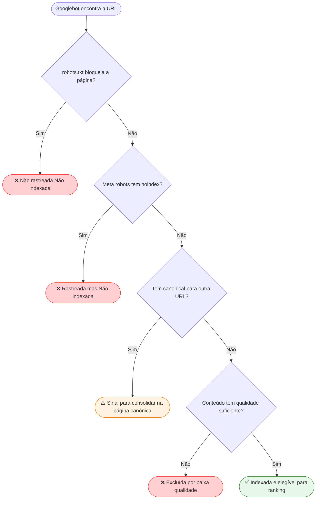
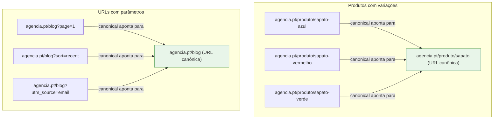
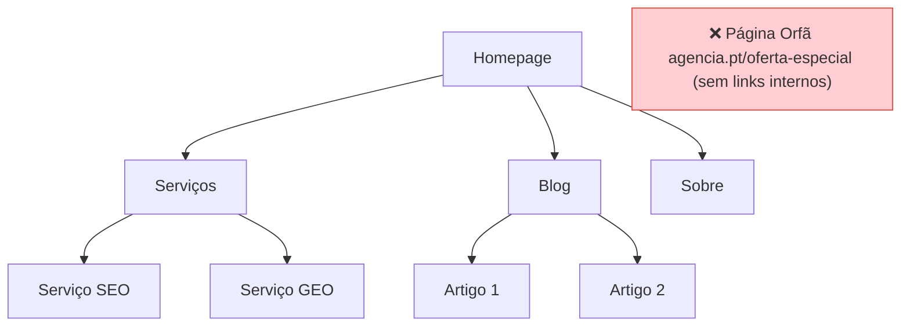

# Indexação

> [!abstract] **O que é a indexação**
> É o momento em que o motor de pesquisa decide o que entra ou não na sua "memória permanente". Sem indexação correta, uma página simplesmente **não existe** para o Google — mesmo que esteja publicada.

---

## Fluxo de Decisão de Indexação



---

## NoIndex

### O que é

A tag `<meta name="robots" content="noindex">` ou o header HTTP `X-Robots-Tag: noindex` diz ao Google para **não incluir esta página nos resultados de pesquisa**.

### Quando usar NoIndex

| Usar NoIndex | Não usar NoIndex |
|-------------|-----------------|
| Páginas de obrigado (thank you pages) | Páginas de produto |
| Páginas de login e registo | Páginas de categoria |
| Páginas de staging/teste | Artigos do blog |
| Páginas de parâmetros duplicados (`?sort=asc`) | Homepage |
| Páginas de pesquisa interna | Páginas de serviço |
| Páginas de impressão (`/imprimir`) | Landing pages de campanhas |

### Como implementar

```html
<!-- No <head> da página -->
<meta name="robots" content="noindex, nofollow">

<!-- Ou apenas noindex (permite seguir links) -->
<meta name="robots" content="noindex, follow">
```

> [!warning] **Atenção ao noindex + disallow**
> Uma página bloqueada no robots.txt **e** com noindex é problemático: o Google nunca vê o noindex porque não pode rastrear a página. Para excluir da indexação, usa apenas noindex (sem bloquear no robots.txt).

---

## Canonical

### O que é

A tag canonical (`<link rel="canonical">`) indica ao Google qual é a versão "oficial" de um conteúdo quando existe duplicação.

### Casos de uso



### Como implementar

```html
<!-- Na página duplicada, no <head> -->
<link rel="canonical" href="https://agencia.pt/produto/sapato">
```

---

## Conteúdo Duplicado

### Por que é um problema

O Google, quando encontra conteúdo duplicado, tem de **escolher qual versão mostrar**. Esta escolha pode não ser a que queres — e a autoridade fica dividida entre URLs.

### Tipos de duplicação

| Tipo | Exemplo | Solução |
|------|---------|---------|
| **Parâmetros de URL** | `/blog` e `/blog?categoria=seo` | NoIndex nos parâmetros ou canonical |
| **Versão www e não-www** | `www.site.pt` e `site.pt` | Redirect 301 + canonical |
| **HTTP e HTTPS** | `http://site.pt` e `https://site.pt` | Redirect 301 para HTTPS |
| **Com e sem trailing slash** | `/pagina` e `/pagina/` | Normalizar com redirect |
| **Conteúdo copiado** | Igual em várias páginas | Reescrever ou canonical |
| **Tags e categorias** | `/tag/seo` lista os mesmos artigos | NoIndex nas tags ou canonical |

---

## Páginas Orfãs

### O que são

Páginas que **não têm links internos** a apontar para elas — estão no site mas inacessíveis pela navegação normal.



> [!danger] **Impacto das páginas orfãs**
> - O Googlebot raramente as encontra
> - A IA não consegue interpretá-las no contexto do site
> - Não recebem autoridade interna
> - Solução: adicionar links internos relevantes ou redirecionar

---

## Páginas Válidas vs. Excluídas no GSC

O Google Search Console mostra o estado de indexação de cada URL. Aqui estão os estados principais e o que fazer:

| Estado GSC | Significado | Ação |
|-----------|-------------|------|
| ✅ **Indexada** | Página nos resultados do Google | Monitorizar performance |
| ⚠️ **Canônica não pela Google** | Google escolheu outra URL como canônica | Verificar se a canonical está correta |
| ❌ **Excluída por noindex** | Meta robots noindex ativo | Verificar se é intencional |
| ❌ **Rastreada, não indexada** | Google viu mas rejeitou por baixa qualidade | Melhorar conteúdo |
| ❌ **Descoberta, não rastreada** | Na fila mas ainda não visitada | Aguardar ou forçar via sitemap |
| ❌ **Erro 404** | Página não encontrada | Corrigir URL ou redirect 301 |
| ❌ **Redirecionamento** | 301 ou 302 ativo | Verificar se o destino é correto |
| ⚠️ **Duplicada sem canonical** | Duplicação sem sinalização | Adicionar canonical |

---

## Checklist de Indexação

- [ ] Páginas importantes não têm noindex acidental
- [ ] Todas as versões duplicadas têm canonical correto
- [ ] Parâmetros de URL configurados no GSC ou com noindex
- [ ] www vs não-www resolvido com redirect 301
- [ ] HTTP redireciona para HTTPS
- [ ] Sem páginas orfãs (todas as páginas têm pelo menos 1 link interno)
- [ ] Sitemap.xml atualizado com todas as páginas válidas
- [ ] GSC sem erros críticos de indexação

---

## Ver também

- [[Robots e Sitemap]] — robots.txt e sitemap em detalhe
- [[SEO Técnico]] — visão geral técnica
- [[../05 - Dados Estruturados/Dados Estruturados - Overview|Dados Estruturados]] — canonical e schema relacionados
