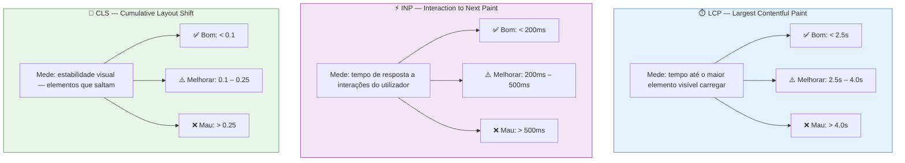
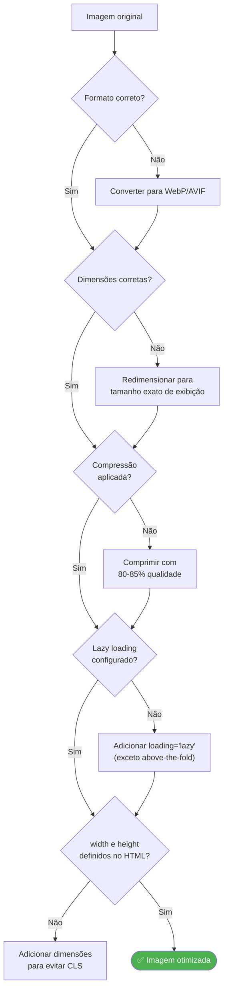

# Performance Técnica

> [!abstract] **Impacto direto no ranking**
> O Google confirmou: páginas que demoram mais de **3 segundos** a carregar são penalizadas no ranking. A performance é um sinal oficial de ranking desde 2021 (Core Web Vitals).

---

## Core Web Vitals — Os 3 Métricas Obrigatórias



### O que afeta cada métrica

| Métrica | Principais Causas de Falha | Solução |
|---------|---------------------------|---------|
| **LCP** | Imagens grandes sem otimização, servidor lento, CSS bloqueante | Otimizar imagens, CDN, preload de recursos críticos |
| **INP** | JavaScript pesado, event handlers lentos, long tasks | Code splitting, diferir JS não-crítico |
| **CLS** | Imagens sem dimensões definidas, anúncios dinâmicos, web fonts | Sempre definir width/height, reservar espaço para ads |

---

## TTFB — Time to First Byte

> [!info] **O que é o TTFB**
> É o tempo que o navegador demora a receber o **primeiro byte** de resposta do servidor, a partir do momento em que fez o pedido.


| TTFB | Avaliação | Ação |
|------|-----------|------|
| < 200ms | ✅ Excelente | Manter |
| 200–500ms | ⚠️ Aceitável | Otimizar servidor e cache |
| > 500ms | ❌ Mau | CDN, cache agressivo, upgrade de hosting |

### Como melhorar o TTFB

- **CDN** (Content Delivery Network) — servidor mais próximo do utilizador
- **Cache de servidor** — gerar HTML uma vez e servir em cache
- **Hosting de qualidade** — evitar partilhado, preferir VPS/cloud
- **Otimizar base de dados** — queries lentas aumentam o TTFB
- **Pré-renderização** (SSG) — HTML gerado em build time, não em runtime

---

## Otimização de Imagens

As imagens são frequentemente o maior culpado na performance de um site.



### Formatos de imagem recomendados

| Formato | Uso ideal | Suporte | Tamanho vs JPEG |
|---------|-----------|---------|-----------------|
| **WebP** | Fotos e imagens complexas | 95%+ browsers | -30% |
| **AVIF** | Fotos de alta qualidade | 85%+ browsers | -50% |
| **SVG** | Ícones, logos, ilustrações | 100% | Vetorial |
| **PNG** | Transparência necessária | 100% | Maior que WebP |
| **JPEG** | Fallback legacy | 100% | Referência |

---

## Lazy Loading

> [!tip] **O que é o Lazy Loading**
> Carregar imagens e outros recursos **apenas quando entram no viewport** do utilizador, em vez de carregar tudo ao início.

### Implementação correta

```html
<!-- ✅ Correto: imagens abaixo do fold com lazy loading -->


<!-- ❌ Errado: above-the-fold com lazy loading (atrasa o LCP) -->
 <!-- NÃO fazer -->

<!-- ✅ Correto: hero image sem lazy loading -->

```

> [!warning] **Lazy loading e SEO**
> Não aplicar lazy loading a imagens **above-the-fold** (visíveis sem scroll). O Googlebot pode não esperar pelo carregamento, tornando-as invisíveis para indexação.

---

## Renderização Bloqueante

Recursos que **bloqueiam o rendering** da página atrasam o LCP e prejudicam a experiência do utilizador.

### CSS Bloqueante

```html
<!-- ❌ Bloqueia rendering -->
<link rel="stylesheet" href="styles.css">

<!-- ✅ CSS crítico inline, resto assíncrono -->
<style>/* CSS crítico above-the-fold aqui */</style>
<link rel="preload" as="style" href="styles.css" onload="this.rel='stylesheet'">
```

### JavaScript Bloqueante

```html
<!-- ❌ Bloqueia parsing e rendering -->
<script src="analytics.js"></script>

<!-- ✅ Defer: executa depois do HTML, não bloqueia -->
<script src="analytics.js" defer></script>

<!-- ✅ Async: carrega em paralelo, executa quando pronto -->
<script src="widget.js" async></script>
```

### Quando usar defer vs async

| Atributo | Comportamento | Quando usar |
|----------|--------------|-------------|
| **Nenhum** | Bloqueia HTML parsing | Evitar para scripts externos |
| **`defer`** | Carrega em paralelo, executa em ordem após HTML | Scripts que dependem do DOM |
| **`async`** | Carrega em paralelo, executa imediatamente | Scripts independentes (analytics) |

---

## Checklist de Performance

### Core Web Vitals
- [ ] LCP < 2.5 segundos (medir no PageSpeed Insights)
- [ ] INP < 200ms
- [ ] CLS < 0.1

### Imagens
- [ ] Todas as imagens em WebP ou AVIF
- [ ] Lazy loading em imagens abaixo do fold
- [ ] width e height definidos em todas as imagens
- [ ] Imagens comprimidas (max 200kb por imagem de conteúdo)

### Código
- [ ] CSS crítico inline ou preloaded
- [ ] JavaScript não-crítico com defer/async
- [ ] Remover CSS/JS não utilizado
- [ ] Minificação de HTML, CSS, JS

### Servidor
- [ ] TTFB < 200ms
- [ ] HTTPS configurado corretamente
- [ ] Gzip/Brotli compressão ativa
- [ ] Headers de cache configurados
- [ ] CDN configurada (para sites com tráfego global)

---

## Ferramentas de Medição

| Ferramenta | O que mede | URL |
|------------|-----------|-----|
| **PageSpeed Insights** | Core Web Vitals por URL | pagespeed.web.dev |
| **Google Search Console** | CWV no campo real | search.google.com/search-console |
| **GTmetrix** | Performance detalhada + waterfall | gtmetrix.com |
| **WebPageTest** | Análise avançada, filmstrip | webpagetest.org |
| **Lighthouse** | Auditoria completa no browser | DevTools → Lighthouse |

---

## Ver também

- [[SEO Técnico]] — visão geral técnica
- [[Arquitetura e Estrutura da Página]] — estrutura que afeta performance
- [[Robots e Sitemap]] — controlo de rastreamento
