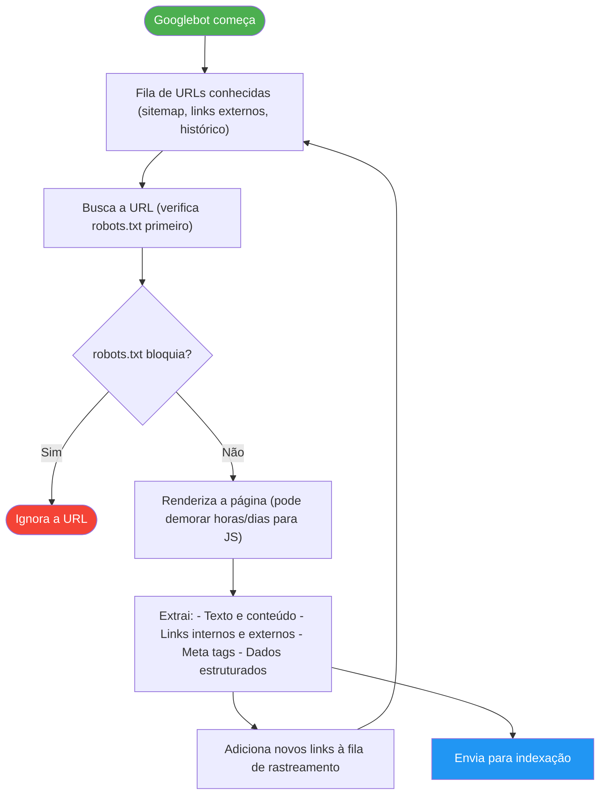
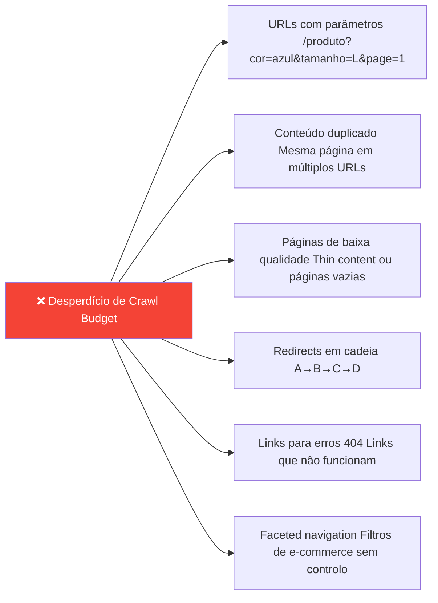
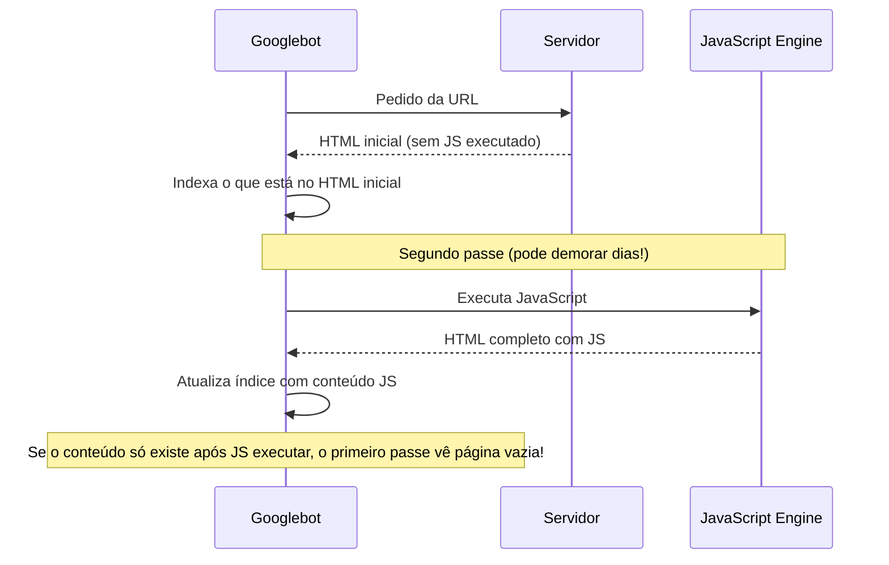
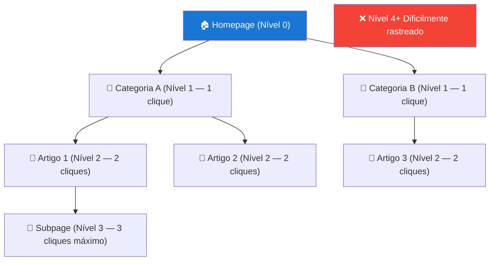

# Rastreamento (Crawling)

> [!abstract] **O que é o rastreamento**
> O rastreamento é o processo em que o Googlebot (e outros crawlers) percorrem o site, seguindo links de página em página, para descobrir todo o conteúdo existente. Sem rastreamento, não há indexação. Sem indexação, não há ranking.

---

## Como o Googlebot Rastreia

---

## Problemas de Rastreamento — Diagnóstico

### Os 6 Problemas Mais Comuns

| Problema | Sintoma | Diagnóstico | Solução |
|----------|---------|-------------|---------|
| **URLs inacessíveis** | Erros 404 no GSC | GSC → Cobertura → Erros | Corrigir URLs ou redirecionar 301 |
| **Cadeia de redirecionamentos** | Lentidão, perda de PageRank | Screaming Frog → Redirects | Redirect direto A→D |
| **Conteúdo só em JavaScript** | Páginas no GSC sem conteúdo | GSC → Inspecionar URL → Renderização | Implementar SSR/SSG |
| **Arquitetura profunda** | Páginas nunca rastreadas | Análise de depth com Screaming Frog | Reestruturar e adicionar links internos |
| **Robots.txt mal configurado** | Páginas bloqueadas | GSC → robots.txt tester | Corrigir o ficheiro robots.txt |
| **Budget de rastreamento esgotado** | Apenas parte do site rastreada | GSC → Estatísticas de rastreamento | Otimizar robots.txt, sitemap, eliminar duplicados |

---

## Crawl Budget

> [!info] **O que é Crawl Budget**
> O Googlebot tem um limite de páginas que visita por dia num site — o "orçamento de rastreamento". Sites grandes (mais de 10.000 páginas) precisam de gerir este budget ativamente.

### O que desperdiça crawl budget

### Como otimizar o crawl budget

- Bloquear URLs de parâmetros no robots.txt
- Consolidar conteúdo duplicado com canonical
- Eliminar páginas de thin content ou noindex nelas
- Corrigir redirects para serem diretos
- Submeter sitemap apenas com páginas relevantes

---

## JavaScript e Rastreamento

### Conteúdo JavaScript — o que fazer

| Tipo de conteúdo | Abordagem |
|-----------------|-----------|
| **Conteúdo crítico** (texto, headings, links principais) | SSR — servir no HTML inicial |
| **Conteúdo de suporte** (comentários, reviews) | Pode ser carregado com JS, com fallback |
| **Funcionalidades interativas** (filtros, tabs) | JS aceitável, garantir que conteúdo base está no HTML |
| **Carrosséis** | Imagem inicial no HTML, resto carregado com JS |

---

## Arquitetura Ideal para Rastreamento

### Regra dos 3 cliques

### Links internos — aceleradores de rastreamento

> [!tip] **Links internos são "estradas" para o Googlebot**
> Cada link interno é um caminho que o Googlebot pode seguir. Páginas importantes devem ter **muitos links internos** a apontar para elas — tanto da homepage como de outras páginas relevantes.

---

## Verificar o Rastreamento no GSC

### Google Search Console — onde encontrar

1. **Erros de rastreamento:** GSC → Cobertura → separador "Erros"
2. **URLs bloqueadas:** GSC → Cobertura → separador "Excluídas"
3. **Estatísticas de rastreamento:** GSC → Configurações → Estatísticas de rastreamento
4. **Teste de robots.txt:** GSC → Ferramentas de inspeção de URLs → Testar robots.txt
5. **Inspecionar URL específica:** GSC → Inspecionar URL → Ver renderização

---

## Checklist de Rastreamento

- [ ] Google Search Console sem erros de rastreamento críticos
- [ ] robots.txt não bloqueia CSS, JS ou conteúdo importante
- [ ] Conteúdo crítico visível no HTML sem JavaScript
- [ ] Máximo 3-4 cliques da homepage para qualquer página
- [ ] Sem cadeias de redirects (A→B→C)
- [ ] Sem páginas orfãs (todas têm links internos)
- [ ] Sitemap.xml submetido no GSC
- [ ] URLs com parâmetros bloqueadas ou com canonical

---

## Ver também

- [[SEO Técnico]] — visão geral do SEO técnico
- [[Indexação]] — o que acontece depois do rastreamento
- [[Robots e Sitemap]] — controlo do rastreamento
- [[Arquitetura e Estrutura da Página]] — estrutura que facilita o rastreamento
