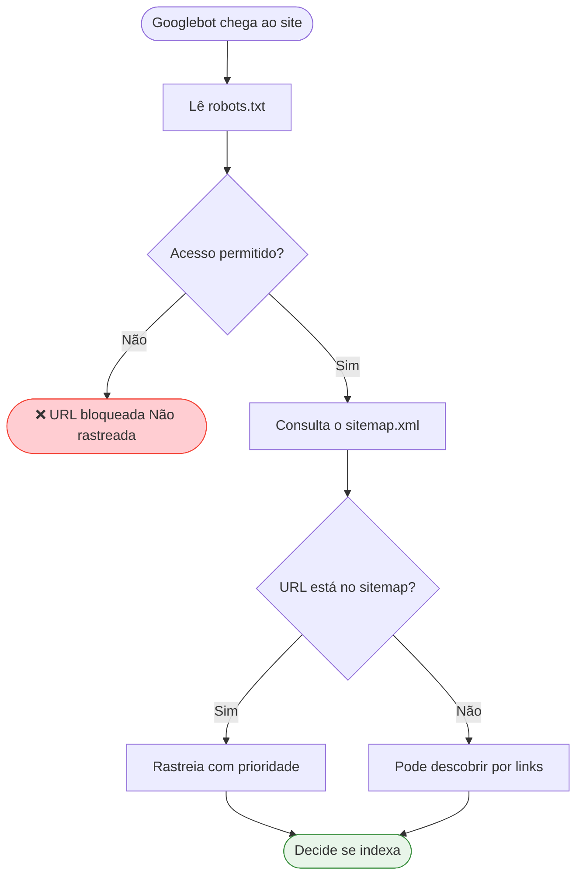

# Robots.txt e Sitemap.xml

> [!abstract] **Papel destes ficheiros**
> - **robots.txt** — diz ao crawler *onde pode e não pode ir*
> - **sitemap.xml** — diz ao crawler *o que existe e onde encontrar*
> São complementares: um controla o acesso, o outro facilita a descoberta.

---

## Robots.txt

### O que é

Ficheiro de texto simples colocado na raiz do site (`https://agencia.pt/robots.txt`). É a primeira coisa que o Googlebot lê ao visitar um site.

### Estrutura básica

```
User-agent: *           # Aplica-se a todos os crawlers
Disallow: /admin/       # Bloquear acesso à área admin
Disallow: /checkout/    # Bloquear processo de checkout
Allow: /blog/           # Permitir explicitamente o blog
Sitemap: https://agencia.pt/sitemap.xml   # Localização do sitemap
```

### O que NUNCA bloquear

> [!danger] **Nunca bloquear estes recursos!**
> Bloquear CSS ou JS impede o Google de ver o site como o utilizador o vê — resultando em penalizações.

| Recurso | Porquê nunca bloquear |
|---------|----------------------|
| **CSS** | O Google precisa de renderizar a página visualmente |
| **JavaScript** | Necessário para renderização de conteúdo |
| **Categorias** | Páginas de listagem importantes para rastreamento |
| **Imagens** | Google Images é uma fonte de tráfego |
| **Páginas de produto/serviço** | Conteúdo principal do site |

### O que bloquear (exemplos)

| Recurso | Motivo |
|---------|--------|
| `/admin/` | Área administrativa |
| `/wp-admin/` | WordPress admin |
| `/checkout/` | Processo de compra |
| `/carrinho/` | Carrinho de compras |
| `/conta/` | Área de utilizador |
| `/pesquisa?q=` | Resultados de pesquisa interna |
| `/imprimir/` | Versões de impressão |
| `/*.pdf$` | PDFs de uso interno |

### Exemplo completo para WordPress/WooCommerce

```
User-agent: *
# Bloquear áreas administrativas
Disallow: /wp-admin/
Disallow: /wp-login.php
Disallow: /xmlrpc.php

# Bloquear parâmetros duplicados
Disallow: /*?*orderby=
Disallow: /*?*add-to-cart=
Disallow: /*?*utm_source=

# Bloquear áreas de utilizador
Disallow: /minha-conta/
Disallow: /checkout/
Disallow: /carrinho/

# Nunca bloquear JS/CSS (deixar comentado para referência)
# Allow: /wp-content/themes/
# Allow: /wp-content/plugins/

Sitemap: https://agencia.pt/sitemap.xml
Sitemap: https://agencia.pt/sitemap-posts.xml
Sitemap: https://agencia.pt/sitemap-products.xml
```

### Testar o robots.txt

> [!tip] **Usar sempre o Google Search Console**
> GSC → Ferramentas de inspeção de URLs → Robots.txt Tester
> Verifica se uma URL específica está a ser bloqueada ou permitida.

---

## Sitemap.xml

### O que é

Lista estruturada de URLs importantes do site, com metadados que ajudam os motores de pesquisa a rastrear e indexar o conteúdo de forma eficiente.

### Estrutura básica

```xml
<?xml version="1.0" encoding="UTF-8"?>
<urlset xmlns="http://www.sitemaps.org/schemas/sitemap/0.9">
  <url>
    <loc>https://agencia.pt/servicos/seo</loc>
    <lastmod>2026-05-15</lastmod>
    <changefreq>monthly</changefreq>
    <priority>0.8</priority>
  </url>
  <url>
    <loc>https://agencia.pt/blog/guia-seo-tecnico</loc>
    <lastmod>2026-06-01</lastmod>
    <changefreq>weekly</changefreq>
    <priority>0.6</priority>
  </url>
</urlset>
```

### Campos do Sitemap

| Campo | Obrigatório | Descrição |
|-------|-------------|-----------|
| `<loc>` | ✅ Sim | URL completa da página |
| `<lastmod>` | Recomendado | Data da última modificação (ISO 8601) |
| `<changefreq>` | Opcional | Frequência de mudança (always/daily/weekly/monthly/yearly/never) |
| `<priority>` | Opcional | Prioridade relativa (0.0–1.0), **não afeta o ranking do Google** |

> [!info] **Sobre o campo `priority`**
> O Google confirmou que **ignora o campo `priority`** para ranking. Mas é útil para indicar quais páginas priorizar no rastreamento em sites grandes.

### Tipos de Sitemap

| Tipo | Quando usar |
|------|-------------|
| **Sitemap principal** | Referência a outros sitemaps (sitemap index) |
| **Sitemap de páginas** | Páginas estáticas (sobre, serviços, contacto) |
| **Sitemap de posts/artigos** | Blog e conteúdo dinâmico |
| **Sitemap de produtos** | E-commerce |
| **Sitemap de imagens** | Para Google Images |
| **Sitemap de vídeos** | Para Google Video |
| **Sitemap de notícias** | Para Google News (publicação noticiosa) |

### Sitemap Index (para sites grandes)

```xml
<?xml version="1.0" encoding="UTF-8"?>
<sitemapindex xmlns="http://www.sitemaps.org/schemas/sitemap/0.9">
  <sitemap>
    <loc>https://agencia.pt/sitemap-pages.xml</loc>
    <lastmod>2026-06-09</lastmod>
  </sitemap>
  <sitemap>
    <loc>https://agencia.pt/sitemap-posts.xml</loc>
    <lastmod>2026-06-09</lastmod>
  </sitemap>
  <sitemap>
    <loc>https://agencia.pt/sitemap-products.xml</loc>
    <lastmod>2026-06-09</lastmod>
  </sitemap>
</sitemapindex>
```

---

## Relação entre Robots.txt e Sitemap



---

## Checklist Robots.txt e Sitemap

### Robots.txt
- [ ] Ficheiro existe em `/robots.txt`
- [ ] CSS e JavaScript não estão bloqueados
- [ ] Referência ao(s) sitemap(s) no final do ficheiro
- [ ] Testado no Google Search Console
- [ ] Áreas administrativas estão bloqueadas
- [ ] Parâmetros de URL duplicados estão bloqueados

### Sitemap.xml
- [ ] Sitemap existe e é acessível
- [ ] Submetido no Google Search Console
- [ ] Submetido no Bing Webmaster Tools
- [ ] Apenas inclui páginas indexáveis (sem noindex)
- [ ] Datas `lastmod` são precisas
- [ ] Atualizado automaticamente (plugin/build)
- [ ] Testado sem erros no GSC

---

## Ver também

- [[SEO Técnico]] — visão geral técnica
- [[Indexação]] — controlo de indexação avançado
- [[../05 - Dados Estruturados/Dados Estruturados - Overview|Dados Estruturados]] — complemento técnico
