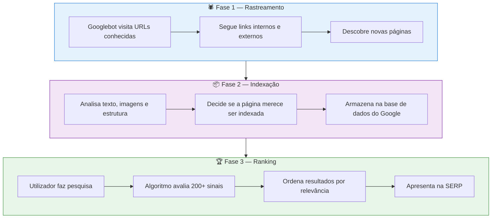
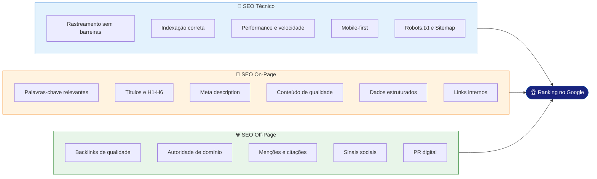
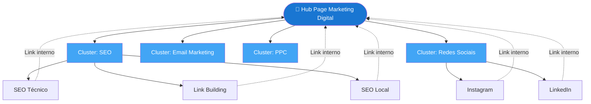
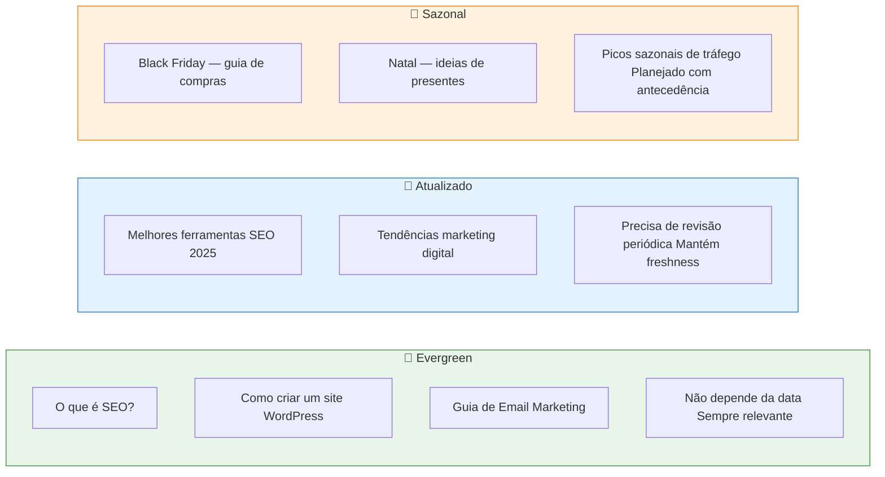

# SEO — Overview

> [!abstract] **Definição**
> SEO (Search Engine Optimization) é o conjunto de práticas técnicas, de conteúdo e de autoridade que permitem a um site aparecer nos primeiros resultados de motores de pesquisa para termos relevantes ao seu negócio.

---

## Como o Motor de Pesquisa Funciona

O processo tem sempre três fases sequenciais:

---

## Os 3 Pilares do SEO

---

## Taxonomia do SEO

A forma como o conteúdo é organizado em categorias, subcategorias, tags e relacionamentos entre páginas. É a lógica interna do site.

### Por que a taxonomia importa

| Beneficiário | Como ajuda |
|-------------|-----------|
| **Google / Bing** | Entende o contexto e hierarquia das páginas |
| **LLMs (ChatGPT, etc.)** | Mapeia entidades e relações temáticas |
| **Utilizadores** | Navegação clara, menos cliques para chegar ao destino |
| **AEO** | Facilita Answer Engine Optimization — snippets diretos |
| **Crawlers** | Caminhos claros para rastreamento eficiente |

### Modelo Hub-Cluster

> [!tip] **Hub-Cluster em prática**
> A Hub Page é o artigo principal que responde à questão mais ampla. Os Clusters são artigos mais específicos que linkam de volta para o hub. Isso **aumenta a autoridade temática** da hub page.

---

## Estratégia de Conteúdo SEO

### Os 3 tipos de conteúdo

---

## Sinais de Ranking (Principais)

| Categoria | Sinal | Peso aproximado |
|-----------|-------|-----------------|
| **Relevância** | Keyword no título, H1, URL | Alto |
| **Autoridade** | Domain Rating, backlinks de qualidade | Alto |
| **Qualidade** | E-E-A-T, originalidade, profundidade | Alto |
| **Experiência** | Core Web Vitals, bounce rate, dwell time | Médio-Alto |
| **Técnico** | Mobile-friendly, HTTPS, velocidade | Médio |
| **Freshness** | Data de atualização, frequência de publicação | Médio (por tema) |
| **Intenção** | Match com a intenção de pesquisa | Alto |
| **Dados estruturados** | Schema markup correto | Médio |

---

## O que NÃO fazer em SEO

> [!danger] **Práticas de Black Hat — penalizam o site**
> - Keyword stuffing (repetir keywords de forma não natural)
> - Link farms e PBNs (Private Blog Networks)
> - Conteúdo copiado ou duplicado
> - Cloaking (mostrar conteúdo diferente ao Google e ao utilizador)
> - Textos ocultos (cor igual ao fundo, font-size 0)
> - Comprar links em massa sem contexto

---

## Ferramentas Essenciais SEO

| Ferramenta | Função | Tipo |
|------------|--------|------|
| **Google Search Console** | Monitorizar performance, erros, indexação | Gratuito |
| **Google Analytics 4** | Tráfego, comportamento, conversões | Gratuito |
| **Ahrefs / SEMrush** | Análise de backlinks, keywords, concorrentes | Pago |
| **Screaming Frog** | Auditoria técnica do site | Freemium |
| **PageSpeed Insights** | Core Web Vitals e performance | Gratuito |
| **Google Rich Results Test** | Validar Schema markup | Gratuito |

---

## Ver também

- [[SEO Técnico]] — aprofundamento técnico
- [[Arquitetura e Estrutura da Página]] — estrutura e URLs
- [[Indexação]] — controlar o que é indexado
- [[Performance Técnica]] — Core Web Vitals
- [[Robots e Sitemap]] — ficheiros de controlo
- [[Conteúdo e Taxonomia]] — estratégia de conteúdo
