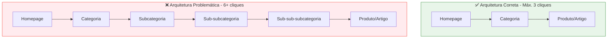
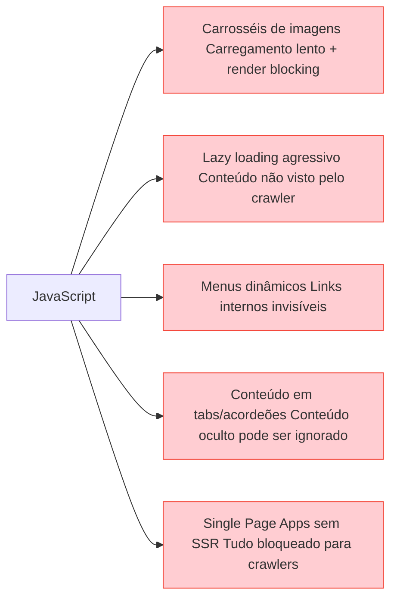
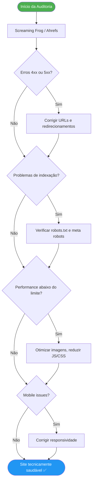

# SEO Técnico

> [!abstract] **Definição**
> O SEO Técnico é o conjunto de ajustes estruturais que permite a motores de pesquisa e LLMs:
> - Rastrear o site sem barreiras
> - Indexar apenas o que faz sentido
> - Entender a hierarquia e semântica do site
> - Oferecer experiência rápida e estável
> - Identificar entidades e conexões temáticas

---

## Visão Geral dos Problemas Técnicos

```mermaid
graph TD
    SITE([🌐 Site]) --> R[Rastreamento]
    SITE --> I[Indexação]
    SITE --> P[Performance]
    SITE --> M[Mobile]

    R --> R1[❌ URLs inacessíveis]
    R --> R2[❌ Cadeias de redirecionamento]
    R --> R3[❌ Conteúdo só em JavaScript]
    R --> R4[❌ Arquitetura demasiado profunda]
    R --> R5[❌ Agentes bloqueados no robots.txt]

    I --> I1[❌ NoIndex em páginas importantes]
    I --> I2[❌ Canonicals errados]
    I --> I3[❌ Conteúdo duplicado]
    I --> I4[❌ Páginas orfãs]
    I --> I5[❌ Parâmetros de URL duplicados]

    P --> P1[❌ Tempo de carregamento > 3s]
    P --> P2[❌ CLS alto]
    P --> P3[❌ LCP lento]
    P --> P4[❌ JavaScript bloqueante]

    M --> M1[❌ Layout não responsivo]
    M --> M2[❌ Elementos ocultos no mobile]
    M --> M3[❌ Espaçamentos incorretos]

    style R1 fill:#ffcdd2,stroke:#f44336
    style R2 fill:#ffcdd2,stroke:#f44336
    style R3 fill:#ffcdd2,stroke:#f44336
    style R4 fill:#ffcdd2,stroke:#f44336
    style R5 fill:#ffcdd2,stroke:#f44336
    style I1 fill:#ffcdd2,stroke:#f44336
    style I2 fill:#ffcdd2,stroke:#f44336
    style I3 fill:#ffcdd2,stroke:#f44336
    style I4 fill:#ffcdd2,stroke:#f44336
    style I5 fill:#ffcdd2,stroke:#f44336
```

---

## Rastreamento (Crawling)

### Problemas e Soluções

| Problema | Causa | Solução |
|----------|-------|---------|
| **URLs inacessíveis** | Erro 404, redirecionamentos quebrados | Corrigir links internos, configurar redirecionamentos 301 |
| **Cadeia de redirecionamentos** | Redirecionamento A→B→C→D | Redirecionamento direto A→D |
| **Conteúdo só em JS** | SPA sem SSR, lazy loading agressivo | Server-side rendering (SSR), pré-rendering |
| **Arquitetura profunda** | Páginas a 6+ cliques da homepage | Reestruturar navegação, links internos estratégicos |
| **Agentes bloqueados** | Robots.txt mal configurado | Auditar e corrigir o robots.txt |

### Arquitetura de Profundidade

> [!tip] **Regra dos 3 cliques**
> Qualquer página do site deve ser acessível a partir da homepage em **máximo 3 cliques**. Páginas a 4+ cliques são frequentemente ignoradas pelo Googlebot.

---

## JavaScript e SEO

> [!warning] **JavaScript é o maior inimigo do rastreamento**
> O Googlebot precisa de dois passes para renderizar JS: um de descoberta e outro de renderização (que pode demorar dias). Conteúdo crítico em JS pode nunca ser rastreado.

### Impacto do JavaScript

| Abordagem | SEO | Performance | Recomendação |
|-----------|-----|-------------|--------------|
| **CSR puro** (Client-Side Rendering) | Muito mau | Variável | ❌ Evitar para conteúdo crítico |
| **SSR** (Server-Side Rendering) | Excelente | Bom | ✅ Recomendado |
| **SSG** (Static Site Generation) | Excelente | Excelente | ✅ Ideal para conteúdo estático |
| **ISR** (Incremental Static Regen.) | Excelente | Excelente | ✅ Ideal para conteúdo dinâmico |

### Elementos JavaScript Problemáticos

---

## Mobile-First Indexing

> [!important] **O Google indexa primeiro a versão mobile**
> Desde 2021, o Google usa exclusivamente a versão mobile do site para indexação e ranking. O desktop é secundário.

### Checklist Mobile-First

| Item | Como verificar | Solução se falhar |
|------|---------------|-------------------|
| Layout responsivo | DevTools → modo mobile | CSS responsive com breakpoints |
| Tamanho mínimo de botões (48px) | Inspeção visual | Aumentar padding nos CTAs |
| Texto legível sem zoom | Teste manual | Font-size mínimo 16px |
| Elementos não ocultos | Comparar mobile vs desktop | Remover `display:none` no mobile |
| Velocidade < 3s no mobile | PageSpeed Insights | Otimizar imagens, reduzir JS |
| Viewport meta tag | Ver `<head>` do HTML | Adicionar `<meta name="viewport">` |

---

## Auditoria Técnica — Fluxo de Trabalho

---

## Ferramentas para SEO Técnico

| Ferramenta | O que faz | Quando usar |
|------------|-----------|-------------|
| **Google Search Console** | Erros de indexação, Core Web Vitals, URLs removidas | Monitorização contínua |
| **Screaming Frog** | Auditoria completa: URLs, redirects, meta, H1, imagens | Auditoria inicial e periódica |
| **PageSpeed Insights** | Core Web Vitals por URL | Ao lançar páginas novas |
| **Lighthouse** | Auditoria de performance, acessibilidade, SEO | Durante desenvolvimento |
| **Ahrefs Site Audit** | Saúde técnica global + oportunidades | Mensalmente |
| **Bing Webmaster Tools** | Indexação no Bing (importante para AIO) | Complementar ao GSC |

---

## Ver também

- [[Rastreamento (Crawling)]] — problemas de rastreamento em detalhe
- [[Indexação]] — controlar o que é indexado
- [[Performance Técnica]] — Core Web Vitals e velocidade
- [[Robots e Sitemap]] — ficheiros de controlo técnico
- [[Arquitetura e Estrutura da Página]] — estrutura de URLs e navegação
