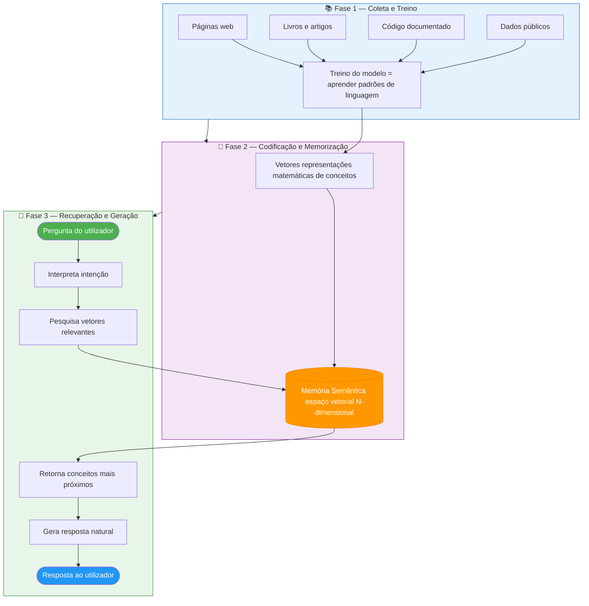
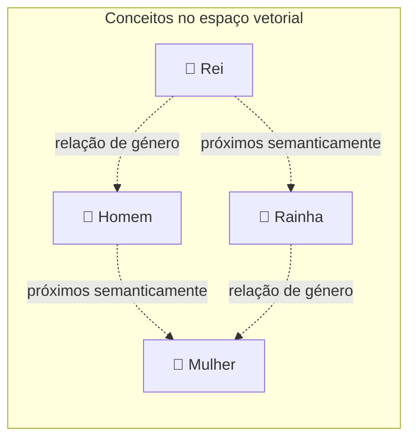
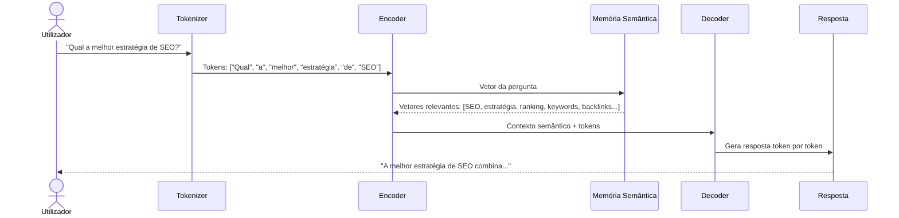
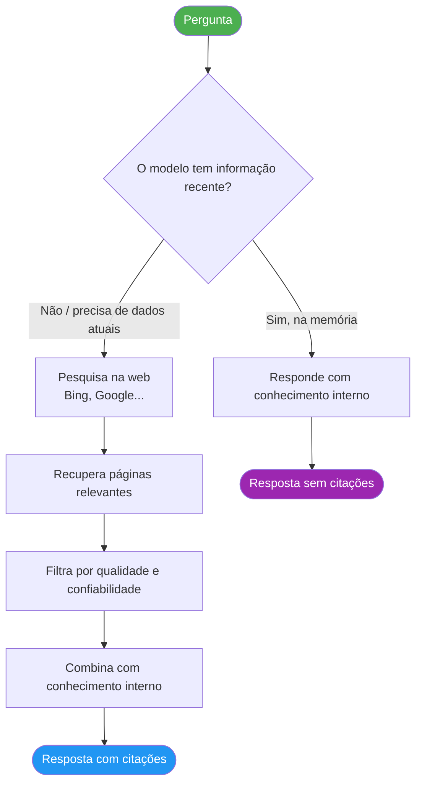
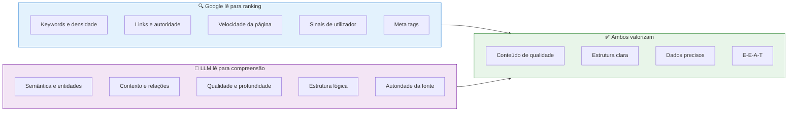

# Como uma LLM Funciona

> [!abstract] **Porquê isto importa para o conteúdo**
> Para otimizar conteúdo para ser utilizado por uma IA, precisamos de entender como essa IA "aprende" e "lembra" informação. A LLM não lê páginas web em tempo real — ela aprendeu com bilhões de documentos e armazenou esse conhecimento como padrões matemáticos.

---

## As 3 Fases de uma LLM

---

## O que são Vetores?

Cada palavra, frase ou conceito é convertido num vetor — uma representação matemática que captura o seu **significado semântico**.

> [!info] **Analogia simples**
> Se o conceito "Rei" é representado pelo vetor [0.9, 0.2, 0.8], o conceito "Rainha" estará em [0.9, 0.8, 0.8] — próximo em "realeza" mas diferente em "género". É assim que a IA entende relações semânticas.

---

## Como a LLM Processa uma Pergunta

---

## LLMs com Pesquisa na Web (RAG)

Modelos como ChatGPT (com browsing) e Perplexity usam **RAG** (Retrieval-Augmented Generation):

> [!important] **Implicação para GEO**
> Quando a IA pesquisa na web antes de responder, os critérios que usa para selecionar fontes são: **autoridade da fonte, estrutura do conteúdo, clareza da resposta e dados estruturados**. É exatamente o que o GEO otimiza.

---

## O Papel do Conteúdo no Treino das LLMs

### O que aumenta a probabilidade de ser incluído no treino

| Fator | Impacto | Como aplicar |
|-------|---------|--------------|
| **Publicações em sites de alta DA** | Alto | Guest posts em publicações relevantes |
| **Conteúdo citado por outros sites** | Alto | Link building editorial |
| **Conteúdo original com dados** | Alto | Estudos, pesquisas, relatórios |
| **Schema markup correto** | Médio | JSON-LD em todos os conteúdos |
| **Consistência temática** | Médio | Especialização num nicho |
| **Freshness e atualização** | Médio | Rever e atualizar conteúdo regularmente |

---

## Diferença entre como o Google e a LLM "lêem" o conteúdo

---

## Implicações Práticas para o Conteúdo

> [!example] **O que a IA "aprende" sobre a tua marca**
>
> Se o teu site tem:
> - Artigos aprofundados sobre um tema específico
> - Citações por outros sites relevantes
> - Schema markup que identifica a empresa como entidade
> - Menções consistentes em diferentes fontes
>
> A IA "aprende" que a tua marca é uma **autoridade temática nesse domínio** e passa a citá-la quando relevante.

---

## Principais LLMs e como pesquisam

| LLM | Pesquisa na web? | Indexação | Implicação SEO/GEO |
|-----|-----------------|-----------|-------------------|
| **ChatGPT (sem browsing)** | Não | Dados de treino até data de corte | Depende de estar bem representado no treino |
| **ChatGPT (com browsing)** | Sim (Bing) | Resultados atuais | Bom ranking no Bing ajuda |
| **Google Gemini** | Sim (Google) | Resultados Google atuais | SEO no Google é crítico |
| **Perplexity** | Sim (múltiplos) | Resultados em tempo real | Alta DA e estrutura clara |
| **Claude (sem projects)** | Não | Dados de treino | Depende do treino |
| **AI Overviews (Google)** | Sim (Google) | Top resultados Google | SEO + E-E-A-T |

---

## Ver também

- [[Processo de Ranking das IA]] — como a IA escolhe o que citar
- [[Otimização On-Page para IA]] — táticas práticas de AIO
- [[../04 - GEO/GEO - Overview|GEO - Overview]] — ser citado pela IA
- [[../01 - Fundamentos/O que é SEO, GEO e AIO|O que é SEO, GEO e AIO]] — contexto geral
