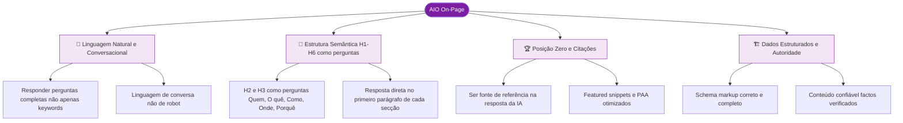
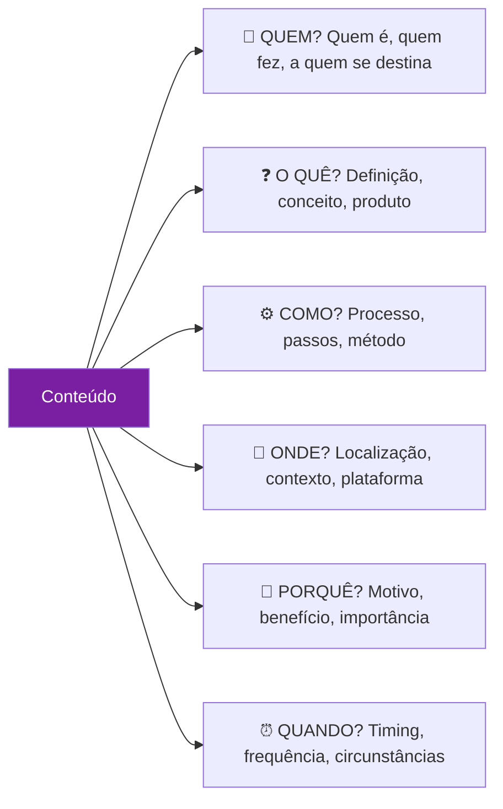
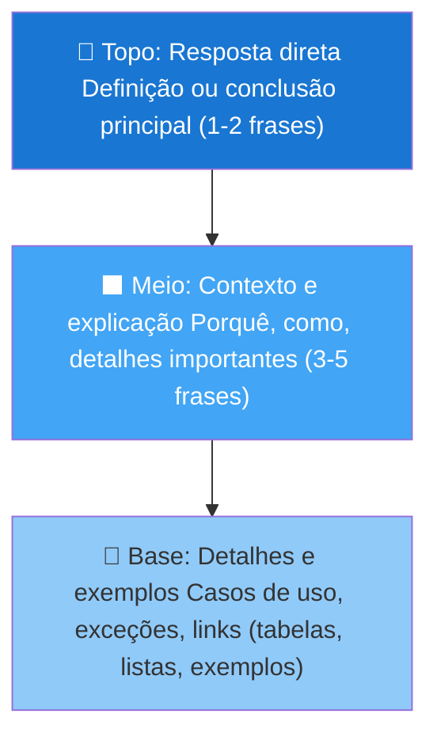
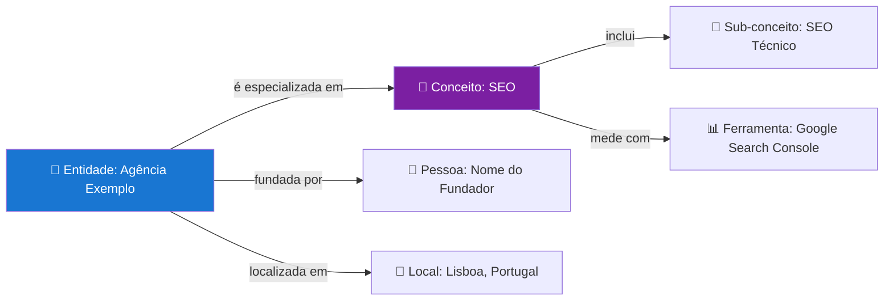

# Otimização On-Page para IA (AIO)

> [!abstract] **O objetivo do AIO**
> Estruturar o conteúdo de forma que modelos de linguagem (LLMs) o compreendam com precisão, o utilizem como fonte confiável e o transformem numa resposta de qualidade para o utilizador.

---

## Os 4 Pilares do AIO On-Page



---

## 1. Linguagem Natural e Conversacional

A IA responde perguntas — não lida com keywords isoladas. O conteúdo deve funcionar como uma **conversa informada**.

### Errado vs Certo

| ❌ Abordagem antiga (keywords) | ✅ Abordagem AIO (linguagem natural) |
|-------------------------------|--------------------------------------|
| "SEO marketing digital empresa Portugal" | "Como melhorar o SEO de uma empresa em Portugal?" |
| "agência SEO Lisboa preço" | "Quanto custa contratar uma agência de SEO em Lisboa?" |
| "core web vitals otimização performance" | "O que são Core Web Vitals e como melhorá-los?" |

### O framework das 5 perguntas

Cada secção de conteúdo deve ser capaz de responder uma destas:



---

## 2. Estrutura de Headings para AIO

### Fórmula para H2/H3

- **H2** = Pergunta principal de cada secção
- **H3** = Sub-perguntas e casos específicos
- **Primeiro parágrafo após heading** = Resposta direta e concisa

### Exemplo prático — antes e depois

**❌ Antes (SEO keyword):**
```markdown
## SEO Técnico
O SEO técnico é importante para as empresas...

### Rastreamento
O rastreamento permite ao Google...
```

**✅ Depois (AIO-friendly):**
```markdown
## O que é o SEO Técnico e por que é importante?
O SEO Técnico é o conjunto de otimizações que permitem aos motores de pesquisa rastrear, indexar e compreender o teu site sem barreiras. Sem ele, nenhuma outra estratégia SEO funciona.

### Quais são os principais problemas de rastreamento?
Os problemas de rastreamento mais comuns são: URLs inacessíveis, cadeias de redirecionamentos, conteúdo em JavaScript sem SSR e arquitetura de site demasiado profunda.
```

---

## 3. Resposta Direta no Primeiro Parágrafo

A IA extrai frequentemente o primeiro parágrafo de uma secção como resposta direta. Chama-se o padrão **"inverted pyramid"**.



### Estrutura de parágrafo ideal para snippets

```
[Definição/resposta direta em 1 frase.]
[Explicação de contexto em 1-2 frases.]
[Lista ou tabela com os principais pontos.]
[Link interno para mais detalhe.]
```

---

## 4. Otimizar para Featured Snippets e PAA

### Tipos de Featured Snippets

| Tipo | Como otimizar |
|------|--------------|
| **Parágrafo** | Resposta direta após H2/H3 com 40-60 palavras |
| **Lista numerada** | Usar `1.`, `2.`, `3.` para passos ou processos |
| **Lista com bullets** | Usar `-` ou `*` para características ou itens |
| **Tabela** | Formato Markdown tabela para comparações |

### People Also Ask (PAA) — ouro para AIO

As perguntas do PAA são perguntas reais que os utilizadores fazem. Cada uma deve ser um H2 ou H3 no conteúdo.

**Como encontrar as perguntas PAA:**
1. Pesquisar o tema no Google
2. Anotar todas as perguntas no bloco "As pessoas também perguntam"
3. Incluir cada uma como H2 ou H3 no artigo
4. Responder diretamente abaixo de cada heading

---

## 5. Conteúdo Baseado em Entidades

A IA trabalha com **entidades** (pessoas, lugares, conceitos, organizações) e as relações entre elas.



### Como tornar o conteúdo rico em entidades

- Mencionar pessoas com nome completo e cargo/especialidade
- Mencionar empresas com localização e área de atuação
- Ligar conceitos uns aos outros explicitamente
- Usar Schema markup para formalizar as entidades
- Citar estudos, fontes e dados com referência completa

---

## 6. Checklist AIO On-Page

### Estrutura
- [ ] H2 e H3 formulados como perguntas reais
- [ ] Resposta direta no primeiro parágrafo de cada secção
- [ ] Pirâmide invertida: conclusão → contexto → detalhe
- [ ] Perguntas do PAA mapeadas e respondidas

### Linguagem
- [ ] Tom conversacional e natural
- [ ] Frases não começam com keywords isoladas
- [ ] Definições claras para cada conceito importante
- [ ] Conectores lógicos ("porque", "isto significa que", "por exemplo")

### Conteúdo
- [ ] Factos verificáveis e com fonte
- [ ] Dados originais ou estatísticas citadas
- [ ] Exemplos práticos e casos de uso
- [ ] Listas e tabelas para informação comparativa

### Técnico
- [ ] Schema markup adequado ao tipo de conteúdo
- [ ] Open Graph tags corretas (para partilha em redes)
- [ ] Velocidade da página < 3s (IA valoriza páginas performáticas)
- [ ] Conteúdo acessível sem JavaScript (SSR/SSG)

---

## Exemplo Completo — Artigo AIO-Otimizado

```markdown
# O que é SEO Técnico? Guia Completo para 2026 (H1)

O SEO Técnico é o conjunto de otimizações estruturais de um website que permitem aos motores de pesquisa — e às IAs generativas — rastrear, indexar e interpretar o seu conteúdo sem barreiras. É a fundação sobre a qual toda a estratégia de conteúdo assenta.

## O que inclui o SEO Técnico? (H2 — pergunta)
O SEO técnico abrange cinco áreas principais: rastreamento, indexação, arquitetura, performance e compatibilidade mobile. Cada área resolve um tipo diferente de barreira para os motores de pesquisa.

### Quais são os problemas de rastreamento mais comuns? (H3 — sub-pergunta)
Os problemas mais comuns são:
1. URLs inacessíveis (erro 404 ou redirecionamentos quebrados)
2. Conteúdo carregado apenas por JavaScript sem SSR
3. Bloqueios incorretos no robots.txt
4. Arquitetura de site muito profunda (mais de 3-4 cliques da homepage)

## Como verificar se o meu site tem problemas técnicos de SEO? (H2 — pergunta)
Para verificar, usa o Google Search Console (gratuito) que identifica erros de indexação, ou ferramentas como Screaming Frog para uma auditoria completa.

[... continua ...]
```

---

## Ver também

- [[Como uma LLM Funciona]] — base técnica de como a IA processa
- [[Processo de Ranking das IA]] — critérios de seleção de fontes
- [[../05 - Dados Estruturados/Dados Estruturados - Overview|Dados Estruturados]] — schema markup para AIO
- [[../06 - Tipos de Busca/Tipos de Busca e SERP|Tipos de Busca]] — featured snippets e PAA
