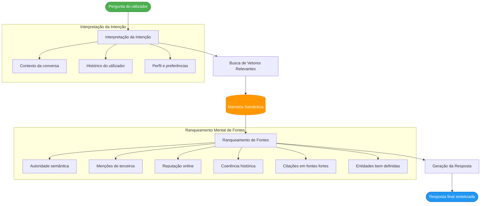
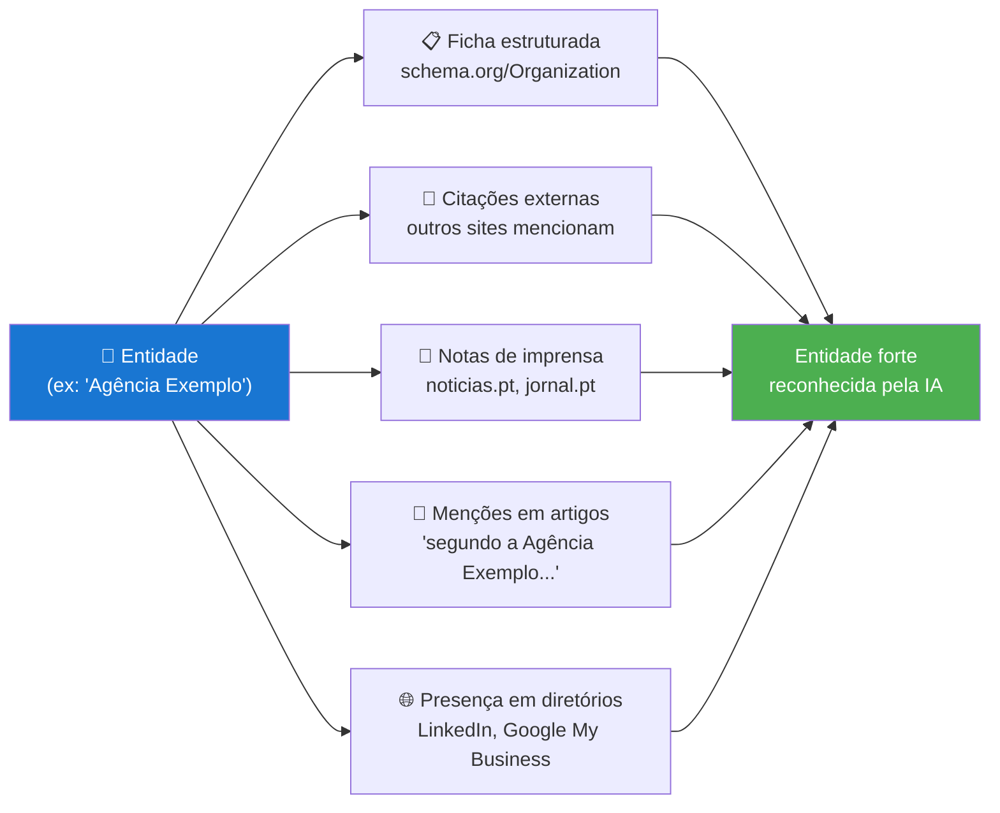
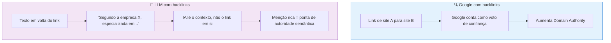
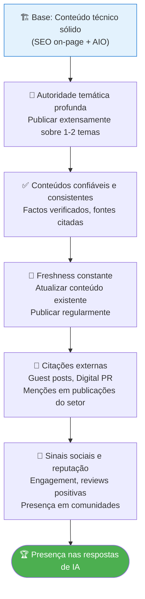

# Processo de Ranking das IA

> [!abstract] **A ideia central**
> As IAs não fazem "ranking" como o Google. Em vez disso, fazem uma **seleção semântica** de informação baseada em confiança, relevância e coerência. O GEO adapta sempre a resposta conforme o perfil, histórico e interações da pessoa com a LLM.

---

## O Processo Completo de Resposta da IA



---

## O que a IA Prioriza ao Escolher Fontes

### Os 7 Fatores de Ranking Semântico

| Fator | O que significa | Como fortalecer |
|-------|-----------------|-----------------|
| **Autoridade semântica** | Profundidade e consistência de conteúdo sobre um tema | Publicar extensamente sobre o nicho |
| **Menções de terceiros** | Quantos sites relevantes mencionam a marca/conteúdo | Digital PR, link building editorial |
| **Reputação online** | Reviews, mentions, sinais sociais positivos | Gestão de reputação ativa |
| **Dados estruturados** | Schema markup que identifica entidades claramente | JSON-LD em todas as páginas |
| **Coerência histórica** | Consistência do conteúdo ao longo do tempo | Não apagar ou alterar radicalmente conteúdo antigo |
| **Citações em fontes fortes** | Ser mencionado por sites de alta autoridade | Guest posts, entrevistas, estudos citados |
| **Entidades bem definidas** | Empresa, pessoa ou tema claramente identificados | Schema Organization, Person, etc. |

---

## Como as Entidades São Lidas pela IA

Uma "entidade" para uma IA é um conceito claramente definível com:



### Como construir uma entidade forte

| Ação | Plataforma | Prioridade |
|------|-----------|------------|
| Página "Sobre Nós" robusta com schema Organization | Site próprio | 🔴 Alta |
| Perfil Google My Business completo | Google | 🔴 Alta |
| LinkedIn da empresa e fundadores | LinkedIn | 🔴 Alta |
| Wikipedia (se elegível) | Wikipedia | 🟡 Média |
| Wikidata entry | Wikidata | 🟡 Média |
| Menções em publicações do setor | Externo | 🔴 Alta |
| Perfil em diretórios de nicho | Vários | 🟡 Média |

---

## Como as LLMs Utilizam Backlinks (diferente do Google)



> [!warning] **Mudança crítica no link building**
> Um link sem texto útil em volta **= zero impacto em IA**.
> Uma menção contextual rica = reconhecimento de autoridade.
> O link building moderno É context building.

### Comparação: link vs. menção para IA

| Tipo | Exemplo | Impacto na IA |
|------|---------|--------------|
| **Link sem contexto** | `Veja aqui <a href="...">aqui</a>` | ❌ Zero impacto |
| **Link com texto âncora** | `Segundo <a href="...">SEO técnico</a>` | ⚠️ Baixo impacto |
| **Menção contextual** | `Segundo a [Empresa X], especializada em SEO há 10 anos, a melhor abordagem é...` | ✅ Alto impacto |
| **Citação como fonte primária** | `Um estudo de 2026 da [Empresa X] mostrou que...` | ✅✅ Máximo impacto |

---

## Aparecer nas Respostas das LLMs

### Framework para máxima presença nas IAs



---

## Métricas para Medir Presença nas IAs

| Métrica | O que mede | Ferramenta |
|---------|-----------|-----------|
| **Answer Share of Voice** | % das respostas da IA em que a tua marca aparece | Brandwatch AI, Mention |
| **Citation Share** | % de vezes que és citado quando o tema é pesquisado | Monitorização manual + tools |
| **Mention Share** | Frequência de menções nas respostas de IA | Perplexity, ChatGPT testing |
| **AI Exposure Score** | Score geral de visibilidade nas IAs | Ferramentas especializadas GEO |
| **Presença em respostas longas** | Se apareces em respostas detalhadas | Teste manual |
| **Menções nas LLMs** | Perguntar diretamente às IAs sobre a marca | ChatGPT, Gemini, Claude |

### Como testar a tua presença agora

```
1. Abre o ChatGPT, Gemini ou Perplexity
2. Pergunta: "Quais são as melhores [empresas/agências/especialistas] em [teu nicho] em [país]?"
3. Pergunta: "O que é [teu produto/serviço]? Que empresas recomendam?"
4. Regista se és mencionado e em que contexto
5. Compara com os concorrentes
```

---

## Ver também

- [[Como uma LLM Funciona]] — base técnica
- [[Otimização On-Page para IA]] — táticas práticas
- [[../04 - GEO/EEAT e Autoridade|EEAT e Autoridade]] — como construir confiança
- [[../04 - GEO/Como Medir o GEO|Como Medir o GEO]] — métricas detalhadas
