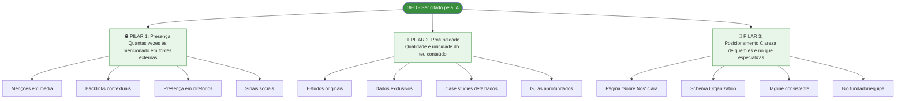
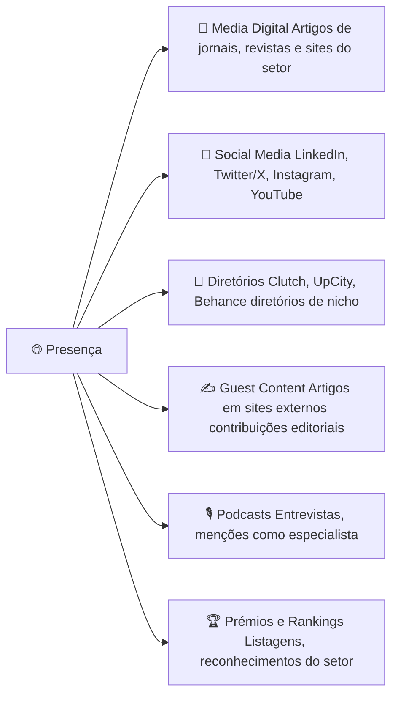
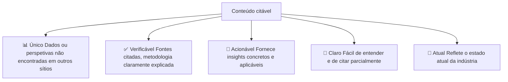
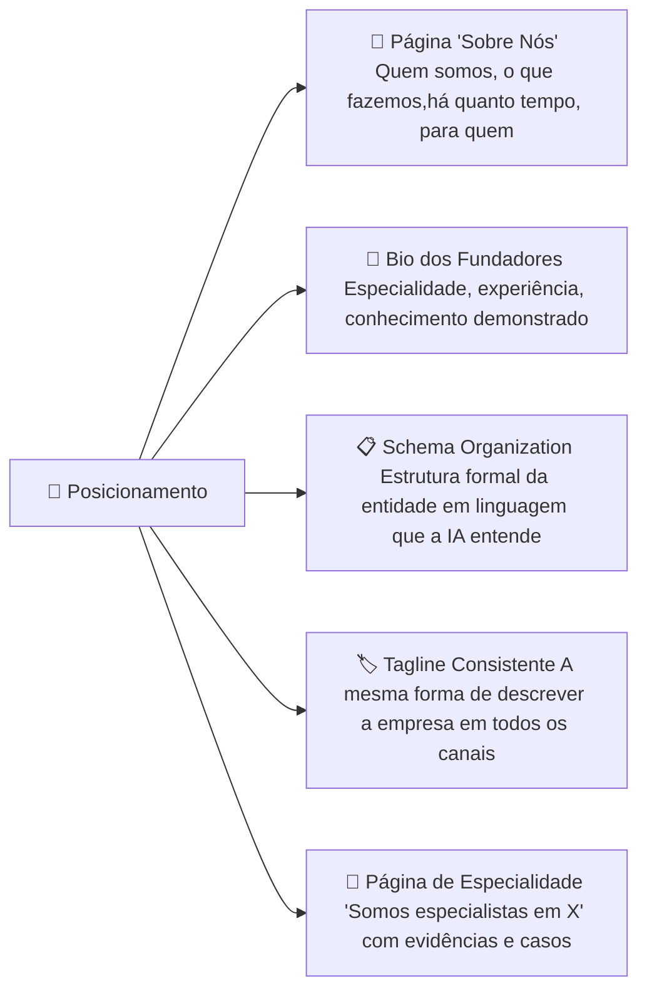
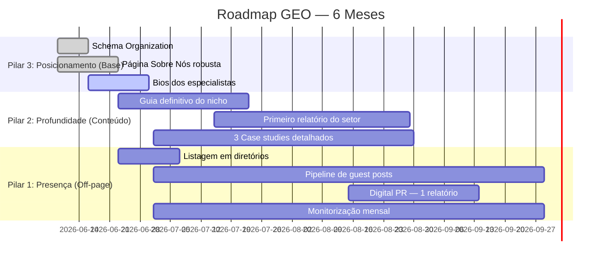

# 3 Pilares Fundamentais do GEO

> [!abstract] **Os 3 pilares**
> | Pilar | Descrição |
> |-------|-----------|
> | 🌐 **Presença** | Aparições externas e menções da marca |
> | 📊 **Profundidade** | Dados, evidências e conteúdo único |
> | 🎯 **Posicionamento** | Clareza da especialidade e nicho da marca |

---

## Visão Geral dos 3 Pilares



---

## Pilar 1 — Presença

### O que é
A quantidade e qualidade de **aparições externas** da marca — onde e como és mencionado fora do teu próprio site.

### Por que importa para a IA
A IA mede a autoridade de uma marca em parte pelo número e qualidade de menções externas. Se apenas o teu próprio site te menciona, a IA não tem sinal externo para validar a tua autoridade.

### Tipos de Presença



### Como medir a Presença

| Métrica | Ferramenta | Frequência |
|---------|-----------|-----------|
| Menções online | Google Alerts, Mention.com | Semanal |
| Número de referring domains | Ahrefs, SEMrush | Mensal |
| Share of voice na SERP | SEMrush | Mensal |
| Presença em respostas de IA | Teste manual nas IAs | Mensal |
| Cobertura de media | BuzzSumo, Brandwatch | Mensal |

---

## Pilar 2 — Profundidade

### O que é
A qualidade, unicidade e credibilidade do conteúdo que produzes. Conteúdo com profundidade é **citável** — outros sites referenciam-no naturalmente.

### Por que importa para a IA
A IA prioriza conteúdo que foi **validado externamente** (citado por outros) e que contém **dados únicos** que não se encontram em todo o lado.

### Tipos de Conteúdo de Alta Profundidade

| Tipo | Descrição | Impacto GEO |
|------|-----------|-------------|
| **Estudos originais** | Pesquisa com dados exclusivos da empresa | Máximo |
| **Relatórios do setor** | Análise anual da indústria com dados originais | Máximo |
| **Case studies detalhados** | Resultados reais de clientes com métricas | Alto |
| **Guias definitivos** | O guia mais completo sobre um tema | Alto |
| **Benchmarks** | Dados comparativos do setor | Alto |
| **Opiniões especializadas** | Análises aprofundadas por especialistas identificados | Médio-Alto |

### O que torna conteúdo "citável"



---

## Pilar 3 — Posicionamento

### O que é
A clareza com que a tua marca comunica a sua **especialidade** e o seu **nicho**. A IA precisa de entender exatamente o que fazes para te citar no contexto certo.

### Por que importa para a IA
Se a IA não consegue identificar claramente o que a tua empresa faz, **não te cita** quando alguém pergunta sobre o teu nicho. O posicionamento claro é a base do GEO.

### Elementos de Posicionamento



### Exemplos de Posicionamento para IA

| ❌ Fraco (vago) | ✅ Forte (específico e citável) |
|----------------|--------------------------------|
| "Fazemos marketing" | "Agência especializada em SEO técnico e GEO para PMEs em Portugal" |
| "Somos uma empresa de tecnologia" | "Desenvolvemos software de gestão para clínicas veterinárias — usamos pela Veterinária X, Y e Z" |
| "Ajudamos empresas a crescer" | "Especialistas em growth marketing B2B SaaS, com 50+ clientes activos e taxa de retenção de 94%" |

### Página "Sobre Nós" — Template para GEO

```markdown
## Quem somos
[Nome da empresa] é [tipo de empresa] especializada em [área específica]. 
Desde [ano], já [resultado mensurável: ex: 'ajudámos 200+ empresas'].

## O que fazemos
Especializamo-nos em [3-5 serviços específicos], com foco em [tipo de cliente] 
que quer [resultado].

## Por que somos diferentes
[Unique Value Proposition com prova concreta]
- [Dado 1 — ex: 95% de taxa de satisfação]
- [Dado 2 — ex: 10+ anos de experiência]
- [Dado 3 — ex: Metodologia própria validada]

## Equipa
[Nome completo], [cargo], especialista em [área].
[Breve bio com credenciais verificáveis.]

## Schema Organization implementado no código
```

---

## Os 3 Pilares em Ação — Roadmap Prático



---

## Métricas por Pilar

| Pilar | Métrica | Meta |
|-------|---------|------|
| **Presença** | Referring domains | +5 novos/mês |
| **Presença** | Menções externas | +10/mês |
| **Presença** | Aparições em IAs | Rastrear e aumentar |
| **Profundidade** | Guias aprofundados publicados | 1/mês |
| **Profundidade** | Citações externas do conteúdo | +3/guia |
| **Posicionamento** | Schema implementado | 100% das páginas principais |
| **Posicionamento** | Consistência do posicionamento | Auditoria trimestral |

---

## Ver também

- [[GEO - Overview]] — visão geral do GEO
- [[Off-page e Backlinks]] — pilar da Presença em detalhe
- [[EEAT e Autoridade]] — pilar do Posicionamento em detalhe
- [[Como Medir o GEO]] — métricas e ferramentas de medição
