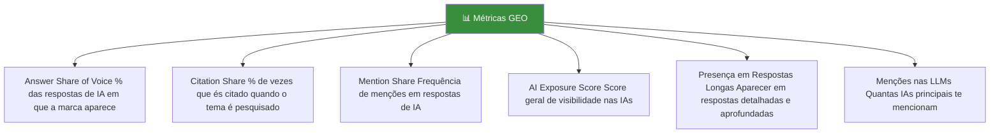
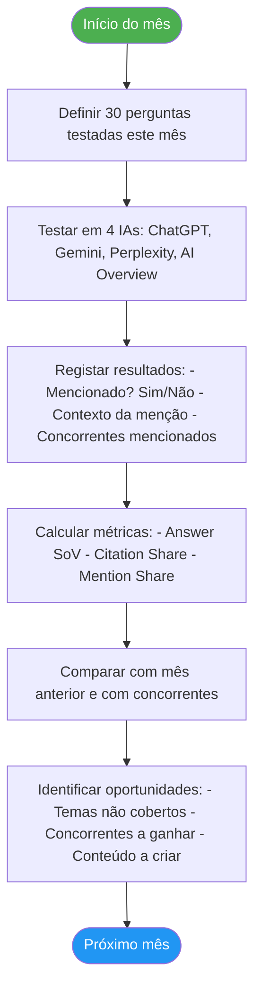
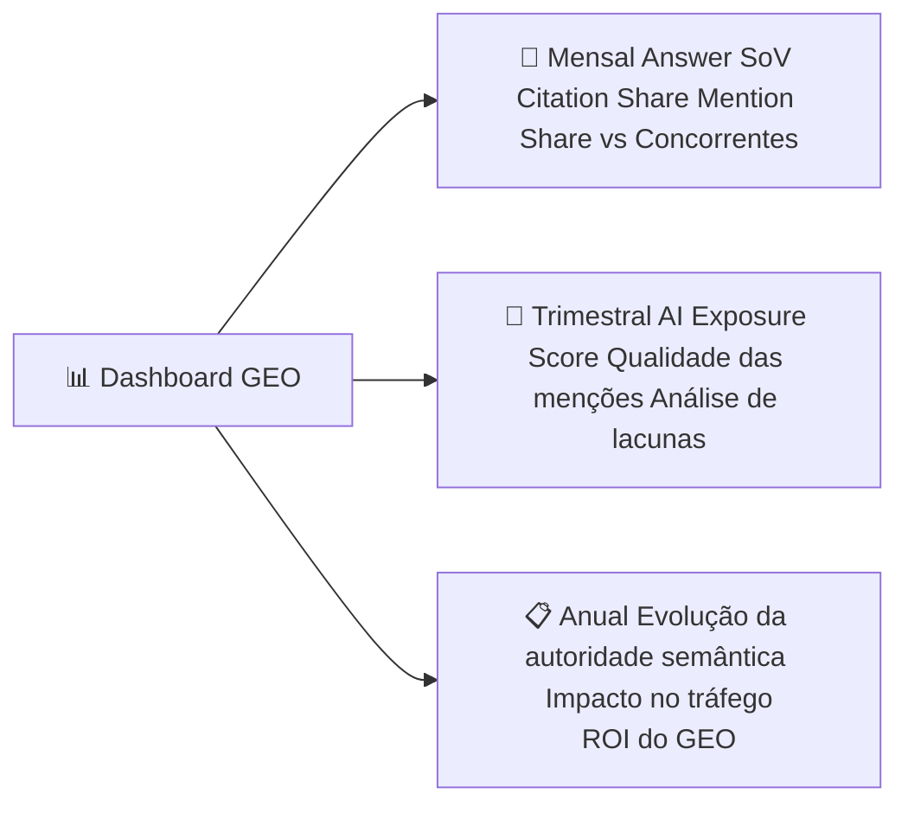

# Como Medir o GEO

> [!abstract] **O desafio de medir GEO**
> Ao contrário do SEO (onde a posição no ranking é objetiva), o GEO é mais difuso: mede-se pela presença nas respostas de IA, pelas menções externas e pelo reconhecimento como fonte autorizada. Mas há métricas claras para o fazer.

---

## As Métricas Principais do GEO



---

## Descrição de Cada Métrica

### 1. Answer Share of Voice

**O que é:** Percentagem das respostas geradas pelas IAs sobre o teu setor em que a tua marca é mencionada.

**Como calcular:**
```
Answer SoV = (Nº de respostas com a tua marca / Total de respostas sobre o tema) × 100
```

**Como medir:**
- Define 20-50 perguntas relevantes para o teu setor
- Pergunta-as nas principais IAs (ChatGPT, Gemini, Perplexity)
- Regista quantas vezes a tua marca aparece

---

### 2. Citation Share

**O que é:** Percentagem de vezes que és especificamente **citado como fonte** quando um tema relevante é pesquisado.

**Como medir:**
```
Pesquisa: "Segundo quem é que [teu tema]?"
Pesquisa: "Quais as fontes para [teu nicho]?"
Registar presença vs. concorrentes
```

---

### 3. Mention Share

**O que é:** Frequência relativa de menções da tua marca em comparação com os concorrentes diretos.

**Fórmula:**
```
Mention Share = Tuas menções / (Tuas menções + Menções concorrente A + Menções concorrente B) × 100
```

---

### 4. AI Exposure Score

**O que é:** Score composto que agrega múltiplos sinais de visibilidade nas IAs.

| Componente | Peso |
|-----------|------|
| Menções em ChatGPT | 25% |
| Menções em Gemini | 20% |
| Menções em Perplexity | 20% |
| Menções em AI Overview (Google) | 20% |
| Menções em outros LLMs | 15% |

---

## Processo de Monitorização Mensal



---

## Template de Teste Manual nas IAs

```markdown
## Perguntas a testar nas IAs

### Sobre identidade da marca
- "Quem é a [Nome da Empresa]?"
- "O que faz a [Nome da Empresa]?"

### Sobre o nicho/serviço
- "Qual a melhor [agência/empresa] de [serviço] em [cidade/país]?"
- "Quem são os especialistas em [tema do nicho]?"
- "Quais as [agências/empresas] mais confiáveis para [problema do cliente]?"

### Sobre o tema/setor
- "Como se faz [tua especialidade]?"
- "Quais as melhores práticas para [teu serviço]?"
- "Que empresa devo contratar para [teu serviço]?"

### Registo de resultados
| Pergunta | ChatGPT | Gemini | Perplexity | AI Overview |
|----------|---------|--------|------------|-------------|
| Pergunta 1 | ✅/❌ | ✅/❌ | ✅/❌ | ✅/❌ |
| Pergunta 2 | ... | ... | ... | ... |
```

---

## Ferramentas para Medir GEO

| Ferramenta | O que mede | Tipo |
|------------|-----------|------|
| **Brandwatch AI** | Menções e sentimento nas IAs | Pago |
| **Mention.com** | Menções online e em IAs | Pago |
| **Google Alerts** | Menções na web (proxy para IA) | Gratuito |
| **Ahrefs** | Backlinks e menções (base para GEO) | Pago |
| **BrightEdge Generative Parser** | Análise de AI Overview | Pago |
| **ChatGPT/Gemini/Perplexity** | Teste manual de presença | Gratuito (manual) |
| **Semrush AI Toolkit** | Presença em respostas de IA | Pago |

---

## Dashboard de GEO — O que monitorizar



### KPIs por maturidade GEO

| Fase | KPIs foco | Meta |
|------|-----------|------|
| **Início (0-3 meses)** | Schema implementado, entidade criada | Ser mencionado em pelo menos 1 IA |
| **Crescimento (3-9 meses)** | Mention Share, Citation Share | 10-20% das perguntas do nicho |
| **Maturidade (9-18 meses)** | Answer SoV, AI Exposure Score | 30%+ das perguntas relevantes |
| **Liderança (18+ meses)** | Todas as métricas + concorrência | Top 3 no nicho nas IAs |

---

## Impacto do GEO no Negócio

> [!tip] **Como conectar GEO com resultados de negócio**

| Métrica GEO | Impacto no negócio |
|-------------|-------------------|
| Mais menções nas IAs | Mais brand awareness e consideração |
| Citado como fonte primária | Posição de liderança de pensamento |
| Mencionado em respostas de compra | Tráfego qualificado e leads |
| Recomendado pela IA para o nicho | Redução do CAC (custo de aquisição) |
| Alta visibilidade comparativa | Vantagem competitiva sustentável |

---

## Ver também

- [[GEO - Overview]] — visão geral do GEO
- [[3 Pilares Fundamentais do GEO]] — pilares que impactam as métricas
- [[EEAT e Autoridade]] — construir confiança para melhorar métricas
- [[Off-page e Backlinks]] — presença externa que afeta GEO
