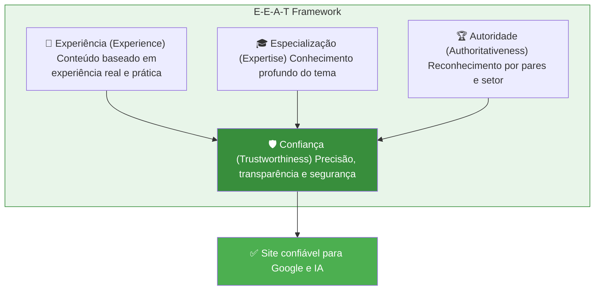
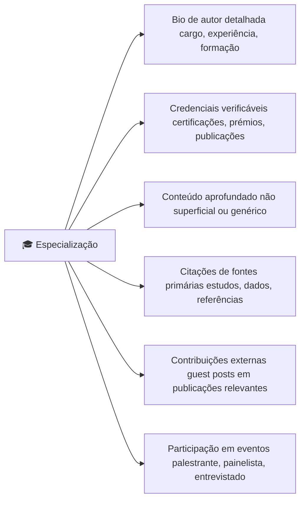
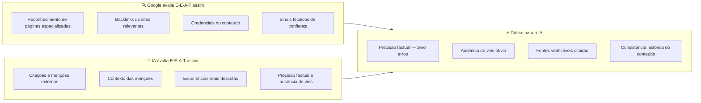

# E-E-A-T — Experiência, Especialização, Autoridade e Confiança

> [!abstract] **O que é E-E-A-T**
> É o framework do Google para avaliar a qualidade e confiabilidade de um site e do seu conteúdo. **A Confiança é o pilar central** — os outros três convergem para ela. Em contexto de IA generativa, o E-E-A-T passou a ser o principal critério de seleção de fontes.

---

## Os 4 Pilares do E-E-A-T

---

## 1. Experiência (Experience)

O primeiro "E" foi adicionado em 2022, reconhecendo que **experiência prática** é diferente de especialização teórica.

### O que demonstra experiência

| Sinal de experiência | Como implementar |
|---------------------|-----------------|
| **Casos de estudo reais** | Descrever projetos com resultados concretos |
| **Fotos e vídeos próprios** | Imagens originais, não stock |
| **Opiniões baseadas em uso** | Reviews com detalhes práticos |
| **Histórias pessoais** | Narrativas reais de "quando testámos..." |
| **Erros e aprendizagens** | Partilhar o que correu mal e o que foi aprendido |

### Exemplo de conteúdo com vs. sem experiência

**❌ Sem experiência:**
> "O SEO técnico é importante para as empresas. Ajuda a melhorar o ranking no Google."

**✅ Com experiência:**
> "Ao auditar mais de 200 sites em 2025, identificámos que 73% tinha pelo menos um problema crítico de rastreamento. O mais comum era conteúdo carregado exclusivamente via JavaScript sem SSR, tornando-o invisível para o Googlebot."

---

## 2. Especialização (Expertise)

### Para conteúdo YMYL (Your Money or Your Life)

> [!warning] **Conteúdo YMYL requer expertise demonstrada**
> Conteúdo sobre saúde, finanças, direito, segurança e bem-estar é avaliado com critérios muito mais rígidos. Exige autores identificados, credenciais visíveis e fontes verificáveis.

| Tipo de site | Nível de expertise exigido |
|-------------|--------------------------|
| Blog de hobbies | Baixo — experiência pessoal basta |
| E-commerce | Médio — especialização no produto |
| Serviços B2B | Alto — expertise demonstrada |
| Saúde/Finanças/Direito | Muito alto — credenciais obrigatórias |

### Como demonstrar especialização

---

## 3. Autoridade (Authoritativeness)

### A diferença entre especialização e autoridade

> Especialização = sabes muito sobre o tema
> Autoridade = **outros reconhecem** que sabes muito

### Como construir autoridade

| Ação | Impacto no SEO | Impacto no GEO |
|------|---------------|----------------|
| Ser citado por publicações do setor | Alto | Muito alto |
| Ter backlinks de sites de alta DA | Alto | Médio |
| Ser mencionado como especialista em artigos | Médio | Muito alto |
| Ser convidado para podcasts/eventos | Médio | Alto |
| Ter página Wikipedia | Médio | Muito alto |
| Publicar estudos citados por outros | Alto | Máximo |

---

## 4. Confiança (Trust) — O Pilar Central

> [!important] **A Confiança é o pilar que sustenta tudo**
> Sem confiança, alta experiência, especialização e autoridade não chegam. Uma fonte não confiável não é citada por IAs.

### Sinais de confiança para o Google e IAs

| Sinal | Google | IA |
|-------|--------|-----|
| HTTPS ativo | ✅ Direto | ✅ Indireto |
| Política de privacidade clara | ✅ | ✅ |
| Termos de serviço | ✅ | ✅ |
| Informação de contacto visível | ✅ | ✅ |
| Autores identificados | ✅ | ✅✅ |
| Factos verificáveis com fontes | ✅ | ✅✅ |
| Sem publicidade enganosa | ✅ | ✅ |
| Reviews positivas verificadas | ✅ | ✅✅ |
| Histórico consistente | ✅ | ✅✅ |
| Sem conteúdo contraditório | ✅ | ✅✅ |

---

## E-E-A-T para IAs vs. Google

---

## Comparação de EEAT entre Google e LLM

| Dimensão | Google | LLM |
|----------|--------|-----|
| **Foco principal** | Reconhecimento de páginas especializadas | Citações, menções e recomendações |
| **Experiência** | Sinal indireto através de conteúdo aprofundado | Crucial — modelos valorizam experiências reais |
| **Especialização** | Demonstrada por credenciais e profundidade | Avaliada pela consistência e precisão ao longo do tempo |
| **Autoridade** | Backlinks e menções de sites de alta qualidade | Frequência e contexto em que o conteúdo é usado como fonte |
| **Confiança** | Segurança do site, transparência, histórico | Precisão factual e ausência de viés são fundamentais |

---

## Checklist E-E-A-T

### Experiência
- [ ] Casos de estudo reais com resultados mensuráveis
- [ ] Imagens originais (não stock genérico)
- [ ] Opiniões baseadas em uso real
- [ ] "Testámos e descobrimos que..."

### Especialização
- [ ] Bio do autor visível em todos os artigos
- [ ] Credenciais/formação mencionadas
- [ ] Links para perfil LinkedIn, Twitter/X
- [ ] Conteúdo aprofundado (não superficial)

### Autoridade
- [ ] Menções em publicações externas
- [ ] Estratégia de Digital PR ativa
- [ ] Participação em eventos do setor
- [ ] Guest posts publicados

### Confiança
- [ ] HTTPS ativo
- [ ] Política de privacidade atualizada (RGPD)
- [ ] Termos de serviço claros
- [ ] Dados de contacto visíveis
- [ ] Factos com fontes citadas
- [ ] Reviews verificadas visíveis

---

## Ver também

- [[GEO - Overview]] — contexto geral do GEO
- [[Off-page e Backlinks]] — construir autoridade off-page
- [[../06 - Tipos de Busca/Tipos de Busca e SERP|Tipos de Busca e SERP]] — como EEAT afeta os resultados
- [[../03 - AIO/Processo de Ranking das IA|Processo de Ranking das IA]] — o que a IA prioriza
