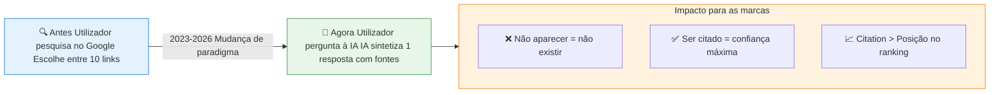
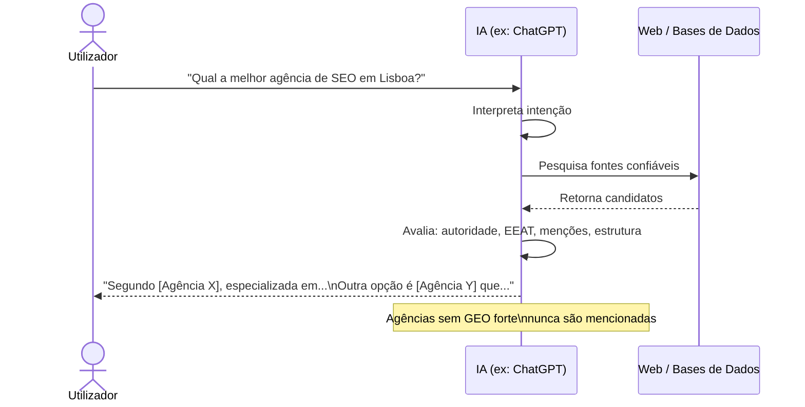
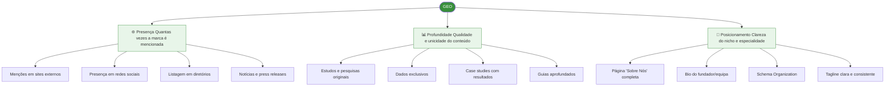
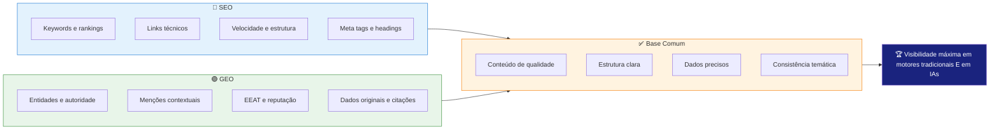
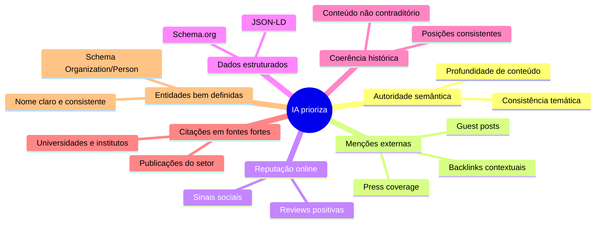
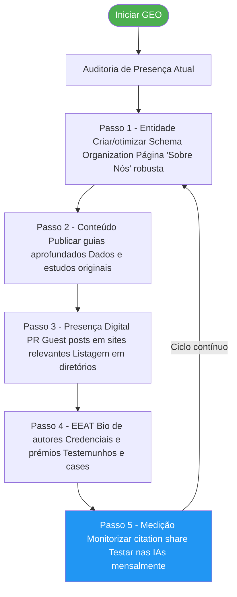

# GEO — Generative Engine Optimization

> [!abstract] **Definição**
> GEO é o conjunto de técnicas para otimizar a presença digital de uma marca, produto ou serviço para ser **citado e recomendado** nas respostas geradas por motores de IA (ChatGPT, Perplexity, Google AI Overview, Gemini, etc.).

---

## Por que o GEO existe agora

> [!warning] **A nova realidade**
> No SEO clássico, estar na posição 1 garantia visibilidade. Com o GEO, uma marca que não é citada pela IA **é invisível** para todos os utilizadores que pesquisam através de IAs — independentemente da sua posição no Google.

---

## Como as IAs Geram Respostas

---

## Os 3 Pilares do GEO

| Pilar | O que é | Ações |
|-------|---------|-------|
| 🌐 **Presença** | Aparições externas e menções da marca | PR digital, diretórios, entrevistas, redes sociais |
| 📊 **Profundidade** | Dados originais, evidências e estudos | Relatórios, case studies, dados exclusivos |
| 🎯 **Posicionamento** | Clareza da especialidade e nicho da marca | Página sobre nós robusta, bio do fundador, tagline clara |

---

## GEO vs SEO — Complementares, não concorrentes

---

## Motores de IA e o GEO

| Motor de IA | Como pesquisa | O que prioriza | Estratégia GEO |
|-------------|--------------|---------------|----------------|
| **Google AI Overview** | Google Search | E-E-A-T + ranking Google | SEO forte = base do GEO |
| **ChatGPT (browsing)** | Bing Search | DA alta + estrutura clara | Presença no Bing |
| **Perplexity** | Multi-source | Fontes diversas e atualizadas | Ser mencionado em muitos sites |
| **Gemini** | Google + próprio | Google Search + Knowledge Graph | Schema markup + Google My Business |
| **Claude (sem RAG)** | Dados de treino | Conteúdo publicado até data de corte | Estar nas fontes de treino |
| **Meta AI** | Meta/Bing | Conteúdo social + web | Presença em Facebook/Instagram + web |

---

## O Que a IA Prioriza

---

## Como Começar com GEO — Roadmap

---

## Ver também

- [[Off-page e Backlinks]] — backlinks no contexto GEO
- [[3 Pilares Fundamentais do GEO]] — aprofundamento dos pilares
- [[EEAT e Autoridade]] — o framework de confiança
- [[Como Medir o GEO]] — métricas e ferramentas
- [[../03 - AIO/Processo de Ranking das IA|Processo de Ranking das IA]] — como a IA seleciona fontes
