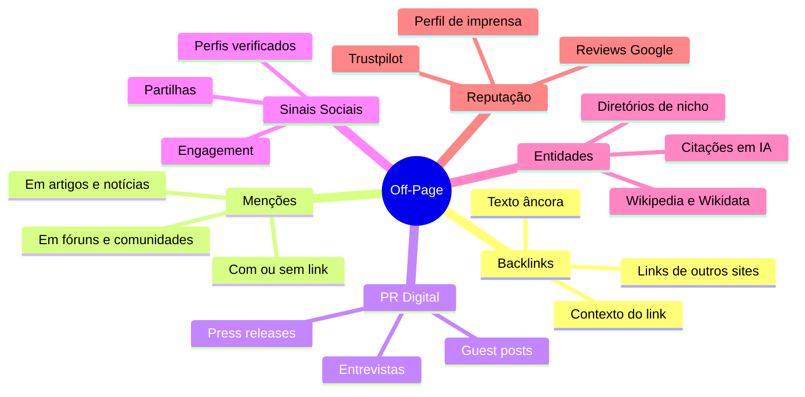
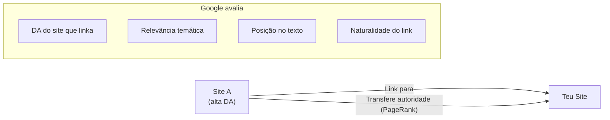
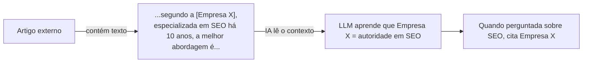
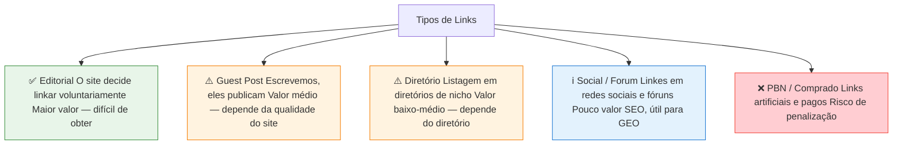
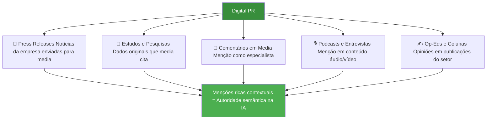
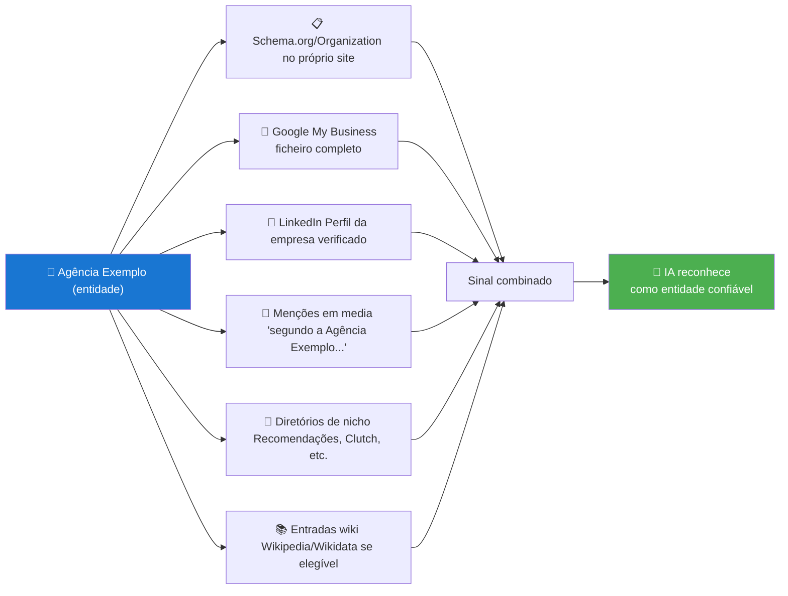

# Off-Page e Backlinks

> [!abstract] **Definição**
> Off-page SEO é tudo o que acontece **fora do teu site** mas que influencia a tua autoridade, reputação e ranking — tanto em motores de pesquisa tradicionais como em IAs generativas.

---

## O que é o Off-Page

---

## Métricas de Off-Page Essenciais

| Métrica | O que mede | Ferramenta |
|---------|-----------|-----------|
| **Domain Rating (DR)** | Força do perfil de backlinks (0-100) | Ahrefs |
| **Domain Authority (DA)** | Autoridade do domínio (0-100) | Moz |
| **Referring Domains** | Número de domínios únicos a linkar | Ahrefs, SEMrush |
| **Âncoras** | Texto dos links que apontam para o site | Ahrefs |
| **Relevance Fit** | Relevância temática dos sites que linkam | Análise manual |
| **Trust Score** | Qualidade editorial e histórico | Majestic |
| **Freshness** | Links recentes (últimos 3-6 meses) | Ahrefs |

---

## Backlinks na Era do GEO

### Como o Google vê os backlinks (SEO clássico)

### Como a LLM "vê" os backlinks

> [!important] **A mudança fundamental**
> Para a IA, **não importa o link** — importa o **contexto em volta do link**.
> - Link sem contexto útil = zero impacto na IA
> - Menção rica sem link = impacto positivo na IA
> - **Link building moderno = context building**

---

## Qualidade dos Backlinks

### Alta qualidade vs Baixa qualidade

| Alta Qualidade ✅ | Baixa Qualidade ❌ |
|------------------|------------------|
| Sites relevantes ao tema | Diretórios genéricos |
| Conteúdo editorial, não pago | Sites de guest post em massa |
| Link contextual no corpo do texto | Blog artificial ou PBN |
| Âncora natural e variada | Redes privadas de blogs (PBN) |
| Páginas bem posicionadas no Google | Links empilhados sem contexto |
| Entidade confiável (publicação, universidade) | Conteúdo irrelevante ao nicho |
| Diretórios de nicho (Reddit, GitHub, Academia) | Sites com spam ou baixa qualidade |
| Links de empresa em diretórios oficiais | Comentários e fóruns de spam |
| Menção em estudos e pesquisas | Footer links de templates |

---

## Tipos de Links e seu Valor

---

## Link Building / Digital PR

### Estratégias de Link Building legítimo

| Estratégia | Descrição | Dificuldade | Impacto GEO |
|-----------|-----------|-------------|-------------|
| **Newsjacking** | Comentar tendências noticiosas com expertise | Média | Alto |
| **Relatórios originais** | Publicar estudos com dados exclusivos | Alta | Máximo |
| **Conteúdo de dados** | Infográficos e visualizações com dados únicos | Alta | Alto |
| **Comentários especializados** | Responder a jornalistas como especialista (HARO) | Baixa | Muito alto |
| **Insight do setor** | Análises aprofundadas que outros citam | Média | Alto |
| **Guest Posts** | Artigos em publicações relevantes do setor | Média | Médio-Alto |
| **Parcerias** | Links recíprocos com parceiros não-concorrentes | Baixa | Médio |
| **Conteúdo linkable** | Recursos tão úteis que outros linkam naturalmente | Alta | Alto |

### O que é o Digital PR para GEO

---

## Menções sem Link (Unlinked Mentions)

Para a IA, uma menção sem link pode ter **mais valor** do que um link sem contexto.

| Tipo de menção | Exemplo | Impacto IA |
|---------------|---------|-----------|
| **Menção simples** | "A empresa Exemplo faz SEO" | Baixo |
| **Menção com contexto** | "A Agência Exemplo, especializada em SEO há 10 anos" | Médio |
| **Menção como autoridade** | "Segundo a Agência Exemplo, líder em SEO em Portugal" | Alto |
| **Menção como fonte** | "Um estudo da Agência Exemplo revelou que..." | Muito alto |
| **Menção com dados** | "A Agência Exemplo analisou 500 sites e concluiu que..." | Máximo |

---

## Construir a Entidade Off-Page

### Os sinais que a IA usa para reconhecer uma entidade

---

## Checklist Off-Page e Backlinks

### Link Building
- [ ] Perfil de backlinks auditado (sem links tóxicos)
- [ ] Estratégia de Digital PR definida
- [ ] Pipeline de guest posts ativo
- [ ] HARO (ou similar) configurado para comentários de especialista
- [ ] Parcerias com sites complementares estabelecidas

### Entidade e Menções
- [ ] Schema Organization implementado
- [ ] Google My Business completo e verificado
- [ ] LinkedIn da empresa e fundadores atualizado
- [ ] Listagem em diretórios relevantes do nicho
- [ ] Monitorização de menções configurada (Google Alerts, Mention)

---

## Ver também

- [[GEO - Overview]] — visão geral do GEO
- [[EEAT e Autoridade]] — construir confiança
- [[3 Pilares Fundamentais do GEO]] — pilares de presença e profundidade
- [[Como Medir o GEO]] — métricas para medir o impacto
