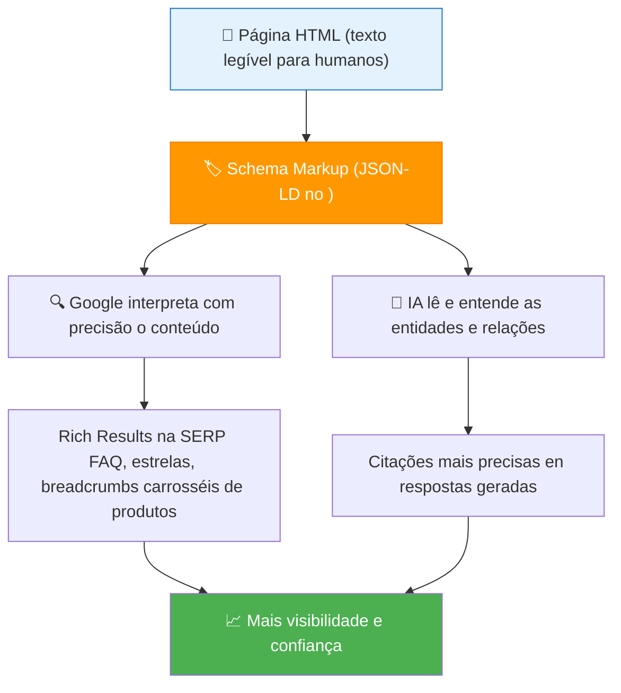
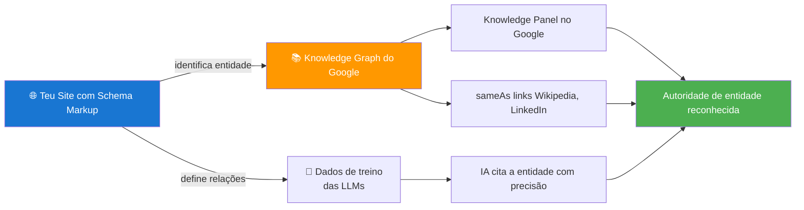

# Dados Estruturados — Overview

> [!abstract] **Definição**
> Dados estruturados são marcações adicionadas ao código HTML de uma página que ajudam motores de pesquisa e sistemas de IA a compreenderem, com precisão, o que aquele conteúdo representa — seja um artigo, produto, evento, pessoa, empresa ou outro tipo de entidade.

---

## Como Funcionam os Dados Estruturados



---

## Por que os Dados Estruturados são Essenciais

| Benefício | Para SEO | Para AIO/GEO |
|-----------|---------|-------------|
| **Rich results** | Snippets visuais que aumentam CTR | Não aplicável diretamente |
| **Compreensão de entidades** | Google entende tipo de conteúdo | IA identifica entidades e relações |
| **Canonical e duplicados** | Define página principal | Consolida sinais de autoridade |
| **Conexão ao Knowledge Graph** | Integra no gráfico de conhecimento do Google | Fortifica o reconhecimento da entidade |
| **FAQ e PAA** | Aparece em People Also Ask | IA usa para responder diretamente |
| **Sitelinks** | Menu de navegação na SERP | Estrutura do site visível para IA |

---

## Formatos de Marcação

| Formato | Estado | Recomendado |
|---------|--------|-------------|
| **JSON-LD** | Moderno, separado do HTML | ✅ Sim — recomendado pelo Google |
| **Microdata** | Legado, integrado no HTML | ⚠️ Funciona mas complexo |
| **RDFa** | Legado, integrado no HTML | ⚠️ Evitar para novos projetos |

### Estrutura básica JSON-LD

```html
<script type="application/ld+json">
{
  "@context": "https://schema.org",
  "@type": "Organization",
  "name": "Agência Exemplo",
  "url": "https://agencia.pt",
  "logo": "https://agencia.pt/logo.png",
  "description": "Agência especializada em SEO, GEO e marketing digital em Lisboa, Portugal.",
  "address": {
    "@type": "PostalAddress",
    "addressLocality": "Lisboa",
    "addressCountry": "PT"
  },
  "sameAs": [
    "https://www.linkedin.com/company/agencia-exemplo",
    "https://twitter.com/agencia_exemplo"
  ]
}
</script>
```

---

## Como os Dados Estruturados Conectam ao Conhecimento Global



---

## Tipos de Rich Results

| Schema Type | Rich Result | Aumenta CTR |
|------------|-------------|-------------|
| **FAQ** | Accordion com perguntas e respostas | +50% área na SERP |
| **Product** | Estrelas de review, preço, disponibilidade | +30% CTR |
| **Article** | Data, autor, imagem em carrossel | +20% CTR |
| **Recipe** | Tempo de preparação, calorias, avaliação | +25% CTR |
| **Event** | Data, local, preço | Destaque em resultados de eventos |
| **LocalBusiness** | Horário, morada, avaliação | Pack local |
| **Breadcrumb** | Caminho de navegação sob o título | Melhor UX |
| **HowTo** | Passos visuais | +30% em pesquisas procedurais |
| **Video** | Thumbnail e duração | Destaque em resultados de vídeo |

---

## Validação e Testes

### Ferramentas de validação

| Ferramenta | O que verifica | URL |
|------------|---------------|-----|
| **Google Rich Results Test** | Se o schema gera rich results | search.google.com/test/rich-results |
| **Schema Markup Validator** | Validade do JSON-LD (schema.org) | validator.schema.org |
| **Google Search Console** | Rich results reais no site | search.google.com/search-console |
| **Structured Data Testing Tool (legacy)** | Teste de esquemas | Deprecated mas ainda funciona |

---

## Ver também

- [[Schema Markup - Tipos e Implementação]] — todos os tipos em detalhe com código
- [[../02 - SEO/SEO - Overview|SEO Overview]] — contexto do SEO técnico
- [[../03 - AIO/Otimização On-Page para IA|Otimização On-Page para IA]] — AIO e estrutura
- [[../04 - GEO/EEAT e Autoridade|EEAT e Autoridade]] — como o schema fortalece a entidade
